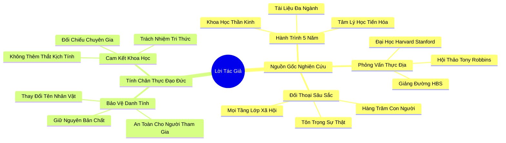

# 📖 TỔNG HỢP NỘI DUNG CHUYÊN SÂU: LỜI TÁC GIẢ (AUTHOR'S NOTE)

### 🎯 THÔNG ĐIỆP CỐT LÕI (1 - 2 CÂU)
Mọi câu chuyện trong cuốn sách đều bắt nguồn từ đời thực và nghiên cứu khoa học nghiêm túc; sự tôn trọng quyền riêng tư qua việc ẩn danh có chọn lọc kết hợp với tính chân thực của các nhân vật minh chứng cho tính trung thực và trách nhiệm đạo đức cao nhất của tác giả.

---

### 📊 LƯỢC ĐỒ PHÂN BỔ CẤU TRÚC TÀI LIỆU
Bảng đối chiếu cấu trúc các phần trong tài liệu gốc và số lượng luận điểm chuyên sâu được khai phóng:

| Phần / Mục Trong Tài Liệu Gốc | Trọng Tâm Phân Tích | Số Luận Điểm | Tỷ Trọng Tri Thức |
| :--- | :--- | :---: | :---: |
| **Phần 1: Nguồn Gốc & Hành Trình Nghiên Cứu** | Phỏng vấn chuyên gia, tài liệu khoa học, đối thoại với hàng trăm người hướng nội | 3 luận điểm | 60% |
| **Phần 2: Tính Chân Thực & Nguyên Tắc Đạo Đức** | Bảo vệ danh tính người tham gia, tôn trọng sự thật lịch sử và cam kết khoa học | 2 luận điểm | 40% |
| **TỔNG CỘNG** | **Toàn bộ cấu trúc Lời Tác Giả** | **5 luận điểm** | **100%** |

---

### 💡 5 LUẬN ĐIỂM CHUYÊN SÂU THEO TỪNG PHẦN TÀI LIỆU

#### 📑 PHẦN 1: NGUỒN GỐC & HÀNH TRÌNH NGHIÊN CỨU (RESEARCH ORIGINS)

1. **Nền Tảng Dữ Liệu Thực Nghiệm Rộng Lớn:**
   - *Phân tích chuyên sâu:* Cuốn sách không phải là một tuyển tập những quan điểm chủ quan hay kinh nghiệm cá nhân đơn lẻ, mà là kết tinh của hơn 5 năm nghiên cứu thực địa chuyên sâu, tiếp cận hàng trăm công trình khoa học thần kinh, tâm lý học tiến hóa và phỏng vấn trực tiếp các chuyên gia hàng đầu tại Harvard, Stanford, Princeton.
   - *Công cụ / Phương pháp đi kèm:* Phương Pháp Nghiên Cứu Đa Ngành (Interdisciplinary Research Methodology).
   - *Ví dụ thực chiến:* Tác giả trực tiếp tham gia các phòng thí nghiệm quét não fMRI, tham dự các hội thảo của Tony Robbins, các lớp học tại HBS và các buổi lễ tại siêu nhà thờ Saddleback để ghi nhận dữ liệu bối cảnh chân thực nhất.

2. **Dòng Chảy Đối Thoại Sâu Sắc Từ Quần Chúng:**
   - *Phân tích chuyên sâu:* Sức mạnh lay động của cuốn sách bắt nguồn từ những cuộc trò chuyện sâu sắc với hàng trăm con người thuộc mọi tầng lớp: từ các CEO công nghệ, luật sư Phố Wall, các mục sư đến học sinh trung học và các bậc phụ huynh có con nhạy cảm.
   - *Công cụ / Phương pháp đi kèm:* Kỹ Thuật Phỏng Vấn Tự Sự Chiều Sâu (In-Depth Narrative Interviewing).
   - *Ví dụ thực chiến:* Những tâm sự thầm kín về cảm giác tội lỗi khi không thể hòa nhập của các cá nhân được tác giả lắng nghe với sự tôn trọng tuyệt đối và chuyển hóa thành tri thức nhân văn.

3. **Tính Đa Chiều Và Khách Quan Trong Tiếp Cận:**
   - *Phân tích chuyên sâu:* Tác giả không viết một cuốn sách để bài xích người hướng ngoại hay tôn sùng người hướng nội một cách cực đoan. Toàn bộ hành trình nghiên cứu nhằm mục đích tìm kiếm sự cân bằng sinh thái giữa hai kiểu tính cách trong xã hội hiện đại.
   - *Công cụ / Phương pháp đi kèm:* Khung Phân Tích Cân Bằng Sinh Thái Tính Cách (Personality Ecological Balance Framework).
   - *Ví dụ thực chiến:* Tác giả luôn đối thoại cởi mở với cả những nhà lãnh đạo hướng ngoại xuất chúng để thấu hiểu thế mạnh tự nhiên của họ và xác định điểm giao thoa bổ khuyết.

---

#### 📑 PHẦN 2: TÍNH CHÂN THỰC & NGUYÊN TẮC ĐẠO ĐỨC (AUTHENTICITY & ETHICS)

4. **Nguyên Tắc Bảo Vệ Quyền Riêng Tư Của Nhân Vật (Ethical Anonymization):**
   - *Phân tích chuyên sâu:* Nhiều nhân vật xuất hiện trong cuốn sách giữ các vị trí quản lý cấp cao hoặc công việc nhạy cảm. Để bảo vệ đời sống cá nhân và sự nghiệp của họ, tác giả đã thay đổi tên tuổi và một số chi tiết nhận dạng, nhưng giữ nguyên 100% bản chất tâm lý và sự thật của câu chuyện.
   - *Công cụ / Phương pháp đi kèm:* Giao Thức Bảo Mật Dữ Liệu Nhân Khẩu (Demographic Confidentiality Protocol).
   - *Ví dụ thực chiến:* Nhân vật nữ luật sư Esther hay nhà giao dịch Phố Wall Alan được đổi tên để bảo vệ sự nghiệp của họ trong các môi trường công sở cạnh tranh khốc liệt.

5. **Cam Kết Tuyệt Đối Với Tính Chân Thực Khoa Học:**
   - *Phân tích chuyên sâu:* Tác giả cam kết không bóp méo, thêm thắt hay kịch tính hóa các dữ liệu nghiên cứu khoa học. Mọi trích dẫn từ các nhà khoa học như Jerome Kagan, Elaine Aron hay Brian Little đều được đối chiếu kỹ lưỡng với các tài liệu xuất bản chính thức.
   - *Công cụ / Phương pháp đi kèm:* Quy Trình Thẩm Định Nguồn Học Thuật (Academic Source Verification).
   - *Ví dụ thực chiến:* Bản thảo được gửi trực tiếp cho các nhà nghiên cứu thẩm định lại trước khi xuất bản nhằm đảm bảo độ chính xác của các khái niệm thần kinh học phức tạp.

---

### 🛠️ KẾ HOẠCH HÀNH ĐỘNG THỰC THI (15 HÀNH ĐỘNG)

#### TẦNG 1: HÀNH VI VI MÔ TỨC THÌ (< 2 PHÚT)
- [ ] **Tôn trọng tính bảo mật:** Cam kết không chia sẻ chuyện riêng tư của người khác khi chưa được họ cho phép.
- [ ] **Ghi nhận nguồn trích dẫn:** Đính kèm nguồn tài liệu rõ ràng mỗi khi chia sẻ một thông tin khoa học.
- [ ] **Lắng nghe không định kiến:** Dành 2 phút lắng nghe trọn vẹn câu chuyện của người đối diện mà không vội phán xét.
- [ ] **Tự hỏi về tính chân thực:** Tự vấn trước khi phát ngôn: "Điều này có đúng với sự thật và trải nghiệm của mình không?".
- [ ] **Mở rộng góc nhìn:** Đọc lại mục lục cuốn sách để chuẩn bị tâm thế tiếp nhận tri thức đa chiều.

#### TẦNG 2: THÓI QUEN & QUY TRÌNH TUẦN
- [ ] **Thiết lập quy trình thẩm định thông tin:** Kiểm tra chéo ít nhất 2 nguồn độc lập trước khi tin tưởng một nghiên cứu tâm lý trên mạng.
- [ ] **Xây dựng không gian đối thoại an toàn:** Tạo điều kiện để đồng nghiệp hoặc người thân có thể tâm sự những khó khăn mà không sợ bị lộ danh tính.
- [ ] **Ghi chép tự sự cá nhân:** Dành 15 phút mỗi tuần viết nhật ký tự sự về những trải nghiệm liên quan đến tính cách của bản thân.
- [ ] **Phỏng vấn người thân:** Hỏi thăm một người thân có tính cách đối lập để thấu hiểu thế giới quan của họ.
- [ ] **Bảo vệ quyền riêng tư số:** Rà soát lại cài đặt bảo mật trên mạng xã hội để bảo vệ dữ liệu cá nhân của bản thân và gia đình.

#### TẦNG 3: CHUYỂN HÓA CHIẾN LƯỢC DÀI HẠN
- [ ] **Thực hành đạo đức nghề nghiệp nghiêm cẩn:** Đưa các tiêu chuẩn bảo mật và tôn trọng sự thật vào mọi dự án công việc dài hạn.
- [ ] **Ủng hộ khoa học nghiêm túc:** Ưu tiên đọc và áp dụng các công trình nghiên cứu đã được bình duyệt (Peer-reviewed) thay vì sách self-help hời hợt.
- [ ] **Xây dựng uy tín dựa trên sự chính trực:** Coi tính trung thực và trách nhiệm xã hội là tài sản vô giá của bản thân.
- [ ] **Lan tỏa văn hóa tôn trọng sự thật:** Cổ vũ các cuộc tranh luận dựa trên dữ liệu xác thực và tôn trọng sự đa dạng quan điểm.
- [ ] **Đồng hành cùng phong trào Quiet:** Tham gia chia sẻ và ứng dụng tri thức khoa học về người hướng nội vào cộng đồng.

---

### ❓ BỘ CÂU HỎI TỰ NGẪM (20 CÂU HỎI)

#### NHÓM 1: TỰ VẤN NHẬN THỨC & THẤU HIỂU BẢN THÂN
1. Tôi có thói quen đánh giá người khác dựa trên những nghiên cứu khoa học xác thực hay chỉ dựa trên cảm tính chủ quan?
2. Khi đọc một cuốn sách tâm lý, tôi tìm kiếm sự an ủi nhất thời hay tìm kiếm sự thật để chuyển hóa bản thân?
3. Tôi đã từng bao nhiêu lần vô tình làm lộ bí mật riêng tư của bạn bè hoặc đồng nghiệp?
4. Mức độ chính trực của tôi trong việc sử dụng dữ liệu và thông tin tại nơi làm việc đạt bao nhiêu điểm trên thang 10?
5. Tôi có đủ dũng khí để thừa nhận sự thật về con người mình ngay cả khi sự thật đó đi ngược lại kỳ vọng của đám đông?

#### NHÓM 2: ĐÁNH GIÁ THỰC TRẠNG & RÀ SOÁT THÓI QUEN
6. Nguồn thông tin hàng ngày của tôi có đang bị chi phối bởi các tin đồn giật gân trên mạng xã hội?
7. Tôi có tạo được cảm giác an toàn và tin cậy để những người xung quanh sẵn sàng mở lòng tâm sự với tôi?
8. Trong công việc, tôi có luôn tôn trọng quyền sở hữu trí tuệ và bảo mật dữ liệu của khách hàng?
9. Tôi có thường xuyên kiểm tra lại tính chính xác của các số liệu trước khi đưa vào báo cáo?
10. Tôi đã từng chia sẻ những câu chuyện của người khác với thái độ tôn trọng hay với sự tò mò phán xét?

#### NHÓM 3: THÁCH THỨC NIỀM TIN CŨ & PHÁ VỠ ĐỊNH KIẾN
11. Liệu các cuốn sách self-help truyền động lực có giá trị khoa học ngang bằng các công trình nghiên cứu thực chứng?
12. Có phải việc thay đổi danh tính nhân vật làm giảm đi tính chân thực của một công trình nghiên cứu?
13. Tại sao sự tôn trọng quyền riêng tư lại là điều kiện tiên quyết để con người dám nói lên sự thật?
14. Việc nghiên cứu về tính cách có nhằm mục đích chia rẽ xã hội hay để tìm kiếm sự hòa hợp nhân văn?
15. Liệu một người có thể sống hoàn toàn trung thực với bản thân trong một xã hội đầy rẫy sự giả tạo?

#### NHÓM 4: THIẾT KẾ GIẢI PHÁP & HÀNH ĐỘNG KIẾN TẠO
16. Tôi sẽ áp dụng phương pháp nghiên cứu đa ngành như thế nào để giải quyết các bài toán phức tạp trong sự nghiệp?
17. Những nguyên tắc bảo mật nào tôi cần thiết lập trong đội ngũ để xây dựng văn hóa tin cậy tuyệt đối?
18. Làm thế nào để tôi có thể truyền cảm hứng cho người khác mở lòng chia sẻ những câu chuyện chân thực của họ?
19. Tôi sẽ làm gì để phân biệt giữa khoa học tâm lý nghiêm túc và những lời khuyên sáo rỗng trên thị trường?
20. Những hành động cụ thể nào tôi có thể thực hiện để bảo vệ sự thật và đạo đức trong môi trường làm việc của mình?

---

### 🗺️ MINDMAP 4-5 TẦNG TRỰC QUAN ĐỈNH CAO

