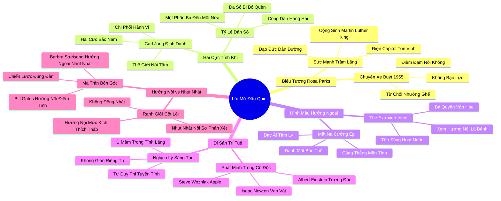

# 🗺️ BẢN ĐỒ TƯ DUY & BẢNG TRA CỨU NEO TRÍ NHỚ: LỜI MỞ ĐẦU - HAI CỰC BẮC NAM CỦA ĐẶC ĐIỂM TÍNH CÁCH

---

## 1. HỆ THỐNG PHẢ HỆ TRI THỨC (ACTIVE RECALL HIERARCHY)

---

## 2. BẢNG TRA CỨU NEO TRÍ NHỚ SIÊU TỐC (MEMORY ANCHOR CHEAT SHEET)

| 📑 Phần/Mục Tài Liệu | Khái Niệm / Từ Khóa Vàng | Bản Chất Cốt Lõi | Cảnh Báo Sai Lầm Thường Gặp | Hành Động Ứng Dụng Đột Phá |
| :--- | :--- | :--- | :--- | :--- |
| **Phần 1: Rosa Parks** | **Quiet Courage** | Lòng can trường trầm lặng: kiên định bảo vệ lẽ phải bằng sự điềm đạm bất bạo động. | Nghĩ rằng người trầm lặng là người yếu đuối và dễ bị bắt nạt. | Học cách nói lời từ chối điềm đạm và dứt khoát trước những yêu cầu bất công. |
| **Phần 1: Rosa Parks** | **Symbiotic Dyad** | Mối quan hệ cộng sinh giữa người trầm lặng giữ la bàn đạo đức và nhà hùng biện truyền lửa. | Cố ép một người phải sở hữu trọn vẹn cả hai phẩm chất đối lập. | Xây dựng liên minh giữa chuyên gia nghiên cứu sâu và nhân sự truyền thông sắc bén. |
| **Phần 2: Hai cực tính khí** | **North & South of Temperament** | Hướng nội và hướng ngoại là hai cực chi phối sâu sắc toàn bộ hành vi và số phận con người (Jung). | Coi tính cách là sở thích nhất thời có thể thay đổi tùy tiện trong một sớm một chiều. | Thấu hiểu cấu trúc hệ thần kinh tự nhiên để thiết kế lối sống tương thích. |
| **Phần 2: Hai cực tính khí** | **Hidden Majority** | Người hướng nội chiếm từ 1/3 đến 1/2 dân số nhưng bị xem như công dân hạng hai. | Phớt lờ nhu cầu của người trầm lặng trong việc thiết kế không gian và quy trình làm việc. | Tạo cơ hội bình đẳng cho mọi kiểu tính cách cùng đóng góp ý kiến trong tổ chức. |
| **Phần 3: Hình mẫu lý tưởng** | **The Extrovert Ideal** | Chuẩn mực văn hóa độc tôn coi người hoạt ngôn, tự tin lấn át là hình mẫu hoàn hảo duy nhất. | Ép bản thân đeo chiếc mặt nạ hướng ngoại giả tạo dẫn đến kiệt quệ tâm lý. | Tự hào cởi bỏ chiếc mặt nạ xã giao và sống đúng với bản sắc tĩnh lặng của mình. |
| **Phần 4: Di sản trí tuệ** | **Solitude-Driven Genius** | Các phát minh vĩ đại nhất nhân loại luôn được thai nghén trong sự cô độc sâu sắc. | Bắt buộc nhân tài sáng tạo phải làm việc liên tục trong các văn phòng mở ồn ào. | Dành ra các khối thời gian biệt lập để đắm chìm vào công việc chuyên môn sâu. |
| **Phần 5: Hướng nội vs Nhút nhát** | **Stimulation vs Evaluation** | Hướng nội là nhu cầu kích thích giác quan thấp; nhút nhát là nỗi sợ bị xã hội phán xét. | Đánh đồng người hướng nội với người nhút nhát và coi đó là bệnh lý tâm thần. | Phân biệt rõ ràng để vượt qua nỗi sợ xã hội trong khi vẫn bảo tồn bản tính hướng nội. |
| **Phần 5: Hướng nội vs Nhút nhát** | **Four-Quadrant Matrix** | Ma trận 4 góc kết hợp giữa hướng nội/hướng ngoại và tự tin/nhút nhát. | Tự ti vô cớ khi thấy mình không dám phát biểu trước đám đông. | Nhận diện đúng góc phần tư của bản thân để rèn luyện kỹ năng giải mẫn cảm từng bước. |
