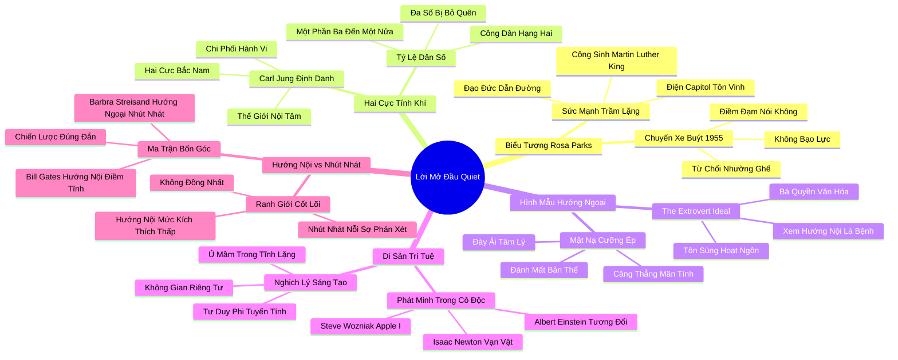

# 📖 TỔNG HỢP NỘI DUNG CHUYÊN SÂU: LỜI MỞ ĐẦU - HAI CỰC BẮC NAM CỦA ĐẶC ĐIỂM TÍNH CÁCH (THE NORTH AND SOUTH OF TEMPERAMENT)

### 🎯 THÔNG ĐIỆP CỐT LÕI (1 - 2 CÂU)
Tính hướng nội và hướng ngoại là "hai cực Bắc Nam" chi phối sâu sắc toàn bộ hành vi, sự lựa chọn nghề nghiệp và số phận của con người; việc xã hội hiện đại áp đặt độc tôn Hình mẫu Hướng ngoại Lý tưởng là một sự lãng phí tài năng khổng lồ, bởi vì những di sản vĩ đại nhất của nhân loại luôn được tạo dựng từ sự can đảm trầm lặng của những cá nhân biết sống trong tĩnh lặng.

---

### 📊 LƯỢC ĐỒ PHÂN BỔ CẤU TRÚC TÀI LIỆU
Bảng đối chiếu cấu trúc các phần trong tài liệu gốc và số lượng luận điểm chuyên sâu được khai phóng:

| Phần / Mục Trong Tài Liệu Gốc | Trọng Tâm Phân Tích | Số Luận Điểm | Tỷ Trọng Tri Thức |
| :--- | :--- | :---: | :---: |
| **Phần 1: Biểu Tượng Lịch Sử Rosa Parks** | Vụ bắt giữ ngày 1/12/1955 tại Montgomery, lòng dũng cảm trầm lặng bất bạo động | 2 luận điểm | 20% |
| **Phần 2: Hai Cực Bắc Nam Của Tính Khí** | Khái niệm của Carl Jung, tỷ lệ 1/3 đến 1/2 dân số là người hướng nội | 2 luận điểm | 20% |
| **Phần 3: Hình Mẫu Hướng Ngoại Lý Tưởng** | The Extrovert Ideal: sự thống trị của người hoạt ngôn trong văn hóa phương Tây | 2 luận điểm | 20% |
| **Phần 4: Những Di Sản Khổng Lồ Của Người Trầm Lặng** | Newton, Einstein, Chopin, Orwell, Dr. Seuss, Steve Wozniak và các kỳ tích trí tuệ | 2 luận điểm | 20% |
| **Phần 5: Phân Biệt Hướng Nội Và Nhút Nhát** | Ranh giới cốt lõi: Nhu cầu kích thích giác quan vs Nỗi sợ bị phán xét xã hội | 2 luận điểm | 20% |
| **TỔNG CỘNG** | **Toàn bộ cấu trúc Lời Mở Đầu** | **10 luận điểm** | **100%** |

---

### 💡 10 LUẬN ĐIỂM CHUYÊN SÂU THEO TỪNG PHẦN TÀI LIỆU

#### 📑 PHẦN 1: BIỂU TƯỢNG LỊCH SỬ ROSA PARKS

1. **Sự Can Đảm Trầm Lặng Của Rosa Parks (Quiet Courage):**
   - *Phân tích chuyên sâu:* Ngày 1 tháng 12 năm 1955 tại Montgomery, Alabama, người phụ nữ da màu Rosa Parks từ chối nhường ghế xe buýt cho một hành khách da trắng. Bà không hề to tiếng, la hét hay dùng bạo lực. Bà chỉ điềm đạm trả lời "Không" với một phong thái trầm tĩnh phi thường. Hành động can trường trong tĩnh lặng đó đã châm ngòi cho phong trào tẩy chay xe buýt lịch sử do Martin Luther King Jr. dẫn dắt và làm thay đổi vĩnh viễn nước Mỹ.
   - *Công cụ / Phương pháp đi kèm:* Khung Hành Động Kháng Cự Bất Bạo Động Trầm Lặng (Quiet Non-Violent Resistance).
   - *Ví dụ thực chiến:* Khi qua đời năm 2005, linh cữu của Rosa Parks được đặt trang trọng dưới mái vòm Điện Capitol – một vinh dự hiếm có vốn chỉ dành cho các tổng thống, chứng minh rằng sự trầm lặng có thể làm rung chuyển cả thế giới.

2. **Sự Kết Hợp Hoàn Hảo Giữa Người Trầm Lặng Và Nhà Hùng Biện:**
   - *Phân tích chuyên sâu:* Phong trào dân quyền Mỹ thành công nhờ vào sự kết hợp cộng sinh kỳ diệu: sự chính trực kiên định không tì vết của một người phụ nữ hướng nội như Rosa Parks cung cấp nền tảng đạo đức thiêng liêng, và tài hùng biện rực lửa của Martin Luther King Jr. (một người hướng ngoại lỗi lạc) đóng vai trò chiếc loa phóng thanh truyền đi thông điệp tới hàng triệu người.
   - *Công cụ / Phương pháp đi kèm:* Mô Hình Đôi Bạn Lịch Sử (The Symbiotic Historic Dyad).
   - *Ví dụ thực chiến:* Martin Luther King Jr. thừa nhận rằng nếu người từ chối nhường ghế là một kẻ nóng nảy hay hung bạo, phong trào sẽ bị bóp nghẹt ngay từ đầu dưới danh nghĩa gây rối trật tự công cộng.

---

#### 📑 PHẦN 2: HAI CỰC BẮC NAM CỦA TÍNH KHÍ

3. **Khám Phá Của Carl Jung Về Hai Kiểu Tính Cách:**
   - *Phân tích chuyên sâu:* Năm 1921, Carl Jung xuất bản tác phẩm "Psychological Types", định danh hai cực tính cách: Người hướng nội tập trung năng lượng vào thế giới bên trong của các ý tưởng, cảm xúc và suy tưởng; người hướng ngoại hướng năng lượng ra thế giới bên ngoài của con người và hoạt động. Jung gọi đây là "hai cực Bắc Nam của tính khí", chi phối sâu sắc cách con người nhìn nhận thực tại.
   - *Công cụ / Phương pháp đi kèm:* Thuyết Phân Loại Tính Khí Jung (Jungian Typology Paradigm).
   - *Ví dụ thực chiến:* Sau một ngày làm việc căng thẳng, người hướng ngoại cảm thấy phấn chấn khi đi ăn tối cùng bạn bè, trong khi người hướng nội cảm thấy kiệt sức và chỉ muốn ở một mình để nạp lại năng lượng.

4. **Tỷ Lệ Khổng Lồ Trong Dân Số: Người Hướng Nội Là Đa Số Bị Bỏ Quên:**
   - *Phân tích chuyên sâu:* Các khảo sát tâm lý học chỉ ra rằng người hướng nội chiếm từ một phần ba đến một nửa dân số nhân loại. Cứ hai hoặc ba người bạn gặp thì có một người là người hướng nội. Thế nhưng, trong một nền văn hóa bị chi phối bởi các chuẩn mực hướng ngoại, hàng triệu con người này đang phải sống như những công dân hạng hai, buộc phải giấu giếm con người thật của mình.
   - *Công cụ / Phương pháp đi kèm:* Thống Kê Nhân Khẩu Tính Cách (Demographic Personality Mapping).
   - *Ví dụ thực chiến:* Trong các lớp học và văn phòng, những người trầm lặng thường bị ép phải tham gia các hoạt động tập thể ồn ào và bị đánh giá thấp chỉ vì họ không thích tranh giành sự chú ý.

---

#### 📑 PHẦN 3: HÌNH MẪU HƯỚNG NGOẠI LÝ TƯỞNG

5. **Sự Thống Trị Của "Hình Mẫu Hướng Ngoại Lý Tưởng" (The Extrovert Ideal):**
   - *Phân tích chuyên sâu:* Xã hội hiện đại bị bao phủ bởi niềm tin mù quáng rằng con người lý tưởng phải là người hoạt ngôn, hòa đồng, thích mạo hiểm và luôn thoải mái khi là tâm điểm chú ý. Tính hướng nội bị xem như một khiếm khuyết thứ cấp nằm giữa trạng thái bình thường và bệnh lý cần phải được điều trị hoặc sửa chữa.
   - *Công cụ / Phương pháp đi kèm:* Phê Phán Bá Quyền Hướng Ngoại (Extrovert Hegemony Critique).
   - *Ví dụ thực chiến:* Từ các buổi phỏng vấn xin việc đến các chương trình tìm kiếm tài năng trên truyền hình, xã hội luôn ưu tiên trao cơ hội cho những người có khả năng ăn nói lưu loát và tự tin biểu diễn trước đám đông.

6. **Chiếc Mặt Nạ Cưỡng Ép Và Sự Đày Ải Tâm Lý:**
   - *Phân tích chuyên sâu:* Để sinh tồn và thăng tiến trong một nền văn hóa thiên vị người hướng ngoại, hàng triệu người hướng nội buộc phải đeo lên một chiếc mặt nạ hoạt bát giả tạo. Sự đày ải tâm lý này gây ra căng thẳng mãn tính, sự xa lánh bản thân và cảm giác tội lỗi thường trực vì nghĩ rằng mình có khuyết tật về nhân cách.
   - *Công cụ / Phương pháp đi kèm:* Phân Tích Sang Chấn Đồng Hóa Xã Hội (Social Assimilation Trauma).
   - *Ví dụ thực chiến:* Susan Cain chia sẻ trải nghiệm thời trẻ khi bà luôn cảm thấy xấu hổ vì thích đọc sách một mình vào mùa hè thay vì tham gia các trại hè náo nhiệt cùng bạn bè đồng trang lứa.

---

#### 📑 PHẦN 4: NHỮNG DI SẢN KHỔNG LỒ CỦA NGƯỜI TRẦM LẶNG

7. **Chiếc Nôi Của Các Phát Minh Vĩ Đại Làm Thay Đổi Thế Giới:**
   - *Phân tích chuyên sâu:* Lịch sử nhân loại chứng minh một sự thật chấn động: Những bước nhảy vọt vĩ đại nhất về khoa học, nghệ thuật và tư tưởng đều được sinh ra từ sự cô độc tĩnh lặng của những người hướng nội. Isaac Newton tìm ra định luật vạn vật hấp dẫn khi sống cô độc ở trang trại Woolsthorpe; Albert Einstein phát triển thuyết tương đối khi làm việc trầm lặng tại sở cấp bằng sáng chế Bern.
   - *Công cụ / Phương pháp đi kèm:* Bản Đồ Di Sản Trí Tuệ Tĩnh Lặng (Quiet Genius Historical Matrix).
   - *Ví dụ thực chiến:* Frederic Chopin, Marcel Proust, George Orwell, J.K. Rowling, Steve Wozniak – tất cả đều là những tâm hồn trầm lặng sâu sắc đã cống hiến cho nhân loại những kiệt tác bất hủ nhờ vào năng lực đắm chìm trong sự cô độc.

8. **Nghịch Lý Giữa Năng Suất Sáng Tạo Và Sự Cô Độc:**
   - *Phân tích chuyên sâu:* Bộ não con người chỉ có thể thực hiện các liên kết ý tưởng phức tạp và tư duy phi tuyến tính khi không bị gián đoạn bởi các kích thích xã hội liên tục. Sự cô độc không phải là sự cô đơn buồn bã; sự cô độc là chất xúc tác tối thượng cho quá trình ủ mầm sáng tạo và thăng hoa trí tuệ.
   - *Công cụ / Phương pháp đi kèm:* Khung Sáng Tạo Trong Cô Độc (Solitude-Driven Creativity Loop).
   - *Ví dụ thực chiến:* Nhà văn Franz Kafka từng viết trong nhật ký: "Tôi cần sự cô độc cho việc viết lách của mình; không phải như một người ẩn dật, điều đó là chưa đủ, mà như một người đã chết".

---

#### 📑 PHẦN 5: PHÂN BIỆT HƯỚNG NỘI VÀ NHÚT NHÁT

9. **Sự Khác Biệt Căn Bản Giữa Hướng Nội (Introversion) Và Nhút Nhát (Shyness):**
   - *Phân tích chuyên sâu:* Đây là sự nhầm lẫn phổ biến và tai hại nhất của xã hội.
     - **Nhút nhát (Shyness):** Là nỗi sợ bị xã hội phán xét, chê bai hoặc làm nhục (một trạng thái cảm xúc tiêu cực liên quan đến nỗi sợ hãi).
     - **Hướng nội (Introversion):** Là xu hướng ưa thích môi trường có mức kích thích giác quan thấp (một đặc điểm sinh học thần kinh liên quan đến việc nạp năng lượng).
   - *Công cụ / Phương pháp đi kèm:* Ma Trận Phân Biệt Hướng Nội - Nhút Nhát (Introversion vs Shyness Quadrant).
   - *Ví dụ thực chiến:* Bill Gates là người hướng nội nhưng không hề nhút nhát; ông thích ở một mình đọc sách nhưng hoàn toàn tự tin tranh luận nảy lửa với các bộ trưởng. Ngược lại, diva Barbra Streisand là người hướng ngoại bùng nổ nhưng lại mắc chứng sợ sân khấu kinh niên (nhút nhát).

10. **Bốn Nhóm Tính Cách Trong Ma Trận Xã Hội:**
    - *Phân tích chuyên sâu:* Kết hợp hai trục tính cách tạo ra 4 nhóm người rõ rệt:
      - Người hướng nội nhút nhát (thích tĩnh lặng và sợ bị phán xét).
      - Người hướng nội điềm tĩnh (thích tĩnh lặng nhưng tự tin tuyệt đối, không sợ đám đông).
      - Người hướng ngoại nhút nhát (khao khát kết nối xã hội nhưng run rẩy lo âu).
      - Người hướng ngoại tự tin (thích giao lưu và thoải mái làm tâm điểm chú ý).
    - *Công cụ / Phương pháp đi kèm:* Bảng Phân Loại Bốn Góc Tính Cách (Four-Quadrant Personality Typology).
    - *Ví dụ thực chiến:* Hiểu rõ mình thuộc nhóm nào giúp cá nhân lựa chọn chiến lược phát triển phù hợp thay vì tự dán nhãn sai lầm lên bản thân.

---

### 🛠️ KẾ HOẠCH HÀNH ĐỘNG THỰC THI (20 HÀNH ĐỘNG)

#### TẦNG 1: HÀNH VI VI MÔ TỨC THÌ (< 2 PHÚT)
- [ ] **Khẳng định bản sắc:** Tự nhủ mỗi sáng: "Mình là người hướng nội và sự tĩnh lặng là sức mạnh của mình".
- [ ] **Dừng lại trước lời phê phán:** Khi bị ai đó bảo "sao ít nói thế?", mỉm cười và trả lời: "Tôi thích lắng nghe và suy nghĩ kỹ trước khi nói".
- [ ] **Tạo khoảng thở 2 phút:** Rút lui vào một góc yên tĩnh thở sâu sau 1 giờ họp hành căng thẳng.
- [ ] **Tôn trọng sở thích một mình:** Cho phép bản thân ngồi ăn trưa một mình đọc sách mà không cảm thấy tội lỗi.
- [ ] **Ghi nhận sức mạnh của Rosa Parks:** Nhớ về hình ảnh Rosa Parks để lấy dũng khí kiên định nói "Không" trước điều sai trái.
- [ ] **Kiểm tra mức độ kích thích:** Đeo tai nghe chống ồn ngay khi bước vào không gian công cộng quá ồn ào.

#### TẦNG 2: THÓI QUEN & QUY TRÌNH TUẦN
- [ ] **Xác định vị trí trên ma trận 4 góc:** Làm bài tự đánh giá để biết mình là người hướng nội điềm tĩnh hay nhút nhát.
- [ ] **Thiết lập giờ cô độc sáng tạo:** Dành riêng 2 giờ vào sáng thứ Bảy ở một mình để viết lách hoặc nghiên cứu chuyên môn.
- [ ] **Ghép đôi cộng sinh trong công việc:** Tìm kiếm một đồng nghiệp hướng ngoại để hợp tác trong các dự án đòi hỏi cả tư duy sâu và thuyết trình.
- [ ] **Tập dượt nói "Không" điềm đạm:** Luyện tập cách từ chối các lời mời tiệc tùng không cần thiết với thái độ lịch thiệp và dứt khoát.
- [ ] **Đọc sách về các thiên tài hướng nội:** Tìm đọc tiểu sử của Newton, Einstein hoặc Chopin để củng cố niềm tin vào con đường của mình.
- [ ] **Chia sẻ cuốn sách Quiet với người thân:** Tặng hoặc giới thiệu sách cho người bạn đời/cha mẹ để họ thấu hiểu thế giới nội tâm của bạn.
- [ ] **Lập nhật ký năng lượng:** Theo dõi những hoạt động nào làm bạn kiệt sức và những hoạt động nào giúp bạn hồi sinh năng lượng.

#### TẦNG 3: CHUYỂN HÓA CHIẾN LƯỢC DÀI HẠN
- [ ] **Tháo bỏ vĩnh viễn chiếc mặt nạ hướng ngoại:** Cam kết sống thật với bản sắc trầm lặng của mình trong cả đời sống cá nhân và sự nghiệp.
- [ ] **Tái cấu trúc công việc theo hướng tĩnh lặng:** Định hướng sự nghiệp vào các lĩnh vực cho phép bạn làm việc sâu và độc lập.
- [ ] **Vận động xóa bỏ định kiến tại công sở:** Đề xuất ban lãnh đạo công nhận sự đa dạng tính cách và tạo không gian làm việc riêng tư cho nhân viên.
- [ ] **Giáo dục thế hệ trẻ về sức mạnh trầm lặng:** Dạy con cái và học sinh hiểu rằng ít nói không đồng nghĩa với nhút nhát hay yếu kém.
- [ ] **Xây dựng phong cách lãnh đạo điềm đạm:** Phát triển năng lực dẫn dắt dựa trên sự lắng nghe thấu cảm và chiến lược sâu sắc.
- [ ] **Bảo vệ ranh giới cá nhân bền vững:** Không bao giờ để áp lực xã hội ép buộc bạn phải từ bỏ những giờ phút tĩnh lặng quý giá.
- [ ] **Tham gia phong trào giải phóng người hướng nội:** Lan tỏa các giá trị của sự tĩnh lặng và chiều sâu tư tưởng ra cộng đồng.

---

### ❓ BỘ CÂU HỎI TỰ NGẪM (20 CÂU HỎI)

#### NHÓM 1: TỰ VẤN NHẬN THỨC & THẤU HIỂU BẢN THÂN
1. Tôi là một người hướng nội thực thụ hay tôi chỉ là một người hướng ngoại đang mắc chứng nhút nhát sợ bị phán xét?
2. Năng lượng của tôi được nạp đầy khi tôi ở một mình hay khi tôi được vây quanh bởi những cuộc trò chuyện rộn rã?
3. Tôi đã bao nhiêu lần cảm thấy xấu hổ vì bản tính trầm lặng của mình và cố gượng ép bản thân trở nên hoạt bát?
4. Khi đứng trước một quyết định quan trọng, tôi cần thảo luận ngay với người khác hay cần một không gian tĩnh lặng để tự suy ngẫm?
5. Tôi có cảm thấy thoải mái khi ở một mình trong phòng suốt một ngày cuối tuần mà không cần bật ti vi hay lướt mạng xã hội?

#### NHÓM 2: ĐÁNH GIÁ THỰC TRẠNG & RÀ SOÁT THÓI QUEN
6. Môi trường làm việc và học tập hiện tại của tôi có đang tôn trọng nhu cầu tĩnh lặng của tôi hay đang ép tôi phải giao tiếp liên tục?
7. Tôi có thói quen đánh giá người khác qua mức độ lưu loát và tự tin của họ trong 5 phút gặp gỡ đầu tiên?
8. Trong các mối quan hệ, tôi có dám thẳng thắn chia sẻ về nhu cầu cần thời gian riêng tư của mình với người thân?
9. Tôi có đang lãng phí thời gian quý giá vào các sự kiện xã giao vô bổ chỉ vì sợ bị coi là kẻ lập dị?
10. Lần gần đây nhất tôi dũng cảm nói "Không" trước một yêu cầu bất hợp lý bằng phong thái điềm tĩnh của Rosa Parks là khi nào?

#### NHÓM 3: THÁCH THỨC NIỀM TIN CŨ & PHÁ VỠ ĐỊNH KIẾN
11. Liệu người nói to và nói nhiều có luôn là người hiểu biết sâu sắc nhất trong phòng họp?
12. Có phải người thích ở một mình là người ích kỷ, cô độc và không có khả năng yêu thương người khác?
13. Tại sao xã hội hiện đại lại biến sự hoạt ngôn thành thước đo duy nhất để đánh giá trí thông minh và tiềm năng lãnh đạo?
14. Isaac Newton có thể khám phá ra định luật vạn vật hấp dẫn nếu ông bị ép phải tham gia các buổi họp nhóm hàng ngày?
15. Liệu lòng can trường có bắt buộc phải đi kèm với sự hung hăng và cơ bắp, hay sự điềm tĩnh kiên định mới là sức mạnh tối thượng?

#### NHÓM 4: THIẾT KẾ GIẢI PHÁP & HÀNH ĐỘNG KIẾN TẠO
16. Tôi sẽ thiết kế không gian sống và bàn làm việc của mình như thế nào để bảo đảm có một "ốc đảo tĩnh lặng" không bị làm phiền?
17. Những bước đi cụ thể nào tôi có thể thực hiện để chuyển hóa sự nhút nhát (nỗi sợ xã hội) thành sự tự tin điềm đạm của người hướng nội?
18. Làm thế nào để tôi có thể kết hợp hài hòa với những người hướng ngoại xung quanh để tạo nên những cặp đôi cộng sinh mạnh mẽ?
19. Tôi sẽ giải thích như thế nào với sếp và đồng nghiệp để họ hiểu rằng sự im lặng của tôi trong cuộc họp là thời gian xử lý dữ liệu sâu?
20. Kế hoạch dài hạn nào sẽ giúp tôi khai phóng toàn bộ tiềm năng trí tuệ và sáng tạo của mình để cống hiến những di sản giá trị cho đời?

---

### 🗺️ MINDMAP 4-5 TẦNG TRỰC QUAN ĐỈNH CAO

