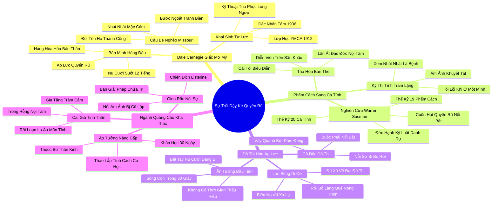

# 🗺️ BẢN ĐỒ TƯ DUY & BẢNG TRA CỨU NEO TRÍ NHỚ: CHƯƠNG MỘT - SỰ TRỖI DẬY CỦA "KẺ QUYẾN RŨ VĨ ĐẠI": HÌNH MẪU HƯỚNG NGOẠI LÝ TƯỞNG RA ĐỜI NHƯ THẾ NÀO?

---

## 1. HỆ THỐNG PHẢ HỆ TRI THỨC (ACTIVE RECALL HIERARCHY)

---

## 2. BẢNG TRA CỨU NEO TRÍ NHỚ SIÊU TỐC (MEMORY ANCHOR CHEAT SHEET)

| 📑 Phần/Mục Tài Liệu | Khái Niệm / Từ Khóa Vàng | Bản Chất Cốt Lõi | Cảnh Báo Sai Lầm Thường Gặp | Hành Động Ứng Dụng Đột Phá |
| :--- | :--- | :--- | :--- | :--- |
| **Phần 1: Dale Carnegie** | **Selling Yourself** | Quan niệm coi bản thân như một món hàng hóa cần được tiếp thị và quyến rũ người khác. | Quên trau dồi chuyên môn thực chất mà chỉ tập trung vào tài ăn nói khéo léo bề ngoài. | Xây dựng thương hiệu cá nhân dựa trên năng lực giải quyết vấn đề thực tế. |
| **Phần 1: Dale Carnegie** | **Carnegie Persuasion** | Kỹ thuật thu phục lòng người bằng nụ cười, nhớ tên và năng lượng tích cực (Đắc Nhân Tâm). | Sử dụng các lời khen ngợi giả tạo nhằm mục đích thao túng cảm xúc của người khác. | Thực hành sự quan tâm chân thành và tôn trọng nhân cách của đối phương. |
| **Phần 2: Phẩm cách sang Cá tính** | **Culture of Character** | Thế kỷ 19: Tôn vinh phẩm hạnh, sự chính trực, kỷ luật và lương tâm khi ở một mình. | Coi sự kín đáo, khiêm tốn là dấu hiệu của sự tự ti và thiếu năng lực cạnh tranh. | Quay về bồi đắp các giá trị đạo đức cốt lõi làm kim chỉ nam cho mọi hành động. |
| **Phần 2: Phẩm cách sang Cá tính** | **Culture of Personality** | Thế kỷ 20: Tôn sùng sức hút biểu diễn, sự quyến rũ bề ngoài và ấn tượng cuốn hút. | Đánh đổi sự liêm chính nội tâm để lấy sự tán dương ngắn hạn của đám đông xa lạ. | Nhận diện bản chất phù du của ánh hào quang biểu diễn và giữ vững cái đầu lạnh. |
| **Phần 3: Đô thị hóa** | **First Impression Tyranny** | Sự thống trị của ấn tượng ban đầu: đánh giá con người trong vài giây giữa biển người đô thị. | Phán xét vội vã một cá nhân chỉ qua vẻ ngoài rụt rè trong lần gặp gỡ đầu tiên. | Cho đối phương và bản thân thời gian để tìm hiểu chiều sâu tính cách qua hành động. |
| **Phần 3: Đô thị hóa** | **Urban Alienation** | Nỗi cô độc đô thị: sống giữa đám đông nhưng luôn nơm nớp lo sợ bị lãng quên và bỏ rơi. | Ép bản thân tham gia mọi cuộc vui ồn ào để khỏa lấp nỗi sợ hãi cô đơn. | Tìm kiếm những cộng đồng nhỏ có cùng giá trị và chiều sâu tâm hồn để gắn kết. |
| **Phần 4: Ngành quảng cáo** | **Fear-Based Marketing** | Chiến thuật tiếp thị gieo rắc nỗi sợ bị cô lập xã hội để bán sản phẩm và khóa học nhân cách. | Để các thông điệp quảng cáo thao túng tâm lý và tự ti về bản sắc tự nhiên của mình. | Tỉnh táo từ chối các khóa học hứa hẹn biến đổi nhân cách cơ học cấp tốc trong 30 ngày. |
| **Phần 4: Ngành quảng cáo** | **Existential Emptiness** | Cảm giác trống rỗng và trầm cảm khi phải liên tục đóng vai một người hoàn hảo trên mạng xã hội. | Chạy theo các thước đo ảo (lượt like, lượt view) mà bỏ quên sức khỏe tinh thần thực tế. | Thực hành cai nghiện mạng xã hội định kỳ và tận hưởng những khoảnh khắc đời thực bình dị. |
