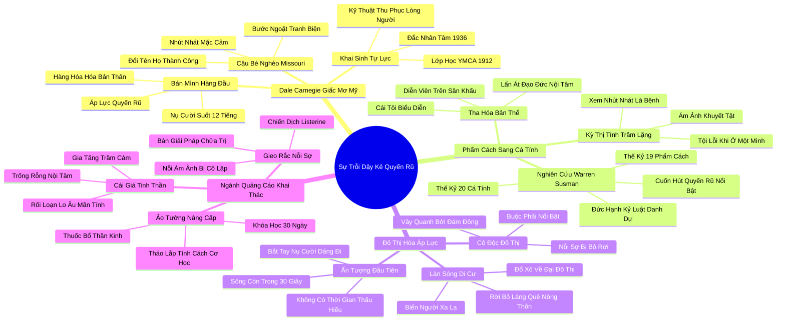

# 📖 TỔNG HỢP NỘI DUNG CHUYÊN SÂU: CHƯƠNG MỘT - SỰ TRỖI DẬY CỦA "KẺ QUYẾN RŨ VĨ ĐẠI": HÌNH MẪU HƯỚNG NGOẠI LÝ TƯỞNG RA ĐỜI NHƯ THẾ NÀO? (THE RISE OF THE MIGHTY LIKEABLE FELLOW)

### 🎯 THÔNG ĐIỆP CỐT LÕI (1 - 2 CÂU)
Thế kỷ 20 chứng kiến một cuộc đại biến chuyển văn hóa từ "Nền văn hóa Tính cách" (tôn vinh phẩm hạnh và đạo đức nội tâm) sang "Nền văn hóa Cá tính" (tôn sùng sức hút biểu diễn và ấn tượng bề ngoài); sự trỗi dậy của Dale Carnegie và ngành quảng cáo hiện đại đã biến sự tự tin hào nhoáng thành chuẩn mực bắt buộc, đày ải những tâm hồn trầm lặng vào bóng tối mặc cảm.

---

### 📊 LƯỢC ĐỒ PHÂN BỔ CẤU TRÚC TÀI LIỆU
Bảng đối chiếu cấu trúc các phần trong tài liệu gốc và số lượng luận điểm chuyên sâu được khai phóng:

| Phần / Mục Trong Tài Liệu Gốc | Trọng Tâm Phân Tích | Số Luận Điểm | Tỷ Trọng Tri Thức |
| :--- | :--- | :---: | :---: |
| **Phần 1: Cuộc Đời Dale Carnegie & Sự Chuyển Mình Giấc Mơ Mỹ** | Cậu bé nghèo Missouri, biến kỹ năng bán hàng và tài ăn nói thành bệ phóng thành công | 3 luận điểm | 25% |
| **Phần 2: Từ Nền Văn Hóa Phẩm Cách Sang Nền Văn Hóa Cá Tính** | Nghiên cứu của Warren Susman: Sự suy tàn của Character và sự lên ngôi của Personality | 3 luận điểm | 25% |
| **Phần 3: Đô Thị Hóa & Áp Lực Ấn Tượng Đầu Tiên** | Rời bỏ làng quê nông thôn bước vào đô thị công nghiệp, áp lực phải tỏa sáng giữa người lạ | 3 luận điểm | 25% |
| **Phần 4: Ngành Quảng Cáo & Nỗi Ám Ảnh Về Sự Nhút Nhát** | Sự trỗi dậy của ngành mỹ phẩm, quảng cáo khai thác nỗi sợ bị cô lập xã hội | 3 luận điểm | 25% |
| **TỔNG CỘNG** | **Toàn bộ cấu trúc Chương 1** | **12 luận điểm** | **100%** |

---

### 💡 12 LUẬN ĐIỂM CHUYÊN SÂU THEO TỪNG PHẦN TÀI LIỆU

#### 📑 PHẦN 1: CUỘC ĐỜI DALE CARNEGIE & GIẤC MƠ MỸ (DALE CARNEGIE)

1. **Sự Chuyển Mình Kỳ Diệu Của Dale Carnegie:**
   - *Phân tích chuyên sâu:* Dale Carnegie sinh ra trong một gia đình nông dân nghèo khó tại Missouri, từng là một cậu bé gầy gò, nhút nhát và mặc cảm vì bộ quần áo cũ kỹ. Bước ngoặt cuộc đời diễn ra khi ông gia nhập đội tranh biện của trường đại học và phát hiện ra rằng tài hùng biện và sự tự tin biểu diễn trước đám đông có thể xóa nhòa mọi khoảng cách giai cấp và mang lại quyền lực xã hội to lớn.
   - *Công cụ / Phương pháp đi kèm:* Mô Hình Chuyển Hóa Nhờ Kỹ Năng Hùng Biện (Rhetorical Social Mobility Model).
   - *Ví dụ thực chiến:* Carnegie đổi cách viết họ của mình từ "Carnagey" sang "Carnegie" (trùng với tên ông trùm thép Andrew Carnegie) – một biểu tượng hoàn hảo cho nghệ thuật xây dựng thương hiệu cá nhân biểu diễn.

2. **Khai Sinh Ngành Đào Tạo Kỹ Năng Nói Trước Đám Đông:**
   - *Phân tích chuyên sâu:* Năm 1912, tại tổ chức YMCA New York, Carnegie bắt đầu giảng dạy các lớp học nói trước công chúng cho các thương nhân và nhân viên bán hàng. Thay vì dạy các kỹ thuật hùng biện học thuật cổ điển, ông dạy họ cách mỉm cười rạng rỡ, nhớ tên người khác, truyền năng lượng tích cực và làm chủ tâm lý đối thoại. Đây chính là viên gạch nền móng khai sinh ra ngành công nghiệp tự lực (Self-help) hiện đại.
   - *Công cụ / Phương pháp đi kèm:* Bộ Quy Tắc Thu Phục Lòng Người Carnegie (Carnegie Persuasion Protocol).
   - *Ví dụ thực chiến:* Cuốn sách "Đắc Nhân Tâm" (How to Win Friends and Influence People) xuất bản năm 1936 trở thành cuốn sách bán chạy nhất mọi thời đại, hướng dẫn hàng chục triệu con người cách biến mình thành những "kẻ quyến rũ vĩ đại".

3. **Đồng Hóa Thành Công Kinh Tế Với Khả Năng Bán Mình:**
   - *Phân tích chuyên sâu:* Carnegie đã biến thông điệp bán hàng thành một triết lý sống: Trong một nền kinh tế thương mại tự do, bạn không chỉ bán sản phẩm hay dịch vụ, mà bạn đang bán chính bản thân mình (Selling yourself). Nếu bạn không thể thu hút và quyến rũ người khác ngay từ cái bắt tay đầu tiên, mọi tài năng chuyên môn của bạn đều trở nên vô giá trị.
   - *Công cụ / Phương pháp đi kèm:* Ma Trận Tự Tiếp Thị Cá Nhân (Personal Branding Commodity Matrix).
   - *Ví dụ thực chiến:* Các nhân viên bán hàng thời kỳ này được đào tạo phải luôn giữ nụ cười trên môi suốt 12 tiếng mỗi ngày, bất kể tâm trạng thực sự bên trong của họ là gì.

---

#### 📑 PHẦN 2: TỪ VĂN HÓA PHẨM CÁCH SANG VĂN HÓA CÁ TÍNH (CHARACTER TO PERSONALITY)

4. **Nghiên Cứu Lịch Sử Đột Phá Của Warren Susman:**
   - *Phân tích chuyên sâu:* Nhà sử học văn hóa lỗi lạc Warren Susman đã khảo sát hàng nghìn cuốn sách hướng dẫn đạo đức và phong cách sống từ thế kỷ 19 sang thế kỷ 20, và phát hiện ra một sự biến chuyển ngôn ngữ chấn động:
     - **Thế kỷ 19 - Nền Văn Hóa Phẩm Cách (Culture of Character):** Tôn vinh các từ khóa: Đức hạnh (Duty), Danh dự (Honor), Sự chính trực (Integrity), Kỷ luật (Discipline), Lương tâm (Conscience). Một người đàn ông được đánh giá cao khi anh ta khiêm tốn, biết kiềm chế bản thân và giữ lời hứa khi ở một mình.
     - **Thế kỷ 20 - Nền Văn Hóa Cá Tính (Culture of Personality):** Tôn vinh các từ khóa: Cuốn hút (Fascinating), Quyến rũ (Charming), Năng động (Energetic), Hấp dẫn (Magnetic), Nổi bật (Stunning). Một người được đánh giá cao khi anh ta biết cách gây ấn tượng mạnh mẽ với người lạ.
   - *Công cụ / Phương pháp đi kèm:* Khung Đối Chiếu Biến Chuyển Lịch Sử Susman (Susman's Cultural Shift Framework).
   - *Ví dụ thực chiến:* Abraham Lincoln là biểu tượng tối thượng của Nền Văn Hóa Phẩm Cách – một người đàn ông giản dị, sâu sắc, không cần phô trương; trong khi các ngôi sao Hollywood thế kỷ 20 là hiện thân của Nền Văn Hóa Cá Tính.

5. **Sự Đảo Lộn Giá Trị: Khi Cái Tôi Biểu Diễn Lấn Át Đạo Đức Nội Tâm:**
   - *Phân tích chuyên sâu:* Trong Nền Văn Hóa Cá Tính, việc bạn là ai trong tâm hồn không còn quan trọng bằng việc bạn trông như thế nào trong mắt người khác. Sự chính trực âm thầm bị coi là lỗi thời; sự khéo léo đóng kịch và khả năng thao túng cảm xúc đám đông được nâng lên hàng nghệ thuật sinh tồn.
   - *Công cụ / Phương pháp đi kèm:* Phân Tích Sự Tha Hóa Bản Thể (Persona Alienation Diagnostic).
   - *Ví dụ thực chiến:* Các cuốn sách hướng dẫn nghề nghiệp bắt đầu khuyên nhân viên: "Đừng lo lắng về việc bạn có đủ năng lực hay không, hãy học cách tạo ấn tượng rằng bạn là người tự tin và tài giỏi nhất phòng".

6. **Sự Ra Đời Của Nỗi Ám Ảnh Về Sự Nhút Nhát (The Stigma of Shyness):**
   - *Phân tích chuyên sâu:* Trước thế kỷ 20, sự trầm lặng và e dè được coi là biểu hiện của sự khiêm tốn, đoan trang và có giáo dục. Nhưng khi Nền Văn Hóa Cá Tính thống trị, sự nhút nhát lập tức bị dán nhãn là một "căn bệnh xã hội nguy hiểm", một dấu hiệu của sự thất bại và yếu đuối cần phải được tiêu diệt tận gốc rễ.
   - *Công cụ / Phương pháp đi kèm:* Thước Đo Kỳ Thị Tính Trầm Lặng (Shyness Stigmatization Index).
   - *Ví dụ thực chiến:* Các tạp chí phụ nữ và y học đầu thế kỷ 20 bắt đầu đăng tải các bài viết cảnh báo các bà mẹ rằng nếu con cái họ thích chơi một mình, chúng có thể trở thành những kẻ tâm thần phân liệt hoặc tội phạm nguy hiểm.

---

#### 📑 PHẦN 3: ĐÔ THỊ HÓA & ÁP LỰC ẤN TƯỢNG ĐẦU TIÊN (URBANIZATION & FIRST IMPRESSIONS)

7. **Làn Sóng Đô Thị Hóa Và Sự Xóa Nhòa Cộng Đồng Làng Quê:**
   - *Phân tích chuyên sâu:* Cuối thế kỷ 19, hàng triệu thanh niên nông thôn rời bỏ các làng quê thanh bình – nơi mọi người quen biết nhau qua nhiều thế hệ và hiểu rõ phẩm cách thật của từng người – để đổ xô về các đại đô thị công nghiệp như Chicago, New York. Tại đây, họ phải sống và làm việc giữa hàng vạn người xa lạ hoàn toàn.
   - *Công cụ / Phương pháp đi kèm:* Mô Hình Tác Động Của Đô Thị Hóa Lên Tâm Lý (Urban Migration Psychology Model).
   - *Ví dụ thực chiến:* Một chàng trai nông thôn từng được cả làng kính trọng vì sự chăm chỉ và thật thà, khi bước chân xuống nhà ga New York bỗng chốc trở thành một kẻ vô danh lạc lõng, buộc phải tìm cách gây chú ý để có được một công việc bán hàng.

8. **Áp Lực Sinh Tử Của "Ấn Tượng Đầu Tiên" (First Impressions):**
   - *Phân tích chuyên sâu:* Giữa một biển người xa lạ trong thành phố, không ai có thời gian để tìm hiểu chiều sâu tâm hồn của bạn qua nhiều năm tháng. Bạn chỉ có vỏn vẹn vài giây để gây ấn tượng trong một buổi phỏng vấn xin việc hoặc một cuộc gặp gỡ đối tác. "Ấn tượng đầu tiên" trở thành vấn đề sinh tử quyết định sự sống còn kinh tế của mỗi cá nhân.
   - *Công cụ / Phương pháp đi kèm:* Khung Đánh Giá Ấn Tượng Ban Đầu Tức Thì (First Impression Survival Matrix).
   - *Ví dụ thực chiến:* Các cẩm nang nghề nghiệp những năm 1920 nhấn mạnh: "Hãy nhớ rằng nhà tuyển dụng chỉ nhìn vào bạn trong 30 giây đầu tiên: dáng đi, nụ cười và cái bắt tay của bạn sẽ quyết định tương lai của bạn".

9. **Sự Ra Đời Của Nỗi Sợ Bị Đám Đông Bỏ Rơi:**
   - *Phân tích chuyên sâu:* Sống trong các đô thị đông đúc tạo ra một nghịch lý tâm lý sâu sắc: con người chưa bao giờ được vây quanh bởi nhiều người đến thế, nhưng cũng chưa bao giờ cảm thấy cô độc và dễ bị tổn thương đến thế. Nỗi sợ bị đám đông phớt lờ và bỏ rơi biến việc "phải trở nên nổi bật" thành một phản xạ sinh tồn bắt buộc.
   - *Công cụ / Phương pháp đi kèm:* Chỉ Số Lo Âu Xã Hội Đô Thị (Urban Social Alienation Metric).
   - *Ví dụ thực chiến:* Các nhân viên công sở bắt đầu tham gia các câu lạc bộ giao khiêu vũ và tiệc tùng vào mỗi tối chỉ vì sợ bị đồng nghiệp gán mác là kẻ lập dị khó gần.

---

#### 📑 PHẦN 4: NGÀNH QUẢNG CÁO & NỖI ÁM ẢNH BẢN THÂN (ADVERTISING & SELF-DOUBT)

10. **Ngành Quảng Cáo Khai Thác Triệt Để Nỗi Tự Ti Ngoại Hình Và Giao Tiếp:**
    - *Phân tích chuyên sâu:* Sự trỗi dậy của ngành công nghiệp quảng cáo hiện đại những năm 1920 gắn liền với việc gieo rắc nỗi sợ hãi tâm lý: Các chiến dịch quảng cáo không chỉ bán xà phòng hay nước súc miệng, mà bán "giải pháp chữa trị sự cô lập xã hội". Họ thuyết phục người tiêu dùng rằng nếu bạn có mùi cơ thể, hơi thở có mùi hoặc không biết nói chuyện hài hước, bạn sẽ bị bạn bè xa lánh và đối tác từ chối.
    - *Công cụ / Phương pháp đi kèm:* Chiến Thuật Tiếp Thị Gieo Rắc Nỗi Sợ (Fear-Based Marketing Playbook).
    - *Ví dụ thực chiến:* Chiến dịch quảng cáo nước súc miệng Listerine huyền thoại với khẩu hiệu về chứng hôi miệng (Halitosis) đã biến một căn bệnh y học ít ai biết thành nỗi ám ảnh quốc gia: hình ảnh một cô gái xinh đẹp ngồi khóc một mình vì không ai thèm khiêu vũ cùng do hơi thở có mùi.

11. **Bán Hàng Cho Người Hướng Nội Bằng Lời Hứa Biến Đổi Nhân Cách:**
    - *Phân tích chuyên sâu:* Hàng loạt khóa học hàm thụ, thuốc bổ thần kinh và sách cẩm nang xuất hiện với lời hứa biến một người nhút nhát, e dè thành một "nam châm thu hút mọi ánh nhìn" chỉ sau 30 ngày. Xã hội bắt đầu coi tính cách con người như một cỗ máy có thể tháo lắp và nâng cấp tùy tiện để phục vụ cho mục tiêu thương mại.
    - *Công cụ / Phương pháp đi kèm:* Ảo Tưởng Nâng Cấp Tính Cách Cơ Học (Mechanical Personality Transformation Myth).
    - *Ví dụ thực chiến:* Các quảng cáo in hình một người đàn ông rụt rè ngồi góc phòng, và sau khi học khóa học thần kỳ, anh ta trở thành người đứng giữa phòng kể chuyện cười khiến mọi người vây quanh thán phục.

12. **Cái Giá Tinh Thần Của Một Nền Văn Hóa Chỉ Chú Trọng Bề Nổi:**
    - *Phân tích chuyên sâu:* Khi một xã hội từ bỏ chiều sâu của Phẩm Cách để chạy theo Cá Tính bề ngoài, cái giá phải trả là sự gia tăng đột biến của các chứng rối loạn lo âu, sự trầm cảm và cảm giác trống rỗng nội tâm. Con người trở thành những diễn viên kiệt quệ trên sân khấu của chính mình, luôn nơm nớp lo sợ bị lột bỏ chiếc mặt nạ hào nhoáng.
    - *Công cụ / Phương pháp đi kèm:* Thước Đo Thâm Hụt Ý Nghĩa Nhân Sinh (Existential Emptiness Index).
    - *Ví dụ thực chiến:* Thế hệ thanh niên hiện đại lớn lên với mạng xã hội (Instagram, TikTok) đang tái hiện chính xác bi kịch của những năm 1920 ở quy mô toàn cầu: săn tìm lượt thích bề ngoài trong khi tâm hồn bên trong hoàn toàn héo úa.

---

### 🛠️ KẾ HOẠCH HÀNH ĐỘNG THỰC THI (20 HÀNH ĐỘNG)

#### TẦNG 1: HÀNH VI VI MÔ TỨC THÌ (< 2 PHÚT)
- [ ] **Nhận diện cái bẫy Cá tính:** Khi bị choáng ngợp bởi một người hoạt ngôn, tự nhắc nhở: "Đây chỉ là kỹ năng biểu diễn, hãy quan sát phẩm cách thật của họ".
- [ ] **Thả lỏng nụ cười gượng:** Tự cho phép cơ mặt được trở về trạng thái thư giãn tự nhiên khi không có nhu cầu giao tiếp xã giao.
- [ ] **Tập trung vào giá trị cốt lõi:** Trước khi bước vào một cuộc họp, tự hỏi: "Mình mang lại giá trị chuyên môn gì?" thay vì "Mình phải diễn xuất thế nào?".
- [ ] **Chặn đứng thông điệp quảng cáo độc hại:** Lập tức bỏ qua các bài viết hoặc quảng cáo gieo rắc nỗi sợ hãi về việc "không đủ hướng ngoại".
- [ ] **Ghi nhận sự chính trực nội tâm:** Tự khen ngợi bản thân khi hoàn thành một công việc âm thầm với trách nhiệm cao nhất.
- [ ] **Khoảng dừng 5 giây:** Dừng lại 5 giây quan sát bối cảnh thay vì vội vã cố gắng tạo ấn tượng ban đầu hấp dẫn.

#### TẦNG 2: THÓI QUEN & QUY TRÌNH TUẦN
- [ ] **Rà soát thang đo Character vs Personality:** Viết ra 5 giá trị phẩm cách nội tâm quan trọng nhất của bạn và đánh giá mức độ trung thành với chúng trong tuần.
- [ ] **Cai nghiện mạng xã hội biểu diễn (Digital Detox):** Dành trọn vẹn ngày Chủ nhật không đăng bài, không kiểm tra lượt thích để thanh lọc tâm hồn.
- [ ] **Xây dựng uy tín dựa trên kết quả thực tế:** Tập trung hoàn thành xuất sắc các sản phẩm chuyên môn thay vì dành thời gian cho các cuộc vận động hành lang.
- [ ] **Lập nhật ký nhận diện sự giả tạo:** Ghi lại những tình huống trong tuần mà bạn cảm thấy mình đang phải gượng ép đóng kịch để rút kinh nghiệm.
- [ ] **Đọc tiểu sử những vĩ nhân thời đại Phẩm cách:** Đọc sách về Abraham Lincoln hoặc Marcus Aurelius để tìm về nguồn cội sức mạnh đạo đức.
- [ ] **Thực hành giao tiếp chân thực:** Trò chuyện với đồng nghiệp bằng sự chân thành, không dùng những lời khen sáo rỗng kiểu Đắc Nhân Tâm.
- [ ] **Đánh giá các mối quan hệ xã giao:** Phân loại và cắt giảm bớt các mối quan hệ chỉ dựa trên sự phô trương bề nổi.

#### TẦNG 3: CHUYỂN HÓA CHIẾN LƯỢC DÀI HẠN
- [ ] **Xây dựng thương hiệu cá nhân dựa trên Phẩm cách:** Định vị bản thân như một chuyên gia đáng tin cậy, chính trực và có chiều sâu tri thức.
- [ ] **Tái cấu trúc tiêu chí đánh giá nhân tài trong công ty:** Loại bỏ sự thiên vị ứng viên hoạt ngôn; đưa tiêu chí đạo đức và sự cẩn trọng vào quy trình phỏng vấn.
- [ ] **Giáo dục con cái về sự khác biệt giữa Character và Personality:** Dạy con hiểu rằng lòng nhân ái, sự trung thực và tính kiên trì quan trọng hơn vẻ ngoài bóng bẩy.
- [ ] **Chống lại văn hóa sùng bái sự hào nhoáng:** Dũng cảm lên tiếng phản biện các dự án kinh doanh rỗng tuếch chỉ dựa trên tài hùng biện của CEO.
- [ ] **Thiết lập không gian sống tôn trọng sự tĩnh lặng:** Tạo dựng ngôi nhà như một nơi trú ẩn an toàn, xa lánh sự ồn ào và áp lực biểu diễn của xã hội đô thị.
- [ ] **Phát triển năng lực tư duy độc lập:** Rèn luyện khả năng đứng vững trước những trào lưu thời thượng ngắn hạn của đám đông.
- [ ] **Tuyên truyền văn hóa giá trị chiều sâu:** Viết bài hoặc chia sẻ về tầm quan trọng của việc khôi phục Nền Văn Hóa Phẩm Cách trong thời đại số.

---

### ❓ BỘ CÂU HỎI TỰ NGẪM (20 CÂU HỎI)

#### NHÓM 1: TỰ VẤN NHẬN THỨC & THẤU HIỂU BẢN THÂN
1. Tôi đang sống vì Nền Văn Hóa Phẩm Cách (Character) hay đang bị cuốn theo Nền Văn Hóa Cá Tính (Personality)?
2. Giá trị tự tôn của tôi bắt nguồn từ sự chính trực nội tâm hay bắt nguồn từ số lượng người tán thưởng tôi trên mạng xã hội?
3. Tôi có đang cảm thấy mệt mỏi và kiệt sức vì phải thường trực duy trì một hình tượng hào nhoáng, vui vẻ trước mắt người khác?
4. Khi đối diện với một người lạ, tôi lo sợ họ nhìn thấy điểm yếu chuyên môn của mình hay lo sợ mình không tạo được ấn tượng đầu tiên cuốn hút?
5. Nếu không ai nhìn thấy và tán thưởng những việc tôi làm, tôi có còn muốn tiếp tục sống tử tế và chăm chỉ hay không?

#### NHÓM 2: ĐÁNH GIÁ THỰC TRẠNG & RÀ SOÁT THÓI QUEN
6. Công việc hiện tại của tôi đang tưởng thưởng cho những người có phẩm cách chuyên môn thực chất hay những kẻ giỏi phô diễn bề ngoài?
7. Tôi có thói quen mua sắm những món đồ xa xỉ chỉ để tạo vỏ bọc tự tin và gây ấn tượng với những người tôi thậm chí không thích?
8. Các bài đăng trên mạng xã hội của tôi có phản ánh chân thực cuộc sống thực tế của tôi hay chỉ là một vở kịch được dàn dựng công phu?
9. Tôi đã từng bao nhiêu lần bỏ qua những sai sót đạo đức của một người chỉ vì họ quá duyên dáng, hoạt ngôn và có sức hút lôi cuốn?
10. Môi trường công sở của tôi có đang ép buộc mọi nhân viên phải biến mình thành những "kẻ quyến rũ vĩ đại" kiểu Dale Carnegie?

#### NHÓM 3: THÁCH THỨC NIỀM TIN CŨ & PHÁ VỠ ĐỊNH KIẾN
11. Liệu nghệ thuật "Đắc Nhân Tâm" có thực sự mang lại sự gắn kết chân thành giữa con người, hay nó chỉ là công cụ thao túng tâm lý phục vụ mục tiêu bán hàng?
12. Có phải người tạo được ấn tượng đầu tiên rực rỡ nhất luôn là người sẽ đồng hành trung thành và đáng tin cậy nhất trong dài hạn?
13. Tại sao xã hội chúng ta lại coi sự nhút nhát, e dè là một khuyết tật cần chữa trị thay vì một biểu hiện của sự đoan trang và cẩn trọng?
14. Abraham Lincoln có thể đắc cử tổng thống trong thời đại truyền hình và mạng xã hội ngày nay nếu ông từ chối phẫu thuật thẩm mỹ nhân cách?
15. Liệu một nền văn minh chỉ tôn sùng sự cuốn hút bề ngoài có thể tồn tại bền vững mà không bị mục ruỗng từ bên trong?

#### NHÓM 4: THIẾT KẾ GIẢI PHÁP & HÀNH ĐỘNG KIẾN TẠO
16. Tôi sẽ làm gì để đưa bản thân quay trở về với những giá trị bất biến của Nền Văn Hóa Phẩm Cách (đức hạnh, danh dự, sự chính trực)?
17. Những bước đi cụ thể nào giúp tôi xây dựng một thương hiệu cá nhân dựa trên chiều sâu chuyên môn thay vì tài ăn nói bề nổi?
18. Làm thế nào để tôi có thể bảo vệ con cái khỏi những thông điệp quảng cáo độc hại đang gieo rắc nỗi tự ti về ngoại hình và tính cách?
19. Tôi sẽ thiết lập quy trình tuyển dụng như thế nào để nhận diện được những viên ngọc quý có phẩm cách vững vàng nhưng không giỏi phô diễn?
20. Kế hoạch cụ thể nào sẽ giúp tôi tìm lại sự thanh thản nội tâm và sống một cuộc đời chân thật, không còn phải đeo chiếc mặt nạ cá tính gượng gạo?

---

### 🗺️ MINDMAP 4-5 TẦNG TRỰC QUAN ĐỈNH CAO

