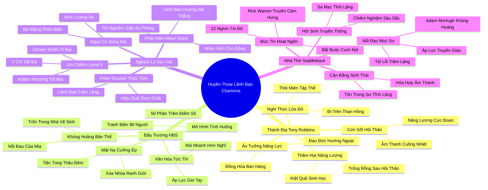

# 🗺️ BẢN ĐỒ TƯ DUY & BẢNG TRA CỨU NEO TRÍ NHỚ: CHƯƠNG HAI - HUYỀN THOẠI VỀ NHÀ LÃNH ĐẠO CÓ SỨC HÚT LÔI CUỐN

---

## 1. HỆ THỐNG PHẢ HỆ TRI THỨC (ACTIVE RECALL HIERARCHY)

---

## 2. BẢNG TRA CỨU NEO TRÍ NHỚ SIÊU TỐC (MEMORY ANCHOR CHEAT SHEET)

| 📑 Phần/Mục Tài Liệu | Khái Niệm / Từ Khóa Vàng | Bản Chất Cốt Lõi | Cảnh Báo Sai Lầm Thường Gặp | Hành Động Ứng Dụng Đột Phá |
| :--- | :--- | :--- | :--- | :--- |
| **Phần 1: Tony Robbins** | **Firewalk & Salesmanship** | Nâng tầm sự tự tin bề ngoài thành phẩm hạnh đạo đức tối thượng. | Nhầm lẫn hưng phấn nhất thời với năng lực tư duy chiến lược dài hạn. | Đo lường hiệu quả dựa trên kết quả phân tích thực tế thay vì độ hào hứng. |
| **Phần 1: Tony Robbins** | **Emotional Hangover** | Sự kiệt quệ năng lượng sinh học sau khi gồng mình đóng vai người hướng ngoại. | Cố ép bản thân tiếp tục tiệc tùng khi pin năng lượng nội tâm đã cạn kiệt. | Thiết lập ranh giới bảo vệ năng lượng cá nhân ngay sau các sự kiện đông người. |
| **Phần 2: Đấu trường HBS** | **Case Method Arena** | Tranh luận áp đảo chiếm 50% điểm, buộc sinh viên nói nhanh hơn suy nghĩ. | Đánh giá thấp năng lực của người ít nói trong các cuộc thảo luận tập thể. | Áp dụng cơ chế lấy ý kiến bằng văn bản (Brainwriting) trước khi họp trực tiếp. |
| **Phần 2: Đấu trường HBS** | **Extrovert Mask** | Chiếc mặt nạ xã giao bắt buộc để sinh tồn trong môi trường tinh hoa kinh tế. | Đánh mất bản sắc cá nhân và rơi vào trạng thái hoảng loạn tinh thần kéo dài. | Dành ra các khoảng lặng an toàn (Restorative Niches) để phục hồi bản thể thật. |
| **Phần 3: Khoa học Lãnh đạo** | **Level 5 Leadership** | Sự kết hợp giữa đức tính khiêm nhường tột bậc và ý chí sắt đá (Jim Collins). | Nghĩ rằng CEO xuất chúng bắt buộc phải là những ngôi sao truyền thông hào nhoáng. | Bổ nhiệm các nhà lãnh đạo tập trung phụng sự mục tiêu chung thay vì đánh bóng cái tôi. |
| **Phần 3: Khoa học Lãnh đạo** | **Adam Grant Matrix** | Lãnh đạo hướng nội đạt hiệu quả vượt trội khi nhân viên chủ động và sáng tạo. | Đặt một nhà lãnh đạo áp đặt cái tôi vào nhóm nhân viên giàu ý kiến đột phá. | Ghép đôi người đứng đầu biết lắng nghe với đội ngũ nhân sự chủ động thực thi. |
| **Phần 4: Saddleback Church** | **Spiritual Extroversion** | Sự đồng hóa sai lầm giữa lòng sùng kính đức tin với hành vi giao tiếp ồn ào. | Cho rằng người trầm lặng là người thiếu nhiệt huyết và vô cảm với cộng đồng. | Tôn vinh truyền thống chiêm nghiệm tĩnh lặng trong đời sống tâm linh và văn hóa nhóm. |
| **Phần 4: Saddleback Church** | **Adam McHugh Paradox** | Cuộc khủng hoảng của những nhà tâm linh hướng nội trong môi trường quá tải âm thanh. | Ép buộc mọi thành viên phải tham gia các hoạt động kết nối náo nhiệt như nhau. | Xây dựng không gian tĩnh lặng đa dạng cho cả hai kiểu tính cách cùng phát triển. |
