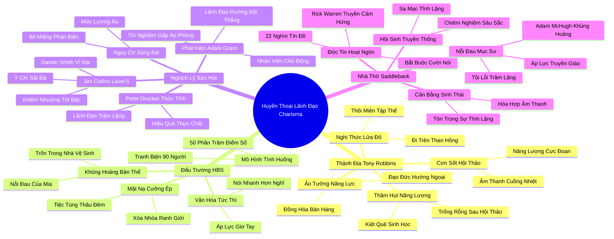

# 📖 TỔNG HỢP NỘI DUNG CHUYÊN SÂU: CHƯƠNG HAI - HUYỀN THOẠI VỀ NHÀ LÃNH ĐẠO CÓ SỨC HÚT LÔI CUỐN (THE MYTH OF CHARISMATIC LEADERSHIP)

### 🎯 THÔNG ĐIỆP CỐT LÕI (1 - 2 CÂU)
Văn hóa doanh nghiệp và xã hội hiện đại đang mắc kẹt trong ảo tưởng nguy hiểm khi đồng nhất năng lượng hoạt ngôn và sức hút biểu diễn bên ngoài với năng lực lãnh đạo thực thụ; trên thực tế, những nhà lãnh đạo trầm tĩnh, khiêm nhường và biết lắng nghe mới là những người phát huy tối đa sức mạnh của đội ngũ nhân viên chủ động và lèo lái tổ chức đạt đến sự vĩ đại trường tồn.

---

### 📊 LƯỢC ĐỒ PHÂN BỔ CẤU TRÚC TÀI LIỆU
Bảng đối chiếu cấu trúc các phần trong tài liệu gốc và số lượng luận điểm chuyên sâu được khai phóng:

| Phần / Mục Trong Tài Liệu Gốc | Trọng Tâm Phân Tích | Số Luận Điểm | Tỷ Trọng Tri Thức |
| :--- | :--- | :---: | :---: |
| **Phần 1: Thánh địa Thức tỉnh của Tony Robbins** | Cơn sốt hội thảo bán hàng, đi trên than hồng (Firewalk), đồng hóa kỹ năng thuyết phục với chuẩn mực đạo đức | 3 luận điểm | 25% |
| **Phần 2: Đấu trường Trường Kinh doanh Harvard (HBS)** | Phương pháp tình huống (Case Method), áp lực phát biểu chiếm 50% điểm, mặt nạ hướng ngoại bắt buộc | 3 luận điểm | 25% |
| **Phần 3: Khoa học Lãnh đạo & Nghịch lý Sức hút** | Peter Drucker, Jim Collins Level 5, nghiên cứu đột phá của Adam Grant về đội ngũ chủ động | 3 luận điểm | 25% |
| **Phần 4: Tôn giáo của Âm thanh tại Saddleback** | Nhà thờ mục sư Rick Warren, cuộc đấu tranh thầm lặng của Mục sư Adam McHugh, sự đồng hóa đức tin với tính hướng ngoại | 3 luận điểm | 25% |
| **TỔNG CỘNG** | **Toàn bộ cấu trúc Chương 2** | **12 luận điểm** | **100%** |

---

### 💡 12 LUẬN ĐIỂM CHUYÊN SÂU THEO TỪNG PHẦN TÀI LIỆU

#### 📑 PHẦN 1: THÁNH ĐỊA THỨC TỈNH CỦA TONY ROBBINS (SALESMANSHIP AS A VIRTUE)

1. **Sự Thần Thánh Hóa Kỹ Năng Bán Hàng Trong Văn Hóa Đại Chúng:**
   - *Phân tích chuyên sâu:* Tại các hội thảo quy mô vạn người như "Đánh Thức Năng Lực Vô Hạn" (Unleash the Power Within) của Tony Robbins, tính hướng ngoại không chỉ được tôn vinh như một kỹ năng giao tiếp mà đã được nâng tầm thành một "phẩm hạnh đạo đức tối thượng". Năng lượng âm thanh cuồng nhiệt, tiếng nhạc sàn đinh tai và lời hiệu triệu liên tục tạo ra một trạng thái xuất thần tập thể, nơi sự ngập ngừng hay trầm tư bị xem là dấu hiệu của sự yếu đuối và thất bại.
   - *Công cụ / Phương pháp đi kèm:* Phễu Tâm Lý Đám Đông (Crowd Hypnosis Funnel) & Thang Đo Hưng Phấn Vận Động (Physiological Priming).
   - *Ví dụ thực chiến:* Susan Cain trực tiếp tham gia nghi thức đi chân trần trên than hồng (Firewalk) ở nhiệt độ 650°C, chứng kiến hàng nghìn người vượt qua nỗi sợ bằng cách tự thôi miên rằng chỉ cần sở hữu sự tự tin bùng nổ là có thể chiến thắng mọi định luật vật lý và thương trường.

2. **Ảo Tưởng Về Sự Tự Tin Quyết Định Năng Lực Chuyên Môn:**
   - *Phân tích chuyên sâu:* Diễn ngôn của Tony Robbins khẳng định rằng trạng thái thể chất (physiology) chi phối 100% cảm xúc và kết quả. Tuy nhiên, điều này tạo ra một hệ quả méo mó: xã hội bắt đầu đánh giá giá trị của một con người dựa trên khả năng trình diễn và sức lôi cuốn bề mặt thay vì chiều sâu nội tâm, tính chân thực và sự thấu đáo trong suy nghĩ.
   - *Công cụ / Phương pháp đi kèm:* Mô Hình Đánh Giá Năng Lực Giả Định (Perceived Competence vs Actual Competence Matrix).
   - *Ví dụ thực chiến:* Các nhân viên bán hàng xuất sắc nhất trong hội thảo thường là những người có khả năng nói không ngừng nghỉ, nhưng trong dài hạn, các hợp đồng giá trị cao đòi hỏi sự phân tích rủi ro kỹ lưỡng lại thường bị họ bỏ qua do tâm lý say men chiến thắng ngắn hạn.

3. **Cái Bẫy Kiệt Quệ Năng Lượng Sau Những Cơn Say Hưng Phấn:**
   - *Phân tích chuyên sâu:* Cảm giác hưng phấn cực độ do các sự kiện truyền động lực tạo ra thực chất chỉ là một "khoản vay năng lượng sinh học" có lãi suất cắt cổ. Khi trở về với đời thực, những người hướng nội rơi vào trạng thái kiệt quệ cảm xúc sâu sắc vì họ buộc phải gồng mình đóng vai một con người hoàn toàn xa lạ với hệ thần kinh tự nhiên của họ.
   - *Công cụ / Phương pháp đi kèm:* Chỉ Số Thâm Hụt Năng Lượng Tinh Thần (Emotional Hangover Audit).
   - *Ví dụ thực chiến:* Tác giả miêu tả cảm giác trống rỗng và mệt mỏi cùng cực vào buổi sáng hôm sau khi bước ra khỏi khán phòng hội thảo rực lửa, nhận ra sự ồn ào không hề mang lại giải pháp căn cơ cho những trăn trở nội tâm.

---

#### 📑 PHẦN 2: ĐẤU TRƯỜNG TRƯỜNG KINH DOANH HARVARD (THE HARVARD BUSINESS SCHOOL ARENA)

4. **Thành Trì HBS Và Triết Lý Lãnh Đạo Định Hướng Hành Động Tức Thì:**
   - *Phân tích chuyên sâu:* Trường Kinh doanh Harvard (HBS) được mệnh danh là "thánh địa của các CEO Phố Wall", nơi đào tạo ra tầng lớp tinh hoa kinh tế Mỹ. Toàn bộ văn hóa HBS được xây dựng xung quanh một định đề bất di bất dịch: một nhà lãnh đạo xuất chúng phải là người hành động quyết đoán, nói nhanh, tự tin tuyệt đối và luôn làm chủ mọi cuộc đối thoại ngay từ giây đầu tiên.
   - *Công cụ / Phương pháp đi kèm:* Ma Trận Văn Hóa HBS (Action-First Culture Paradigm).
   - *Ví dụ thực chiến:* Khuôn viên trường HBS tràn ngập những sinh viên ăn mặc chỉn chu, bước đi dứt khoát, giao tiếp bằng những cái bắt tay rắn rỏi và giọng nói sang sảng; sự do dự hay ngập ngừng suy nghĩ bị coi là dấu hiệu của sự thiếu năng lực.

5. **Phương Pháp Nghiên Cứu Tình Huống (Case Method) Và Cuộc Đua Phát Biểu Sinh Tử:**
   - *Phân tích chuyên sâu:* Tại HBS, 50% điểm số môn học được quyết định bởi tần suất và mức độ áp đảo khi phát biểu trong các giảng đường vòng cung 90 sinh viên. Quy chế này biến lớp học thành một đấu trường sinh tử, nơi việc giơ tay cướp lời nhanh hơn người khác được tưởng thưởng cao hơn việc đưa ra một góc nhìn sâu sắc nhưng chậm rãi. Người ta học cách nói trước khi kịp nghĩ trọn vẹn.
   - *Công cụ / Phương pháp đi kèm:* Chỉ Số Đóng Góp Giảng Đường (Air-time Maximization Strategy).
   - *Ví dụ thực chiến:* Nữ sinh viên Mia chia sẻ cô luôn bị dày vò bởi cảm giác hoảng loạn trước mỗi giờ học, buộc phải chuẩn bị sẵn những câu nói ngắn gây sốc để giơ tay thật nhanh, dù trong lòng cô muốn dành thời gian đào sâu các con số tài chính phức tạp hơn.

6. **Áp Lực Đồng Hóa Xã Hội Và Mặt Nạ Hướng Ngoại Bắt Buộc:**
   - *Phân tích chuyên sâu:* Tại HBS, ranh giới giữa học tập và giao lưu xã hội bị xóa nhòa hoàn toàn. Sinh viên phải tham gia các buổi tiệc tùng thâu đêm, các chuyến du lịch nhóm bắt buộc để xây dựng mạng lưới quan hệ. Giáo sư Thomas DeLong thừa nhận rằng môi trường này ép mọi cá nhân phải đeo lên một "chiếc mặt nạ hướng ngoại hoàn hảo", khiến những người có thiên hướng trầm lặng cảm thấy mình là những kẻ dị biệt có khuyết tật về nhân cách.
   - *Công cụ / Phương pháp đi kèm:* Phân Tích Xung Đột Bản Thể (Authentic Identity vs Social Persona Gap).
   - *Ví dụ thực chiến:* Mia và các bạn học hướng nội thường phải trốn vào nhà vệ sinh hoặc phòng ký túc xá đóng kín cửa để thở dốc sau hàng giờ gồng mình cười nói xã giao tại các quán bar đông đúc.

---

#### 📑 PHẦN 3: KHOA HỌC LÃNH ĐẠO & NGHỊCH LÝ SỨC HÚT (THE CHARISMATIC LEADERSHIP PARADOX)

7. **Sự Thức Tỉnh Của Peter Drucker Và Bằng Chứng Từ Jim Collins:**
   - *Phân tích chuyên sâu:* Bậc thầy quản trị Peter Drucker từng quan sát thấy rằng những nhà lãnh đạo hiệu quả nhất trong nửa thế kỷ ông làm việc cùng không hề có sức hút lôi cuốn áp đảo; họ là những người trầm lặng, kiên định và nghiêm túc. Công trình nghiên cứu kinh điển "Từ Tốt Đến Vĩ Đại" của Jim Collins củng cố điều này: 100% các công ty nhảy vọt vĩ đại đều được dẫn dắt bởi các Nhà Lãnh Đạo Cấp Độ 5 (Level 5 Leaders) – những người kết hợp giữa sự khiêm nhường tột bậc và ý chí sắt đá, hoàn toàn trái ngược với những CEO ngôi sao hào nhoáng.
   - *Công cụ / Phương pháp đi kèm:* Kim Tự Tháp Lãnh Đạo Cấp Độ 5 (Level 5 Leadership Hierarchy).
   - *Ví dụ thực chiến:* Darwin Smith của tập đoàn Kimberly-Clark, một người đàn ông nhút nhát, ghét sự chú ý của truyền thông và ăn mặc giản dị, đã đưa giá trị cổ phiếu công ty vượt xa General Electric và Coca-Cola trong suốt 20 năm cầm quyền.

8. **Nghiên Cứu Đột Phá Của Adam Grant Về Sự Tương Tác Giữa Lãnh Đạo Và Cấp Dưới:**
   - *Phân tích chuyên sâu:* Giáo sư Adam Grant (Wharton) cùng các cộng sự đã chứng minh quy luật tương tác then chốt: Lãnh đạo hướng ngoại hoạt động hiệu quả khi nhân viên thụ động (cần người thúc đẩy); nhưng khi nhân viên là những người chủ động, sáng tạo và giàu ý kiến (proactive employees), lãnh đạo hướng nội lại mang lại lợi nhuận và năng suất vượt trội hơn hẳn. Lãnh đạo hướng ngoại cảm thấy bị đe dọa bởi sáng kiến của cấp dưới, trong khi lãnh đạo hướng nội biết lắng nghe, nâng đỡ và trao quyền thực thi.
   - *Công cụ / Phương pháp đi kèm:* Mô Hình Tương Thích Năng Động Lãnh Đạo (Grant's Leader-Follower Proactivity Matrix).
   - *Ví dụ thực chiến:* Thí nghiệm gấp áo phông gây quỹ cho thấy các nhóm có thành viên chủ động đóng góp sáng kiến đạt doanh số cao hơn 24% khi làm việc dưới sự điều phối của một trưởng nhóm hướng nội lắng nghe, so với khi dưới quyền một trưởng nhóm hướng ngoại luôn tìm cách áp đặt ý tưởng cá nhân.

9. **Nguy Cơ Từ Những Nhà Lãnh Đạo Hào Nhoáng: Cái Giá Của Sự Cả Tin:**
   - *Phân tích chuyên sâu:* Giáo sư Bradley Agle phát hiện rằng các tổ chức do CEO có sức hút lôi cuốn dẫn dắt không hề đạt hiệu quả tài chính cao hơn, nhưng mức lương thưởng của những CEO này lại cao ngất ngưởng và doanh nghiệp dễ rơi vào thảm họa rủi ro do không ai dám lên tiếng phản biện người đứng đầu. Sức hút cá nhân dễ dàng che mờ các lỗ hổng chiến lược nghiêm trọng.
   - *Công cụ / Phương pháp đi kèm:* Thước Đo Rủi Ro Sùng Bái Lãnh Đạo (Charisma Hubris Risk Index).
   - *Ví dụ thực chiến:* Cuộc khủng hoảng tài chính năm 2008 bắt nguồn một phần từ các ngân hàng đầu tư nơi các nhà giao dịch ồn ào, tự tin thái quá được tán dương, trong khi những chuyên gia phân tích rủi ro thận trọng ngồi ở góc phòng lại bị phớt lờ.

---

#### 📑 PHẦN 4: TÔN GIÁO CỦA ÂM THANH TẠI NHÀ THỜ SADDLEBACK (EVANGELICAL OUTPOURING)

10. **Nhà Thờ Khổng Lồ (Megachurch) Và Sự Đồng Hóa Đức Tin Với Tính Hoạt Ngôn:**
    - *Phân tích chuyên sâu:* Tại siêu nhà thờ Saddleback của Mục sư Rick Warren với 22.000 tín đồ, tôn giáo đã được hiện đại hóa theo đúng chuẩn mực hướng ngoại: ban nhạc rock, màn hình LED khổng lồ, những cái ôm bắt buộc và lời kêu gọi phải thể hiện đức tin một cách ồn ào ra bên ngoài. Văn hóa Phúc Âm (Evangelicalism) vô tình tạo ra quan niệm sai lầm rằng một người chỉ thực sự yêu Chúa khi họ xông xáo giao tiếp, truyền giáo nhiệt thành và kết nối không ngừng nghỉ.
    - *Công cụ / Phương pháp đi kèm:* Ma Trận Đồng Hóa Văn Hóa Tâm Linh (Spiritual Extroversion Index).
    - *Ví dụ thực chiến:* Khung cảnh buổi sáng chủ nhật tại Saddleback giống như một lễ hội âm nhạc sôi động ngoài trời, nơi mọi tín đồ được yêu cầu phải quay sang bắt tay, ôm và cười rạng rỡ với ít nhất 5 người lạ xung quanh.

11. **Cuộc Đấu Tranh Tinh Thần Của Mục Sư Adam McHugh:**
    - *Phân tích chuyên sâu:* Mục sư Adam McHugh, một người hướng nội sâu sắc, đã trải qua cuộc khủng hoảng đức tin trầm trọng khi cảm thấy mình không đủ tư cách làm mục sư chỉ vì anh cần sự tĩnh lặng để cầu nguyện và cảm thấy kiệt sức trước các nghi lễ giao tiếp bề nổi liên tục. Anh phát hiện ra rằng hàng nghìn tín đồ và giáo sĩ hướng nội khác cũng đang âm thầm chịu đựng nỗi đau tương tự: họ cảm thấy tội lỗi vì không thể trở thành mẫu người hoạt ngôn mà giáo hội kỳ vọng.
    - *Công cụ / Phương pháp đi kèm:* Bản Đồ Tái Định Vị Tâm Linh Tĩnh Lặng (Contemplative Spirituality Framework).
    - *Ví dụ thực chiến:* McHugh viết cuốn sách "Những Người Hướng Nội Trong Giáo Hội" (Introverts in the Church) để khẳng định rằng truyền thống tâm linh hàng nghìn năm của nhân loại vốn bắt nguồn từ sự cô độc trong sa mạc và sự chiêm nghiệm sâu lắng, chứ không phải từ những buổi đại nhạc hội ồn ào.

12. **Sự Hồi Sinh Của Quyền Lực Trầm Lặng Trong Tổ Chức:**
    - *Phân tích chuyên sâu:* Cả HBS lẫn các siêu nhà thờ đều đang dần phải nhận ra giới hạn của mô hình ồn ào. Một tổ chức bền vững đòi hỏi sự cân bằng sinh thái: cần sự nhiệt huyết mở đường nhưng tối quan trọng là phải có chiều sâu chiêm nghiệm, sự thấu cảm âm thầm và khả năng phân tích rủi ro độc lập của những tâm hồn tĩnh lặng.
    - *Công cụ / Phương pháp đi kèm:* Mô Hình Đa Dạng Tính Cách Sinh Thái (Organizational Personality Ecology).
    - *Ví dụ thực chiến:* Sự đón nhận nồng nhiệt của các sinh viên HBS và các mục sư đối với các buổi hội thảo về tính hướng nội của Susan Cain và Adam McHugh cho thấy nhu cầu cấp bách được cởi bỏ chiếc mặt nạ hướng ngoại cưỡng ép.

---

### 🛠️ KẾ HOẠCH HÀNH ĐỘNG THỰC THI (20 HÀNH ĐỘNG)

#### TẦNG 1: HÀNH VI VI MÔ TỨC THÌ (< 2 PHÚT)
- [ ] **Quy tắc 3 giây lắng nghe:** Khi cấp dưới hoặc đồng nghiệp đưa ra ý kiến, dừng lại 3 giây trước khi phản hồi để đảm bảo không cướp lời họ.
- [ ] **Ghi chép trước khi phát biểu:** Viết vắn tắt 1-2 luận điểm cốt lõi ra sổ tay trước khi bật micro trong cuộc họp trực tuyến.
- [ ] **Kiểm tra tỷ lệ nói - nghe:** Tự nhắc nhở bản thân trong các cuộc hội thoại 1-1: duy trì tỷ lệ lắng nghe tối thiểu 60%.
- [ ] **Tháo mặt nạ năng lượng:** Hít thở sâu 3 nhịp và thả lỏng cơ mặt khi cảm thấy mình đang cố gượng cười để hòa nhập với đám đông.
- [ ] **Tán dương người trầm lặng:** Gật đầu khích lệ hoặc gửi tin nhắn riêng cảm ơn một đồng nghiệp ít nói khi họ đưa ra một ý kiến sắc bén.
- [ ] **Khảo sát mức độ kích thích:** Đánh giá thang điểm năng lượng (1-10) của bản thân trước khi quyết định bước vào một bữa tiệc ồn ào.

#### TẦNG 2: THÓI QUEN & QUY TRÌNH TUẦN
- [ ] **Thiết lập cơ chế lấy ý kiến bằng văn bản (Brainwriting):** Yêu cầu toàn bộ thành viên nhóm gửi ý kiến qua tài liệu chia sẻ 24 giờ trước khi thảo luận trực tiếp.
- [ ] **Buổi rà soát 1-1 chuyên sâu:** Dành 30 phút mỗi tuần nói chuyện riêng với từng thành viên chủ động (proactive) để lắng nghe sáng kiến cải tiến quy trình của họ.
- [ ] **Xây dựng ốc đảo tĩnh lặng cá nhân:** Dành ra trọn vẹn 2 tiếng vào chiều thứ Sáu không lịch họp để chiêm nghiệm chiến lược và đọc báo cáo chuyên sâu.
- [ ] **Phân vai linh hoạt trong cuộc họp:** Giao quyền chủ trì phần thảo luận cho thành viên có chuyên môn sâu thay vì để người hoạt ngôn nhất chi phối diễn đàn.
- [ ] **Tập dượt phản biện an toàn:** Tổ chức các buổi họp nhóm với nguyên tắc "Người đóng vai ác" (Devil's Advocate) để bảo vệ những ý kiến trái chiều khỏi áp lực bầy đàn.
- [ ] **Định kỳ từ chối các sự kiện vô bổ:** Dũng cảm từ chối ít nhất 1 buổi liên hoan xã giao không bắt buộc mỗi tuần để phục hồi nội lực.
- [ ] **Nhật ký nhận diện rủi ro:** Ghi lại những quyết định kinh doanh được đưa ra quá nhanh do hiệu ứng lôi cuốn cá nhân để rút kinh nghiệm.

#### TẦNG 3: CHUYỂN HÓA CHIẾN LƯỢC DÀI HẠN
- [ ] **Tái cấu trúc tiêu chí tuyển dụng và thăng tiến:** Loại bỏ định kiến ưu tiên ứng viên ăn nói lưu loát; đưa tiêu chí "năng lực tư duy độc lập" và "khả năng lắng nghe" vào khung đánh giá lãnh đạo.
- [ ] **Ứng dụng Mô hình Lãnh đạo Cấp độ 5:** Xây dựng lộ trình đào tạo quản lý tập trung vào sự khiêm nhường cá nhân kết hợp với ý chí quyết liệt vì mục tiêu chung của tổ chức.
- [ ] **Ghép đôi Lãnh đạo Hướng nội - Nhân viên Chủ động:** Sắp xếp cơ cấu nhân sự theo nghiên cứu của Adam Grant để giải phóng tối đa tiềm năng của đội ngũ sáng tạo.
- [ ] **Kiểm toán văn hóa tổ chức:** Đánh giá xem doanh nghiệp có đang vô tình trừng phạt người hướng nội thông qua các quy chế đánh giá hiệu suất thiên vị sự trình diễn hay không.
- [ ] **Xây dựng không gian làm việc cân bằng:** Thiết kế lại văn phòng làm việc với tỷ lệ 50% không gian mở tương tác và 50% cabin tĩnh lặng cách âm tuyệt đối.
- [ ] **Bình thường hóa sự trầm lặng trong văn hóa doanh nghiệp:** Ban hành thông điệp khẳng định sự im lặng để suy nghĩ là một giá trị chuyên nghiệp đáng được tôn trọng.
- [ ] **Tạo lập mạng lưới hỗ trợ nhân sự hướng nội:** Khởi xướng các nhóm thảo luận chuyên đề về nghệ thuật lãnh đạo trầm lặng để giúp nhân viên cởi bỏ mặc cảm tự ti.

---

### ❓ BỘ CÂU HỎI TỰ NGẪM (20 CÂU HỎI)

#### NHÓM 1: TỰ VẤN NHẬN THỨC & THẤU HIỂU BẢN THÂN
1. Tôi có đang vô thức cảm thấy tội lỗi hoặc kém cỏi mỗi khi không thể nói năng lưu loát và hoạt bát như những người xung quanh?
2. Trong các cuộc họp, tôi giơ tay phát biểu vì tôi thực sự có giải pháp giá trị hay vì tôi sợ bị đánh giá là thụ động và thiếu năng lực?
3. Năng lượng của tôi phục hồi tốt nhất khi nào: giữa một đám đông tán thưởng hay trong một không gian tĩnh lặng một mình?
4. Tôi đã bao nhiêu lần tự ép mình đeo chiếc mặt nạ hướng ngoại để vừa vặn với kỳ vọng của cấp trên hoặc đồng nghiệp?
5. Khi đối diện với một nhà lãnh đạo có sức hút lôi cuốn áp đảo, tôi cảm thấy được truyền cảm hứng thực sự hay cảm thấy bị lấn át và e ngại?

#### NHÓM 2: ĐÁNH GIÁ THỰC TRẠNG & RÀ SOÁT THÓI QUEN
6. Đội ngũ của tôi hiện tại đang vận hành theo cơ chế nào: mọi người hào hứng đóng góp sáng kiến hay im lặng chờ đợi mệnh lệnh từ tôi?
7. Tôi có xu hướng dành nhiều thiện cảm và cơ hội thăng tiến hơn cho những nhân viên ăn nói khéo léo so với những người làm việc âm thầm hiệu quả?
8. Trong tổ chức của tôi, thời lượng phát biểu trong các cuộc họp có tỷ lệ thuận với chất lượng quyết định được đưa ra hay không?
9. Doanh nghiệp của tôi có đang áp dụng "phương pháp HBS" một cách mù quáng: tôn vinh những người nói nhanh hơn nghĩ?
10. Tôi đã từng bỏ lỡ những sáng kiến mang tính đột phá nào chỉ vì người đề xuất trình bày nó một cách ngập ngừng và rụt rè?

#### NHÓM 3: THÁCH THỨC NIỀM TIN CŨ & PHÁ VỠ ĐỊNH KIẾN
11. Liệu một nhà lãnh đạo không có tài hùng biện trước đám đông có thể dẫn dắt một doanh nghiệp vĩ đại trường tồn hay không? (Hãy nhìn vào Darwin Smith và Lou Gerstner).
12. Có phải người nói nhiều nhất trong phòng họp luôn là người thông minh và nắm rõ vấn đề nhất?
13. Tại sao chúng ta lại sẵn sàng trả hàng nghìn đô la để nghe những lời hô hào truyền động lực ngắn hạn thay vì đầu tư vào việc học cách tư duy phân tích sâu sắc?
14. Đức tin hay lòng trung thành với một tổ chức có thực sự cần phải được chứng minh bằng sự ồn ào và những cử chỉ phô trương bên ngoài?
15. Liệu sức hút lôi cuốn (charisma) của lãnh đạo là một tài sản chiến lược vô giá hay là một mầm mống rủi ro che giấu những sai lầm chết người?

#### NHÓM 4: THIẾT KẾ GIẢI PHÁP & HÀNH ĐỘNG KIẾN TẠO
16. Tôi cần thiết lập quy trình họp như thế nào để những người hướng nội có đủ thời gian suy nghĩ và cất lên tiếng nói trí tuệ của họ?
17. Làm thế nào để tôi có thể kết hợp sự khiêm nhường cá nhân với ý chí sắt đá theo chuẩn mực Lãnh Đạo Cấp Độ 5 của Jim Collins?
18. Tôi sẽ làm gì vào ngày mai để tạo ra một "vùng đệm an toàn tâm lý", giúp nhân viên cấp dưới không sợ bị trừng phạt khi chỉ ra lỗi sai của lãnh đạo?
19. Nếu tôi là một người hướng nội, tôi sẽ sử dụng "quyền lực mềm" và khả năng lắng nghe sâu sắc của mình như thế nào để dẫn dắt đội ngũ chủ động?
20. Làm thế nào để tổ chức của tôi đạt được trạng thái cân bằng sinh thái: tận dụng sức mạnh mở đường của người hướng ngoại và chiều sâu thẩm định của người hướng nội?

---

### 🗺️ MINDMAP 4-5 TẦNG TRỰC QUAN ĐỈNH CAO

