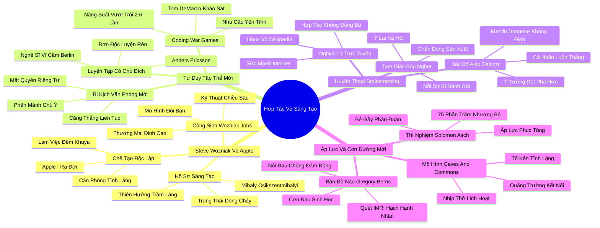

# 🗺️ BẢN ĐỒ TƯ DUY & BẢNG TRA CỨU NEO TRÍ NHỚ: CHƯƠNG BA - KHI SỰ HỢP TÁC HỦY HOẠI SỨC SÁNG TẠO

---

## 1. HỆ THỐNG PHẢ HỆ TRI THỨC (ACTIVE RECALL HIERARCHY)

---

## 2. BẢNG TRA CỨU NEO TRÍ NHỚ SIÊU TỐC (MEMORY ANCHOR CHEAT SHEET)

| 📑 Phần/Mục Tài Liệu | Khái Niệm / Từ Khóa Vàng | Bản Chất Cốt Lõi | Cảnh Báo Sai Lầm Thường Gặp | Hành Động Ứng Dụng Đột Phá |
| :--- | :--- | :--- | :--- | :--- |
| **Phần 1: Steve Wozniak** | **Autonomous Creation** | Các phát minh mang tính cách mạng luôn được thai nghén trong sự cô độc sâu sắc. | Ép buộc các kỹ sư sáng tạo phải làm việc liên tục trong các ban bệ ồn ào. | Cung cấp không gian làm việc biệt lập cho nhân sự nghiên cứu và phát triển. |
| **Phần 1: Steve Wozniak** | **Introvert-Extrovert Dyad** | Mối quan hệ cộng sinh hoàn hảo giữa người chế tạo trầm lặng và người bán hàng năng nổ. | Cố gắng tìm kiếm một cá nhân hoàn hảo sở hữu cả hai phẩm chất đối nghịch. | Ghép đôi chuyên gia kỹ thuật hướng nội với quản lý thương mại hướng ngoại. |
| **Phần 2: Tư duy tập thể mới** | **Open-Plan Distraction** | Văn phòng mở triệt tiêu sự tập trung sâu và làm gia tăng căng thẳng huyết áp. | Đánh đồng văn phòng mở không vách ngăn với sự minh bạch và tinh thần hợp tác. | Thiết kế lại không gian với các cabin cách âm phục vụ làm việc sâu (Deep Work). |
| **Phần 2: Tư duy tập thể mới** | **Deliberate Practice** | Năng lực đỉnh cao chỉ được hình thành qua hàng nghìn giờ tự rèn luyện một mình. | Lãng phí thời gian vào các buổi đào tạo nhóm chung chung không chạm vào điểm yếu vi mô. | Thiết lập khung giờ cố định mỗi ngày để nhân viên tự học và thực hành chuyên môn sâu. |
| **Phần 3: Brainstorming** | **Production Blocking** | Sự nghẽn dòng ý tưởng khi chỉ có một người được nói trong một cuộc họp nhóm. | Tin rằng ngồi động não tập thể sẽ tạo ra nhiều ý tưởng đột phá hơn làm việc độc lập. | Áp dụng Kỹ thuật Nhóm Danh nghĩa (Nominal Group Technique): viết ý tưởng trước khi nói. |
| **Phần 3: Brainstorming** | **Asynchronous Collaboration** | Sức mạnh đột phá của Internet: kết hợp tư duy cá nhân cô độc với sức mạnh tập thể mở. | Ép mọi cuộc trao đổi dự án phải diễn ra trực tiếp qua các cuộc họp mặt đối mặt. | Xây dựng hệ thống quản lý công việc và thảo luận bất đồng bộ qua tài liệu số. |
| **Phần 4: Áp lực bầy đàn** | **Asch Conformity & Amygdala** | Não bộ phát tín hiệu đau đớn thể xác khi cá nhân chọn nói lên quan điểm trái nghịch đám đông. | Tự trách bản thân yếu đuối khi cảm thấy lo âu lúc đứng lên phản biện tập thể. | Tạo lập văn phòng có cơ chế bỏ phiếu kín hoặc phản biện ẩn danh để giải tỏa nỗi sợ. |
| **Phần 4: Áp lực bầy đàn** | **Caves and Commons** | Mô hình kiến trúc linh hoạt: tổ kén cá nhân tĩnh lặng kết hợp với quảng trường trung tâm. | Phân cực cực đoan: hoặc biệt lập hoàn toàn, hoặc mở toang 100% không gian. | Phân bổ tỷ lệ không gian cân bằng giúp nhân sự luân chuyển tự nhiên theo nhu cầu. |
