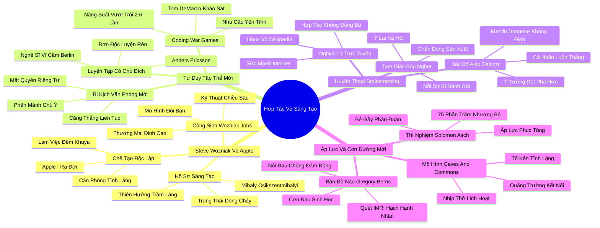

# 📖 TỔNG HỢP NỘI DUNG CHUYÊN SÂU: CHƯƠNG BA - KHI SỰ HỢP TÁC HỦY HOẠI SỨC SÁNG TẠO (WHEN COLLABORATION KILLS CREATIVITY)

### 🎯 THÔNG ĐIỆP CỐT LÕI (1 - 2 CÂU)
Tư duy tập thể mới (The New Groupthink) đang hủy hoại năng lực sáng tạo đỉnh cao khi mù quáng tôn thờ làm việc nhóm và văn phòng mở; trong khi đó, sự cô độc tập trung và rèn luyện có chủ đích (Deliberate Practice) trong không gian tĩnh lặng mới chính là chiếc nôi sản sinh ra những phát minh vĩ đại thay đổi nhân loại.

---

### 📊 LƯỢC ĐỒ PHÂN BỔ CẤU TRÚC TÀI LIỆU
Bảng đối chiếu cấu trúc các phần trong tài liệu gốc và số lượng luận điểm chuyên sâu được khai phóng:

| Phần / Mục Trong Tài Liệu Gốc | Trọng Tâm Phân Tích | Số Luận Điểm | Tỷ Trọng Tri Thức |
| :--- | :--- | :---: | :---: |
| **Phần 1: Steve Wozniak & CLB Homebrew** | Sự ra đời của máy tính cá nhân Apple I trong tĩnh lặng, mẫu người phát minh hướng nội | 3 luận điểm | 25% |
| **Phần 2: Sự Trỗi Dậy Của Tư Duy Tập Thể Mới** | Văn phòng mở, triệt tiêu không gian riêng tư, rèn luyện có chủ đích (Anders Ericsson) | 3 luận điểm | 25% |
| **Phần 3: Huyền Thoại Động Não Tập Thể (Brainstorming)** | Nghiên cứu của Alex Osborn bị bác bỏ: Social loafing, Production blocking, Evaluation apprehension | 3 luận điểm | 25% |
| **Phần 4: Áp Lực Bầy Đàn & Con Đường Cộng Sinh** | Thí nghiệm Solomon Asch, quét não fMRI Gregory Berns, mô hình kết hợp linh hoạt | 3 luận điểm | 25% |
| **TỔNG CỘNG** | **Toàn bộ cấu trúc Chương 3** | **12 luận điểm** | **100%** |

---

### 💡 12 LUẬN ĐIỂM CHUYÊN SÂU THEO TỪNG PHẦN TÀI LIỆU

#### 📑 PHẦN 1: STEVE WOZNIAK & CÂU LẠC BỘ HOMEBREW (THE INTROVERT CREATIVE ADVANTAGE)

1. **Sự Ra Đời Của Máy Tính Cá Nhân Trong Sự Đơn Độc Tuyệt Đối:**
   - *Phân tích chuyên sâu:* Steve Wozniak đã chế tạo ra chiếc máy tính cá nhân Apple I và Apple II mang tính cách mạng không phải giữa một ban bệ ồn ào, mà là trong sự cô độc sâu sắc tại phòng làm việc của mình tại Hewlett-Packard từ nửa đêm đến bình minh. Wozniak khẳng định nguyên tắc bất hủ dành cho các nhà sáng tạo: "Hầu hết các nhà phát minh và kỹ sư mà tôi từng gặp đều giống như tôi... họ làm việc tốt nhất khi ở một mình. Hãy làm việc một mình. Bạn sẽ có thể thiết kế ra những sản phẩm mang tính cách mạng nhất khi bạn không bị phân tâm bởi bất kỳ ai."
   - *Công cụ / Phương pháp đi kèm:* Nguyên Lý Khởi Tạo Độc Lập (Autonomous Creation Paradigm).
   - *Ví dụ thực chiến:* Wozniak tham dự Câu lạc bộ Máy tính Homebrew chỉ để quan sát và lấy cảm hứng kỹ thuật, nhưng ngay lập tức rút lui về căn phòng tĩnh lặng của mình để hàn từng vi mạch và viết từng dòng mã nguồn assembly một cách tỉ mỉ.

2. **Hồ Sơ Tâm Lý Của Các Cá Nhân Sáng Tạo Đỉnh Cao:**
   - *Phân tích chuyên sâu:* Các nghiên cứu tâm lý học sâu rộng của các chuyên gia như Mihaly Csikszentmihalyi về những bộ óc sáng tạo nhất nhân loại chỉ ra một nghịch lý: họ là những người có xu hướng hướng nội rõ rệt. Họ không phải là những kẻ ghét con người, mà họ cần sự cô độc để tích lũy tri thức sâu sắc và đắm chìm vào trạng thái "Dòng chảy" (Flow). Sự hiện diện của người khác phân mảnh tâm trí và phá vỡ cấu trúc tư duy phức tạp.
   - *Công cụ / Phương pháp đi kèm:* Thước Đo Thiên Hướng Sáng Tạo Trầm Lặng (Quiet Creativity Index).
   - *Ví dụ thực chiến:* Từ Charles Darwin đi dạo đơn độc trên con đường suy tưởng (Sandwalk), J.K. Rowling thai nghén Harry Potter trên chuyến tàu vắng, đến các lập trình viên hàng đầu thế giới – tất cả đều cần sự biệt lập để kết nối các mạng lưới ý tưởng phức tạp.

3. **Mối Quan Hệ Cộng Sinh Giữa Kẻ Phát Minh Và Nhà Buôn Bán:**
   - *Phân tích chuyên sâu:* Thành công của Apple không chỉ đến từ thiên tài kỹ thuật của Wozniak hay tài hùng biện của Steve Jobs, mà đến từ sự kết hợp cộng sinh hoàn hảo giữa một người hướng nội kiệt xuất chế tạo sản phẩm trong tĩnh lặng và một người hướng ngoại sắc sảo đóng gói và thương mại hóa sản phẩm ra thế giới. Nếu ép Wozniak phải làm việc theo kiểu Jobs, Apple sẽ không bao giờ có chiếc máy tính cá nhân đầu tiên.
   - *Công cụ / Phương pháp đi kèm:* Mô Hình Đôi Bạn Cộng Sinh Đột Phá (Introvert-Extrovert Dyad Framework).
   - *Ví dụ thực chiến:* Wozniak sẵn sàng cho không thiết kế mạch máy tính của mình cho bạn bè ở CLB Homebrew; chính Steve Jobs là người nhìn thấy cơ hội kinh doanh và thuyết phục thành lập công ty Apple để bán các bo mạch hoàn chỉnh.

---

#### 📑 PHẦN 2: SỰ TRỖI DẬY CỦA TƯ DUY TẬP THỂ MỚI (THE RISE OF THE NEW GROUPTHINK)

4. **Bi Kịch Của Văn Phòng Mở (Open-Plan Offices):**
   - *Phân tích chuyên sâu:* Phong trào "Văn phòng mở" càn quét các tập đoàn hiện đại dưới danh nghĩa thúc đẩy hợp tác và chia sẻ ngẫu hứng. Tuy nhiên, các dữ liệu khoa học chứng minh điều ngược lại: văn phòng mở làm giảm sự tập trung sâu, gia tăng căng thẳng huyết áp, tăng tỷ lệ nghỉ ốm và triệt tiêu tính bảo mật hội thoại. Nhân viên bị đặt vào trạng thái cảnh giác liên tục trước các kích thích thị giác và thính giác không kiểm soát.
   - *Công cụ / Phương pháp đi kèm:* Chỉ Số Phân Mảnh Chú Ý (Cognitive Distraction Ratio).
   - *Ví dụ thực chiến:* Nghiên cứu "Trò chơi Chiến tranh Lập trình" (Coding War Games) của Tom DeMarco và Timothy Lister trên 600 lập trình viên tại 92 công ty cho thấy các kỹ sư làm việc ở công ty cung cấp không gian riêng tư và yên tĩnh đạt hiệu suất vượt trội gấp 2.6 lần so với nhóm ngồi ở văn phòng mở ồn ào.

5. **Luyện Tập Có Chủ Đích (Deliberate Practice) Đòi Hỏi Sự Đơn Độc Tuyệt Đối:**
   - *Phân tích chuyên sâu:* Giáo sư Anders Ericsson phát hiện ra rằng bí mật đưa một người bình thường trở thành bậc thầy thế giới (trong cờ vua, âm nhạc, lập trình, thể thao) không nằm ở việc tập luyện cùng người khác, mà nằm ở số giờ "Luyện tập có chủ đích trong đơn độc". Chỉ khi ở một mình, cá nhân mới có thể tự điều chỉnh các lỗi sai vi mô ở ranh giới năng lực của mình và đẩy não bộ vào vùng thích nghi thần kinh tối ưu.
   - *Công cụ / Phương pháp đi kèm:* Khung Luyện Tập Có Chủ Đích Đơn Độc (Solo Deliberate Practice Loop).
   - *Ví dụ thực chiến:* Các nghệ sĩ vĩ cầm hàng đầu thế giới tại Học viện Âm nhạc Berlin dành trung bình 24 giờ mỗi tuần luyện tập một mình trong phòng kín, so với chỉ 9 giờ của nhóm nghệ sĩ hạng trung bình – những người dành nhiều thời gian hơn để chơi nhạc cùng dàn nhạc tập thể.

6. **Ảo Tưởng Về Sự Sáng Tạo Đến Từ Va Đập Ngẫu Nhiên:**
   - *Phân tích chuyên sâu:* Các nhà thiết kế văn phòng hiện đại thường lầm tưởng rằng việc buộc mọi người va vào nhau ở quầy cà phê hay hành lang mở sẽ tự động sinh ra những ý tưởng tỷ đô. Trên thực tế, sự va đập ngẫu nhiên chỉ tạo ra các cuộc trò chuyện phiếm bề mặt; những ý tưởng mang tính đột phá cấu trúc luôn đòi hỏi quá trình ủ mầm tư duy bền bỉ kéo dài hàng tháng trời trong tĩnh lặng.
   - *Công cụ / Phương pháp đi kèm:* Phân Tích Chi Phí Chuyển Đổi Ngữ Cảnh (Context Switching Cost Analysis).
   - *Ví dụ thực chiến:* Nghiên cứu của tập đoàn thiết kế Gensler cho thấy năng lực tập trung sâu (Focus) là yếu tố dự báo thành công quan trọng nhất tại nơi làm việc, và việc đánh đổi sự tập trung lấy sự cộng tác hời hợt là một sai lầm tài chính đắt giá.

---

#### 📑 PHẦN 3: HUYỀN THOẠI ĐỘNG NÃO TẬP THỂ (THE MYTH OF BRAINSTORMING)

7. **Sự Thất Bại Toàn Diện Của Phương Pháp Brainstorming Truyền Thống:**
   - *Phân tích chuyên sâu:* Từ năm 1953, chuyên gia quảng cáo Alex Osborn tuyên bố phương pháp "Động não tập thể" (Brainstorming) có thể tăng gấp đôi số lượng ý tưởng. Tuy nhiên, hơn 40 năm nghiên cứu thực nghiệm tâm lý học đã nhất quán chứng minh điều ngược lại: các cá nhân làm việc độc lập luôn tạo ra số lượng ý tưởng nhiều hơn, chất lượng cao hơn và mang tính đột phá hơn so với cùng số lượng người đó ngồi lại động não trong một căn phòng.
   - *Công cụ / Phương pháp đi kèm:* Thí Nghiệm So Sánh Nhóm Danh Nghĩa (Nominal Group Technique vs Real Group).
   - *Ví dụ thực chiến:* Nghiên cứu của Marvin Dunnette tại Đại học Minnesota chỉ ra rằng 24 nhóm nghiên cứu độc lập (sau đó gộp kết quả lại) vượt trội hoàn toàn so với các nhóm động não trực tiếp ở mọi chỉ số về tính độc đáo và tính khả thi của ý tưởng.

8. **Ba Thủ Phạm Bóp Nghẹt Trí Tuệ Trong Làm Việc Nhóm:**
   - *Phân tích chuyên sâu:* Tâm lý học chỉ ra 3 rào cản chí tử triệt tiêu hiệu suất trong các buổi động não tập thể:
     - **Hiện tượng ỷ lại xã hội (Social loafing):** Xu hướng một số cá nhân lười biếng, dựa dẫm vào nỗ lực của người khác khi ở trong tập thể.
     - **Sự chặn dòng sản xuất (Production blocking):** Chỉ có một người có thể phát biểu tại một thời điểm, khiến những người khác phải chờ đợi, phân tâm và quên mất dòng suy tưởng ban đầu của mình.
     - **Nỗi sợ bị đánh giá (Evaluation apprehension):** Nỗi ám ảnh vô thức về việc bị đồng nghiệp và cấp trên phán xét khiến các thành viên tự kiểm duyệt và loại bỏ những ý tưởng điên rồ nhưng tiềm năng nhất.
   - *Công cụ / Phương pháp đi kèm:* Tam Giác Triệt Tiêu Ý Tưởng Nhóm (Group Ideation Bottleneck Triangle).
   - *Ví dụ thực chiến:* Trong các cuộc họp công ty, những người nói to nhất và có chức vụ cao nhất thường định hình toàn bộ hướng đi của cuộc thảo luận, trong khi những nhân sự có chuyên môn sâu sắc nhất nhưng nhút nhát lại hoàn toàn im lặng.

9. **Nghịch Lý Cộng Tác Trực Tuyến (The Online Paradox):**
   - *Phân tích chuyên sâu:* Trong khi làm việc nhóm mặt đối mặt trực tiếp thường bóp nghẹt sáng tạo, thì sự hợp tác trực tuyến (Online collaboration) qua Internet lại tạo ra những kỳ tích vĩ đại (như Wikipedia, Linux, phần mềm mã nguồn mở). Lý do cốt lõi: Internet cho phép con người kết hợp sức mạnh của sự cô độc cá nhân (viết mã hoặc viết bài một mình) với khả năng đóng góp vào một dự án tập thể mà không phải chịu áp lực bầy đàn và sự phân tâm của văn phòng thực.
   - *Công cụ / Phương pháp đi kèm:* Khung Hợp Tác Không Đồng Bộ (Asynchronous Collaboration Framework).
   - *Ví dụ thực chiến:* Hàng vạn lập trình viên trên khắp hành tinh cùng phát triển hệ điều hành Linux mà hầu như không bao giờ phải ngồi chung trong một căn phòng họp hay tham gia các buổi động não ồn ào.

---

#### 📑 PHẦN 4: ÁP LỰC BẦY ĐÀN & CON ĐƯỜNG CỘNG SINH (CONFORMITY & SYMBIOSIS)

10. **Thí Nghiệm Kinh Điển Của Solomon Asch Về Áp Lực Phục Tùng:**
    - *Phân tích chuyên sâu:* Nhà tâm lý học Solomon Asch chứng minh rằng khi đối mặt với một tập thể đồng thanh khẳng định một điều hoàn toàn sai (chọn que ngắn hơn que mẫu), có tới 75% người tham gia đã thuận theo ý kiến đám đông ít nhất một lần. Áp lực đồng thuận xã hội mạnh mẽ đến mức nó bẻ gãy khả năng phán đoán logic độc lập của con người.
    - *Công cụ / Phương pháp đi kèm:* Thang Đo Tính Phục Tùng Nhóm (Asch Conformity Index).
    - *Ví dụ thực chiến:* Trong các hội đồng quản trị và cuộc họp chiến lược, các thành viên thường gật đầu tán thành các kế hoạch đầu tư rủi ro chỉ vì không muốn trở thành "kẻ phá đám" hay làm mất hòa khí chung của tập thể.

11. **Bản Đồ Quét Não fMRI Của Gregory Berns: Nỗi Đau Sinh Học Của Kẻ Bất Đồng:**
    - *Phân tích chuyên sâu:* Nhà khoa học thần kinh Gregory Berns sử dụng công nghệ fMRI để quét não những người tham gia thí nghiệm Asch và phát hiện ra một sự thật chấn động: Khi một người quyết định nói lên ý kiến độc lập chống lại đám đông, hạch hạnh nhân (Amygdala) – trung tâm xử lý nỗi sợ hãi và đau đớn thể xác – phát tín hiệu cảnh báo dữ dội. Sự bất đồng chính kiến tạo ra một cơn đau sinh học thực sự, giải thích tại sao làm việc nhóm trực tiếp dễ dẫn đến sự thỏa hiệp tầm thường.
    - *Công cụ / Phương pháp đi kèm:* Bản Đồ Thần Kinh Về Sự Phục Tùng (Neurobiology of Non-Conformity).
    - *Ví dụ thực chiến:* Một kỹ sư phát hiện ra lỗi thiết kế nghiêm trọng nhưng trong phòng họp đông người, anh cảm thấy tim đập nhanh, nghẹn họng và quyết định im lặng vì não bộ báo động rằng việc chống lại cả phòng ban là một nguy cơ sinh tồn.

12. **Mô Hình Cộng Sinh Mới: Không Gian Linh Hoạt Cho Sự Thăng Hoa:**
    - *Phân tích chuyên sâu:* Giải pháp không phải là xóa bỏ hoàn toàn làm việc nhóm, mà là thiết kế một "Mô hình Cộng sinh Linh hoạt" (Flexible Symbiosis). Con người cần không gian riêng biệt để tư duy độc lập trước, sau đó mới gặp nhau trong thời gian ngắn để chia sẻ thành quả, và cuối cùng lại rút lui về ốc đảo cá nhân để hoàn thiện. Không gian kiến trúc phải phục vụ cho nhịp thở này.
    - *Công cụ / Phương pháp đi kèm:* Không Gian Kiến Trúc Đa Năng (Flexible Spine & Cell Office Layout).
    - *Ví dụ thực chiến:* Các công ty công nghệ tiên tiến áp dụng mô hình "Tổ kén và Quảng trường" (Caves and Commons) – nơi mỗi nhân viên có một buồng làm việc riêng biệt cách âm hoàn toàn (Caves), bao quanh một quảng trường trung tâm nhỏ (Commons) để giao lưu khi thực sự có nhu cầu.

---

### 🛠️ KẾ HOẠCH HÀNH ĐỘNG THỰC THI (20 HÀNH ĐỘNG)

#### TẦNG 1: HÀNH VI VI MÔ TỨC THÌ (< 2 PHÚT)
- [ ] **Đeo tai nghe chống ồn làm tín hiệu:** Đeo tai nghe khi cần tập trung sâu như một quy ước thị giác ngầm thông báo "xin đừng làm phiền".
- [ ] **Tắt toàn bộ thông báo tức thì:** Tắt thông báo Slack/Email trong các khung giờ tư duy buổi sáng để bảo vệ trạng thái Dòng chảy.
- [ ] **Quy tắc viết nháp trước khi họp:** Viết ra giấy 3 ý tưởng độc lập của bản thân 5 phút trước khi bước vào phòng họp nhóm.
- [ ] **Từ chối brainstorming trực tiếp:** Đề xuất đồng nghiệp trao đổi ý tưởng qua văn bản chia sẻ thay vì ngồi lại động não tự phát.
- [ ] **Chặn đứng kẻ cắt ngang:** Lịch sự nói câu: "Hãy để tôi hoàn thành trọn vẹn mạch tư duy này trước khi chúng ta thảo luận tiếp".
- [ ] **Ghi nhận ý tưởng của người ít nói:** Chủ động hỏi: "Tôi rất muốn nghe suy nghĩ của bạn về khía cạnh này" đối với người chưa phát biểu.

#### TẦNG 2: THÓI QUEN & QUY TRÌNH TUẦN
- [ ] **Áp dụng Kỹ thuật Nhóm Danh nghĩa (Nominal Group Technique):** Dành 15 phút đầu buổi họp để mọi người tự viết ý tưởng trong im lặng tuyệt đối trước khi dán lên bảng.
- [ ] **Thiết lập Ngày Không Họp Hành (No-Meeting Day):** Dành trọn vẹn thứ Tư hoặc thứ Năm hàng tuần hoàn toàn không lịch họp để làm việc sâu.
- [ ] **Quy trình Đóng góp Không đồng bộ:** Ban hành nguyên tắc mọi dự án mới phải có tài liệu mô tả chi tiết và lấy phản biện bằng văn bản trong 48 giờ.
- [ ] **Khối thời gian Deliberate Practice:** Dành riêng 60-90 phút mỗi ngày cô độc thực hành một kỹ năng chuyên môn cốt lõi ở ranh giới năng lực.
- [ ] **Bảo vệ ranh giới phòng làm việc:** Đóng cửa phòng làm việc hoặc tìm một góc thư viện vắng người khi xử lý các báo cáo phức tạp.
- [ ] **Phân tích chi phí thời gian làm việc nhóm:** Định kỳ rà soát các cuộc họp định kỳ hàng tuần và hủy bỏ những buổi họp không tạo ra giá trị gia tăng.
- [ ] **Tập dượt đứng độc lập:** Tự rèn luyện tâm lý thoải mái khi là người duy nhất đưa ra quan điểm trái ngược trong các cuộc thảo luận chuyên môn.

#### TẦNG 3: CHUYỂN HÓA CHIẾN LƯỢC DÀI HẠN
- [ ] **Cải tạo không gian văn phòng theo mô hình Caves & Commons:** Phá bỏ tư duy văn phòng mở 100%; xây dựng các cabin tĩnh lặng chiếm ít nhất 40% diện tích.
- [ ] **Tái cấu trúc văn hóa đánh giá sáng tạo:** Tưởng thưởng cho các giải pháp mang tính đột phá được phát triển độc lập thay vì chỉ khen ngợi tinh thần tham gia họp nhóm.
- [ ] **Xây dựng hệ thống tài liệu hóa tri thức kiểu Wikipedia nội bộ:** Chuyển đổi toàn bộ tri thức doanh nghiệp sang dạng văn bản mở để nhân sự tự do nghiên cứu.
- [ ] **Thiết lập cặp đôi cộng sinh Hướng nội - Hướng ngoại:** Ghép đôi chuyên gia nghiên cứu/sáng tạo trầm lặng với nhân sự phát triển kinh doanh hoạt ngôn trong mọi dự án trọng điểm.
- [ ] **Đào tạo kỹ năng tư duy phản biện chống áp lực bầy đàn:** Tổ chức các khóa học chuyên sâu về bẫy tâm lý Asch và phương pháp bảo vệ ý kiến thiểu số.
- [ ] **Đo lường chỉ số gián đoạn công việc (Interruption Audit):** Thực hiện khảo sát đo lường số lần nhân viên bị cắt ngang mỗi ngày để cải tiến quy chế văn phòng.
- [ ] **Bình thường hóa văn hóa làm việc độc lập:** Xóa bỏ định kiến cho rằng người thích làm việc một mình là người thiếu tinh thần đồng đội.

---

### ❓ BỘ CÂU HỎI TỰ NGẪM (20 CÂU HỎI)

#### NHÓM 1: TỰ VẤN NHẬN THỨC & THẤU HIỂU BẢN THÂN
1. Những ý tưởng sáng tạo và giải pháp mang tính đột phá nhất trong đời tôi đã xuất hiện khi nào: giữa một cuộc tranh luận ồn ào hay trong sự tĩnh lặng một mình?
2. Tôi có đang cảm thấy kiệt quệ và mất tập trung vì phải ngồi làm việc trong một không gian mở không có vách ngăn?
3. Khi ở trong một căn phòng đông người, tôi có xu hướng tự động nuốt lại những ý tưởng kỳ lạ của mình vì sợ bị đám đông phán xét?
4. Tôi đã dành bao nhiêu giờ trong tuần qua cho việc "Luyện tập có chủ đích trong đơn độc" để thực sự nâng cao tay nghề chuyên môn?
5. Cảm giác sinh học của tôi khi phản đối ý kiến của toàn bộ tập thể là gì: tim đập nhanh, lo âu hay bình thản bảo vệ sự thật?

#### NHÓM 2: ĐÁNH GIÁ THỰC TRẠNG & RÀ SOÁT THÓI QUEN
6. Công ty của tôi có đang lãng phí hàng nghìn giờ làm việc mỗi tháng vào những buổi họp brainstorming hình thức không mang lại kết quả thực tế?
7. Không gian làm việc hiện tại của tôi đang hỗ trợ năng lực tập trung sâu (Focus) hay đang biến tôi thành nạn nhân của sự phân tâm liên tục?
8. Các cuộc họp nhóm tại phòng ban của tôi có đang bị chi phối hoàn toàn bởi 1-2 người nói to nhất và có chức vụ cao nhất?
9. Chúng ta có đang nhầm lẫn giữa sự ồn ào bận rộn tại văn phòng với năng suất sáng tạo thực chất?
10. Đội ngũ của tôi có đang áp dụng quy trình lấy ý kiến bằng văn bản hay vẫn phụ thuộc vào những cuộc tranh cãi tự phát?

#### NHÓM 3: THÁCH THỨC NIỀM TIN CŨ & PHÁ VỠ ĐỊNH KIẾN
11. Liệu huyền thoại về việc "hai cái đầu luôn tốt hơn một cái đầu" có thực sự đúng trong giai đoạn khởi tạo ý tưởng ban đầu?
12. Tại sao chúng ta lại tin rằng ép buộc con người ngồi cạnh nhau trong văn phòng mở sẽ tự động tạo ra sự hợp tác đột phá?
13. Có phải làm việc nhóm luôn đồng nghĩa với tinh thần đoàn kết, hay nó thường là mảnh đất màu mỡ cho sự ỷ lại xã hội (Social loafing)?
14. Steve Wozniak có thể chế tạo ra Apple I nếu ông bị bắt phải làm việc trong một văn phòng mở hiện đại của Thung lũng Silicon ngày nay?
15. Tại sao chúng ta lại sợ hãi sự cô độc trong khi đó là điều kiện tiên quyết để đạt tới sự tinh thông nghề nghiệp?

#### NHÓM 4: THIẾT KẾ GIẢI PHÁP & HÀNH ĐỘNG KIẾN TẠO
16. Tôi có thể tái cấu trúc quy trình sáng tạo của nhóm mình như thế nào để kết hợp giữa tư duy độc lập ban đầu và phản biện tập thể sau đó?
17. Doanh nghiệp của tôi cần thay đổi những gì về mặt không gian vật lý để cung cấp đủ "ốc đảo tĩnh lặng" cho các chuyên gia sáng tạo?
18. Làm thế nào để bảo vệ những nhân viên hướng nội tài năng khỏi bị cuốn vào vòng xoáy của các cuộc họp hành vô bổ?
19. Tôi sẽ xây dựng mối quan hệ cộng sinh kiểu "Wozniak - Jobs" nào trong công việc để biến các ý tưởng kỹ thuật sâu sắc thành hiện thực thương mại?
20. Những quy tắc bất thành văn nào cần được ban hành để biến việc đeo tai nghe và không bị làm phiền trở thành một quyền lợi chính đáng tại công sở?

---

### 🗺️ MINDMAP 4-5 TẦNG TRỰC QUAN ĐỈNH CAO

