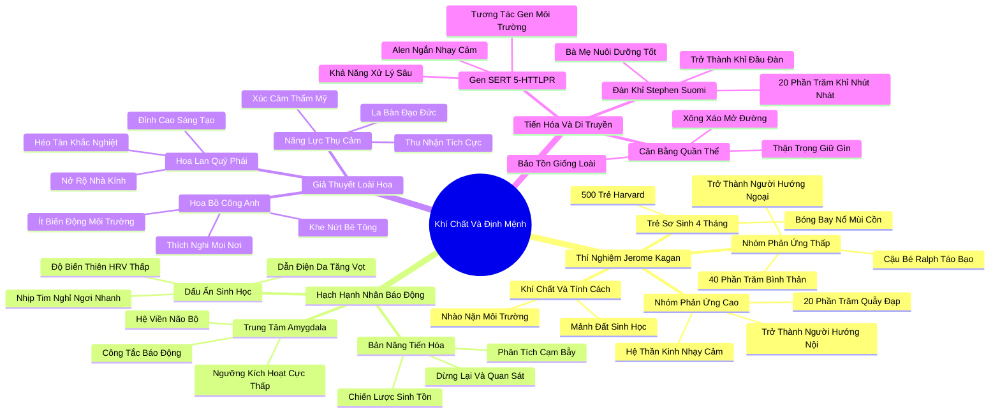

# 🗺️ BẢN ĐỒ TƯ DUY & BẢNG TRA CỨU NEO TRÍ NHỚ: CHƯƠNG BỐN - LIỆU KHÍ CHẤT CÓ PHẢI LÀ ĐỊNH MỆNH?

---

## 1. HỆ THỐNG PHẢ HỆ TRI THỨC (ACTIVE RECALL HIERARCHY)

---

## 2. BẢNG TRA CỨU NEO TRÍ NHỚ SIÊU TỐC (MEMORY ANCHOR CHEAT SHEET)

| 📑 Phần/Mục Tài Liệu | Khái Niệm / Từ Khóa Vàng | Bản Chất Cốt Lõi | Cảnh Báo Sai Lầm Thường Gặp | Hành Động Ứng Dụng Đột Phá |
| :--- | :--- | :--- | :--- | :--- |
| **Phần 1: Thí nghiệm Kagan** | **High-Reactive Infants** | Trẻ sơ sinh phản ứng mãnh liệt với kích thích lớn lên thành người hướng nội trầm lặng. | Nghĩ rằng đứa trẻ khóc nhiều trước đồ chơi lạ là đứa trẻ hiếu động, thích giao tiếp. | Tôn trọng sự nhạy cảm của trẻ nhỏ; không ép trẻ lao ngay vào các tình huống mới lạ. |
| **Phần 1: Thí nghiệm Kagan** | **Temperament vs Personality** | Khí chất là nền tảng sinh học bẩm sinh; tính cách là sự nhào nặn của môi trường và ý chí. | Cho rằng sinh học là định mệnh bất di bất dịch và con người không thể thay đổi. | Xây dựng môi trường sống tích cực để phát triển khí chất bẩm sinh thành thế mạnh nhân cách. |
| **Phần 2: Hạch hạnh nhân** | **Amygdala Excitability** | Trung tâm báo động của người hướng nội có ngưỡng kích hoạt thấp, dễ bị kích thích. | Coi phản ứng căng thẳng của người nhạy cảm là sự yếu đuối về mặt ý chí. | Thực hành các bài tập thở chậm (như 4-7-8) để điều hòa hệ thần kinh tự chủ tức thì. |
| **Phần 2: Hạch hạnh nhân** | **Stop, Look, and Listen** | Chiến lược nhận thức chậm: dừng lại quan sát toàn diện trước khi đưa ra hành động. | Nhầm lẫn sự cẩn trọng quan sát với sự thiếu quyết đoán và chậm chạp. | Cho phép bản thân có một khoảng dừng (Pause) trước khi phản hồi các yêu cầu phức tạp. |
| **Phần 3: Giả thuyết loài hoa** | **Orchid Hypothesis** | Người nhạy cảm héo úa trong nghịch cảnh nhưng thăng hoa vượt trội khi được nuôi dưỡng tốt. | Xem tính nhạy cảm như một khiếm khuyết tâm lý hoặc căn bệnh cần chữa trị. | Tự thiết kế một "nhà kính tinh thần" an toàn để phát huy tối đa tiềm năng cá nhân. |
| **Phần 3: Giả thuyết loài hoa** | **Vantage Sensitivity** | Khả năng hấp thụ gấp đôi những ảnh hưởng tích cực từ giáo dục, nghệ thuật và tình yêu thương. | Đặt bản thân vào những môi trường làm việc độc hại, chèn ép và quá tải tiếng ồn. | Đầu tư vào các khóa học chất lượng cao và các mối quan hệ đồng điệu, sâu sắc. |
| **Phần 4: Bản năng tiến hóa** | **5-HTTLPR Short Allele** | Biến thể gen tạo ra sự nhạy bén thần kinh và khả năng tư duy chi tiết sâu sắc. | Đổ lỗi cho gen di truyền khi gặp thất bại trong các tình huống giao tiếp xã hội. | Tận dụng năng lực phân tích chi tiết để trở thành chuyên gia sâu trong lĩnh vực cốt lõi. |
| **Phần 4: Bản năng tiến hóa** | **Suomi Primate Leadership** | Những chú khỉ nhạy cảm được yêu thương lớn lên trở thành thủ lĩnh nhờ sự khôn ngoan và hòa giải. | Cho rằng thủ lĩnh bầy đàn bắt buộc phải là những kẻ bạo lực và hung hăng nhất. | Lãnh đạo bằng sự thấu hiểu, công bằng và khả năng dự báo hiểm họa cho tổ chức. |
