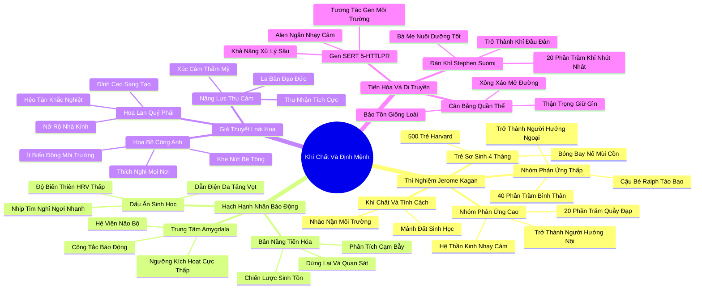

# 📖 TỔNG HỢP NỘI DUNG CHUYÊN SÂU: CHƯƠNG BỐN - LIỆU KHÍ CHẤT CÓ PHẢI LÀ ĐỊNH MỆNH? (IS TEMPERAMENT DESTINY?)

### 🎯 THÔNG ĐIỆP CỐT LÕI (1 - 2 CÂU)
Khí chất sinh học bẩm sinh (đặc biệt là mức độ phản ứng nhạy cảm của hạch hạnh nhân) đặt nền móng sinh lý thần kinh vững chắc cho tính cách hướng nội; tuy nhiên, gen di truyền không phải là định mệnh bất di bất dịch, mà giống như một chiếc dây thun đàn hồi có thể co giãn linh hoạt trong sự tương tác kỳ diệu với môi trường nuôi dưỡng.

---

### 📊 LƯỢC ĐỒ PHÂN BỔ CẤU TRÚC TÀI LIỆU
Bảng đối chiếu cấu trúc các phần trong tài liệu gốc và số lượng luận điểm chuyên sâu được khai phóng:

| Phần / Mục Trong Tài Liệu Gốc | Trọng Tâm Phân Tích | Số Luận Điểm | Tỷ Trọng Tri Thức |
| :--- | :--- | :---: | :---: |
| **Phần 1: Thí Nghiệm Đột Phá Của Jerome Kagan** | Trẻ sơ sinh 4 tháng tuổi: Nhóm phản ứng cao (High-reactive) vs Phản ứng thấp (Low-reactive) | 3 luận điểm | 25% |
| **Phần 2: Hạch Hạnh Nhân & Trung Tâm Báo Động** | Amygdala, hệ thần kinh giao cảm, phản xạ giật mình và nhịp tim dao động thấp | 3 luận điểm | 25% |
| **Phần 3: Giả Thuyết Hoa Lan & Hoa Bồ Công Anh** | The Orchid Hypothesis (David Dobbs, Thomas Boyce), lợi thế nhạy cảm khi được nuôi dưỡng tốt | 3 luận điểm | 25% |
| **Phần 4: Bản Năng Tiến Hóa & Gen SERT** | Gen 5-HTTLPR, đàn khỉ Rhesus của Stephen Suomi, giá trị sinh tồn của sự thận trọng | 3 luận điểm | 25% |
| **TỔNG CỘNG** | **Toàn bộ cấu trúc Chương 4** | **12 luận điểm** | **100%** |

---

### 💡 12 LUẬN ĐIỂM CHUYÊN SÂU THEO TỪNG PHẦN TÀI LIỆU

#### 📑 PHẦN 1: THÍ NGHIỆM ĐỘT PHÁ CỦA JEROME KAGAN (THE HARVARD INFANT STUDIES)

1. **Nghịch Lý Của Trẻ Sơ Sinh Phản Ứng Cao (High-Reactive Infants):**
   - *Phân tích chuyên sâu:* Năm 1989, nhà tâm lý học lỗi lạc Jerome Kagan tại Đại học Harvard khởi xướng công trình nghiên cứu theo dõi dọc mang tính lịch sử trên 500 trẻ sơ sinh 4 tháng tuổi. Khi cho tiếp xúc với các kích thích mới lạ (bóng bay nổ, mùi cồn, đồ chơi chuyển động màu sắc sặc sỡ), khoảng 20% trẻ phản ứng kịch liệt: khóc to, đạp chân tay dữ dội; 40% trẻ hoàn toàn bình thản, cười đùa; 40% còn lại ở mức trung gian. Nghịch lý lớn xuất hiện: những đứa trẻ quẫy đạp dữ dội nhất không phải là những kẻ hướng ngoại sau này, mà chính là những đứa trẻ sẽ lớn lên trở thành người hướng nội trầm lặng và thận trọng.
   - *Công cụ / Phương pháp đi kèm:* Thí Nghiệm Đột Phá Kagan Về Khí Chất Sơ Sinh (Kagan Infant Reactivity Paradigm).
   - *Ví dụ thực chiến:* Đứa trẻ tên Tom khi 4 tháng tuổi đã khóc thét và đập chân tay loạn xạ trước một chiếc mobile đồ chơi chuyển động; khi lên 2 tuổi, Tom bám chặt lấy chân mẹ khi gặp người lạ; và đến tuổi vị thành niên, Tom trở thành một thiếu niên trầm tính, sâu sắc và yêu thích đọc sách.

2. **Quỹ Đạo Trưởng Thành Nhất Quán Từ 4 Tháng Tuổi Đến Tuổi Trưởng Thành:**
   - *Phân tích chuyên sâu:* Kagan và nhóm cộng sự kiên trì theo dõi những đứa trẻ này khi chúng lên 2, 4, 7, 11 tuổi và khi trưởng thành. Kết quả cho thấy tính nhất quán sinh học đáng kinh ngạc: những đứa trẻ phản ứng cao hồi 4 tháng tuổi vẫn giữ nguyên xu hướng thận trọng, suy nghĩ kỹ trước khi hành động, nhạy cảm trước tình huống mới; trong khi những đứa trẻ phản ứng thấp như Ralph lại lớn lên thành những thanh niên bạo dạn, thích phiêu lưu và giao tiếp xã hội không hề e ngại.
   - *Công cụ / Phương pháp đi kèm:* Nghiên Cứu Dọc Đo Lường Tính Cách (Longitudinal Temperament Tracking).
   - *Ví dụ thực chiến:* Cậu bé Ralph khi nhỏ không hề chớp mắt trước tiếng nổ bóng bay, khi lớn lên luôn là người xung phong dẫn đầu các trò chơi mạo hiểm và cảm thấy thoải mái tuyệt đối khi bước vào một căn phòng đầy người xa lạ.

3. **Phân Biệt Cốt Lõi Giữa Khí Chất (Temperament) Và Tính Cách (Personality):**
   - *Phân tích chuyên sâu:* Kagan làm rõ ranh giới khoa học thiết yếu: Khí chất là nền tảng sinh học bẩm sinh, cấu trúc thần kinh có thể quan sát được ngay từ trong nôi; còn Tính cách là bức tranh hoàn thiện được nhào nặn sau khi khí chất đó tương tác với văn hóa, môi trường giáo dục, gia đình và trải nghiệm sống của từng cá nhân. Khí chất là mảnh đất và hạt giống; tính cách là cái cây lớn lên từ mảnh đất đó.
   - *Công cụ / Phương pháp đi kèm:* Mô Hình Phân Tầng Khí Chất - Nhân Cách (Temperament vs Personality Framework).
   - *Ví dụ thực chiến:* Hai đứa trẻ có cùng khí chất phản ứng cao: một đứa được nuôi dưỡng trong môi trường yêu thương, an toàn sẽ trở thành một nhà văn sâu sắc hoặc nhà khoa học thấu cảm; đứa còn lại bị bạo hành hoặc bỏ rơi có thể phát triển thành chứng rối loạn lo âu xã hội nghiêm trọng.

---

#### 📑 PHẦN 2: HẠCH HẠNH NHÂN & TRUNG TÂM BÁO ĐỘNG (THE AMYGDALA & EMOTIONAL BRAIN)

4. **Hạch Hạnh Nhân: Trạm Kiểm Soát Báo Động Thần Kinh Siêu Nhạy:**
   - *Phân tích chuyên sâu:* Cơ chế sinh học đằng sau sự phản ứng cao chính là mức độ nhạy cảm của Hạch Hạnh Nhân (Amygdala) – cấu trúc hình quả hạnh nằm sâu trong hệ viền (Limbic system) của não bộ, đóng vai trò công tắc báo động sinh tồn. Ở người hướng nội bẩm sinh, hạch hạnh nhân có ngưỡng kích hoạt cực thấp: nó phát tín hiệu báo động ngay cả trước những kích thích mới lạ rất nhỏ, kích hoạt toàn bộ hệ thần kinh giao cảm (tăng nhịp tim, co thắt đồng tử, tăng tiết cortisol).
   - *Công cụ / Phương pháp đi kèm:* Bản Đồ Kích Hoạt Hệ Viền (Limbic Arousal Mapping).
   - *Ví dụ thực chiến:* Khi bước vào một căn phòng tiệc đông đúc, hạch hạnh nhân của người hướng nội lập tức quét mọi gương mặt lạ và phân tích mối đe dọa tiềm tàng, khiến tim họ đập nhanh hơn, trong khi hạch hạnh nhân của người phản ứng thấp hầu như không hề biến chuyển.

5. **Dấu Ấn Thần Kinh Tự Chủ: Sự Ổn Định Nhịp Tim Và Dẫn Điện Da:**
   - *Phân tích chuyên sâu:* Nghiên cứu của Kagan phát hiện những dấu ấn sinh học rõ rệt: những đứa trẻ phản ứng cao có nhịp tim nghỉ ngơi nhanh hơn, độ biến thiên nhịp tim (Heart Rate Variability - HRV) thấp hơn (thể hiện sự căng thẳng của hệ thần kinh tự chủ) và mức độ dẫn điện qua da (dấu hiệu của mồ hôi do kích thích giao cảm) cao hơn đáng kể khi đối diện với bài toán hóc búa hoặc người lạ.
   - *Công cụ / Phương pháp đi kèm:* Bộ Chỉ Số Đo Lường Thần Kinh Thực Vật (Autonomic Biomarker Suite).
   - *Ví dụ thực chiến:* Trong các bài kiểm tra áp lực, người có khí chất nhạy cảm có sự tăng vọt nồng độ hormone norepinephrine trong máu và nước tiểu, chứng minh rằng sự e dè của họ không phải là sự yếu đuối về ý chí mà là một phản ứng sinh học có thật 100%.

6. **Bản Năng Quan Sát Trước Khi Nhảy (Look Before You Leap):**
   - *Phân tích chuyên sâu:* Do hạch hạnh nhân nhạy bén, người hướng nội sở hữu chiến lược sinh tồn tự nhiên: "Dừng lại, nhìn ngắm và lắng nghe" (Stop, look, and listen). Họ không lao vào hành động một cách mù quáng. Họ dành thời gian xử lý toàn bộ thông tin bối cảnh xung quanh trước khi đưa ra phản ứng. Đây là một cơ chế phòng vệ tiến hóa vô giá giúp tổ tiên loài người tránh khỏi nanh vuốt thú dữ và các cạm bẫy thiên nhiên.
   - *Công cụ / Phương pháp đi kèm:* Chiến Lược Sinh Tồn Nhận Thức Chậm (Cognitive Pausing Strategy).
   - *Ví dụ thực chiến:* Khi một món đồ chơi mới được đưa ra, đứa trẻ phản ứng thấp chộp lấy ngay lập tức mà không cần suy nghĩ; đứa trẻ phản ứng cao đứng nhìn món đồ chơi từ xa trong vài phút, quan sát cách nó hoạt động rồi mới từ tốn tiến lại gần chạm vào.

---

#### 📑 PHẦN 3: GIẢ THUYẾT HOA LAN & HOA BỒ CÔNG ANH (THE ORCHID HYPOTHESIS)

7. **Sự Ra Đời Của Giả Thuyết Hoa Lan Đột Phá:**
   - *Phân tích chuyên sâu:* Trong nhiều thập kỷ, tâm lý học truyền thống coi tính nhạy cảm bẩm sinh là một yếu tố nguy cơ dẫn đến trầm cảm và lo âu. Tuy nhiên, giả thuyết mang tính cách mạng của các nhà nghiên cứu David Dobbs, W. Thomas Boyce và Bruce Ellis đã lật ngược định kiến này: phần lớn trẻ em giống như loài "Hoa Bồ Công Anh" (Dandelion Children) – có thể sinh trưởng và thích nghi ở bất kỳ môi trường nào; nhưng những đứa trẻ có khí chất phản ứng cao lại giống như loài "Hoa Lan" (Orchid Children).
   - *Công cụ / Phương pháp đi kèm:* Phân Loại Nhạy Cảm Sinh Học (Orchid vs Dandelion Taxonomy).
   - *Ví dụ thực chiến:* Hoa bồ công anh có thể mọc giữa khe nứt bê tông ven đường; nhưng hoa lan nếu gặp môi trường khắc nghiệt sẽ héo tàn nhanh chóng, còn nếu được chăm sóc trong một nhà kính ấm áp với sự thấu hiểu, nó sẽ nở ra những bông hoa lộng lẫy và quý phái nhất trần gian.

8. **Lợi Thế Vượt Trội Của Trẻ Hoa Lan Khi Được Nuôi Dưỡng Đúng Cách:**
   - *Phân tích chuyên sâu:* Các nghiên cứu thực nghiệm chấn động chỉ ra rằng khi những đứa trẻ hoa lan được lớn lên trong một gia đình an toàn, tràn đầy tình yêu thương và sự khích lệ, chúng không chỉ phát triển bình thường mà còn đạt được thành tựu học tập, sức khỏe thể chất, trí thông minh cảm xúc và kỹ năng xã hội vượt trội hơn hẳn so với những đứa trẻ hoa bồ công anh. Tính nhạy cảm cao biến thành một ăng-ten siêu việt để thu nhận mọi điều tốt đẹp từ môi trường sống.
   - *Công cụ / Phương pháp đi kèm:* Thước Đo Năng Lực Thụ Cảm Tích Cực (Vantage Sensitivity Index).
   - *Ví dụ thực chiến:* Nghiên cứu của Jay Belsky chứng minh trẻ hoa lan được gửi vào các trường mầm non chất lượng cao có bước nhảy vọt về khả năng ngôn ngữ và hợp tác xã hội lớn hơn gấp đôi so với các bạn học cùng trang lứa có khí chất phản ứng thấp.

9. **Sự Nhạy Cảm Thẩm Mỹ Và Trực Giác Đạo Đức Sâu Sắc:**
   - *Phân tích chuyên sâu:* Hệ thần kinh nhạy bén không chỉ cảm nhận mối đe dọa mà còn cảm nhận cái đẹp và sự bất công một cách mãnh liệt. Những người thuộc nhóm hoa lan sở hữu sự đồng cảm sâu sắc với nỗi đau của người khác, phản ứng mạnh mẽ trước âm nhạc, nghệ thuật và thiên nhiên, đồng thời sở hữu một la bàn đạo đức nội tâm vô cùng vững chắc.
   - *Công cụ / Phương pháp đi kèm:* Khung Đánh Giá Xúc Cảm Thẩm Mỹ & Đạo Đức (Aesthetic & Moral Sensitivity Scale).
   - *Ví dụ thực chiến:* Một đứa trẻ hoa lan có thể rơi nước mắt khi nghe một bản sonata buồn hoặc nhìn thấy một con chim bị thương ngoài sân, và từ đó phát triển niềm đam mê cống hiến trọn đời cho y học hoặc hoạt động nhân đạo.

---

#### 📑 PHẦN 4: BẢN NĂNG TIẾN HÓA & GEN SERT (EVOLUTIONARY FEAR & GENETICS)

10. **Bí Ẩn Của Biến Thể Gen Vận Chuyển Serotonin (5-HTTLPR):**
    - *Phân tích chuyên sâu:* Di truyền học phân tử đã xác định gen 5-HTTLPR (gen kiểm soát chất vận chuyển serotonin) có hai biến thể: alen ngắn (short allele) và alen dài (long allele). Những người sở hữu alen ngắn có xu hướng nhạy cảm hơn, dễ lo âu hơn nhưng lại có khả năng xử lý chi tiết sâu sắc hơn. Alen ngắn này chính là một trong những chiếc chìa khóa di truyền của khí chất hoa lan.
    - *Công cụ / Phương pháp đi kèm:* Bản Đồ Tương Tác Gen - Môi Trường (Gene-Environment GxE Matrix).
    - *Ví dụ thực chiến:* Người mang alen ngắn sống trong hoàn cảnh bất hạnh có nguy cơ trầm cảm cao; nhưng cũng chính người mang alen ngắn đó nếu sống trong môi trường hỗ trợ lại có tỷ lệ mắc trầm cảm thấp hơn cả những người mang alen dài.

11. **Bài Học Sinh Tồn Từ Đàn Khỉ Rhesus Của Stephen Suomi:**
    - *Phân tích chuyên sâu:* Nhà linh trưởng học Stephen Suomi tại Viện Y tế Quốc gia Hoa Kỳ (NIH) nghiên cứu các đàn khỉ Rhesus – loài động vật có cấu trúc gen chia sẻ 20% cá thể nhút nhát, nhạy cảm giống hệt con người. Trong tự nhiên, những chú khỉ con nhạy cảm luôn bám lấy mẹ và quan sát cẩn thận. Đáng kinh ngạc, khi những chú khỉ nhạy cảm này được nuôi dưỡng bởi những bà mẹ khỉ giàu tình thương và kinh nghiệm, chúng lớn lên trở thành những con khỉ đầu đàn thống trị cả đàn nhờ khả năng đàm phán hòa bình và phân tích rủi ro môi trường vượt trội.
    - *Công cụ / Phương pháp đi kèm:* Mô Hình Lãnh Đạo Linh Trưởng Nhạy Cảm (Suomi's Primate Leadership Model).
    - *Ví dụ thực chiến:* Những con khỉ bạo dạn liều lĩnh thường chết sớm do đánh nhau tranh giành lãnh thổ hoặc ăn phải quả độc, trong khi những con khỉ nhạy cảm sống thọ hơn và bảo vệ đàn khỉ khỏi các hiểm họa bất ngờ của rừng già.

12. **Sự Cân Bằng Tiến Hóa Của Hai Chiến Lược Sinh Tồn:**
    - *Phân tích chuyên sâu:* Tự nhiên không bao giờ duy trì một đặc điểm di truyền vô nghĩa trong suốt hàng triệu năm tiến hóa. Quần thể sinh vật luôn cần sự tồn tại song song của cả hai nhóm: nhóm phiêu lưu xông xáo (đi tìm vùng đất mới, săn thú dữ) và nhóm nhạy cảm thận trọng (canh chừng kẻ thù, bảo quản lương thực, giữ gìn trật tự xã hội). Thiếu một trong hai, giống loài sẽ diệt vong.
    - *Công cụ / Phương pháp đi kèm:* Cân Bằng Tiến Hóa Đa Hình (Evolutionary Polymorphism Equilibrium).
    - *Ví dụ thực chiến:* Trong một đàn linh dương, nếu tất cả đều nhút nhát, chúng sẽ chết đói vì không dám đi tìm bãi cỏ mới; nếu tất cả đều liều lĩnh, cả đàn sẽ bị bầy sư tử tiêu diệt phục kích. Sự sinh tồn phụ thuộc vào việc linh dương nhạy cảm giật mình báo động cho cả đàn bỏ chạy kịp thời.

---

### 🛠️ KẾ HOẠCH HÀNH ĐỘNG THỰC THI (20 HÀNH ĐỘNG)

#### TẦNG 1: HÀNH VI VI MÔ TỨC THÌ (< 2 PHÚT)
- [ ] **Nhận diện cơn bốc hỏa hạch hạnh nhân:** Khi cảm thấy tim đập nhanh trước một tình huống bất ngờ, tự nhủ: "Đây chỉ là hạch hạnh nhân đang làm nhiệm vụ bảo vệ mình".
- [ ] **Kỹ thuật thở 4-7-8 làm dịu thần kinh:** Hít vào 4 giây, giữ hơi 7 giây và thở ra từ từ qua miệng 8 giây để hạ nhịp tim ngay lập tức.
- [ ] **Kiểm tra mức độ kích thích giác quan:** Lập tức hạ độ sáng màn hình máy tính hoặc đeo kính râm khi cảm thấy quá tải thị giác.
- [ ] **Khoảng dừng 5 giây trước kích thích mới:** Khi được mời tham gia một sự kiện bất ngờ, xin phép dừng 5 giây để cảm nhận cơ thể trước khi nhận lời.
- [ ] **Lời tự nhủ hoa lan:** Lặp lại câu thần chú: "Mình không yếu đuối, mình là một bông hoa lan sở hữu ăng-ten cảm xúc tinh tế".
- [ ] **Ghi nhận phản xạ giật mình:** Mỉm cười bao dung với bản thân khi giật mình trước tiếng động lớn thay vì cảm thấy xấu hổ.

#### TẦNG 2: THÓI QUEN & QUY TRÌNH TUẦN
- [ ] **Thiết kế môi trường nhà kính cá nhân:** Tối ưu hóa không gian sống và bàn làm việc: ánh sáng vàng ấm, cây xanh, âm nhạc không lời và triệt tiêu tiếng ồn đột ngột.
- [ ] **Rà soát ngưỡng quá tải thần kinh:** Lập nhật ký theo dõi mức độ căng thẳng vào cuối mỗi ngày để phát hiện những tác nhân kích thích lặp đi lặp lại.
- [ ] **Quy trình tiếp cận từng bước (Gradual Exposure):** Đối diện với nỗi sợ xã hội bằng cách chia nhỏ thành các nấc thang vi mô và tiếp xúc từ từ 15 phút mỗi tuần.
- [ ] **Nuôi dưỡng tâm hồn qua nghệ thuật:** Dành ít nhất 2 giờ mỗi tuần đắm chìm trong thiên nhiên, đọc thơ hoặc thưởng thức hội họa để kích hoạt năng lực thụ cảm tích cực.
- [ ] **Xây dựng chế độ dinh dưỡng ổn định thần kinh:** Giảm thiểu caffeine và đường tinh luyện vào các ngày có lịch trình căng thẳng để tránh kích động hạch hạnh nhân.
- [ ] **Tập thể dục nhịp điệu điều hòa HRV:** Đi bộ nhanh hoặc bơi lội 30 phút mỗi tuần 3 lần để cải thiện chỉ số biến thiên nhịp tim và sức bền thần kinh.
- [ ] **Thiết lập vòng tròn bảo vệ tâm lý:** Chỉ chia sẻ những trăn trở sâu sắc nhất với những người thực sự thấu hiểu và tôn trọng tính nhạy cảm của bạn.

#### TẦNG 3: CHUYỂN HÓA CHIẾN LƯỢC DÀI HẠN
- [ ] **Tái định vị bản thân từ Bệnh lý sang Tài sản:** Chuyển đổi toàn bộ góc nhìn cá nhân: xem tính nhạy cảm là siêu năng lực phân tích rủi ro và thấu cảm xã hội.
- [ ] **Chiến lược nuôi dạy con hoa lan:** Nếu có con thuộc nhóm phản ứng cao, cam kết tạo dựng môi trường gia đình tuyệt đối an toàn, kiên nhẫn đồng hành và không bao giờ dán nhãn con "nhút nhát".
- [ ] **Lựa chọn nghề nghiệp tương thích sinh học:** Định hướng công việc vào các lĩnh vực đòi hỏi sự tỉ mỉ, chiều sâu tư duy, nghiên cứu độc lập hoặc chăm sóc con người chuyên sâu.
- [ ] **Đàm phán ranh giới kích thích tại nơi làm việc:** Chủ động thỏa thuận với cấp trên về lịch làm việc linh hoạt hoặc quyền được làm việc từ xa một số ngày trong tuần.
- [ ] **Xây dựng chiến lược đầu tư phòng ngừa rủi ro:** Tận dụng bản năng thận trọng tự nhiên để xây dựng danh mục tài chính an toàn, tránh xa các cơn sốt đầu cơ ngắn hạn.
- [ ] **Tham gia cộng đồng người nhạy cảm cao (HSP):** Kết nối với các mạng lưới những người có cùng khí chất để học hỏi kinh nghiệm sống và tháo gỡ mặc cảm cô độc.
- [ ] **Trở thành người báo động chiến lược cho tổ chức:** Đảm nhận vai trò thẩm định rủi ro, dự báo khủng hoảng tiềm ẩn mà những người xông xáo thường bỏ qua.

---

### ❓ BỘ CÂU HỎI TỰ NGẪM (20 CÂU HỎI)

#### NHÓM 1: TỰ VẤN NHẬN THỨC & THẤU HIỂU BẢN THÂN
1. Thuở nhỏ tôi là một đứa trẻ như thế nào: hào hứng lao vào mọi trò chơi mới lạ hay đứng nép sau lưng cha mẹ để quan sát thật kỹ?
2. Cơ thể tôi phản ứng như thế nào trước những âm thanh chát chúa, mùi hương nồng nặc hoặc ánh đèn nhấp nháy?
3. Tôi có thường xuyên cảm thấy tim đập thình thịch và nghẹn thở trước những sự kiện xã hội đông người không rõ lý do?
4. Tôi là một cây bồ công anh kiên cường có thể sống ở mọi nơi, hay là một nhành hoa lan cần môi trường chăm sóc đặc biệt để nở rộ?
5. Tôi đã bao nhiêu lần tự trách bản thân là "quá nhạy cảm", "yếu đuối" hoặc "không đủ bản lĩnh đàn ông/phụ nữ"?

#### NHÓM 2: ĐÁNH GIÁ THỰC TRẠNG & RÀ SOÁT THÓI QUEN
6. Môi trường sống và làm việc hiện tại của tôi đang nuôi dưỡng sự thăng hoa của tôi hay đang đầu độc hệ thần kinh của tôi mỗi ngày?
7. Tôi có đang lạm dụng cà phê, trà đặc hoặc chất kích thích để cố gắng duy trì mức năng lượng cao như những người hướng ngoại?
8. Khi gặp một tình huống bất ngờ, tôi thường phản ứng theo bản năng "chiến hay biến" hay áp dụng chiến lược "dừng lại và quan sát"?
9. Những người thân thiết nhất xung quanh tôi có thấu hiểu và tôn trọng nhu cầu tĩnh lặng của tôi, hay họ luôn tìm cách ép tôi phải xởi lởi hơn?
10. Tôi đã từng đạt được những kết quả xuất sắc nào nhờ vào sự cẩn trọng, tỉ mỉ và khả năng dự báo rủi ro bẩm sinh của mình?

#### NHÓM 3: THÁCH THỨC NIỀM TIN CŨ & PHÁ VỠ ĐỊNH KIẾN
11. Liệu nhút nhát và e dè có thực sự là một khuyết tật tâm lý cần phải được "chữa trị" bằng mọi giá?
12. Có phải người không biết sợ hãi luôn là người dũng cảm nhất, hay người cảm nhận sâu sắc nỗi sợ nhưng vẫn cẩn trọng bước tới mới là người thực sự kiên cường?
13. Tại sao xã hội chúng ta lại tôn vinh những kẻ liều lĩnh nhảy xuống vực thẳm hơn những người đứng lại quan sát và tìm cây cầu an toàn?
14. Gen di truyền và khí chất sơ sinh có thực sự giam cầm tương lai của một con người trong một chiếc hộp cố định?
15. Nếu loài người chỉ toàn những cá nhân liều lĩnh xông xáo, liệu giống loài của chúng ta có thể sinh tồn qua hàng triệu năm hiểm họa của kỷ băng hà?

#### NHÓM 4: THIẾT KẾ GIẢI PHÁP & HÀNH ĐỘNG KIẾN TẠO
16. Tôi cần thiết kế một "nhà kính tinh thần" như thế nào trong ngôi nhà của mình để tái tạo năng lượng sau một ngày làm việc căng thẳng?
17. Làm thế nào để tôi có thể giải thích cho cấp trên và đồng nghiệp hiểu rằng sự ngập ngừng của tôi là quá trình xử lý thông tin chuyên sâu chứ không phải là sự thiếu tự tin?
18. Nếu tôi đang nuôi dạy một đứa trẻ hoa lan, tôi sẽ thay đổi phương pháp giáo dục của mình như thế nào để con không bị tổn thương bởi thế giới ồn ào?
19. Tôi sẽ tận dụng "siêu năng lực nhạy cảm" của mình như thế nào để tạo ra những tác phẩm nghệ thuật, công trình nghiên cứu hoặc chiến lược kinh doanh độc bản?
20. Những bước đi cụ thể nào tôi có thể thực hiện ngay hôm nay để hòa giải với hệ thần kinh bẩm sinh của mình và sống một cuộc đời trọn vẹn?

---

### 🗺️ MINDMAP 4-5 TẦNG TRỰC QUAN ĐỈNH CAO

