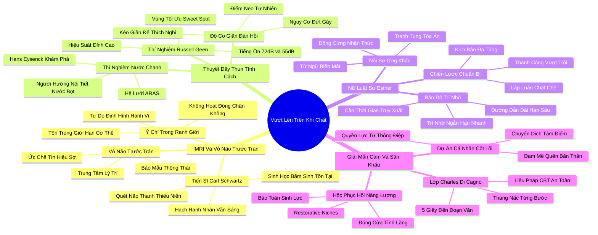

# 🗺️ BẢN ĐỒ TƯ DUY & BẢNG TRA CỨU NEO TRÍ NHỚ: CHƯƠNG NĂM - VƯỢT LÊN TRÊN KHÍ CHẤT

---

## 1. HỆ THỐNG PHẢ HỆ TRI THỨC (ACTIVE RECALL HIERARCHY)

---

## 2. BẢNG TRA CỨU NEO TRÍ NHỚ SIÊU TỐC (MEMORY ANCHOR CHEAT SHEET)

| 📑 Phần/Mục Tài Liệu | Khái Niệm / Từ Khóa Vàng | Bản Chất Cốt Lõi | Cảnh Báo Sai Lầm Thường Gặp | Hành Động Ứng Dụng Đột Phá |
| :--- | :--- | :--- | :--- | :--- |
| **Phần 1: fMRI Carl Schwartz** | **Prefrontal Regulation** | Vỏ não trước trán học cách gửi tín hiệu ức chế nỗi sợ của hạch hạnh nhân. | Cảm thấy bất an khi tim đập nhanh; cho rằng mình chưa bao giờ tiến bộ. | Dùng suy nghĩ logic trấn an cơ thể: "Mọi thứ vẫn an toàn và trong tầm kiểm soát". |
| **Phần 1: fMRI Carl Schwartz** | **Bounded Free Will** | Ý chí tự do giúp định hình hành vi nhưng hoạt động trong giới hạn sinh học. | Cố ép bản thân thay đổi 100% gen di truyền để trở thành một người hoàn toàn khác. | Kéo giãn bản thân có chừng mực và tôn trọng nhu cầu nghỉ ngơi sinh học. |
| **Phần 2: Thuyết dây thun** | **Rubber Band Theory** | Tính cách có thể co giãn linh hoạt nhưng luôn có xu hướng co về điểm neo tự nhiên. | Kéo căng chiếc dây thun liên tục không ngừng nghỉ dẫn đến đứt gãy và kiệt quệ. | Cho phép bản thân co về trạng thái tĩnh lặng ngay sau khi hoàn thành nhiệm vụ xã hội. |
| **Phần 2: Thuyết dây thun** | **Sweet Spot (Russell Geen)** | Mỗi kiểu tính cách có một mức kích thích tối ưu (55dB vs 72dB) để đạt hiệu suất cao nhất. | Bắt buộc người hướng nội làm việc trong văn phòng ồn ào và cho rằng họ lười biếng. | Tự điều chỉnh âm lượng, ánh sáng và không gian để duy trì đúng vùng kích thích lý tưởng. |
| **Phần 3: Nữ luật sư Esther** | **Long Neural Retrieval** | Não bộ người hướng nội kích hoạt đường dẫn thần kinh dài tới trí nhớ dài hạn. | Tự ti vì không thể ứng khẩu chém gió nhanh như những người hoạt ngôn bề nổi. | Dành thời gian chuẩn bị kịch bản chuyên sâu và sử dụng các khoảng dừng nhịp điệu. |
| **Phần 3: Nữ luật sư Esther** | **Multi-Tier Preparation** | Chuẩn bị kịch bản đa tầng biến sự cẩn trọng tỉ mỉ thành ưu thế tranh luận bất bại. | Chủ quan bước vào các cuộc họp đàm phán mà không dự liệu các câu hỏi hóc búa. | Chuẩn bị trước câu trả lời cho 5 kịch bản phản biện khó nhất của đối tác. |
| **Phần 4: Giải mẫn cảm** | **Systematic Desensitization** | Tiếp xúc với nỗi sợ nói trước đám đông qua các bước vi mô (5 giây, 1 câu, 1 đoạn). | Nhảy ngay lên sân khấu 1.000 người khi hệ thần kinh chưa được tôi luyện an toàn. | Chia nhỏ mục tiêu nói chuyện trước đám đông thành các bước vi mô thực hành hàng tuần. |
| **Phần 4: Giải mẫn cảm** | **Restorative Niches** | Ốc đảo tĩnh lặng bắt buộc giúp nạp lại pin sinh học sau các hoạt động giao tiếp căng thẳng. | Xếp lịch họp và tiệc tùng dày đặc không có lấy một phút nghỉ ngơi giữa các chặng. | Khóa chết 30 phút tĩnh lặng trên lịch làm việc ngay sau mỗi buổi thuyết trình lớn. |
