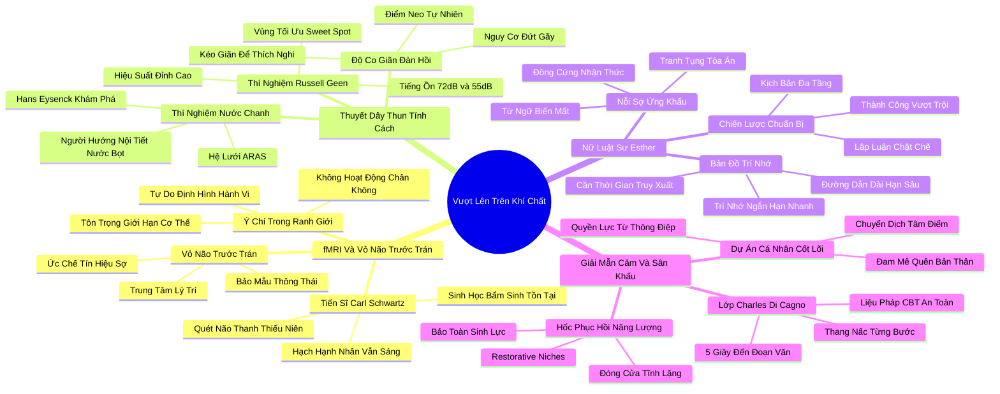

# 📖 TỔNG HỢP NỘI DUNG CHUYÊN SÂU: CHƯƠNG NĂM - VƯỢT LÊN TRÊN KHÍ CHẤT (BEYOND TEMPERAMENT)

### 🎯 THÔNG ĐIỆP CỐT LÕI (1 - 2 CÂU)
Ý chí tự do và vỏ não trước trán cho phép chúng ta kéo giãn bản thân như một chiếc dây thun để thích nghi với các đòi hỏi xã hội; tuy nhiên, để duy trì sự thăng hoa bền vững mà không kiệt quệ, mỗi cá nhân phải thấu hiểu và liên tục quay trở về "vùng kích thích tối ưu" (Sweet Spot) tự nhiên của mình.

---

### 📊 LƯỢC ĐỒ PHÂN BỔ CẤU TRÚC TÀI LIỆU
Bảng đối chiếu cấu trúc các phần trong tài liệu gốc và số lượng luận điểm chuyên sâu được khai phóng:

| Phần / Mục Trong Tài Liệu Gốc | Trọng Tâm Phân Tích | Số Luận Điểm | Tỷ Trọng Tri Thức |
| :--- | :--- | :---: | :---: |
| **Phần 1: Cỗ Máy fMRI & Vỏ Não Trước Trán** | Nghiên cứu Carl Schwartz: hạch hạnh nhân vẫn sáng nhưng vỏ não trước trán (Prefrontal Cortex) học cách kìm hãm | 3 luận điểm | 25% |
| **Phần 2: Thuyết Dây Thun & Điểm Tối Ưu (Sweet Spot)** | Thuyết dây thun tính cách, thí nghiệm nước cốt chanh của Eysenck, thí nghiệm tiếng ồn của Russell Geen | 3 luận điểm | 25% |
| **Phần 3: Nữ Luật Sư Esther & Trí Nhớ Làm Việc** | Khác biệt giữa trí nhớ ngắn hạn và trí nhớ dài hạn, nghệ thuật chuẩn bị bài thuyết trình | 3 luận điểm | 25% |
| **Phần 4: Lớp Giải Mẫn Cảm & Làm Chủ Bục Giảng** | Lớp học Charles Di Cagno, giải mẫn cảm từng bước (Desensitization), biến đam mê thành quyền lực nói | 3 luận điểm | 25% |
| **TỔNG CỘNG** | **Toàn bộ cấu trúc Chương 5** | **12 luận điểm** | **100%** |

---

### 💡 12 LUẬN ĐIỂM CHUYÊN SÂU THEO TỪNG PHẦN TÀI LIỆU

#### 📑 PHẦN 1: CỖ MÁY fMRI & VỎ NÃO TRƯỚC TRÁN (THE MARTINO CENTER & PREFRONTAL CORTEX)

1. **Bản Đồ Quét Não Của Tiến Sĩ Carl Schwartz:**
   - *Phân tích chuyên sâu:* Tại Trung tâm Hình ảnh Y sinh Martino thuộc Đại học Harvard, Tiến sĩ Carl Schwartz đã đặt những thanh thiếu niên từng là trẻ sơ sinh phản ứng cao trong nghiên cứu của Jerome Kagan vào cỗ máy fMRI. Khi nhìn thấy các khuôn mặt lạ, hạch hạnh nhân (Amygdala) của họ vẫn phát sáng rực rỡ y như lúc 4 tháng tuổi. Điều này chứng minh: nền tảng sinh học thần kinh bẩm sinh không bao giờ biến mất hoàn toàn.
   - *Công cụ / Phương pháp đi kèm:* Kỹ Thuật Chụp Cộng Hưởng Từ Chức Năng fMRI Hệ Viền (Limbic fMRI Imaging).
   - *Ví dụ thực chiến:* Một người hướng nội thành đạt có thể nở nụ cười tự tin bước vào khán phòng tiệc, nhưng hạch hạnh nhân bên trong não bộ của anh ta vẫn đang phát tín hiệu cảnh báo sinh học về một môi trường lạ lẫm.

2. **Vai Trò Kiểm Soát Tối Cao Của Vỏ Não Trước Trán (Prefrontal Cortex):**
   - *Phân tích chuyên sâu:* Điểm khác biệt giữa đứa trẻ sơ sinh và người trưởng thành chính là sự trưởng thành của Vỏ Não Trước Trán (Prefrontal Cortex) – trung tâm tư duy logic, lập kế hoạch và điều hành hành vi. Vỏ não trước trán hoạt động như một "người bảo mẫu thông thái": nó nhận tín hiệu hoảng sợ từ hạch hạnh nhân, nhanh chóng phân tích bối cảnh và gửi các tín hiệu ức chế thần kinh xuống để trấn an: "Bình tĩnh nào, đây chỉ là một buổi tiệc sinh nhật của bạn bè, không có mối nguy sinh tử nào ở đây cả".
   - *Công cụ / Phương pháp đi kèm:* Cơ Chế Tự Điều Chỉnh Thần Kinh Trên - Xuống (Top-Down Cognitive Regulation).
   - *Ví dụ thực chiến:* Khi đối diện với một câu hỏi hóc búa từ ban giám khảo, người hướng nội luyện tập lâu năm có thể cảm thấy tim nhói lên một nhịp nhưng ngay lập tức dùng lý trí hít thở sâu và mỉm cười điềm tĩnh trả lời.

3. **Ý Chí Tự Do Trong Giới Hạn Của Sinh Học:**
   - *Phân tích chuyên sâu:* Con người sở hữu ý chí tự do để định hình hành vi, nhưng ý chí tự do không hoạt động trong chân không mà vận hành bên trong những đường biên sinh học do tự nhiên thiết lập. Chúng ta có thể học cách diễn xuất bạo dạn và tự tin, nhưng việc cố gắng phủ nhận hoàn toàn nhu cầu tĩnh lặng nguyên thủy sẽ chỉ dẫn đến sự suy kiệt thần kinh mãn tính.
   - *Công cụ / Phương pháp đi kèm:* Khung Phân Tích Ý Chí Trong Ranh Giới Sinh Học (Bounded Free Will Model).
   - *Ví dụ thực chiến:* Bạn có thể trở thành một diễn giả truyền cảm hứng trước 5.000 người nhờ vào sự rèn luyện ý chí, nhưng bạn không thể ép bản thân tận hưởng việc đi quán bar ồn ào 5 đêm mỗi tuần sau giờ làm việc.

---

#### 📑 PHẦN 2: THUYẾT DÂY THUN & ĐIỂM TỐI ƯU (THE RUBBER BAND THEORY & SWEET SPOTS)

4. **Thuyết Dây Thun Về Nhân Cách Con Người (The Rubber Band Theory):**
   - *Phân tích chuyên sâu:* Susan Cain đưa ra ẩn dụ xuất sắc: Tính cách của chúng ta giống như một chiếc dây thun. Chúng ta có thể kéo giãn chiếc dây thun đó ra xa để thích nghi với các tình huống giao tiếp xã hội, thuyết trình trước công chúng hay lãnh đạo dự án. Nhưng chiếc dây thun luôn có một điểm neo tự nhiên và một giới hạn đàn hồi tối đa. Nếu kéo quá căng trong thời gian quá dài, dây thun sẽ đứt gãy; và ngay khi ngừng tác dụng lực, nó sẽ co lại về trạng thái nghỉ ngơi ban đầu.
   - *Công cụ / Phương pháp đi kèm:* Thước Đo Độ Co Giãn Dây Thun Tính Cách (Elastic Personality Index).
   - *Ví dụ thực chiến:* Một nhân viên kinh doanh hướng nội có thể nỗ lực gọi 30 cuộc điện thoại chào hàng đầy nhiệt huyết trong buổi sáng, nhưng đến buổi trưa, anh ta bắt buộc phải co về trạng thái nghỉ bằng một bữa trưa tĩnh lặng một mình trong công viên.

5. **Thí Nghiệm Nước Cốt Chanh Của Hans Eysenck:**
   - *Phân tích chuyên sâu:* Nhà tâm lý học huyền thoại Hans Eysenck phát hiện ra rằng người hướng nội và hướng ngoại khác nhau ở mức độ kích thích nền của Hệ Lưới Hoạt Hóa Hướng Lên (ARAS). Khi nhỏ một giọt nước cốt chanh vào lưỡi, người hướng nội tiết ra lượng nước bọt nhiều hơn gấp bội so với người hướng ngoại. Lý do: hệ thần kinh của người hướng nội vốn đã ở trạng thái cảnh giác cao độ, nên một kích thích vị giác mạnh sẽ gây ra phản ứng sinh lý cực kỳ dữ dội.
   - *Công cụ / Phương pháp đi kèm:* Thí Nghiệm Tiết Nước Bọt Eysenck (Lemon Juice Arousal Test).
   - *Ví dụ thực chiến:* Người hướng ngoại cần những kích thích mạnh như đồ ăn cay nồng, âm nhạc đinh tai và tiệc tùng đông đúc để cảm thấy tỉnh táo; trong khi người hướng nội chỉ cần một bản nhạc êm dịu và một tách trà ấm là đã đạt tới ngưỡng thỏa mãn giác quan.

6. **Thí Nghiệm Tiếng Ồn Của Russell Geen & Vùng Tối Ưu (Sweet Spot):**
   - *Phân tích chuyên sâu:* Nhà nghiên cứu Russell Geen cho các đối tượng làm bài kiểm tra nhận thức phức tạp trong khi cho họ tự do điều chỉnh mức âm lượng tiếng ồn nền. Người hướng ngoại chọn mức âm lượng trung bình 72 decibel (tương đương tiếng đường phố ồn ào), trong khi người hướng nội chọn mức 55 decibel (tiếng thì thầm thư viện). Đáng chú ý: khi tráo đổi mức tiếng ồn (bắt người hướng nội làm việc ở 72dB và người hướng ngoại ở 55dB), cả hai nhóm đều làm bài cực kỳ tệ hại.
   - *Công cụ / Phương pháp đi kèm:* Bản Đồ Vùng Kích Thích Tối Ưu (Optimal Stimulation Sweet Spot Matrix).
   - *Ví dụ thực chiến:* Khi được làm việc ở đúng mức kích thích ưa thích của mình, cả người hướng nội và hướng ngoại đều đạt năng suất đỉnh cao tương đương nhau; thất bại xảy ra khi một bên bị ép phải sinh sống trong môi trường âm thanh của bên kia.

---

#### 📑 PHẦN 3: NỮ LUẬT SƯ ESTHER & TRÍ NHỚ LÀM VIỆC (ESTHER & WORKING MEMORY)

7. **Nỗi Sợ Hãi Nói Tức Thì Của Nữ Luật Sư Hàng Đầu Esther:**
   - *Phân tích chuyên sâu:* Esther là một nữ luật sư tranh tụng tài ba, tốt nghiệp trường luật hàng đầu và có tư duy sắc bén. Thế nhưng, cô luôn sống trong nỗi ám ảnh kinh hoàng trước các phiên điều trần đòi hỏi phải đứng dậy ứng khẩu tức thì (extemporaneous speaking). Cô cảm thấy tâm trí mình đông cứng lại và các từ ngữ biến mất hoàn toàn khi bị thẩm phán dồn hỏi bất ngờ.
   - *Công cụ / Phương pháp đi kèm:* Phân Tích Hiện Tượng Đóng Băng Nhận Thức (Cognitive Freezing Diagnostic).
   - *Ví dụ thực chiến:* Trong khi các luật sư hướng ngoại có thể dễ dàng nói trôi chảy ngay cả khi chưa nắm chắc hồ sơ, Esther cần vài giây tĩnh lặng để kết nối các lập luận, nhưng sự ngập ngừng đó lại bị tòa án hiểu lầm là sự thiếu tự tin.

8. **Sự Khác Biệt Giữa Trí Nhớ Ngắn Hạn Và Truy Xuất Dài Hạn:**
   - *Phân tích chuyên sâu:* Khoa học nhận thức chỉ ra rằng người hướng ngoại có ưu thế trong việc truy xuất thông tin nhanh từ Trí Nhớ Ngắn Hạn / Trí Nhớ Làm Việc (Working Memory) dưới áp lực xã hội. Ngược lại, não bộ người hướng nội kích hoạt các đường dẫn thần kinh dài hơn đi qua vùng lưu trữ Trí Nhớ Dài Hạn (Long-term Memory), nơi thông tin được gắn kết với các tầng ý nghĩa và liên tưởng phức tạp. Quá trình này đòi hỏi thời gian xử lý lâu hơn nhưng mang lại độ sâu sắc và tính chính xác cao hơn vượt bậc.
   - *Công cụ / Phương pháp đi kèm:* Mô Hình Đường Dẫn Thần Kinh Dài - Ngắn (Long vs Short Neural Pathways).
   - *Ví dụ thực chiến:* Người hướng ngoại phản xạ ngay lập tức trong trò chơi đuổi hình bắt chữ nhanh; người hướng nội có thể chậm hơn vài giây nhưng là người tìm ra gốc rễ bản chất của một điều luật phức tạp bị ẩn giấu trong hàng nghìn trang hồ sơ.

9. **Chiến Lược Chuẩn Bị Siêu Kỹ Càng Của Bậc Thầy Trầm Lặng:**
   - *Phân tích chuyên sâu:* Nhận thức được đặc điểm thần kinh của mình, Esther đã thay đổi chiến lược: thay vì cố gắng ứng khẩu tùy tiện, cô đầu tư hàng chục giờ chuẩn bị trước mọi kịch bản phản biện có thể xảy ra, viết sẵn các luận điểm then chốt và luyện tập đến mức nhuần nhuyễn. Kết quả: cô trở thành một trong những luật sư tranh tụng đáng gờm nhất vì các lập luận của cô chặt chẽ đến mức đối phương không thể tìm ra kẽ hở.
   - *Công cụ / Phương pháp đi kèm:* Quy Trình Chuẩn Bị Kịch Bản Đa Tầng (Multi-Tier Scenario Preparation).
   - *Ví dụ thực chiến:* Abraham Lincoln hay Barack Obama – những nhà lãnh đạo có thiên hướng hướng nội – luôn chuẩn bị các bài phát biểu của mình kỹ lưỡng đến từng dấu chấm phẩy, biến sự cẩn trọng thành những áng văn hùng biện bất hủ.

---

#### 📑 PHẦN 4: LỚP HỌC GIẢI MẪN CẢM & LÀM CHỦ BỤC GIẢNG (DESENSITIZATION & MASTERY)

10. **Lớp Học Vượt Qua Nỗi Sợ Của Charles Di Cagno:**
    - *Phân tích chuyên sâu:* Tại thành phố New York, chuyên gia Charles Di Cagno mở các lớp học đặc biệt dành riêng cho những người mắc hội chứng sợ nói trước đám đông (Public speaking phobia). Phương pháp cốt lõi của ông dựa trên liệu pháp Nhận Thức - Hành Vi (CBT) và Kỹ thuật Giải mẫn cảm từng bước (Systematic Desensitization): đưa học viên tiếp xúc với tác nhân gây sợ hãi ở mức độ cực nhỏ, trong một môi trường được kiểm soát an toàn tuyệt đối.
    - *Công cụ / Phương pháp đi kèm:* Thang Nấc Giải Mẫn Cảm Từng Bước (Gradual Desensitization Ladder).
    - *Ví dụ thực chiến:* Buổi đầu tiên, học viên chỉ cần đứng dậy, nói tên mình trong 5 giây và ngồi xuống; buổi tiếp theo nói một câu; dần dần tăng lên một đoạn văn ngắn trước sự cổ vũ chân thành của các bạn học có cùng hoàn cảnh.

11. **Bí Quyết Làm Chủ Bục Giảng: Thuyết Trình Bằng Niềm Đam Mê Đích Thực:**
    - *Phân tích chuyên sâu:* Susan Cain phát hiện ra bí mật lớn nhất giúp người hướng nội làm chủ sân khấu: Đừng cố gắng trở thành một diễn giả hài hước hoạt ngôn kiểu Tony Robbins. Hãy chọn nói về một đề tài mà bạn thực sự say mê đến mức quên đi chính bản thân mình (Core Personal Projects). Khi tâm trí tập trung 100% vào giá trị của thông điệp cần trao gửi cho khán giả, hạch hạnh nhân sẽ không còn không gian để kích hoạt nỗi sợ vị kỷ.
    - *Công cụ / Phương pháp đi kèm:* Nguyên Tắc Chuyển Dịch Tâm Điểm Chú Ý (Self-to-Subject Focus Shift).
    - *Ví dụ thực chiến:* Một nhà khoa học hướng nội cực kỳ run rẩy khi xã giao, nhưng khi bước lên bục giảng để chia sẻ về phát minh thuốc chữa bệnh ung thư mà ông đã cống hiến 20 năm nghiên cứu, giọng nói của ông bỗng trở nên uy lực, truyền cảm và lay động hàng triệu trái tim.

12. **Xây Dựng Các "Hốc Phục Hồi Năng Lượng" (Restorative Niches) Sau Trình Diễn:**
    - *Phân tích chuyên sâu:* Ngay sau khi hoàn thành việc "kéo giãn chiếc dây thun" trên bục giảng hoặc cuộc họp, người hướng nội bắt buộc phải có một "Hốc phục hồi" – một không gian hoặc khoảng thời gian tĩnh lặng tuyệt đối để hệ thần kinh tự chủ hạ nhiệt và nạp lại năng lượng sinh học. Nếu thiếu đi các hốc phục hồi này, chu kỳ kiệt quệ sẽ xảy ra.
    - *Công cụ / Phương pháp đi kèm:* Giao Thức Thiết Lập Hốc Phục Hồi (Restorative Niche Protocol).
    - *Ví dụ thực chiến:* Các giáo sư hướng nội nổi tiếng tại Harvard thường quy định giờ tiếp sinh viên cách nhau 30 phút để đóng kín cửa phòng làm việc, uống một tách trà nóng hoặc nhắm mắt tĩnh tâm trước khi tiếp lượt người tiếp theo.

---

### 🛠️ KẾ HOẠCH HÀNH ĐỘNG THỰC THI (20 HÀNH ĐỘNG)

#### TẦNG 1: HÀNH VI VI MÔ TỨC THÌ (< 2 PHÚT)
- [ ] **Nhận diện trạng thái dây thun:** Tự hỏi nhanh: "Chiếc dây thun năng lượng của mình hiện tại đang giãn bao nhiêu phần trăm?".
- [ ] **Kỹ thuật neo chân chạm đất (Grounding):** Đứng thẳng lưng, cảm nhận hai lòng bàn chân tiếp xúc vững chắc với sàn nhà trước khi bước lên thuyết trình.
- [ ] **Quy tắc 2 giây dừng lại:** Khi bị hỏi bất ngờ, mỉm cười nhẹ và dừng lại 2 giây để vỏ não trước trán kích hoạt truy xuất dữ liệu sâu.
- [ ] **Điều chỉnh âm thanh môi trường:** Lập tức cắm tai nghe hoặc chuyển sang bàn làm việc yên tĩnh khi cảm thấy tiếng ồn xung quanh vượt ngưỡng chịu đựng.
- [ ] **Rút lui vi mô trong nhà vệ sinh:** Dành 90 giây ở một mình trong buồng rửa mặt, rửa tay bằng nước mát và nhắm mắt hít thở sâu giữa sự kiện đông người.
- [ ] **Chuyển tâm điểm chú ý:** Nhủ thầm trước khi phát biểu: "Khán giả đang cần giải pháp hữu ích này, mình chỉ là người đưa tin".

#### TẦNG 2: THÓI QUEN & QUY TRÌNH TUẦN
- [ ] **Quy trình chuẩn bị bài thuyết trình 3 lớp:** Viết kịch bản chi tiết -> Rút gọn thành thẻ nhớ từ khóa -> Tập dượt ghi âm một mình 3 lần trước buổi thuyết trình.
- [ ] **Thiết lập Hốc Phục Hồi cố định:** Đặt lịch khóa chết 45 phút tĩnh lặng tuyệt đối trên Google Calendar ngay sau mỗi cuộc họp hoặc buổi đào tạo lớn.
- [ ] **Nhật ký Sweet Spot:** Theo dõi mức độ kích thích (ánh sáng, âm thanh, số người tiếp xúc) tạo ra năng suất làm việc cao nhất trong tuần.
- [ ] **Tập dượt giải mẫn cảm quy mô nhỏ:** Tự nguyện nhận nhiệm vụ báo cáo 3 phút trong cuộc họp nhóm nhỏ trước khi nhận bài thuyết trình toàn công ty.
- [ ] **Bảo vệ buổi tối tĩnh dưỡng:** Dành trọn vẹn 2 buổi tối trong tuần không tham gia bất kỳ hoạt động xã giao nào để dây thun tính cách co về trạng thái nghỉ.
- [ ] **Luyện tập nói chậm rãi:** Rèn luyện thói quen nhả chữ chậm rãi, có khoảng dừng nhịp nhàng thay vì cố gắng nói liến thoắng cho giống người hướng ngoại.
- [ ] **Tối ưu hóa không gian làm việc cá nhân:** Đặt một chiếc đèn bàn ánh sáng ấm, loại bỏ các vật dụng gây rối mắt để giảm kích thích giác quan.

#### TẦNG 3: CHUYỂN HÓA CHIẾN LƯỢC DÀI HẠN
- [ ] **Xây dựng sự nghiệp xoay quanh Dự án Cá nhân Cốt lõi (Core Projects):** Lựa chọn những công việc mà mục tiêu cuối cùng đủ ý nghĩa để bạn sẵn sàng kéo giãn bản thân bước ra sân khấu lớn.
- [ ] **Đàm phán "Thỏa thuận Đặc điểm Tự do" (Free Trait Agreement):** Thống nhất với gia đình và đồng nghiệp: bạn sẽ xuất hiện nhiệt tình trong các sự kiện quan trọng, đổi lại họ tôn trọng quyền được ở một mình của bạn sau đó.
- [ ] **Tham gia câu lạc bộ rèn luyện kỹ năng nói an toàn:** Gia nhập Toastmasters hoặc các nhóm rèn luyện thuyết trình nhỏ nơi có văn hóa phản hồi tích cực và không phán xét.
- [ ] **Thiết kế lộ trình nghề nghiệp tôn trọng Sweet Spot:** Từ chối các vị trí quản lý đòi hỏi phải giao tiếp xã giao 80% thời gian nếu nó triệt tiêu hoàn toàn thời gian nghiên cứu chuyên môn sâu của bạn.
- [ ] **Đào tạo đội ngũ về sự đa dạng kích thích giác quan:** Tổ chức chia sẻ nội bộ về thí nghiệm Russell Geen để các phòng ban biết cách tôn trọng nhu cầu âm thanh khác nhau của nhân viên.
- [ ] **Làm chủ nghệ thuật đàm phán dựa trên chiều sâu:** Chuyển đổi các cuộc đàm phán căng thẳng trực tiếp sang hình thức chuẩn bị văn bản chiến lược kỹ lưỡng trước khi gặp mặt.
- [ ] **Xóa bỏ vĩnh viễn mặc cảm sợ sân khấu:** Thấu hiểu rằng lo âu trước đám đông là một phản ứng sinh học bình thường của loài người, và hoàn toàn có thể được làm chủ bằng phương pháp giải mẫn cảm.

---

### ❓ BỘ CÂU HỎI TỰ NGẪM (20 CÂU HỎI)

#### NHÓM 1: TỰ VẤN NHẬN THỨC & THẤU HIỂU BẢN THÂN
1. Đâu là "Vùng kích thích tối ưu" (Sweet Spot) của tôi: một quán cà phê rộn rã tiếng nhạc hay một góc thư viện vắng lặng?
2. Chiếc dây thun tính cách của tôi có thể kéo giãn tối đa trong bao lâu trước khi tôi rơi vào trạng thái cáu kỉnh và kiệt sức?
3. Khi đứng trước đám đông, tôi đang sợ hãi điều gì nhất: sợ bị đánh giá năng lực hay sợ hãi phản ứng sinh học tim đập chân run của chính mình?
4. Trí nhớ của tôi hoạt động tốt nhất trong hoàn cảnh nào: khi bị hối thúc trả lời ngay lập tức hay khi có 5 phút suy nghĩ thấu đáo?
5. Tôi có đang tự trừng phạt bản thân vì không thể ứng khẩu trôi chảy và hóm hỉnh như một số người bạn hướng ngoại?

#### NHÓM 2: ĐÁNH GIÁ THỰC TRẠNG & RÀ SOÁT THÓI QUEN
6. Sau những buổi thuyết trình hoặc tiệc tùng công ty, tôi có dành cho bản thân một "Hốc phục hồi" đúng nghĩa hay lại lao ngay vào công việc tiếp theo?
7. Mức độ tiếng ồn tại văn phòng làm việc hiện tại của tôi đang hỗ trợ hay đang phá hủy năng lực tư duy của tôi mỗi ngày?
8. Tôi đã từng bao nhiêu lần chuẩn bị sơ sài cho các cuộc họp quan trọng rồi hy vọng vào khả năng ứng biến tùy tiện?
9. Tôi có thường xuyên sử dụng cà phê hoặc nước tăng lực để cưỡng ép hệ thần kinh thức tỉnh vượt quá ngưỡng kích thích tự nhiên?
10. Những chủ đề nào khiến tôi say mê đến mức khi nói về chúng, tôi hoàn toàn quên mất sự nhút nhát và nỗi sợ hãi của bản thân?

#### NHÓM 3: THÁCH THỨC NIỀM TIN CŨ & PHÁ VỠ ĐỊNH KIẾN
11. Liệu người nói năng lưu loát ứng khẩu tức thì có luôn đưa ra những quyết định sáng suốt hơn người cần thời gian suy ngẫm?
12. Có phải thuyết trình trước công chúng là một tài năng thiên bẩm không thể học được, hay nó là một kỹ năng vận động có thể giải mẫn cảm từng bước?
13. Tại sao chúng ta lại coi sự ngập ngừng suy nghĩ trong vài giây là dấu hiệu của sự kém cỏi thay vì sự cẩn trọng trí tuệ?
14. Kéo giãn chiếc dây thun tính cách có đồng nghĩa với việc sống giả tạo và đánh mất con người thật của mình?
15. Có đúng là một người hướng nội không bao giờ có thể trở thành một diễn giả xuất chúng lay động hàng triệu người?

#### NHÓM 4: THIẾT KẾ GIẢI PHÁP & HÀNH ĐỘNG KIẾN TẠO
16. Tôi sẽ thiết kế thang nấc "Giải mẫn cảm từng bước" nào để chinh phục nỗi sợ thuyết trình trước ban lãnh đạo trong tháng tới?
17. Những "Hốc phục hồi năng lượng" cụ thể nào tôi có thể tích hợp ngay vào lịch làm việc bận rộn hàng ngày của mình?
18. Tôi có thể chuyển hóa bài thuyết trình sắp tới từ một màn phô diễn cá nhân thành một buổi chia sẻ về một "Dự án cá nhân cốt lõi" đầy đam mê như thế nào?
19. Làm thế nào để tôi có thể thiết lập "Thỏa thuận đặc điểm tự do" với bạn đời hoặc cấp trên để vừa hoàn thành trách nhiệm xã hội vừa bảo vệ được sự bình an nội tâm?
20. Những quy ước nào tôi cần thỏa thuận với đồng nghiệp để tôi có thêm 3-5 giây suy nghĩ trước khi phản hồi trong các cuộc họp quan trọng?

---

### 🗺️ MINDMAP 4-5 TẦNG TRỰC QUAN ĐỈNH CAO

