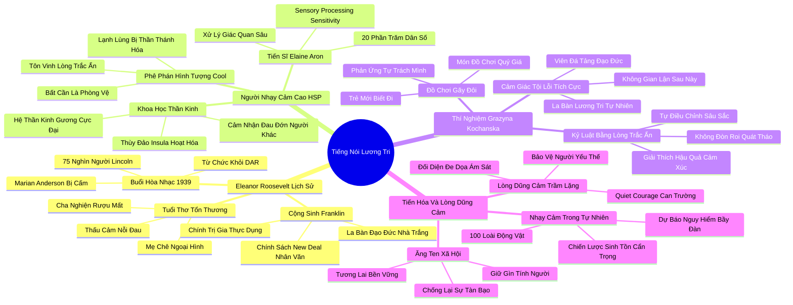

# 🗺️ BẢN ĐỒ TƯ DUY & BẢNG TRA CỨU NEO TRÍ NHỚ: CHƯƠNG SÁU - FRANKLIN LÀ MỘT CHÍNH TRỊ GIA, NHƯNG ELEANOR LÊN TIẾNG BẰNG TIẾNG NÓI LƯƠNG TRI

---

## 1. HỆ THỐNG PHẢ HỆ TRI THỨC (ACTIVE RECALL HIERARCHY)

---

## 2. BẢNG TRA CỨU NEO TRÍ NHỚ SIÊU TỐC (MEMORY ANCHOR CHEAT SHEET)

| 📑 Phần/Mục Tài Liệu | Khái Niệm / Từ Khóa Vàng | Bản Chất Cốt Lõi | Cảnh Báo Sai Lầm Thường Gặp | Hành Động Ứng Dụng Đột Phá |
| :--- | :--- | :--- | :--- | :--- |
| **Phần 1: Eleanor Roosevelt** | **Quiet Moral Courage** | Lòng dũng cảm thầm lặng: vượt qua sự nhút nhát để bảo vệ phẩm giá con người. | Nhầm lẫn sự trầm lặng, rụt rè với sự nhu nhược và hèn nhát trước cường quyền. | Kiên định hành động theo tiếng gọi lương tri ngay cả khi phải đối diện với sự cô lập. |
| **Phần 1: Eleanor Roosevelt** | **Politician-Conscience Dyad** | Cặp đôi cộng sinh: người hướng ngoại thao lược thực tế kết hợp người hướng nội giữ gìn la bàn đạo đức. | Đánh giá thấp vai trò phản biện đạo đức trong các quyết định chiến lược vĩ mô. | Xây dựng cơ chế phản biện lương tri trong ban điều hành doanh nghiệp. |
| **Phần 2: Người nhạy cảm cao** | **Sensory Processing (HSP)** | Não bộ xử lý các kích thích giác quan và tín hiệu cảm xúc sâu sắc gấp nhiều lần. | Xem tính nhạy cảm như một căn bệnh tâm lý yếu đuối cần phải loại bỏ. | Tôn trọng nhu cầu thanh lọc giác quan định kỳ để bảo vệ sức khỏe tâm thần. |
| **Phần 2: Người nhạy cảm cao** | **Mirror Neuron Surge** | Hệ thần kinh gương và thùy đảo hoạt động cực đại khiến cá nhân thực sự cảm nhận nỗi đau người khác. | Cố gắng tỏ ra lạnh lùng, bất cần (Cool) để hòa nhập vào văn hóa vô cảm đại chúng. | Tận dụng năng lực thấu cảm tự nhiên vào nghệ thuật, chữa lành và lãnh đạo phụng sự. |
| **Phần 3: Thí nghiệm Kochanska** | **Constructive Guilt** | Cảm giác áy náy tích cực khi làm sai là nền tảng xây dựng nhân cách đạo đức vững chắc. | Sợ hãi cảm giác tội lỗi và tìm cách bao biện, trốn tránh trách nhiệm cá nhân. | Lắng nghe sự cắn rứt lương tâm như một tín hiệu dẫn đường để sửa đổi hành vi. |
| **Phần 3: Thí nghiệm Kochanska** | **Inductive Discipline** | Kỷ luật nhẹ nhàng bằng cách giải thích hậu quả cảm xúc thay vì dùng đòn roi sỉ nhục. | Quát tháo và áp đặt bạo lực lên những đứa trẻ vốn đã có tòa án lương tâm nghiêm khắc. | Ngồi ngang tầm mắt trẻ và trò chuyện về sự thấu cảm khi trẻ mắc lỗi lầm. |
| **Phần 4: Lợi thế tiến hóa** | **Evolutionary Sentinel** | 20% cá thể nhạy cảm đóng vai trò lính gác cảnh báo sớm nguy cơ hiểm họa cho toàn bầy. | Ép mọi cá nhân trong xã hội phải trở nên liều lĩnh và xông xáo giống nhau. | Bố trí nhân sự nhạy cảm vào các vị trí kiểm soát chất lượng, thẩm định rủi ro và pháp chế. |
| **Phần 4: Lợi thế tiến hóa** | **Social Conscience Compass** | Sự nhạy cảm đạo đức là ăng-ten thiết yếu giúp nhân loại duy trì tính người và sự văn minh. | Hy sinh các chuẩn mực đạo đức cốt lõi để đổi lấy lợi ích tài chính ngắn hạn. | Luôn đặt câu hỏi về tác động nhân văn dài hạn trước mọi quyết định công nghệ và chính sách. |
