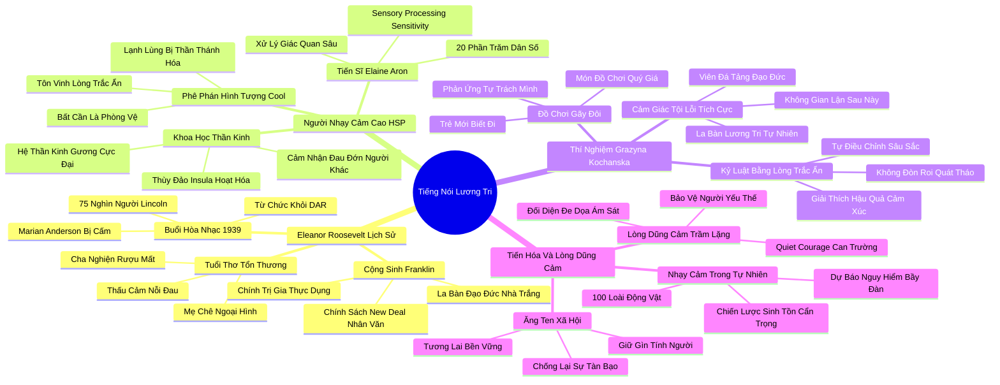

# 📖 TỔNG HỢP NỘI DUNG CHUYÊN SÂU: CHƯƠNG SÁU - FRANKLIN LÀ MỘT CHÍNH TRỊ GIA, NHƯNG ELEANOR LÊN TIẾNG BẰNG TIẾNG NÓI LƯƠNG TRI (FRANKLIN WAS A POLITICIAN, BUT ELEANOR SPOKE OUT OF CONSCIENCE)

### 🎯 THÔNG ĐIỆP CỐT LÕI (1 - 2 CÂU)
Văn hóa hiện đại đang đánh giá quá cao sự lạnh lùng bất cần và sự hào nhoáng bề ngoài mà xem nhẹ năng lực nhạy cảm xử lý giác quan (Sensory Processing Sensitivity); chính lòng trắc ẩn sâu sắc và tiếng nói lương tri can trường của những tâm hồn nhạy cảm như Eleanor Roosevelt mới là động lực thức tỉnh đạo đức và định hình tiến bộ nhân loại.

---

### 📊 LƯỢC ĐỒ PHÂN BỔ CẤU TRÚC TÀI LIỆU
Bảng đối chiếu cấu trúc các phần trong tài liệu gốc và số lượng luận điểm chuyên sâu được khai phóng:

| Phần / Mục Trong Tài Liệu Gốc | Trọng Tâm Phân Tích | Số Luận Điểm | Tỷ Trọng Tri Thức |
| :--- | :--- | :---: | :---: |
| **Phần 1: Buổi Hòa Nhạc 1939 & Eleanor Roosevelt** | Sự kiện Marian Anderson tại Đài tưởng niệm Lincoln, tuổi thơ đầy nước mắt và lòng trắc ẩn của Eleanor | 3 luận điểm | 25% |
| **Phần 2: Tiến Sĩ Elaine Aron & Người Nhạy Cảm Cao (HSP)** | Khái niệm Sensory Processing Sensitivity, 27 câu hỏi trắc nghiệm, đặc điểm sinh lý thần kinh | 3 luận điểm | 25% |
| **Phần 3: Thí Nghiệm Đồ Chơi Hỏng & Lương Tâm Trẻ Thơ** | Grazyna Kochanska: phản ứng cảm giác tội lỗi (Guilt) của trẻ nhạy cảm là bệ phóng cho nhân cách đạo đức | 3 luận điểm | 25% |
| **Phần 4: Lợi Thế Tiến Hóa & Sức Mạnh Lương Tri** | Lợi thế sinh tồn của cá thể nhạy cảm trong tự nhiên, sự kết hợp chính trị Franklin - Eleanor | 3 luận điểm | 25% |
| **TỔNG CỘNG** | **Toàn bộ cấu trúc Chương 6** | **12 luận điểm** | **100%** |

---

### 💡 12 LUẬN ĐIỂM CHUYÊN SÂU THEO TỪNG PHẦN TÀI LIỆU

#### 📑 PHẦN 1: BUỔI HÒA NHẠC 1939 & ELEANOR ROOSEVELT (MARIAN ANDERSON & COMPASSION)

1. **Hành Động Can Trường Lịch Sử Năm 1939 Của Eleanor Roosevelt:**
   - *Phân tích chuyên sâu:* Năm 1939, khi Hội Nữ Con gái Cách mạng Mỹ (DAR) cấm nữ danh ca da màu Marian Anderson biểu diễn tại hội trường Constitution Hall vì nạn phân biệt chủng tộc, Đệ nhất Phu nhân Eleanor Roosevelt đã lập tức tuyên bố từ chức khỏi hội và đích thân dàn xếp buổi hòa nhạc lịch sử tại Đài tưởng niệm Lincoln trước 75.000 khán giả. Eleanor – một người phụ nữ nhút nhát, ghét sự chú ý của công chúng – đã vượt qua nỗi sợ hãi cá nhân để bảo vệ phẩm giá con người bằng sự can đảm bắt nguồn từ lương tri thuần khiết.
   - *Công cụ / Phương pháp đi kèm:* Hành Động Đạo Đức Bất Tuân Lệnh (Moral Defiance Framework).
   - *Ví dụ thực chiến:* Hình ảnh nữ danh ca Marian Anderson cất cao tiếng hát bài "My Country, 'Tis of Thee" dưới chân tượng Abraham Lincoln đã trở thành biểu tượng bất tử cho phong trào dân quyền Mỹ, khởi nguồn từ sự can thiệp âm thầm nhưng quyết liệt của Eleanor.

2. **Tuổi Thơ Đầy Tổn Thương Và Sự Thấu Cảm Sâu Sắc Của Eleanor:**
   - *Phân tích chuyên sâu:* Eleanor lớn lên với mặc cảm tự ti sâu sắc: mẹ cô là một tuyệt sắc giai nhân luôn gọi cô là "Granny" (Bà già) vì ngoại hình thô kệch, cha cô là một người nghiện rượu chết sớm. Thay vì trở nên cay nghiệt hay chai lì cảm xúc, nỗi đau tuổi thơ đã tôi luyện Eleanor thành một tâm hồn có khả năng thấu cảm tột bậc trước nỗi thống khổ của người khác. Bà cảm nhận nỗi đau của người nghèo, người da màu và những người yếu thế như nỗi đau của chính da thịt mình.
   - *Công cụ / Phương pháp đi kèm:* Chuyển Hóa Nỗi Đau Thành Lòng Trắc Ẩn (Trauma-to-Empathy Alchemy).
   - *Ví dụ thực chiến:* Khi đến thăm những khu ổ chuột tối tăm hay các trại lính trong Thế chiến II, Eleanor không ngần ngại ngồi xuống bên giường bệnh nhân, cầm tay họ và lắng nghe từng lời tâm sự trong hàng giờ đồng hồ.

3. **Mối Quan Hệ Cộng Sinh Đạo Đức: Franklin Là Chính Trị Gia, Eleanor Là Lương Tri:**
   - *Phân tích chuyên sâu:* Tổng thống Franklin D. Roosevelt (FDR) là một người hướng ngoại điển hình: cuốn hút, giỏi thao túng chính trị, thích được vây quanh bởi đám đông và luôn tìm cách dung hòa các phe phái. Eleanor là cực đối lập: bà đóng vai trò là "chiếc la bàn đạo đức" không khoan nhượng của Nhà Trắng, liên tục thúc ép FDR phải ban hành các chính sách vì người nghèo và chấm dứt phân biệt chủng tộc ngay cả khi việc đó gây tổn hại đến tính toán chính trị thực dụng của ông.
   - *Công cụ / Phương pháp đi kèm:* Mô Hình Cặp Đôi Chính Trị - Lương Tri (The Politician-Conscience Dynamic).
   - *Ví dụ thực chiến:* FDR từng phàn nàn rằng việc sống cùng Eleanor giống như sống cùng một vị quan tòa đạo đức không bao giờ ngủ, nhưng chính ông thừa nhận rằng nếu không có sự thúc giục không ngừng nghỉ của bà, chính sách New Deal sẽ không bao giờ có được linh hồn nhân văn sâu sắc đến vậy.

---

#### 📑 PHẦN 2: TIẾN SĨ ELAINE ARON & NGƯỜI NHẠY CẢM CAO (DR ELAINE ARON & HSP)

4. **Khám Phá Đột Phá Về Người Nhạy Cảm Cao (Highly Sensitive Person - HSP):**
   - *Phân tích chuyên sâu:* Tiến sĩ Elaine Aron khởi xướng nghiên cứu tiên phong về đặc điểm "Nhạy cảm xử lý giác quan" (Sensory Processing Sensitivity - SPS), ước tính chiếm khoảng 15% đến 20% dân số. Đây không phải là một chứng rối loạn tâm thần, mà là một chiến lược thần kinh bẩm sinh: não bộ của người HSP xử lý thông tin giác quan (âm thanh, ánh sáng, xúc cảm, tâm trạng người khác) ở mức độ sâu sắc và chi tiết hơn gấp nhiều lần so với người bình thường.
   - *Công cụ / Phương pháp đi kèm:* Thang Đo Đánh Giá Người Nhạy Cảm Cao (The HSP Scale - 27 Items).
   - *Ví dụ thực chiến:* Một người HSP có thể nhận ra ngay sự thay đổi tinh tế trong ánh mắt của đồng nghiệp, cảm thấy choáng ngợp trước mùi nước hoa quá nồng trong thang máy, và bị xúc động mạnh mẽ đến rơi nước mắt trước một bức tranh đẹp.

5. **Bộ Não Của Sự Thấu Cảm: Hệ Thần Kinh Gương (Mirror Neurons) Hoạt Động Cực Đại:**
   - *Phân tích chuyên sâu:* Các nghiên cứu quét não fMRI hiện đại của Tiến sĩ Aron và các cộng sự chứng minh rằng khi người HSP nhìn thấy những bức ảnh chụp gương mặt biểu lộ cảm xúc (dù vui hay buồn), vùng não chứa Hệ Thần Kinh Gương (Mirror Neuron System) và Vùng Vỏ Não Thùy Đảo (Insula) – trung tâm tạo ra cảm giác thấu cảm và tự nhận thức – hoạt động mạnh mẽ hơn rõ rệt so với người không nhạy cảm. Họ thực sự "cảm thấy" nỗi đau của người khác trong cơ thể mình.
   - *Công cụ / Phương pháp đi kèm:* Bản Đồ Hoạt Hóa Thần Kinh Gương (Mirror Neuron Activation Mapping).
   - *Ví dụ thực chiến:* Khi xem một bản tin thời sự về nạn nhân bão lũ, người bình thường có thể cảm thấy thương hại trong thoáng chốc, nhưng người HSP có thể cảm thấy lồng ngực đau nhói và mất ngủ suốt đêm vì tâm trí liên tục tái hiện nỗi đau của những con người xa lạ.

6. **Vì Sao Sự "Lạnh Lùng Bất Cần" (Cool) Lại Bị Đánh Giá Quá Cao:**
   - *Phân tích chuyên sâu:* Văn hóa đại chúng phương Tây tôn sùng hình tượng "Cool" – sự lạnh lùng, bất cần, không lay chuyển, không thể bị tổn thương (như các nhân vật hành động James Bond hay các ngôi sao nhạc rock). Susan Cain lập luận rằng sự tôn sùng này là một căn bệnh văn hóa nguy hiểm. Nó biến sự nhạy cảm, lòng trắc ẩn và sự quan tâm chân thành thành những biểu hiện của sự yếu thế, trong khi chính sự nhạy cảm mới là chất keo gắn kết xã hội và ngăn chặn sự tàn bạo của con người.
   - *Công cụ / Phương pháp đi kèm:* Phê Phán Mô Thức Lạnh Lùng Xã Hội (Critique of the Cool Paradigm).
   - *Ví dụ thực chiến:* Trong các trường học và công sở, những cá nhân biết quan tâm sâu sắc thường bị gán mác "ủy mị", trong khi những kẻ thờ ơ, ích kỷ lại được ca tụng là "bản lĩnh và cứng cỏi".

---

#### 📑 PHẦN 3: THÍ NGHIỆM ĐỒ CHƠI HỎNG & LƯƠNG TÂM TRẺ THƠ (KOCHANSKA'S TOY EXPERIMENT)

7. **Thí Nghiệm Đồ Chơi Bị Hỏng Của Nhà Tâm Lý Học Grazyna Kochanska:**
   - *Phân tích chuyên sâu:* Giáo sư Grazyna Kochanska tại Đại học Iowa tiến hành thí nghiệm nổi tiếng: bà đưa cho các đứa trẻ mới biết đi một món đồ chơi đặc biệt và nói rằng đây là món đồ chơi quý giá nhất của bà. Tuy nhiên, món đồ chơi đã được gắn bẫy để tự gãy đôi ngay khi đứa trẻ cầm vào. Khi món đồ chơi gãy, nhóm trẻ có khí chất nhạy cảm phản ứng bằng cảm xúc tội lỗi sâu sắc: chúng cúi gầm mặt, ôm chặt tay, lo lắng và nhanh chóng tìm cách xin lỗi hoặc sửa chữa món đồ; ngược lại, nhóm trẻ bạo dạn không nhạy cảm chỉ nhún vai hoặc thậm chí cười đùa dửng dưng.
   - *Công cụ / Phương pháp đi kèm:* Thí Nghiệm Đồ Chơi Gãy Đạo Đức (Kochanska Damaged Toy Paradigm).
   - *Ví dụ thực chiến:* Đứa trẻ nhạy cảm khi vô tình làm đổ cốc nước sẽ đứng sững lại với đôi mắt ngấn lệ và vội vã đi lấy khăn lau; đứa trẻ bạo dạn có thể thản nhiên bước qua vũng nước và tiếp tục chạy nhảy.

8. **Cảm Giác Tội Lỗi Tích Cực (Guilt) Là Nền Tảng Của Lương Tri Con Người:**
   - *Phân tích chuyên sâu:* Kochanska phát hiện một quy luật tâm lý vĩ đại: Cảm giác tội lỗi ở mức độ vừa phải không phải là một căn bệnh tâm lý tiêu cực, mà chính là "viên đá tảng" xây dựng nên nhân cách đạo đức của nhân loại. Trẻ em biết cảm thấy áy náy khi làm sai sẽ lớn lên trở thành những công dân biết tôn trọng pháp luật, ít gian lận trong học tập, không bắt nạt bạn bè và phát triển lòng vị tha xã hội bền vững nhất.
   - *Công cụ / Phương pháp đi kèm:* Thước Đo Phát Triển Lương Tâm Trẻ Thơ (Moral Conscience Index).
   - *Ví dụ thực chiến:* Theo dõi dọc của Kochanska cho thấy những đứa trẻ biểu lộ cảm xúc áy náy trong thí nghiệm đồ chơi hỏng khi lên 6-7 tuổi luôn tuân thủ nghiêm túc các quy tắc trò chơi ngay cả khi không có người lớn giám sát.

9. **Nghệ Thuật Kỷ Luật Trẻ Nhạy Cảm Bằng Lòng Trắc Ẩn:**
   - *Phân tích chuyên sâu:* Do trẻ nhạy cảm đã sở hữu một tòa án lương tâm nội tâm nghiêm khắc, phương pháp giáo dục bằng đòn roi, quát tháo hay sỉ nhục nơi công cộng sẽ phá hủy hoàn toàn lòng tự trọng của trẻ và gây ra sang chấn tâm lý nặng nề. Cha mẹ chỉ cần giải thích nhẹ nhàng về hậu quả hành vi đối với người khác ("Hành động đó làm bạn đau đấy con ạ"), đứa trẻ sẽ lập tức tự điều chỉnh hành vi một cách sâu sắc.
   - *Công cụ / Phương pháp đi kèm:* Phương Pháp Kỷ Luật Nhẹ Nhàng Bằng Thấu Cảm (Inductive Discipline Method).
   - *Ví dụ thực chiến:* Một lời nhắc nhở nhẹ nhàng: "Mẹ rất buồn khi thấy con vứt sách lung tung" có tác động thức tỉnh đạo đức đối với một đứa trẻ nhạy cảm mạnh hơn gấp trăm lần một trận đòn roi thịnh nộ.

---

#### 📑 PHẦN 4: LỢI THẾ TIẾN HÓA & SỨC MẠNH LƯƠNG TRI (EVOLUTION & QUIET COURAGE)

10. **Sự Nhạy Cảm Giác Quan Trong Toàn Bộ Giới Động Vật:**
    - *Phân tích chuyên sâu:* Nghiên cứu của các nhà sinh học tiến hóa phát hiện đặc điểm nhạy cảm xử lý giác quan tồn tại ở hơn 100 loài động vật khác nhau (từ ruồi giấm, cá hồi, chim chích đến chó sói và khỉ). Trong mỗi loài, luôn có một tỷ lệ cố định khoảng 20% cá thể mang tính nhạy cảm. Chúng là những cá thể đứng ở rìa đàn, quan sát kỹ các biến đổi thời tiết, cẩn trọng khi nếm thức ăn lạ và phát hiện kẻ săn mồi sớm nhất.
    - *Công cụ / Phương pháp đi kèm:* Thuyết Chiến Lược Sinh Tồn Nhạy Cảm Tiến Hóa (Evolutionary Sensitive Trait Theory).
    - *Ví dụ thực chiến:* Trong một đàn chim chích, những con chim nhạy cảm dành nhiều thời gian hơn để tìm kiếm thức ăn dưới bụi rậm an toàn; khi thời tiết biến động khắc nghiệt, chính những con chim này sống sót nhờ khả năng dự báo thiên tai nhạy bén.

11. **Sức Mạnh Của Lòng Dũng Cảm Trầm Lặng (Quiet Courage):**
    - *Phân tích chuyên sâu:* Lòng dũng cảm đích thực không nhất thiết phải là hành động xông pha gươm giáo trên chiến trường với tiếng hò hét vang trời. Lòng dũng cảm của người hướng nội nhạy cảm là "Lòng dũng cảm trầm lặng" (Quiet Courage): dám đứng lên nói lên sự thật khi cả tập thể im lặng, dám bảo vệ kẻ yếu thế trước cường quyền, và kiên định đi theo tiếng gọi của lương tri bất chấp sự cô lập của xã hội.
    - *Công cụ / Phương pháp đi kèm:* Khung Đánh Giá Lòng Dũng Cảm Đạo Đức (Moral Courage Matrix).
    - *Ví dụ thực chiến:* Eleanor Roosevelt từng nhận được hàng trăm lá thư đe dọa ám sát từ các nhóm phân biệt chủng tộc Ku Klux Klan, nhưng bà kiên quyết từ chối đội mật vụ bảo vệ có vũ trang và một mình lái xe đi khắp miền Nam nước Mỹ để vận động bình đẳng nhân quyền.

12. **Sự Cần Thiết Của La Bàn Lương Tri Trong Thời Đại Hỗn Loạn:**
    - *Phân tích chuyên sâu:* Một thế giới chỉ toàn những kẻ thực dụng, toan tính và lạnh lùng sẽ nhanh chóng tự hủy diệt bởi các cuộc chiến tranh và sự bóc lột cạn kiệt tài nguyên. Sự nhạy cảm không phải là điểm yếu cần che giấu; nó là ăng-ten đạo đức thiết yếu giúp nhân loại duy trì tính người, sự gắn kết xã hội và trách nhiệm với thế hệ tương lai.
    - *Công cụ / Phương pháp đi kèm:* La Bàn Lương Tri Xã Hội (Social Conscience Compass).
    - *Ví dụ thực chiến:* Các phong trào bảo vệ môi trường toàn cầu, các tổ chức từ thiện nhân đạo và các bản tuyên ngôn nhân quyền của Liên Hợp Quốc (mà Eleanor Roosevelt là chủ tịch ủy ban soạn thảo) đều được khai sinh từ trái tim thổn thức của những con người nhạy cảm cao.

---

### 🛠️ KẾ HOẠCH HÀNH ĐỘNG THỰC THI (20 HÀNH ĐỘNG)

#### TẦNG 1: HÀNH VI VI MÔ TỨC THÌ (< 2 PHÚT)
- [ ] **Lời khen ngợi sự thấu cảm:** Khi thấy ai đó xúc động trước một câu chuyện nhân văn, nói lời trân trọng: "Lòng trắc ẩn của bạn thật đáng quý".
- [ ] **Dừng lại trước khi phán xét:** Khi thấy một đứa trẻ hoặc đồng nghiệp khóc, dừng lại 3 giây và đặt câu hỏi: "Bạn có cần một không gian yên tĩnh không?".
- [ ] **Lắng nghe tiếng nói lương tâm:** Trước khi đưa ra một quyết định kinh doanh, tự hỏi: "Nếu quyết định này được đưa lên trang nhất báo chí, mình có thanh thản không?".
- [ ] **Tháo gỡ vỏ bọc lạnh lùng:** Dũng cảm bày tỏ sự quan tâm chân thành tới một người đang gặp khó khăn thay vì giả vờ tỏ ra bất cần, vô cảm.
- [ ] **Bảo vệ giác quan nhạy cảm:** Đeo kính râm hoặc giảm âm lượng thiết bị ngay khi cảm thấy môi trường bên ngoài quá chói chang hoặc đinh tai.
- [ ] **Chấp nhận sự rung động:** Cho phép bản thân rơi nước mắt khi xem một bộ phim cảm động mà không cảm thấy ngượng ngùng.

#### TẦNG 2: THÓI QUEN & QUY TRÌNH TUẦN
- [ ] **Thực hiện bài trắc nghiệm HSP:** Làm bài kiểm tra 27 câu hỏi của Tiến sĩ Elaine Aron để thấu hiểu rõ nét hồ sơ nhạy cảm giác quan của bản thân.
- [ ] **Áp dụng kỷ luật thấu cảm (Inductive Discipline):** Khi dạy con, thay vì quát mắng, ngồi ngang tầm mắt con và giải thích cặn kẽ hậu quả cảm xúc của hành vi.
- [ ] **Dành một buổi chiều thanh lọc giác quan:** Dành chiều chủ nhật hoàn toàn không màn hình điện tử, không mạng xã hội, đắm mình trong thiên nhiên hoặc sách hay.
- [ ] **Viết nhật ký thấu cảm:** Ghi lại những khoảnh khắc trong tuần mà sự nhạy cảm giúp bạn thấu hiểu một xung đột ngầm hoặc bảo vệ ai đó khỏi bất công.
- [ ] **Từ chối các nội dung bạo lực vô bổ:** Chủ động hủy theo dõi các trang tin tức giật gân, bạo lực để bảo vệ hệ thần kinh gương khỏi bị quá tải tiêu cực.
- [ ] **Thiết lập không gian ấm áp trong gia đình:** Tạo ra một góc đọc sách với ánh sáng dịu nhẹ và âm nhạc cổ điển để cả nhà cùng thư giãn tâm hồn.
- [ ] **Luyện tập nói lời từ chối nhân danh lương tri:** Tập dượt nói "Không" một cách lịch sự nhưng dứt khoát trước những yêu cầu vi phạm giá trị đạo đức cá nhân.

#### TẦNG 3: CHUYỂN HÓA CHIẾN LƯỢC DÀI HẠN
- [ ] **Tái định vị tính nhạy cảm như một lợi thế cạnh tranh:** Tận dụng trực giác sắc bén và năng lực thấu cảm để trở thành chuyên gia tâm lý, đàm phán nhân sự hoặc thiết kế trải nghiệm người dùng xuất sắc.
- [ ] **Xây dựng cặp đôi cộng sinh "Thực thi - Lương tri":** Hợp tác với một đối tác giỏi chiến lược kinh doanh thực tế, trong khi bạn đảm nhận vai trò giữ gìn văn hóa và kiểm soát đạo đức tổ chức.
- [ ] **Tham gia hoặc bảo trợ các hoạt động nhân quyền / thiện nguyện:** Noi gương Eleanor Roosevelt, cống hiến thời gian hoặc tài chính cho các dự án bảo vệ người yếu thế.
- [ ] **Xây dựng chính sách nhân sự thân thiện với người nhạy cảm:** Vận động doanh nghiệp công nhận sự đa dạng thần kinh (Neurodiversity) và tạo điều kiện làm việc phù hợp cho nhân sự HSP.
- [ ] **Biên soạn quy tắc ứng xử đạo đức cho đội ngũ:** Đưa các tiêu chí về tính trung thực, sự thấu cảm và trách nhiệm xã hội vào bộ giá trị cốt lõi của công ty.
- [ ] **Nuôi dạy thế hệ trẻ giàu lòng trắc ẩn:** Truyền cảm hứng cho con cái và học sinh rằng việc biết quan tâm và sống có lương tri là phẩm hạnh cao quý nhất của con người.
- [ ] **Tuyên truyền xóa bỏ huyền thoại "Lạnh lùng bất cần":** Viết bài hoặc chia sẻ góc nhìn nhằm phá vỡ định kiến tôn sùng sự vô cảm trong văn hóa giới trẻ.

---

### ❓ BỘ CÂU HỎI TỰ NGẪM (20 CÂU HỎI)

#### NHÓM 1: TỰ VẤN NHẬN THỨC & THẤU HIỂU BẢN THÂN
1. Tôi có phải là một người nhạy cảm cao (HSP) – người dễ dàng bị choáng ngợp bởi đám đông, tiếng ồn và ánh sáng mạnh?
2. Khi nhìn thấy người khác chịu đau đớn hoặc bất công, cơ thể tôi phản ứng như thế nào: rung động sâu sắc hay nhanh chóng lãng quên?
3. Tôi có thường xuyên cố gắng tỏ ra lạnh lùng, bất cần và "ngầu" để che giấu một trái tim mỏng manh dễ bị tổn thương bên trong?
4. Cảm giác tội lỗi (Guilt) trong tôi hoạt động như thế nào: như một kẻ tra tấn tâm lý hay như một chiếc la bàn đạo đức giúp tôi sống tử tế hơn?
5. Tôi đã từng bao nhiêu lần cảm thấy tự ti vì nghĩ rằng mình quá "mít ướt", quá yếu mềm trước những biến cố của cuộc đời?

#### NHÓM 2: ĐÁNH GIÁ THỰC TRẠNG & RÀ SOÁT THÓI QUEN
6. Môi trường làm việc hiện tại của tôi có đang tôn vinh những kẻ thực dụng lạnh lùng và gạt ra rìa những người làm việc bằng lương tri?
7. Trong cách dạy con hoặc quản lý cấp dưới, tôi đang sử dụng nỗi sợ hãi và hình phạt hay đang sử dụng sự thấu hiểu và kỷ luật nhẹ nhàng?
8. Tôi có đang vô tình đầu độc tâm hồn mình bằng việc tiếp xúc quá nhiều với các bộ phim bạo lực và tin tức giật gân trên mạng xã hội?
9. Lần gần đây nhất tôi dũng cảm lên tiếng bảo vệ một người bị đối xử bất công là khi nào, bất chấp việc đó có thể khiến tôi bị cô lập?
10. Mối quan hệ giữa tôi và người bạn đời/cộng sự có giống như cặp đôi FDR - Eleanor: một người giỏi hành động thực tế và một người giữ gìn la bàn đạo đức?

#### NHÓM 3: THÁCH THỨC NIỀM TIN CŨ & PHÁ VỠ ĐỊNH KIẾN
11. Liệu sự lạnh lùng bất cần (Cool) có thực sự là biểu hiện của sức mạnh nội tâm, hay nó chỉ là một chiếc khiên phòng vệ hèn nhát của những tâm hồn sợ bị tổn thương?
12. Có phải người nhạy cảm luôn là nạn nhân của nghịch cảnh, hay họ chính là những cá nhân có khả năng thăng hoa vượt bậc nhất khi gặp đúng môi trường?
13. Tại sao xã hội hiện đại lại coi việc một người đàn ông rơi nước mắt vì thương cảm là dấu hiệu của sự yếu đuối?
14. Nếu không có cảm giác tội lỗi và sự cắn rứt lương tâm, liệu loài người có thể xây dựng được một xã hội văn minh và hòa bình?
15. Eleanor Roosevelt có thể trở thành một trong những đệ nhất phu nhân vĩ đại nhất lịch sử nếu bà sinh ra với một tính cách chai lì và vô cảm?

#### NHÓM 4: THIẾT KẾ GIẢI PHÁP & HÀNH ĐỘNG KIẾN TẠO
16. Tôi sẽ sử dụng "siêu năng lực thấu cảm" của mình như thế nào để hóa giải các xung đột ngầm và gắn kết các thành viên trong tổ chức?
17. Những biện pháp cụ thể nào tôi có thể áp dụng để bảo vệ bản thân khỏi tình trạng "kiệt quệ vì thấu cảm" (Empathy Burnout)?
18. Nếu tôi đang nuôi dạy một đứa trẻ nhạy cảm, tôi sẽ giúp con nhìn nhận tính nhạy cảm như một món quà quý giá của tự nhiên như thế nào?
19. Tôi có thể xây dựng một dự án xã hội hoặc sáng kiến kinh doanh nào xuất phát trực tiếp từ tiếng gọi lương tri và lòng trắc ẩn của mình?
20. Làm thế nào để kết hợp hài hòa giữa sự nhạy cảm sâu sắc của Eleanor và sự khéo léo thực tế của Franklin trong chính cuộc đời tôi?

---

### 🗺️ MINDMAP 4-5 TẦNG TRỰC QUAN ĐỈNH CAO

