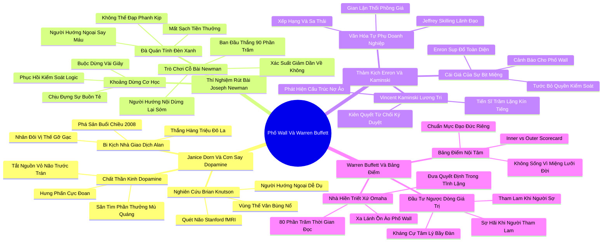

# 🗺️ BẢN ĐỒ TƯ DUY & BẢNG TRA CỨU NEO TRÍ NHỚ: CHƯƠNG BẢY - VÌ SAO PHỐ WALL SỤP ĐỔ VÀ WARREN BUFFETT PHỒN THỊNH?

---

## 1. HỆ THỐNG PHẢ HỆ TRI THỨC (ACTIVE RECALL HIERARCHY)

---

## 2. BẢNG TRA CỨU NEO TRÍ NHỚ SIÊU TỐC (MEMORY ANCHOR CHEAT SHEET)

| 📑 Phần/Mục Tài Liệu | Khái Niệm / Từ Khóa Vàng | Bản Chất Cốt Lõi | Cảnh Báo Sai Lầm Thường Gặp | Hành Động Ứng Dụng Đột Phá |
| :--- | :--- | :--- | :--- | :--- |
| **Phần 1: Cơn say Dopamine** | **Reward Sensitivity** | Hệ thống dopamine bùng nổ làm tê liệt vùng vỏ não phân tích rủi ro. | Nhầm lẫn cơn say hưng phấn kiếm tiền ngắn hạn với năng lực đầu tư chiến lược. | Tạm dừng mọi giao dịch tài chính lớn khi cảm thấy quá phấn khích hoặc quá cay cú. |
| **Phần 1: Cơn say Dopamine** | **Revenge Trading** | Hành vi nhân đôi đòn bẩy để gỡ gạc sau khi thua lỗ dẫn đến phá sản tức thì. | Đổ lỗi cho thị trường xui xẻo thay vì nhận diện sự mất kiểm soát sinh học thần kinh. | Thiết lập giới hạn cắt lỗ tự động không thể can thiệp bằng tay trong mọi giao dịch. |
| **Phần 2: Thí nghiệm Newman** | **Newman Card Paradigm** | Người hướng nội biết dừng lại đúng lúc khi xác suất biến động xấu; người hướng ngoại say máu rút tiếp. | Tin rằng chuỗi thua lỗ sắp kết thúc và vận may sẽ trở lại ở lượt cược tiếp theo. | Học cách rời bỏ bàn cược và bảo toàn nguồn vốn khi các điều kiện cơ bản thay đổi. |
| **Phần 2: Thí nghiệm Newman** | **Mechanical Pause** | Khoảng dừng cơ học bắt buộc giúp ngắt đà quán tính hưng phấn và phục hồi lý trí. | Đưa ra các quyết định chi tiêu hoặc đầu tư trong trạng thái vội vã bị hối thúc. | Áp dụng quy tắc chờ 48 giờ trước khi ký duyệt bất kỳ thương vụ đầu tư rủi ro nào. |
| **Phần 3: Thảm kịch Enron** | **Whistleblower Dismissal** | Các tổ chức sụp đổ vì bịt miệng chuyên gia cảnh báo rủi ro để chạy theo lợi nhuận ảo. | Tôn sùng những người kiếm tiền liều lĩnh và coi thường những người nói về rủi ro. | Bảo vệ và trao quyền phủ quyết cho bộ phận quản trị rủi ro và kiểm toán nội bộ. |
| **Phần 3: Thảm kịch Enron** | **Rank and Yank Hubris** | Hệ thống sa thải tàn khốc tạo ra môi trường lừa đảo và bóp nghẹt tiếng nói phản biện. | Đánh giá hiệu suất nhân sự chỉ dựa trên con số doanh số ngắn hạn trước mắt. | Đưa tiêu chí tuân thủ đạo đức và kiểm soát an toàn vào khung đánh giá lãnh đạo. |
| **Phần 4: Warren Buffett** | **Inner Scorecard** | Đo lường bản thân bằng các giá trị và nguyên tắc nội tại thay vì ánh nhìn xã hội. | Chạy theo các trào lưu tiêu dùng xa xỉ và đầu cơ chỉ để gây ấn tượng với người khác. | Viết ra bộ nguyên tắc sống và chỉ hành động khi nó phù hợp với Bảng điểm nội tâm. |
| **Phần 4: Warren Buffett** | **Contrarian Patience** | Sức mạnh của sự lười biếng thông minh: chịu đựng sự buồn tẻ và kiên nhẫn chờ cơ hội lớn. | Mua bán giao dịch liên tục vì sợ bỏ lỡ cơ hội (FOMO) trên thị trường náo loạn. | Dành phần lớn thời gian nghiên cứu sâu và chỉ hành động quyết liệt khi xác suất thắng cực cao. |
