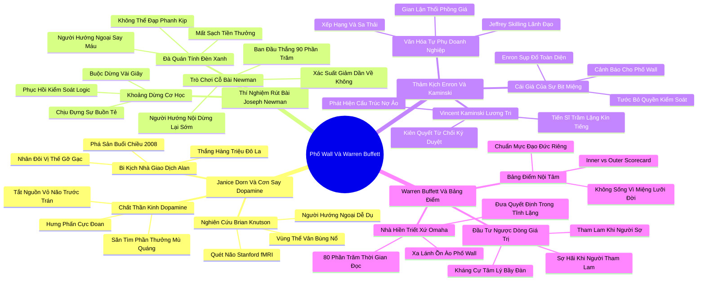

# 📖 TỔNG HỢP NỘI DUNG CHUYÊN SÂU: CHƯƠNG BẢY - VÌ SAO PHỐ WALL SỤP ĐỔ VÀ WARREN BUFFETT PHỒN THỊNH? (WHY DID WALL STREET CRASH AND WARREN BUFFETT PROSPER?)

### 🎯 THÔNG ĐIỆP CỐT LÕI (1 - 2 CÂU)
Cơn say phần thưởng do dopamine chi phối khiến những người hướng ngoại dễ dàng lao vào các trò cờ bạc tài chính và bỏ qua tín hiệu cảnh báo rủi ro; ngược lại, sự thận trọng thần kinh và năng lực bám trụ vào "Bảng điểm nội tâm" (Inner Scorecard) của những người hướng nội như Warren Buffett mới chính là chiếc mỏ neo bảo toàn thịnh vượng qua mọi cơn bão sụp đổ thị trường.

---

### 📊 LƯỢC ĐỒ PHÂN BỔ CẤU TRÚC TÀI LIỆU
Bảng đối chiếu cấu trúc các phần trong tài liệu gốc và số lượng luận điểm chuyên sâu được khai phóng:

| Phần / Mục Trong Tài Liệu Gốc | Trọng Tâm Phân Tích | Số Luận Điểm | Tỷ Trọng Tri Thức |
| :--- | :--- | :---: | :---: |
| **Phần 1: Janice Dorn & Cơn Say Dopamine** | Bi kịch cháy tài khoản của Alan năm 2008, chất dẫn truyền thần kinh dopamine, sự nhạy cảm phần thưởng (Reward Sensitivity) | 3 luận điểm | 25% |
| **Phần 2: Thí Nghiệm Rút Bài Của Joseph Newman** | Thí nghiệm đèn đỏ Newman, hiện tượng "say máu" tiếp tục đặt cược, nghệ thuật biết dừng lại | 3 luận điểm | 25% |
| **Phần 3: Thảm Kịch Enron & Vincent Kaminski** | Thảm họa tập đoàn Enron, chuyên gia phân tích rủi ro Vincent Kaminski bị phớt lờ trước những kẻ xông xáo liều lĩnh | 3 luận điểm | 25% |
| **Phần 4: Triết Lý Đầu Tư Của Warren Buffett** | Nhà hiền triết Omaha, Bảng điểm nội tâm (Inner Scorecard vs Outer Scorecard), kỷ luật tĩnh lặng độc lập | 3 luận điểm | 25% |
| **TỔNG CỘNG** | **Toàn bộ cấu trúc Chương 7** | **12 luận điểm** | **100%** |

---

### 💡 12 LUẬN ĐIỂM CHUYÊN SÂU THEO TỪNG PHẦN TÀI LIỆU

#### 📑 PHẦN 1: JANICE DORN & CƠN SAY DOPAMINE (DR JANICE DORN & REWARD SENSITIVITY)

1. **Bi Kịch Cháy Tài Khoản Của Nhà Giao Dịch Alan Năm 2008:**
   - *Phân tích chuyên sâu:* Tiến sĩ Janice Dorn – một bác sĩ tâm thần đồng thời là chuyên gia huấn luyện giao dịch Phố Wall – kể lại câu chuyện của Alan: một nhà giao dịch cổ phiếu thông minh, năng nổ và luôn tràn đầy tự tin. Trong cơn sốt bong bóng nhà đất trước năm 2008, Alan kiếm được hàng triệu đô la. Nhưng khi thị trường đảo chiều, thay vì cắt lỗ, anh ta liên tục nhân đôi vị thế đòn bẩy trong cơn say gỡ gạc, phớt lờ mọi lời cảnh báo và cuối cùng mất sạch toàn bộ cơ nghiệp trong một buổi chiều hoảng loạn.
   - *Công cụ / Phương pháp đi kèm:* Phân Tích Tâm Lý Say Máu Giao Dịch (Trader Tilt & Revenge Trading Analysis).
   - *Ví dụ thực chiến:* Alan nhìn vào màn hình biểu đồ đỏ rực nhưng não bộ của anh bị khóa chặt trong ảo tưởng rằng thị trường sắp bật tăng trở lại, biến một nhà đầu tư có học thức thành một con bạc khát nước tại sòng bài Las Vegas.

2. **Cơ Chế Sinh Học Thần Kinh Của Cơn Say Phần Thưởng (Reward Sensitivity):**
   - *Phân tích chuyên sâu:* Sự khác biệt cốt lõi giữa người hướng ngoại và người hướng nội trong tài chính nằm ở mức độ nhạy cảm với Chất Dẫn Truyền Thần Kinh Dopamine. Người hướng ngoại có hệ thống dopamine hoạt động cực mạnh: khi nhìn thấy cơ hội kiếm tiền, danh vọng hay tình dục, não bộ họ phóng thích một lượng dopamine khổng lồ, tạo ra cảm giác hưng phấn ngây ngất. Cơn say dopamine này kích hoạt hạch hạnh nhân và vùng thể vân bụng (Ventral striatum), tạm thời "tắt nguồn" vùng vỏ não trước trán chuyên phân tích rủi ro.
   - *Công cụ / Phương pháp đi kèm:* Bản Đồ Thần Kinh Về Sự Nhạy Cảm Phần Thưởng (Dopamine Reward Pathway Mapping).
   - *Ví dụ thực chiến:* Thí nghiệm quét não fMRI của Brian Knutson tại Đại học Stanford cho thấy khi nhìn thấy biểu tượng tiền thưởng USD, người hướng ngoại có sự bùng nổ tín hiệu thần kinh ở vùng nhân accumbens (Nucleus Accumbens) mạnh hơn gấp bội so với người hướng nội.

3. **Nghịch Lý Động Lực: Nỗi Ám Ảnh Về Đích Đến Thay Vì Quá Trình:**
   - *Phân tích chuyên sâu:* Do quá nhạy cảm với phần thưởng, người hướng ngoại dễ rơi vào cái bẫy "Hành vi hướng mục tiêu cực đoan" (Extreme goal-directed behavior). Họ tập trung toàn bộ năng lượng vào viễn cảnh huy hoàng khi chiến thắng mà bỏ qua các tín hiệu cảnh báo rủi ro xuất hiện dọc đường. Ngược lại, người hướng nội có xu hướng ít bị dopamine chi phối hơn, giúp họ giữ được cái đầu lạnh để soi xét cẩn thận các chi tiết nguy hiểm.
   - *Công cụ / Phương pháp đi kèm:* Ma Trận Cân Bằng Động Lực - Thận Trọng (Reward vs Risk Balance Matrix).
   - *Ví dụ thực chiến:* Một giám đốc bán hàng hướng ngoại sẵn sàng cam kết những hợp đồng vượt quá năng lực sản xuất của công ty chỉ để giành danh hiệu "Người bán hàng xuất sắc nhất tháng", đẩy cả doanh nghiệp vào khủng hoảng giao hàng.

---

#### 📑 PHẦN 2: THÍ NGHIỆM RÚT BÀI CỦA JOSEPH NEWMAN (CARD PLAYING PARADIGM)

4. **Thí Nghiệm Kinh Điển Của Joseph Newman Về Nghệ Thuật Dừng Lại:**
   - *Phân tích chuyên sâu:* Nhà tâm lý học Joseph Newman tại Đại học Wisconsin thiết kế thí nghiệm rút bài tinh vi: Người tham gia được rút từng lá bài từ một cỗ bài. Ban đầu, tỷ lệ thắng là 90% (rút được bài thắng được thưởng 10 xu). Nhưng sau mỗi 10 lá bài, tỷ lệ bài thắng giảm dần 10% và tỷ lệ bài thua (bị phạt tiền) tăng lên. Đến lá bài thứ 100, tỷ lệ thua là 100%. Người tham gia có quyền tuyên bố dừng cuộc chơi bất kỳ lúc nào để bảo toàn số tiền đã thắng.
   - *Công cụ / Phương pháp đi kèm:* Thí Nghiệm Trò Chơi Bài Newman (Newman Card Playing Paradigm).
   - *Ví dụ thực chiến:* Người hướng nội nhanh chóng nhận ra quy luật xác suất đang thay đổi bất lợi sau vài lá bài thua liên tiếp; họ dừng lại và mang về nhà một khoản tiền thưởng đáng kể. Ngược lại, người hướng ngoại tiếp tục rút bài với tốc độ ngày càng nhanh hơn, tin rằng lá bài tiếp theo sẽ thắng, và cuối cùng mất sạch toàn bộ số tiền.

5. **Hiện Tượng Đóng Băng Nhận Thức Khi Đối Mặt Tín Hiệu Đèn Đỏ:**
   - *Phân tích chuyên sâu:* Newman phân tích cơ chế hành vi: Khi người hướng ngoại đang trên đà hưng phấn tiến tới mục tiêu (tín hiệu đèn xanh), họ cực kỳ khó khăn trong việc đạp phanh khi gặp tín hiệu cảnh báo (tín hiệu đèn đỏ). Họ bị cuốn vào đà quán tính hành vi (Behavioral momentum). Tuy nhiên, Newman phát hiện một giải pháp đột phá: Nếu bắt người hướng ngoại buộc phải dừng lại vài giây giữa mỗi lần rút bài, hiệu suất của họ lập tức cải thiện ngang bằng người hướng nội. Sự ngắt quãng cơ học giúp não bộ lấy lại quyền kiểm soát logic.
   - *Công cụ / Phương pháp đi kèm:* Kỹ Thuật Đặt Khoảng Dừng Cơ Học (Mechanical Pause Intervention).
   - *Ví dụ thực chiến:* Khi một nhà đầu tư chứng khoán đang thua lỗ liên tục, việc khóa tài khoản giao dịch trong 24 giờ bắt buộc sẽ ngăn chặn được 90% các quyết định đặt cược hoảng loạn tự sát.

6. **Năng Lực Trì Hoãn Thỏa Mãn Và Khả Năng Chịu Đựng Sự Buồn Tẻ:**
   - *Phân tích chuyên sâu:* Đầu tư tài chính thành công trong dài hạn thực chất là một công việc cực kỳ tẻ nhạt: đọc hàng nghìn trang báo cáo tài chính, chờ đợi cơ hội hàng năm trời và không làm gì cả. Người hướng ngoại ghét sự buồn tẻ và luôn khao khát hành động, do đó họ thường xuyên mua bán cổ phiếu liên tục (Over-trading), làm giàu cho các công ty môi giới nhưng bào mòn tài sản của chính mình. Người hướng nội cảm thấy thoải mái tuyệt đối với sự tĩnh lặng, biến sự kiên nhẫn thành vũ khí sinh lời tối thượng.
   - *Công cụ / Phương pháp đi kèm:* Chỉ Số Kiên Nhẫn Trong Buồn Tẻ (Boredom Tolerance Index).
   - *Ví dụ thực chiến:* Warren Buffett từng tuyên bố: "Phần lớn các nhà đầu tư không thể cưỡng lại việc mua bán liên tục. Nhưng trong đầu tư, sự lười biếng thông minh và việc không hành động gì cả mới là đỉnh cao của sự khôn ngoan".

---

#### 📑 PHẦN 3: THẢM KỊCH ENRON & VINCENT KAMINSKI (ENRON & RISK MANAGEMENT)

7. **Văn Hóa Tự Tin Thái Quá Và Sự Sụp Đổ Của Tập Đoàn Năng Lượng Enron:**
   - *Phân tích chuyên sâu:* Enron từng là tập đoàn năng lượng lớn thứ 7 nước Mỹ, được ca tụng là biểu tượng của sự đổi mới sáng tạo. Tuy nhiên, toàn bộ văn hóa Enron được điều hành bởi những nhà lãnh đạo hướng ngoại hung hăng, tự phụ như Jeffrey Skilling. Họ tuyển dụng những người trẻ tuổi liều lĩnh, sẵn sàng làm giả số liệu kế toán để thổi phồng giá cổ phiếu và sa thải không thương tiếc 15% nhân viên mỗi năm thông qua hệ thống đánh giá tàn khốc "Xếp hạng và Sa thải" (Rank and Yank).
   - *Công cụ / Phương pháp đi kèm:* Phân Tích Văn Hóa Tự Phụ Doanh Nghiệp (Corporate Hubris Diagnostic).
   - *Ví dụ thực chiến:* Các nhà giao dịch Enron nhảy múa ăn mừng trên sàn giao dịch khi giá khí đốt tăng ảo, bất chấp việc các công ty con của họ đang gánh những khoản nợ khổng lồ được che giấu tinh vi ngoài bảng cân đối kế toán.

8. **Số Phận Của Người Cảnh Báo Lương Tri Vincent Kaminski:**
   - *Phân tích chuyên sâu:* Vincent Kaminski – một tiến sĩ kinh tế học gốc Ba Lan trầm lặng, kín tiếng, đứng đầu bộ phận nghiên cứu rủi ro định lượng của Enron. Nhờ vào việc phân tích toán học tỉ mỉ và bản tính thận trọng bẩm sinh, Kaminski là người đầu tiên phát hiện ra các cấu trúc tài chính "mờ ám" của Giám đốc Tài chính Andrew Fastow thực chất là một quả bom nợ rủi ro khổng lồ có thể phá hủy tập đoàn.
   - *Công cụ / Phương pháp đi kèm:* Khung Thẩm Định Rủi Ro Định Lượng (Quantitative Risk Audit Framework).
   - *Ví dụ thực chiến:* Khi Fastow yêu cầu Kaminski ký duyệt cho các giao dịch mờ ám, Kaminski kiên quyết từ chối. Thay vì lắng nghe ông, ban lãnh đạo Enron đã tước bỏ quyền kiểm soát rủi ro của Kaminski và chuyển dự án cho một người dễ dãi hơn để tiếp tục màn lừa đảo.

9. **Cái Giá Đắt Của Việc Bịt Miệng Những Người Thận Trọng:**
   - *Phân tích chuyên sâu:* Thảm kịch Enron năm 2001 và cuộc khủng hoảng tài chính toàn cầu năm 2008 đều chia sẻ chung một kịch bản nghiệt ngã: Các tổ chức tài chính đã tôn sùng những kẻ bán hàng hoạt ngôn, những tay giao dịch liều lĩnh kiếm lời ngắn hạn và bịt miệng, gạt ra rìa những chuyên gia phân tích rủi ro hướng nội thận trọng. Khi một hệ thống triệt tiêu tiếng nói cảnh báo của những người nhạy cảm, sự sụp đổ mang tính hệ thống là điều tất yếu không thể tránh khỏi.
   - *Công cụ / Phương pháp đi kèm:* Chỉ Số Đa Dạng Rủi Ro Tổ Chức (Organizational Risk Diversity Metric).
   - *Ví dụ thực chiến:* Sau khi Enron phá sản, Kaminski được quốc hội Mỹ mời ra điều trần như một nhân chứng danh dự, trong khi các CEO hào nhoáng của Enron phải vào tù bóc lịch vì tội lừa đảo gian lận tài chính.

---

#### 📑 PHẦN 4: TRIẾT LÝ ĐẦU TƯ CỦA WARREN BUFFETT (WARREN BUFFETT & INNER SCORECARD)

10. **Nhà Hiền Triết Xứ Omaha: Đỉnh Cao Của Nhà Đầu Tư Hướng Nội:**
    - *Phân tích chuyên sâu:* Warren Buffett – một trong những người giàu nhất hành tinh – là một người hướng nội điển hình: ông sống ở thị trấn nhỏ Omaha xa lánh sự ồn ào của Phố Wall, dành 80% thời gian mỗi ngày trong phòng làm việc đóng kín cửa chỉ để đọc sách và suy ngẫm. Ông không sử dụng máy tính trên bàn làm việc, không có màn hình biểu đồ chứng khoán nhấp nháy, và đưa ra các quyết định đầu tư hàng tỷ đô la trong sự tĩnh lặng tuyệt đối.
    - *Công cụ / Phương pháp đi kèm:* Lối Sống Đầu Tư Tĩnh Lặng Omaha (Quiet Investing Lifestyle Framework).
    - *Ví dụ thực chiến:* Trong cơn sốt bong bóng Dot-com cuối những năm 1990, khi toàn bộ Phố Wall chê cười Buffett là "ông già lỗi thời" vì không chịu mua cổ phiếu công nghệ, ông vẫn kiên định ngồi yên đọc báo cáo; vài năm sau khi bong bóng vỡ tan, tài sản của ông tăng vọt trong khi các quỹ đầu tư ồn ào biến mất khỏi thị trường.

11. **Sức Mạnh Tối Thượng Của "Bảng Điểm Nội Tâm" (The Inner Scorecard):**
    - *Phân tích chuyên sâu:* Triết lý sống cốt tủy của Warren Buffett được đúc kết qua khái niệm: "Bảng điểm nội tâm" (Inner Scorecard) đối lập với "Bảng điểm bên ngoài" (Outer Scorecard). Bảng điểm bên ngoài đo lường giá trị của bạn bằng những gì người khác nhìn vào bạn (danh tiếng, sự tán thưởng của đám đông, vị thế xã hội). Bảng điểm nội tâm đo lường bạn bằng chính những tiêu chuẩn đạo đức và nguyên tắc logic mà bạn tự đặt ra cho mình: "Bạn muốn trở thành người yêu thương vĩ đại nhất thế giới nhưng bị mọi người coi là tệ hại, hay bạn muốn là người tệ hại nhất nhưng được cả thế giới ngợi ca?".
    - *Công cụ / Phương pháp đi kèm:* Khung Đánh Giá Bảng Điểm Nội Tâm (Inner vs Outer Scorecard Audit).
    - *Ví dụ thực chiến:* Người có Bảng điểm nội tâm vững vàng sẽ không bao giờ cảm thấy bị áp lực phải mua nhà to, xe sang hay đuổi theo các cơn sốt tiền mã hóa chỉ vì bạn bè xung quanh đang làm như vậy.

12. **Chiến Lược Đầu Tư Giá Trị: Kháng Cự Lại Tâm Lý Bầy Đàn:**
    - *Phân tích chuyên sâu:* Đầu tư giá trị (Value Investing) của Benjamin Graham và Warren Buffett bản chất là một môn khoa học đòi hỏi tính khí hướng nội sâu sắc: "Hãy tham lam khi người khác sợ hãi, và hãy sợ hãi khi người khác tham lam". Để làm được điều này, nhà đầu tư phải có khả năng miễn nhiễm sinh học với cơn say dopamine của đám đông hưng phấn và đứng vững trước nỗi sợ hãi khi cả thị trường tháo chạy.
    - *Công cụ / Phương pháp đi kèm:* Quy Tắc Miễn Nhiễm Tâm Lý Bầy Đàn (Contrarian Value Investing Protocol).
    - *Ví dụ thực chiến:* Trong cuộc khủng hoảng tài chính 2008, khi cả thế giới hoảng loạn bán tháo, Buffett đã ung dung rót 5 tỷ USD vào Goldman Sachs và General Electric với các điều khoản sinh lời khổng lồ, thu về hàng tỷ USD lợi nhuận khi thị trường phục hồi.

---

### 🛠️ KẾ HOẠCH HÀNH ĐỘNG THỰC THI (20 HÀNH ĐỘNG)

#### TẦNG 1: HÀNH VI VI MÔ TỨC THÌ (< 2 PHÚT)
- [ ] **Quy tắc đệm 24 giờ trước khi mua sắm:** Bắt buộc chờ 24 giờ trước khi bấm nút thanh toán cho bất kỳ món hàng không thiết yếu nào trên mạng.
- [ ] **Nhận diện cơn bốc hỏa Dopamine:** Khi thấy một cơ hội kiếm tiền quá dễ dàng, tự nhủ: "Đây chỉ là dopamine đang đánh lừa vùng vỏ não trước trán của mình".
- [ ] **Xóa ứng dụng theo dõi biến động giá:** Gỡ bỏ các ứng dụng chứng khoán/tiền mã hóa khỏi màn hình chính điện thoại để tránh kích hoạt phản xạ kiểm tra giá liên tục.
- [ ] **Tự hỏi về Bảng điểm nội tâm:** Trước khi đăng một bài viết lên mạng xã hội, tự hỏi: "Mình đăng vì giá trị nội dung hay vì muốn săn tìm lượt thích từ người ngoài?".
- [ ] **Kỹ thuật thở làm chậm nhịp tim khi mất tiền:** Hít thở sâu 5 nhịp khi đọc một tin tức tài chính tiêu cực để ngăn chặn phản xạ bán tháo hoảng loạn.
- [ ] **Quy tắc dừng lại sau chuỗi thắng:** Tự động đứng dậy khỏi bàn làm việc sau một thương vụ thành công để tránh tâm lý tự tin thái quá.

#### TẦNG 2: THÓI QUEN & QUY TRÌNH TUẦN
- [ ] **Thiết lập khoảng dừng cơ học trong đầu tư:** Ban hành quy tắc cá nhân: mọi quyết định mua/bán tài sản tài chính phải được viết ra giấy và chờ ít nhất 48 giờ trước khi thực thi.
- [ ] **Dành 5 giờ đọc báo cáo chuyên sâu mỗi tuần:** Dành trọn vẹn sáng thứ Bảy đọc báo cáo tài chính gốc thay vì đọc các bài tóm tắt và bình luận giật gân trên báo.
- [ ] **Rà soát danh mục theo tiêu chuẩn Buffett:** Kiểm tra xem các khoản đầu tư hiện tại có dựa trên giá trị nội tại thực tế hay đang dựa trên kỳ vọng bán lại cho kẻ ngốc hơn.
- [ ] **Bổ nhiệm "Người kiểm toán rủi ro" trong gia đình/công ty:** Chỉ định một người có tính cách thận trọng chuyên đóng vai trò phản biện mọi kế hoạch chi tiêu lớn.
- [ ] **Lập nhật ký các sai lầm tài chính do say máu:** Ghi lại chi tiết cảm xúc và bối cảnh của những lần thua lỗ trong quá khứ để nhận diện quy luật kích hoạt dopamine.
- [ ] **Tập dượt sự buồn tẻ có ý thức:** Dành 1 tiếng mỗi tuần ngồi yên tĩnh đọc sách kinh điển mà không kiểm tra bất kỳ thiết bị điện tử nào.
- [ ] **Đo lường tỷ lệ Inner vs Outer Scorecard:** Đánh giá xem bao nhiêu phần trăm chi tiêu hàng tháng là để phục vụ nhu cầu thật và bao nhiêu phần trăm là để gây ấn tượng với người khác.

#### TẦNG 3: CHUYỂN HÓA CHIẾN LƯỢC DÀI HẠN
- [ ] **Xây dựng pháo đài tài chính an toàn:** Thiết lập quỹ khẩn cấp tương đương 12 tháng sinh hoạt phí đặt tại tài sản có thanh khoản cao và rủi ro thấp trước khi nghĩ tới đầu tư mạo hiểm.
- [ ] **Chiến lược đầu tư ngược dòng (Contrarian):** Lập kế hoạch tích lũy tiền mặt kiên nhẫn để sẵn sàng mua tài sản giá rẻ khi các cuộc khủng hoảng thị trường xảy ra.
- [ ] **Cân bằng cơ cấu nhân sự trong hội đồng quản trị:** Đảm bảo doanh nghiệp luôn có sự cân bằng 50-50 giữa nhóm phát triển thị trường năng nổ và nhóm quản trị rủi ro thận trọng.
- [ ] **Tái cấu trúc hệ thống đãi ngộ nhân sự:** Loại bỏ các gói thưởng ngắn hạn thúc đẩy nhân viên đánh bạc với rủi ro của công ty; chuyển sang thưởng dài hạn theo chu kỳ 3-5 năm.
- [ ] **Thiết lập quy trình bảo vệ người cảnh báo (Whistleblower):** Xây dựng kênh báo cáo rủi ro ẩn danh để những chuyên gia như Vincent Kaminski có thể lên tiếng mà không sợ bị trả thù.
- [ ] **Nuôi dưỡng triết lý sống tối giản và độc lập:** Học tập lối sống giản dị của Warren Buffett tại Omaha để giữ cho tâm trí luôn thanh thản và không bị cuốn vào vòng xoáy tiêu dùng xa xỉ.
- [ ] **Tuyên truyền văn hóa tôn trọng sự thận trọng:** Khẳng định trong tổ chức rằng người biết nói "Không" trước những rủi ro nguy hiểm cũng có giá trị ngang bằng người mang về hợp đồng lớn.

---

### ❓ BỘ CÂU HỎI TỰ NGẪM (20 CÂU HỎI)

#### NHÓM 1: TỰ VẤN NHẬN THỨC & THẤU HIỂU BẢN THÂN
1. Cơ thể tôi phản ứng như thế nào trước một cơ hội kiếm tiền nhanh chóng: tim đập rộn ràng đầy phấn khích hay bình tĩnh phân tích rủi ro?
2. Tôi đang sống và làm việc dựa trên "Bảng điểm nội tâm" (tiêu chuẩn của chính tôi) hay "Bảng điểm bên ngoài" (sự phán xét của xã hội)?
3. Tôi có khả năng chịu đựng sự buồn tẻ của một chiến lược đầu tư dài hạn hay tôi luôn ngứa ngáy muốn mua bán hành động liên tục?
4. Khi gặp một chuỗi thất bại tài chính, tôi có xu hướng dừng lại để đánh giá lại hay cay cú muốn nhân đôi số tiền để gỡ gạc ngay lập tức?
5. Lần gần đây nhất tôi cảm thấy hối hận vì một quyết định bốc đồng xuất phát từ cơn say dopamine là khi nào?

#### NHÓM 2: ĐÁNH GIÁ THỰC TRẠNG & RÀ SOÁT THÓI QUEN
6. Danh mục tài chính hiện tại của tôi đang phản ánh năng lực phân tích độc lập của tôi hay đang phản ánh những lời khuyên truyền tai của đám đông?
7. Tôi có đang dành nhiều thời gian để lướt mạng xã hội xem những người khác khoe giàu có hơn là dành thời gian nâng cao năng lực chuyên môn?
8. Trong doanh nghiệp của tôi, những chuyên gia quản trị rủi ro và tuân thủ có thực sự được lắng nghe hay chỉ bị xem là những "kẻ phá đám cản đường"?
9. Tôi có thói quen đặt ra các "khoảng dừng cơ học" trước khi ký kết các hợp đồng kinh tế lớn hay tôi thường đưa ra quyết định ngay trên bàn tiệc?
10. Những người bạn thân thiết nhất xung quanh tôi đang kéo tôi vào các cơn sốt đầu cơ liều lĩnh hay đang giúp tôi giữ vững sự tỉnh táo?

#### NHÓM 3: THÁCH THỨC NIỀM TIN CŨ & PHÁ VỠ ĐỊNH KIẾN
11. Liệu người kiếm được nhiều tiền nhất trong cơn sốt thị trường có phải là nhà đầu tư thông minh nhất, hay họ chỉ là người may mắn chưa kịp đối diện với quy luật sụp đổ?
12. Có phải sự tự tin thái quá luôn là phẩm chất bắt buộc của một doanh nhân thành đạt, hay sự khiêm nhường biết sợ rủi ro mới là chìa khóa trường tồn?
13. Tại sao xã hội chúng ta lại tán dương những kẻ liều lĩnh mang lại lợi nhuận ngắn hạn hơn những người âm thầm ngăn chặn thảm họa dài hạn?
14. Giữa việc sở hữu chiếc xe đắt tiền để cả thiên hạ ngưỡng mộ nhưng ngập trong nợ nần, và việc đi xe bình dân nhưng tài chính tự do tuyệt đối – tôi thực sự chọn điều gì?
15. Warren Buffett có thể xây dựng được đế chế Berkshire Hathaway hùng mạnh nếu ông đặt trụ sở tại trung tâm náo nhiệt của Phố Wall thay vì Omaha?

#### NHÓM 4: THIẾT KẾ GIẢI PHÁP & HÀNH ĐỘNG KIẾN TẠO
16. Tôi sẽ thiết lập quy trình kiểm soát dopamine nào để bảo vệ tài sản gia đình khỏi những cái bẫy lừa đảo tài chính tinh vi trên thị trường?
17. Những tiêu chí cụ thể nào sẽ nằm trong "Bảng điểm nội tâm" của tôi để định hướng mọi hành vi và sự lựa chọn nghề nghiệp trong 5 năm tới?
18. Làm thế nào để tôi có thể xây dựng một cơ chế "Đèn đỏ Newman" – buộc bản thân phải dừng lại và đánh giá lại sau mỗi cột mốc quan trọng?
19. Tôi sẽ làm gì để trao thêm quyền hạn và sự tôn trọng cho những nhân viên có tính cách cẩn trọng, tỉ mỉ trong đội ngũ của mình?
20. Những thói quen tĩnh lặng hàng ngày nào của Warren Buffett mà tôi có thể bắt đầu áp dụng ngay vào cuộc sống của mình từ ngày mai?

---

### 🗺️ MINDMAP 4-5 TẦNG TRỰC QUAN ĐỈNH CAO

