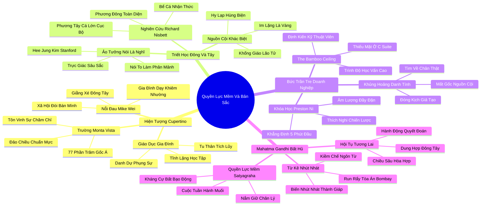

# 🗺️ BẢN ĐỒ TƯ DUY & BẢNG TRA CỨU NEO TRÍ NHỚ: CHƯƠNG TÁM - QUYỀN LỰC MỀM: NGƯỜI MỸ GỐC Á VÀ HÌNH MẪU HƯỚNG NGOẠI LÝ TƯỞNG

---

## 1. HỆ THỐNG PHẢ HỆ TRI THỨC (ACTIVE RECALL HIERARCHY)

---

## 2. BẢNG TRA CỨU NEO TRÍ NHỚ SIÊU TỐC (MEMORY ANCHOR CHEAT SHEET)

| 📑 Phần/Mục Tài Liệu | Khái Niệm / Từ Khóa Vàng | Bản Chất Cốt Lõi | Cảnh Báo Sai Lầm Thường Gặp | Hành Động Ứng Dụng Đột Phá |
| :--- | :--- | :--- | :--- | :--- |
| **Phần 1: Hiện tượng Cupertino** | **Norm Inversion** | Sự đảo chiều chuẩn mực: văn hóa học đường tôn vinh sự kỷ luật, tĩnh lặng và chiều sâu tri thức. | Coi các giá trị lễ phép, khiêm tốn của phương Đông là sự thụ động, thiếu cá tính. | Tạo lập môi trường học tập và làm việc coi trọng chất lượng tư duy hơn sự phô trương. |
| **Phần 1: Hiện tượng Cupertino** | **Bicultural Conflict** | Cuộc xung đột nội tâm giữa sự khiêm nhường gia đình và áp lực phải tự quảng bá bản thân ngoài xã hội. | Chối bỏ nguồn cội để cố gắng hòa nhập mù quáng vào các chuẩn mực ồn ào bề nổi. | Học cách tích hợp cả hai giá trị: giữ gìn chiều sâu bên trong và giao tiếp chiến lược bên ngoài. |
| **Phần 2: Triết học Đông - Tây** | **Holistic vs Analytic** | Phương Đông nhìn nhận bối cảnh tương quan toàn diện; phương Tây tập trung vào cá nhân độc lập. | Áp đặt lối tư duy nhị nguyên thắng - thua vào các mối quan hệ hợp tác dài hạn. | Xem xét toàn diện bối cảnh và cảm xúc của các bên liên quan trước khi ra quyết định. |
| **Phần 2: Triết học Đông - Tây** | **Verbalization Cost** | Ép buộc phải nói to suy nghĩ trong khi giải quyết vấn đề phức tạp làm giảm sút năng lực logic. | Nhầm lẫn giữa sự im lặng suy ngẫm với sự thiếu hiểu biết và chậm chạp. | Cho phép nhân sự có khoảng lặng độc lập để xử lý thông tin trước khi yêu cầu phát biểu. |
| **Phần 3: Bức trần tre** | **The Bamboo Ceiling** | Rào cản vô hình gạt bỏ nhân sự trầm lặng, chuyên môn cao khỏi các vị trí lãnh đạo cấp cao. | Đánh đồng kỹ năng ăn nói khéo léo tại các bữa tiệc với năng lực lãnh đạo tổ chức thực thụ. | Cải cách tiêu chí bổ nhiệm: đánh giá dựa trên tầm nhìn chiến lược và khả năng phát triển con người. |
| **Phần 3: Bức trần tre** | **Preston Ni Assertiveness** | Thích nghi chiến lược: sử dụng tư thế đĩnh đạc và khẳng định sự hiện diện trong 5 phút đầu cuộc họp. | Nghĩ rằng mình phải trở thành kẻ to tiếng, hách dịch thì mới được tôn trọng. | Sử dụng ngôn ngữ ngắn gọn, dựa trên dữ liệu xác thực và giao tiếp bằng mắt ấm áp. |
| **Phần 4: Bài học Gandhi** | **Gandhi's Armor** | Sự nhút nhát ban đầu được tôi luyện thành áo giáp bảo vệ và khả năng kiềm chế ngôn từ bậc thầy. | Than thân trách phận vì bản tính rụt rè thay vì biến nó thành sức mạnh tự chủ. | Thực hành nói ít nhưng mỗi lời thốt ra đều mang sức nặng của sự thật và lương tri. |
| **Phần 4: Bài học Gandhi** | **Satyagraha Soft Power** | Sức mạnh của chân lý và lòng kiên định bất bạo động lay động lương tri kẻ áp bức. | Dùng bạo lực, sự tức giận và đe dọa để áp đặt ý muốn lên người khác. | Dẫn dắt bằng sự chính trực, lòng trắc ẩn và sự kiên trì không lay chuyển vì đại nghĩa. |
