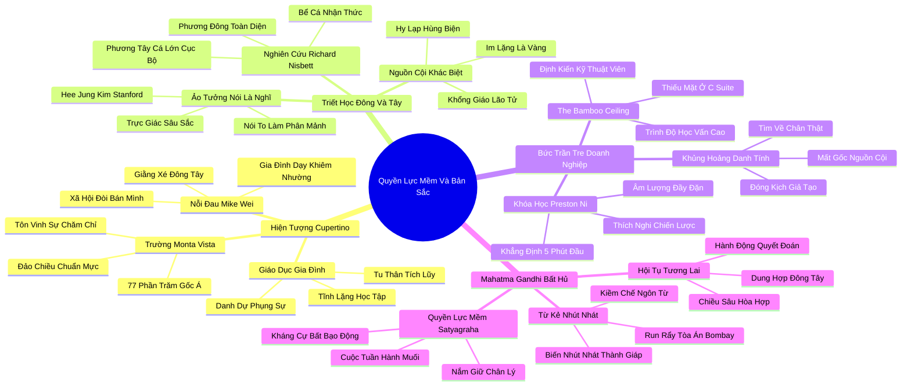

# 📖 TỔNG HỢP NỘI DUNG CHUYÊN SÂU: CHƯƠNG TÁM - QUYỀN LỰC MỀM: NGƯỜI MỸ GỐC Á VÀ HÌNH MẪU HƯỚNG NGOẠI LÝ TƯỞNG (SOFT POWER: ASIAN-AMERICANS AND THE EXTROVERT IDEAL)

### 🎯 THÔNG ĐIỆP CỐT LÕI (1 - 2 CÂU)
Hình mẫu hướng ngoại lý tưởng không phải là một chân lý phổ quát của nhân loại mà chỉ là một kiến tạo văn hóa phương Tây mang tính lịch sử; truyền thống phương Đông tôn vinh sự tĩnh lặng, khiêm nhường và quyền lực mềm (như triết lý Bất bạo động Satyagraha của Mahatma Gandhi) mang lại chiếc chìa khóa cân bằng vô giá để giải cứu thế giới hiện đại khỏi sự cuồng loạn của chủ nghĩa cá nhân ồn ào.

---

### 📊 LƯỢC ĐỒ PHÂN BỔ CẤU TRÚC TÀI LIỆU
Bảng đối chiếu cấu trúc các phần trong tài liệu gốc và số lượng luận điểm chuyên sâu được khai phóng:

| Phần / Mục Trong Tài Liệu Gốc | Trọng Tâm Phân Tích | Số Luận Điểm | Tỷ Trọng Tri Thức |
| :--- | :--- | :---: | :---: |
| **Phần 1: Mike Wei & Hiện Tượng Cupertino** | Trường trung học Monta Vista tại Thung lũng Silicon, sự va chạm giữa học sinh gốc Á và văn hóa học đường Mỹ | 3 luận điểm | 25% |
| **Phần 2: Hai Thế Giới Quan Văn Hóa: Đông vs Tây** | Khổng giáo, Đạo giáo, ngạn ngữ phương Đông ("Lời nói là bạc, im lặng là vàng") đối lập với truyền thống hùng biện Hy Lạp | 3 luận điểm | 25% |
| **Phần 3: Bức Trần Tre Trong Thế Giới Doanh Nghiệp** | The Bamboo Ceiling: người Mỹ gốc Á xuất sắc về chuyên môn nhưng bị gạt khỏi vị trí lãnh đạo, lớp học Preston Ni | 3 luận điểm | 25% |
| **Phần 4: Bài Học Bất Hủ Từ Mahatma Gandhi** | Quyền lực mềm (Soft Power), phong trào Satyagraha, sức mạnh của sự kiên định không bạo lực và tương lai cân bằng | 3 luận điểm | 25% |
| **TỔNG CỘNG** | **Toàn bộ cấu trúc Chương 8** | **12 luận điểm** | **100%** |

---

### 💡 12 LUẬN ĐIỂM CHUYÊN SÂU THEO TỪNG PHẦN TÀI LIỆU

#### 📑 PHẦN 1: MIKE WEI & HIỆN TƯỢNG CUPERTINO (THE CUPERTINO PHENOMENON)

1. **Hiện Tượng Trường Trung Học Monta Vista Tại Thủ Phủ Silicon:**
   - *Phân tích chuyên sâu:* Tại thành phố Cupertino (nơi đặt trụ sở Apple), Trường Trung học Monta Vista có tới 77% học sinh là người Mỹ gốc Á. Tại đây, định chuẩn văn hóa học đường bị đảo ngược hoàn toàn: sự ồn ào, tiệc tùng và những trò đùa bồng bột bị coi là trẻ con; thay vào đó, sự chăm chỉ, kỷ luật, tôn trọng thầy cô và thành tích học tập xuất sắc trong tĩnh lặng trở thành chuẩn mực được toàn thể học sinh kính trọng.
   - *Công cụ / Phương pháp đi kèm:* Phân Tích Đảo Chiều Chuẩn Mực Văn Hóa (Cultural Norm Inversion Diagnostic).
   - *Ví dụ thực chiến:* Học sinh Monta Vista tranh luận về các bài toán tích phân và thí nghiệm robot trong giờ giải lao thay vì bàn tán về các trận bóng bầu dục hay các buổi dạ hội khiêu vũ rộn rã.

2. **Nỗi Dằn Vặt Của Cậu Học Sinh Gốc Á Mike Wei:**
   - *Phân tích chuyên sâu:* Mike Wei – một học sinh xuất sắc, hiếu thảo và khiêm nhường – tâm sự với Susan Cain về sự giằng xé nội tâm sâu sắc: trong gia đình, cha mẹ dạy cậu phải biết lắng nghe, nhường nhịn và khiêm tốn; nhưng khi bước ra ngoài xã hội Mỹ rộng lớn, cậu liên tục nhận được thông điệp rằng nếu không biết "bán mình", không biết to tiếng tranh luận và khoe khoang thành tích, cậu sẽ mãi mãi là kẻ vô hình thất bại.
   - *Công cụ / Phương pháp đi kèm:* Ma Trận Xung Đột Nhị Nguyên Văn Hóa (Bicultural Dualism Matrix).
   - *Ví dụ thực chiến:* Mike Wei cảm thấy xấu hổ khi bị giáo viên phê vào học bạ là "quá trầm lặng, cần phải năng nổ phát biểu hơn trong lớp", dù bài thi viết của cậu luôn đạt điểm tuyệt đối.

3. **Mô Hình Nuôi Dạy Con Cái Trong Các Gia Đình Nhập Cư:**
   - *Phân tích chuyên sâu:* Các bậc phụ huynh phương Đông nhìn nhận thành công của con cái không phải là sự phô diễn cái tôi cá nhân, mà là danh dự và sự phụng sự gia đình. Sự tĩnh lặng được giáo dục như một đức tính tu dưỡng bản thân (Tự kỷ ám thị - Tu thân), rèn luyện khả năng chịu đựng gian khổ (Ăn đắng nuốt cay) để đạt tới sự tinh thông học thuật.
   - *Công cụ / Phương pháp đi kèm:* Khung Giáo Dục Gia Đình Phương Đông (Filial Piety & Quiet Rigor Model).
   - *Ví dụ thực chiến:* Những buổi tối cả gia đình quây quần trong sự im lặng tuyệt đối: con cái làm bài tập, cha mẹ đọc sách hoặc làm việc bên cạnh, không có tiếng ti vi hay tranh cãi ồn ào.

---

#### 📑 PHẦN 2: HAI THẾ GIỚI QUAN VĂN HÓA: ĐÔNG VS TÂY (EASTERN VS WESTERN CULTURAL IDEALS)

4. **Nguồn Cội Triết Học: Khổng - Đạo Phương Đông Đối Lập Hùng Biện Hy Lạp:**
   - *Phân tích chuyên sâu:* Truyền thống phương Tây bắt nguồn từ nền dân chủ Hy Lạp cổ đại và đế chế La Mã, nơi nghệ thuật Hùng biện (Rhetoric) được coi là thước đo cao nhất của công dân tự do. Ngược lại, văn hóa phương Đông chịu ảnh hưởng sâu sắc từ Khổng giáo và Đạo giáo: Đức Khổng Tử dạy "Người quân tử nhanh nhẹn trong hành động nhưng thận trọng trong lời nói"; Lão Tử khẳng định trong Đạo Đức Kinh "Người biết thì không nói, người nói thì không biết". Sự im lặng được xem là đỉnh cao của trí tuệ và sự thấu thị.
   - *Công cụ / Phương pháp đi kèm:* Bản Đồ Đối Chiếu Căn Tính Triết Học Đông - Tây (East-West Philosophical Foundations).
   - *Ví dụ thực chiến:* Ngạn ngữ phương Tây có câu "Bánh xe kêu cót két mới được tra dầu", trong khi ngạn ngữ Nhật Bản lại dạy "Chiếc đinh nào nhô lên sẽ bị búa đập xuống", và ngạn ngữ Trung Hoa nhắc nhở "Họa từ miệng mà ra".

5. **Thí Nghiệm Nhận Thức Nhìn Cảnh Vật Của Richard Nisbett:**
   - *Phân tích chuyên sâu:* Nhà tâm lý học Richard Nisbett tại Đại học Michigan chứng minh rằng người phương Tây và phương Đông nhìn thế giới bằng hai lăng kính thần kinh khác biệt: Khi cho xem một bể cá, người Mỹ tập trung ngay vào con cá lớn nhất, bơi nhanh nhất (Tư duy quy nạp, cá nhân độc lập); trong khi người châu Á nhìn vào toàn bộ khung cảnh: thực vật thủy sinh, nước, các hòn đá và mối quan hệ tương hỗ giữa đàn cá nhỏ (Tư duy toàn diện, phụ thuộc lẫn nhau).
   - *Công cụ / Phương pháp đi kèm:* Thí Nghiệm Nhận Thức Toàn Diện vs Cục Bộ (Holistic vs Analytic Cognitive Paradigm).
   - *Ví dụ thực chiến:* Trong các cuộc đàm phán kinh doanh, đối tác phương Tây muốn đi thẳng vào điều khoản tài chính then chốt; đối tác phương Đông dành thời gian xây dựng sự tin cậy, quan sát phong thái và xem xét bối cảnh dài hạn của toàn bộ mối quan hệ.

6. **Ảo Tưởng "Nói Là Nghĩ" Của Văn Hóa Phương Tây:**
   - *Phân tích chuyên sâu:* Nghiên cứu của Hee Jung Kim tại Đại học Stanford cho thấy: khi sinh viên Mỹ được yêu cầu "nói to suy nghĩ của mình trong khi giải toán" (Thinking aloud), điểm số của họ không đổi hoặc tăng nhẹ; nhưng khi sinh viên châu Á bị ép phải vừa nói vừa giải toán, điểm số của họ giảm thê thảm. Lý do: người phương Đông tư duy bằng hình tượng và cấu trúc trực giác sâu sắc trong im lặng, việc ép ngôn ngữ hóa liên tục làm phân mảnh mạch tư duy toán học của họ.
   - *Công cụ / Phương pháp đi kèm:* Thước Đo Ảnh Hưởng Phát Ngôn Lên Nhận Thức (Verbalization Cognitive Cost Index).
   - *Ví dụ thực chiến:* Ép một kỹ sư phần mềm gốc Á phải liên tục thuyết minh giải thích khi đang thiết kế cấu trúc thuật toán phức tạp sẽ làm giảm 50% hiệu suất xử lý logic của anh ta.

---

#### 📑 PHẦN 3: BỨC TRẦN TRE TRONG THẾ GIỚI TẬP ĐOÀN MỸ (THE BAMBOO CEILING)

7. **Nghịch Lý "Bức Trần Tre" (The Bamboo Ceiling):**
   - *Phân tích chuyên sâu:* Người Mỹ gốc Á là nhóm dân số có trình độ học vấn cao nhất, thu nhập bình quân hộ gia đình cao nhất nước Mỹ và chiếm tới 30-40% lực lượng kỹ sư tại Thung lũng Silicon. Thế nhưng, tại các vị trí lãnh đạo cấp cao (C-suite, Hội đồng quản trị) của các tập đoàn Fortune 500, họ chỉ chiếm vỏn vẹn chưa đầy 2%. Hiện tượng này được gọi là "Bức Trần Tre" (The Bamboo Ceiling): họ bị mặc định là "những thợ kỹ thuật giỏi nhưng thiếu tố chất lãnh đạo" chỉ vì họ không có thói quen to tiếng và thích phô trương.
   - *Công cụ / Phương pháp đi kèm:* Phân Tích Rào Cản Thăng Tiến Sắc Tộc (Bamboo Ceiling Structural Audit).
   - *Ví dụ thực chiến:* Một kỹ sư trưởng người Mỹ gốc Á có đóng góp cốt lõi cho 5 bằng sáng chế công nghệ của công ty liên tục bị bỏ qua trong đợt đề bạt Phó chủ tịch; vị trí đó được trao cho một đồng nghiệp da trắng có năng lực kỹ thuật trung bình nhưng có tài nói chuyện dí dỏm tại các bữa tiệc cocktail.

8. **Lớp Học Kỹ Năng Giao Tiếp Của Giáo Sư Preston Ni:**
   - *Phân tích chuyên sâu:* Tại Thung lũng Silicon, Giáo sư Preston Ni mở các khóa đào tạo đặc biệt nhằm giúp các chuyên gia gốc Á phá vỡ bức trần tre. Ông không dạy họ chối bỏ bản sắc văn hóa của mình, mà dạy họ "nghệ thuật thích nghi chiến lược": học cách đứng thẳng lưng, duy trì giao tiếp bằng mắt (Eye contact), mở rộng giọng nói và chủ động cất lời trong 5 phút đầu của cuộc họp để xác lập sự hiện diện tâm lý.
   - *Công cụ / Phương pháp đi kèm:* Khung Giao Tiếp Quyền Uy Thích Ứng (Strategic Assertiveness Framework).
   - *Ví dụ thực chiến:* Học viên học cách thay thế câu nói nhút nhát: "Tôi không chắc lắm nhưng có lẽ..." bằng câu khẳng định đĩnh đạc: "Dựa trên các dữ liệu phân tích số liệu tài chính quý vừa qua, đề xuất tối ưu của tôi là...".

9. **Tổn Thương Bản Sắc Khi Phải Chối Bỏ Nguồn Cội:**
   - *Phân tích chuyên sâu:* Nhiều người gốc Á cố gắng phẫu thuật thẩm mỹ nhân cách để trở nên ồn ào và hài hước như người da trắng bản địa, nhưng điều này thường dẫn đến một cuộc khủng hoảng danh tính sâu sắc. Họ cảm thấy mình như một diễn viên hạng tồi trên sân khấu cuộc đời mình, bị cô lập giữa hai thế giới: không còn là người phương Đông đích thực nhưng cũng không bao giờ hoàn toàn trở thành người Mỹ hướng ngoại theo chuẩn mực WASP.
   - *Công cụ / Phương pháp đi kèm:* Đánh Giá Xung Đột Căn Tính Văn Hóa (Cultural Identity Alienation Metric).
   - *Ví dụ thực chiến:* Những kỹ sư gốc Á tâm sự rằng họ cảm thấy kiệt quệ sau những buổi đi bar gượng gạo với sếp, và nhận ra rằng sự tôn trọng thực sự không thể xây dựng trên nền tảng của sự đóng kịch giả tạo.

---

#### 📑 PHẦN 4: BÀI HỌC BẤT HỦ TỪ MAHATMA GANDHI (MAHATMA GANDHI & SATYAGRAHA)

10. **Sự Chuyển Hóa Của Mahatma Gandhi: Từ Kẻ Nhút Nhát Đến Người Thay Đổi Lịch Sử:**
    - *Phân tích chuyên sâu:* Thuở thanh niên, Mohandas Gandhi là một người nhút nhát đến mức bệnh tật: khi làm luật sư tranh tụng tại tòa án Bombay, ông đứng dậy đọc lời bào chữa nhưng quá run rẩy đến mức không thể nói nên lời và phải bỏ chạy khỏi phòng xử án trong sự xấu hổ tột cùng. Thế nhưng, chính con người nhút nhát ấy sau này đã đánh bại Đế quốc Anh hùng mạnh nhất thế giới mà không cần sử dụng một viên đạn hay một khẩu súng.
    - *Công cụ / Phương pháp đi kèm:* Tiến Trình Chuyển Hóa Bản Năng Trầm Lặng (Gandhi's Quiet Metamorphosis).
    - *Ví dụ thực chiến:* Gandhi viết trong tự truyện: "Sự nhút nhát của tôi thực chất là một chiếc khiên và chiếc áo giáp bảo vệ tôi. Nó giúp tôi học được sự kiềm chế ngôn từ và thói quen không bao giờ nói một lời nào mà mình không thực sự suy nghĩ thấu đáo".

11. **Bản Chất Của Quyền Lực Mềm (Satyagraha - Sức Mạnh Của Chân Lý):**
    - *Phân tích chuyên sâu:* Gandhi sáng lập phong trào Satyagraha (Nắm giữ Chân lý / Kháng cự Bất bạo động). Đây là biểu hiện tối thượng của Quyền Lực Mềm (Soft Power): không dùng bạo lực cơ bắp hay tài hùng biện áp đảo để khuất phục đối phương, mà dùng sự kiên định đạo đức tuyệt đối, sự tự nguyện chịu đựng đau khổ và lòng vị tha để lay động lương tri của kẻ áp bức. Người hướng nội trầm lặng chính là những người sở hữu nguồn năng lượng Satyagraha mạnh mẽ nhất.
    - *Công cụ / Phương pháp đi kèm:* Nguyên Lý Quyền Lực Mềm Đạo Đức (Satyagraha Moral Power Framework).
    - *Ví dụ thực chiến:* Cuộc tuần hành Muối (Salt March) lịch sử năm 1930: Gandhi và hàng vạn người dân đi bộ 390 km trong im lặng trang nghiêm; khi bị lính Anh dùng dùi cui đánh đập dã dã man, đoàn người không hề đánh trả mà bình thản tiến lên, khiến toàn bộ lương tri nhân loại thức tỉnh và làm lung lay tận gốc rễ quyền thống trị của thực dân Anh.

12. **Giao Thoa Văn Hóa Và Khát Vọng Cân Bằng Của Thế Giới Tương Lai:**
    - *Phân tích chuyên sâu:* Thế kỷ 21 đòi hỏi sự dung hợp vĩ đại giữa hai nền văn minh: phương Tây cần học hỏi phương Đông sự tĩnh lặng, khiêm nhường, tính gắn kết cộng đồng và khả năng suy ngẫm sâu xa; trong khi phương Đông cần tiếp thu phương Tây kỹ năng tự khẳng định bản thân, sự minh bạch và tinh thần dám dấn thân phản biện. Sự kết hợp giữa "Quyền lực mềm" phương Đông và "Tư duy hành động" phương Tây sẽ tạo ra những nhà lãnh đạo toàn cầu đích thực.
    - *Công cụ / Phương pháp đi kèm:* Mô Hình Hội Tụ Văn Hóa Toàn Cầu (Global Cultural Convergence Model).
    - *Ví dụ thực chiến:* Các tập đoàn công nghệ đa quốc gia thành công nhất hiện nay đều sở hữu ban lãnh đạo kết hợp giữa tầm nhìn chiến lược quyết liệt phương Tây và sự điều hòa nhân tâm sâu lắng phương Đông.

---

### 🛠️ KẾ HOẠCH HÀNH ĐỘNG THỰC THI (20 HÀNH ĐỘNG)

#### TẦNG 1: HÀNH VI VI MÔ TỨC THÌ (< 2 PHÚT)
- [ ] **Quy tắc 5 phút đầu tiên:** Chủ động đóng góp 1 ý kiến ngắn gọn, sắc bén ngay trong 5 phút đầu cuộc họp để xác lập sự hiện diện.
- [ ] **Điều chỉnh tư thế quyền lực mềm:** Ngồi thẳng lưng, hai tay đặt thả lỏng trên bàn, duy trì ánh mắt ấm áp với người đối diện trong 3 giây.
- [ ] **Thay thế từ ngữ ngập ngừng:** Loại bỏ cụm từ "Tôi chỉ nghĩ là..." bằng cụm từ "Góc nhìn chuyên môn của tôi cho thấy...".
- [ ] **Tôn vinh sự im lặng chiến lược:** Khi đối phương đưa ra đề xuất bất lợi, im lặng nhìn thẳng trong 4 giây thay vì vội vã nhượng bộ.
- [ ] **Ghi nhận sự đóng góp thầm lặng:** Gửi lời cảm ơn chân thành đến người đã chuẩn bị tài liệu kỹ lưỡng cho cuộc họp dù họ không phát biểu nhiều.
- [ ] **Hít thở định tâm kiểu Gandhi:** Nhắm mắt hít một hơi thật sâu và tự nhủ: "Sức mạnh của mình nằm ở chân lý, không nằm ở âm lượng giọng nói".

#### TẦNG 2: THÓI QUEN & QUY TRÌNH TUẦN
- [ ] **Thực hành bài tập Preston Ni:** Đứng trước gương luyện tập phát âm 5 câu khẳng định chiến lược với âm lượng lồng ngực đầy đặn mỗi sáng thứ Hai.
- [ ] **Thiết lập không gian tư duy gia đình kiểu phương Đông:** Dành tối thứ Năm cả gia đình cùng đọc sách và học tập trong sự tĩnh lặng không thiết bị điện tử.
- [ ] **Lập bản đồ Quyền lực mềm trong công việc:** Xác định 3 dự án mà sự cẩn trọng, tỉ mỉ và uy tín cá nhân của bạn có thể tạo ra sức ảnh hưởng lớn hơn các cuộc vận động hành lang ồn ào.
- [ ] **Chủ động xây dựng liên minh 1-1:** Hẹn cà phê riêng với các nhân sự chủ chốt để chia sẻ góc nhìn sâu sắc thay vì cố gắng tranh cãi trong các cuộc họp đông người.
- [ ] **Theo dõi chỉ số nói vs nghe trong văn hóa nhóm:** Quan sát và ghi nhận xem văn hóa công ty có đang tạo cơ hội bình đẳng cho các tiếng nói ôn hòa hay không.
- [ ] **Đọc lại tự truyện Gandhi:** Dành 30 phút mỗi tuần chiêm nghiệm các bài học về sự tự chủ và lòng kiên định không bạo lực của Mahatma Gandhi.
- [ ] **Tập dượt từ chối với phong thái điềm đạm:** Luyện tập cách nói lời từ chối dứt khoát nhưng tràn đầy sự lịch thiệp và thấu cảm.

#### TẦNG 3: CHUYỂN HÓA CHIẾN LƯỢC DÀI HẠN
- [ ] **Phá vỡ Bức Trần Tre trong sự nghiệp:** Xây dựng lộ trình thăng tiến dựa trên việc kết hợp năng lực chuyên môn xuất chúng với kỹ năng lãnh đạo dựa trên sự lắng nghe và trao quyền.
- [ ] **Vận động cải cách tiêu chí đánh giá nhân tài:** Đưa tiêu chí "khả năng tư duy toàn diện" và "sự khiêm nhường chính trực" vào khung năng lực bổ nhiệm lãnh đạo cấp cao.
- [ ] **Tổ chức hội thảo đa dạng văn hóa (Cultural Diversity Workshop):** Chia sẻ nghiên cứu của Richard Nisbett và Susan Cain để xóa bỏ định kiến thiên vị người hoạt ngôn tại công sở.
- [ ] **Xây dựng phong cách lãnh đạo phong thái Gandhi:** Dẫn dắt đội ngũ bằng sự gương mẫu đạo đức tuyệt đối, bảo vệ sự thật và kiên trì theo đuổi mục tiêu dài hạn.
- [ ] **Dạy con cái tự hào về bản sắc văn hóa:** Giúp con hiểu rằng sự lễ phép, khiêm tốn là giá trị nhân cách cao quý, đồng thời trang bị cho con kỹ năng tự khẳng định bản thân khi ra xã hội.
- [ ] **Thiết lập mạng lưới cố vấn cho nhân sự gốc Á / hướng nội:** Tạo lập các chương trình mentoring để thế hệ đi trước truyền kinh nghiệm vượt qua các rào cản vô hình cho thế hệ trẻ.
- [ ] **Lan tỏa thông điệp Quyền lực mềm ra cộng đồng:** Viết bài hoặc chia sẻ về giá trị của sự tĩnh lặng và lòng trắc ẩn trong việc kiến tạo hòa bình và tiến bộ xã hội.

---

### ❓ BỘ CÂU HỎI TỰ NGẪM (20 CÂU HỎI)

#### NHÓM 1: TỰ VẤN NHẬN THỨC & THẤU HIỂU BẢN THÂN
1. Nền tảng văn hóa gia đình thuở nhỏ đã dạy tôi điều gì về lời nói: im lặng là vàng hay phải cất cao giọng để khẳng định cái tôi?
2. Tôi có đang cảm thấy xấu hổ hoặc tự ti về sự trầm lặng, khiêm tốn bẩm sinh của mình khi đối diện với văn hóa phương Tây thực dụng?
3. Khi bị người khác ngắt lời hoặc lấn lướt trong cuộc họp, tôi cảm thấy bất lực cam chịu hay giữ vững sự điềm tĩnh nội tâm?
4. Tôi định nghĩa "sức mạnh" là gì: khả năng áp chế người khác bằng âm lượng hay khả năng lay động lòng người bằng sự chân thành và chân lý?
5. Lần gần đây nhất tôi cố gắng đóng vai một người hoạt ngôn giả tạo là khi nào, và cơ thể tôi đã phản ứng như thế nào sau đó?

#### NHÓM 2: ĐÁNH GIÁ THỰC TRẠNG & RÀ SOÁT THÓI QUEN
6. Tại nơi làm việc của tôi, có tồn tại một "Bức trần tre" vô hình đang ngăn cản những nhân sự trầm lặng, giỏi chuyên môn bước lên nấc thang lãnh đạo?
7. Tôi có đang đánh giá thấp năng lực của một đồng nghiệp chỉ vì họ nói năng nhỏ nhẹ, khiêm tốn và không thích khoe khoang thành tích?
8. Các cuộc thảo luận chiến lược trong nhóm của tôi đang vận hành theo lối tư duy cục bộ (phương Tây) hay tư duy toàn diện mối quan hệ (phương Đông)?
9. Tôi có thói quen phát biểu ngay khi có suy nghĩ sơ khai hay luôn chờ đợi đến khi cấu trúc luận điểm hoàn thiện mới cất lời?
10. Doanh nghiệp của tôi có đang bỏ lỡ những góc nhìn sâu sắc từ các nhân sự phương Đông hoặc người hướng nội do quy chế họp hành thiên vị người nói nhanh?

#### NHÓM 3: THÁCH THỨC NIỀM TIN CŨ & PHÁ VỠ ĐỊNH KIẾN
11. Liệu hình mẫu lãnh đạo hoạt ngôn, quyết liệt của phương Tây có phải là mô hình duy nhất và tối ưu nhất cho sự phát triển của thế giới?
12. Có phải người khiêm nhường luôn là người yếu thế, hay sự khiêm nhường thực chất là biểu hiện đỉnh cao của sự tự tin sâu sắc không cần phô trương?
13. Tại sao chúng ta lại coi người nói nhiều là người thông minh trong khi ngàn đời nay các bậc thánh nhân đều ca tụng sự tĩnh lặng?
14. Mahatma Gandhi có thể giải phóng một quốc gia 400 triệu dân nếu ông cố ép mình trở thành một chính trị gia hùng biện kiểu phương Tây?
15. Liệu sự va chạm và cạnh tranh khốc liệt có thực sự thúc đẩy xã hội tốt hơn sự hòa hợp, cộng sinh và quyền lực mềm?

#### NHÓM 4: THIẾT KẾ GIẢI PHÁP & HÀNH ĐỘNG KIẾN TẠO
16. Tôi sẽ áp dụng kỹ thuật "Giao tiếp quyền uy thích ứng" của Giáo sư Preston Ni như thế nào để vừa bảo vệ bản sắc vừa khẳng định vị thế chuyên môn?
17. Làm thế nào để tôi có thể kết hợp hài hòa giữa sự kỷ luật sâu sắc phương Đông và sự chủ động sáng tạo phương Tây trong phong cách làm việc của mình?
18. Nếu tôi là người đứng đầu tổ chức, tôi sẽ thiết kế quy trình thăng tiến như thế nào để xóa bỏ hoàn toàn định kiến Bức Trần Tre?
19. Tôi có thể sử dụng sức mạnh của "Satyagraha - Nắm giữ chân lý" như thế nào để hóa giải một cuộc xung đột nan giải trong công việc hiện tại?
20. Những hành động cụ thể nào tôi có thể thực hiện để giúp thế hệ tương lai tự tin tỏa sáng bằng chính phẩm giá trầm lặng và sâu sắc của mình?

---

### 🗺️ MINDMAP 4-5 TẦNG TRỰC QUAN ĐỈNH CAO

