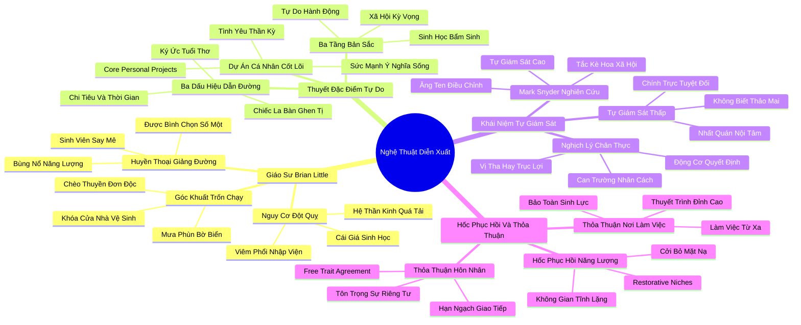

# 🗺️ BẢN ĐỒ TƯ DUY & BẢNG TRA CỨU NEO TRÍ NHỚ: CHƯƠNG CHÍN - KHI NÀO BẠN NÊN DIỄN XUẤT HƯỚNG NGOẠI HƠN CON NGƯỜI THỰC CỦA MÌNH?

---

## 1. HỆ THỐNG PHẢ HỆ TRI THỨC (ACTIVE RECALL HIERARCHY)

---

## 2. BẢNG TRA CỨU NEO TRÍ NHỚ SIÊU TỐC (MEMORY ANCHOR CHEAT SHEET)

| 📑 Phần/Mục Tài Liệu | Khái Niệm / Từ Khóa Vàng | Bản Chất Cốt Lõi | Cảnh Báo Sai Lầm Thường Gặp | Hành Động Ứng Dụng Đột Phá |
| :--- | :--- | :--- | :--- | :--- |
| **Phần 1: Brian Little** | **Pedagogical Passion** | Tình yêu thương học trò biến một người hướng nội nhút nhát thành giảng viên bùng nổ. | Ép bản thân diễn xuất liên tục không nghỉ dẫn đến kiệt quệ hệ thống miễn dịch. | Dành ra các khoảng lặng bí mật ngay sau các bài phát biểu để phục hồi năng lượng. |
| **Phần 2: Thuyết Đặc điểm Tự do** | **Free Trait Theory** | Con người có thể vượt qua giới hạn sinh học để phục vụ các Dự án Cá nhân Cốt lõi. | Nghĩ rằng tính cách sinh học là một nhà tù giam cầm mọi sự lựa chọn hành vi. | Xác định rõ ràng các Dự án Cốt lõi để kéo giãn bản thân một cách có ý thức và tự nguyện. |
| **Phần 2: Thuyết Đặc điểm Tự do** | **Core Projects Clues** | Ký ức tuổi thơ, sự ghen tị thầm kín và nhật ký thời gian là 3 dấu hiệu chỉ đường đam mê. | Đuổi theo các dự án kiếm tiền đơn thuần mà không có sự kết nối với ý nghĩa sống. | Giải mã cơn ghen tị cá nhân để tìm ra sứ mệnh nghề nghiệp đích thực của bản thân. |
| **Phần 3: Tự giám sát Snyder** | **Self-Monitoring Scale** | Người tự giám sát cao linh hoạt như tắc kè hoa; người tự giám sát thấp nhất quán kiên định. | Phán xét người linh hoạt là đạo đức giả hoặc chê người thẳng thắn là vụng về xã giao. | Tận dụng sự linh hoạt để phụng sự mục tiêu tốt đẹp, đồng thời giữ vững la bàn đạo đức. |
| **Phần 3: Tự giám sát Snyder** | **Authentic Motivation** | Diễn xuất vì tình yêu và đại nghĩa là lòng can trường; diễn xuất vì tư lợi là sự lừa dối. | Cảm thấy tội lỗi khi phải tỏ ra hoạt bát để động viên con cái hoặc đồng đội. | Tự hào về khả năng kéo giãn bản thân vì những người và lý tưởng mình trân quý. |
| **Phần 4: Hốc phục hồi** | **Restorative Niches** | Không gian hoặc thời gian tĩnh lặng bắt buộc để cởi bỏ mặt nạ và nạp lại pin sinh học. | Xếp lịch trình làm việc và giao lưu dày đặc không có lấy một khe hở để thở. | Khóa chết ít nhất 30-45 phút mỗi ngày làm ốc đảo tĩnh lặng không bị ai làm phiền. |
| **Phần 4: Thỏa thuận Đặc điểm** | **Free Trait Agreement** | Hợp đồng hòa hợp: đàm phán rõ ràng hạn ngạch tiệc tùng đổi lấy sự tôn trọng khoảng lặng riêng. | Để sự bất đồng về nhu cầu giao tiếp tích tụ thành những cuộc chiến tranh lạnh triền miên. | Ngồi lại cùng bạn đời lập thỏa thuận cụ thể về số buổi xã giao tối đa trong mỗi tuần. |
