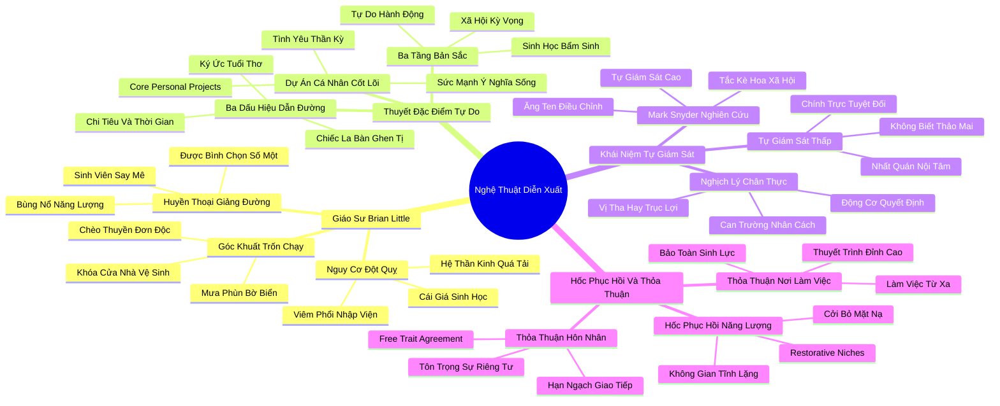

# 📖 TỔNG HỢP NỘI DUNG CHUYÊN SÂU: CHƯƠNG CHÍN - KHI NÀO BẠN NÊN DIỄN XUẤT HƯỚNG NGOẠI HƠN CON NGƯỜI THỰC CỦA MÌNH? (WHEN SHOULD YOU ACT MORE EXTROVERTED THAN YOU REALLY ARE?)

### 🎯 THÔNG ĐIỆP CỐT LÕI (1 - 2 CÂU)
Theo Lý thuyết Đặc điểm Tự do (Free Trait Theory), chúng ta hoàn toàn có thể và nên diễn xuất như một người hướng ngoại vì những "Dự án cá nhân cốt lõi" (Core Personal Projects) và những người mà ta hết mực yêu thương; tuy nhiên, điều kiện sống còn để không bị hủy hoại tâm lý là phải thiết lập các "Thỏa thuận đặc điểm tự do" và bảo vệ nghiêm ngặt các "Hốc phục hồi năng lượng" (Restorative Niches).

---

### 📊 LƯỢC ĐỒ PHÂN BỔ CẤU TRÚC TÀI LIỆU
Bảng đối chiếu cấu trúc các phần trong tài liệu gốc và số lượng luận điểm chuyên sâu được khai phóng:

| Phần / Mục Trong Tài Liệu Gốc | Trọng Tâm Phân Tích | Số Luận Điểm | Tỷ Trọng Tri Thức |
| :--- | :--- | :---: | :---: |
| **Phần 1: Giáo Sư Brian Little Tại Harvard** | Giảng viên tâm lý học huyền thoại được sinh viên cuồng nhiệt, nghịch lý trốn vào nhà vệ sinh và chèo thuyền đơn độc | 3 luận điểm | 25% |
| **Phần 2: Lý Thuyết Đặc Điểm Tự Do (Free Trait Theory)** | Ba bản sắc tính cách: Cố định (Biogenic), Xã hội (Sociogenic), Tự do (Idiosyncratic) & Dự án cá nhân cốt lõi | 3 luận điểm | 25% |
| **Phần 3: Khái Niệm Tự Giám Sát & Sự Chân Thực** | Mark Snyder: High Self-Monitors vs Low Self-Monitors, ranh giới giữa linh hoạt thích nghi và sự lừa dối bản thân | 3 luận điểm | 25% |
| **Phần 4: Hốc Phục Hồi & Thỏa Thuận Đặc Điểm Tự Do** | Restorative Niches, The Free Trait Agreement trong hôn nhân và công sở, gìn giữ sinh lực bền vững | 3 luận điểm | 25% |
| **TỔNG CỘNG** | **Toàn bộ cấu trúc Chương 9** | **12 luận điểm** | **100%** |

---

### 💡 12 LUẬN ĐIỂM CHUYÊN SÂU THEO TỪNG PHẦN TÀI LIỆU

#### 📑 PHẦN 1: GIÁO SƯ BRIAN LITTLE TẠI HARVARD (PROFESSOR BRIAN LITTLE AT HARVARD)

1. **Hiện Tượng Giảng Đường Huyền Thoại Của Brian Little:**
   - *Phân tích chuyên sâu:* Giáo sư Brian Little là một huyền thoại giảng dạy tại Đại học Harvard, từng được sinh viên bình chọn là giáo sư được yêu thích nhất. Trên bục giảng, ông là một quả bom năng lượng: nhảy múa, kể chuyện cười, diễn kịch, tung hứng micro và truyền cảm hứng say mê đến mức hàng trăm sinh viên đứng dậy vỗ tay vang dội sau mỗi tiết học. Bất kỳ ai nhìn vào cũng đinh ninh rằng ông là người hướng ngoại bẩm sinh cuồng nhiệt nhất thế giới.
   - *Công cụ / Phương pháp đi kèm:* Hiện Tượng Trình Diễn Giảng Đường Đỉnh Cao (Pedagogical Theatricality Paradigm).
   - *Ví dụ thực chiến:* Sinh viên xếp hàng dài từ sáng sớm để đăng ký vào lớp học của Brian Little, và các bài giảng của ông luôn tràn ngập tiếng cười sảng khoái và sự phấn khích tột độ.

2. **Góc Khuất Đằng Sau Sân Khấu: Sự Trốn Chạy Về Tĩnh Lặng:**
   - *Phân tích chuyên sâu:* Ngay khi bài giảng kết thúc, một thực tế hoàn toàn trái ngược diễn ra: Brian Little lập tức lẩn tránh các lời mời dự tiệc, trốn vào buồng nhà vệ sinh khóa trái cửa, hoặc đi bộ một mình ra bờ sông chèo thuyền kayak đơn độc giữa làn nước lạnh giá để nạp lại năng lượng. Thực chất, ông là một người hướng nội bẩm sinh có mức độ nhạy cảm thần kinh cực cao.
   - *Công cụ / Phương pháp đi kèm:* Chỉ Số Thâm Hụt Năng Lượng Sau Trình Diễn (Post-Performance Depletion Metric).
   - *Ví dụ thực chiến:* Khi được một hiệp hội quân đội mời thuyết trình tại một hòn đảo xa xôi, sau bài phát biểu bùng nổ, Little đã trốn ra bờ biển ngồi một mình suốt 5 tiếng đồng hồ dưới trời mưa phùn chỉ để tìm lại sự bình yên nội tâm.

3. **Cái Giá Của Việc Cưỡng Ép Bản Thể Quá Ngưỡng:**
   - *Phân tích chuyên sâu:* Nếu một người hướng nội liên tục diễn xuất hướng ngoại mà không có thời gian nghỉ ngơi, hệ thống thần kinh giao cảm sẽ bị đẩy vào trạng thái kiệt quệ mãn tính, dẫn đến suy giảm hệ miễn dịch, rối loạn lo âu và các bệnh lý thực thể nghiêm trọng. Brian Little từng phải nhập viện vì viêm phổi nặng và kiệt sức do kéo dài lịch trình giảng dạy dày đặc.
   - *Công cụ / Phương pháp đi kèm:* Cảnh Báo Nguy Cơ Đột Quỵ Thần Kinh (Autonomic Burnout Warning System).
   - *Ví dụ thực chiến:* Little thừa nhận có những giai đoạn ông cảm thấy cơ thể mình như một cỗ máy cạn kiệt dầu nhờn, mỗi bước đi ra bục giảng là một cuộc chiến sinh tử với chính hệ miễn dịch đang rệu rã của mình.

---

#### 📑 PHẦN 2: LÝ THUYẾT ĐẶC ĐIỂM TỰ DO (FREE TRAIT THEORY & CORE PROJECTS)

4. **Ba Tầng Bản Sắc Của Lý Thuyết Đặc Điểm Tự Do:**
   - *Phân tích chuyên sâu:* Brian Little sáng lập ra "Lý thuyết Đặc điểm Tự do" (Free Trait Theory) mang tính cách mạng, phân chia bản sắc con người thành 3 tầng bản chất:
     - **Bản tính sinh học (Biogenic Identity):** Cấu trúc gen và hệ thần kinh bẩm sinh (hướng nội hay hướng ngoại nguyên thủy).
     - **Bản tính xã hội (Sociogenic Identity):** Những quy chuẩn, kỳ vọng và áp lực văn hóa mà gia đình và xã hội nhào nặn nên.
     - **Bản tính tự do (Idiosyncratic Identity):** Những hành vi và vai trò mà chúng ta tự nguyện lựa chọn để phục vụ cho các "Dự án cá nhân cốt lõi".
   - *Công cụ / Phương pháp đi kèm:* Khung Phân Tầng Tam Nguyên Tính Cách (Tripartite Personality Structure).
   - *Ví dụ thực chiến:* Về mặt sinh học (Biogenic), bạn là người hướng nội thích đọc sách; về mặt xã hội (Sociogenic), bạn học cách cư xử lịch sự ở công sở; nhưng về mặt tự do (Idiosyncratic), bạn sẵn sàng đứng lên sân khấu tranh đấu cho quyền lợi bệnh nhân hiểm nghèo.

5. **Sức Mạnh Cứu Rỗi Của "Dự Án Cá Nhân Cốt Lõi" (Core Personal Projects):**
   - *Phân tích chuyên sâu:* Dự án cá nhân cốt lõi là những mục tiêu, đam mê hoặc trách nhiệm sâu sắc mà một người coi là ý nghĩa sống của đời mình (như chăm sóc con cái, nghiên cứu một đề tài khoa học, phụng sự một lý tưởng đạo đức). Tình yêu thương và sự tận hiến cho Dự án Cốt lõi cung cấp nguồn nhiên liệu tâm lý thần kỳ, cho phép chúng ta vượt qua giới hạn sinh học bẩm sinh để diễn xuất như một người hoàn toàn khác mà không cảm thấy giả tạo.
   - *Công cụ / Phương pháp đi kèm:* Ma Trận Xác Định Dự Án Cá Nhân Cốt Lõi (Core Personal Project Matrix).
   - *Ví dụ thực chiến:* Brian Little vượt qua nỗi sợ đám đông để trở thành một giảng viên rực lửa bởi vì "Dự án cá nhân cốt lõi" của ông là tình yêu thương vô bờ bến dành cho sinh viên và sứ mệnh truyền thụ tri thức tâm lý học.

6. **Phương Pháp 3 Bước Nhận Diện Dự Án Cốt Lõi:**
   - *Phân tích chuyên sâu:* Làm thế nào để biết đâu là Dự án Cốt lõi đích thực của bạn? Susan Cain đề xuất 3 dấu hiệu dẫn đường:
     - **Hồi tưởng lại thời thơ ấu:** Bạn từng say mê làm điều gì nhất trước khi xã hội bắt đầu phán xét bạn?
     - **Quan sát sự ghen tị:** Bạn thầm ghen tị với công việc hoặc thành tựu của ai? Sự ghen tị là chiếc la bàn chỉ thẳng vào khao khát sâu kín nhất của bạn.
     - **Rà soát nhật ký chi tiêu và thời gian:** Bạn tự nguyện chi tiền và dành thời gian rảnh rỗi cho lĩnh vực nào mà không cần ai thúc ép?
   - *Công cụ / Phương pháp đi kèm:* Bộ Công Cụ Truy Vết Đam Mê Ẩn Sâu (Core Project Discovery Toolkit).
   - *Ví dụ thực chiến:* Susan Cain từng là một luật sư Phố Wall kiếm nhiều tiền nhưng luôn cảm thấy trống rỗng; khi nhận ra mình ghen tị với các nhà văn tự do ngồi viết sách trong quán cà phê, bà hiểu rằng viết lách mới là Dự án Cốt lõi của đời mình.

---

#### 📑 PHẦN 3: KHÁI NIỆM TỰ GIÁM SÁT & SỰ CHÂN THỰC (SELF-MONITORING & AUTHENTICITY)

7. **Thang Đo Tự Giám Sát Của Nhà Tâm Lý Học Mark Snyder:**
   - *Phân tích chuyên sâu:* Giáo sư Mark Snyder tại Đại học Minnesota phát triển khái niệm "Mức độ Tự giám sát" (Self-Monitoring):
     - **Người tự giám sát cao (High Self-Monitors):** Giống như những chú tắc kè hoa, họ có ăng-ten xã hội siêu nhạy, liên tục quan sát tín hiệu của người xung quanh để điều chỉnh hành vi, giọng điệu và cử chỉ cho phù hợp hoàn hảo với bối cảnh.
     - **Người tự giám sát thấp (Low Self-Monitors):** Luôn hành động nhất quán theo đúng cảm xúc và giá trị nội tâm của mình trong mọi hoàn cảnh, bất chấp việc điều đó có thể làm mất lòng người khác.
   - *Công cụ / Phương pháp đi kèm:* Thang Đo Tự Giám Sát Snyder (Snyder Self-Monitoring Scale).
   - *Ví dụ thực chiến:* Trong một bữa tiệc ngoại giao, người tự giám sát cao có thể nói chuyện vui vẻ với 10 nhóm người thuộc các quan điểm chính trị trái ngược nhau; người tự giám sát thấp sẽ im lặng hoặc tranh luận nảy lửa nếu ai đó nói điều trái với lương tâm họ.

8. **Nghịch Lý Chân Thực: Linh Hoạt Thích Nghi Hay Lừa Dối Bản Thân?:**
   - *Phân tích chuyên sâu:* Liệu việc "diễn xuất hướng ngoại" có biến chúng ta thành những kẻ đạo đức giả? Câu trả lời phụ thuộc vào ĐỘNG CƠ: Nếu bạn diễn xuất vì mục đích thao túng, tư lợi cá nhân hoặc để đánh bóng cái tôi rỗng tuếch, đó là sự giả tạo. Nhưng nếu bạn kéo giãn bản thân nhân danh một Dự án Cá nhân Cốt lõi và vì tình yêu thương những người thân yêu, thì đó là biểu hiện cao nhất của lòng vị tha và sự can trường nhân cách.
   - *Công cụ / Phương pháp đi kèm:* Thước Đo Tính Chân Thực Động Cơ (Motivational Authenticity Gauge).
   - *Ví dụ thực chiến:* Một người cha hướng nội mệt mỏi nhưng vẫn hào hứng tổ chức trò chơi cho sinh nhật con gái không phải là kẻ giả tạo; ông đang hành động với tư cách một người cha tận tụy xuất phát từ tình yêu thương thuần khiết nhất.

9. **Tận Dụng Năng Lực Của Người Tự Giám Sát Thấp:**
   - *Phân tích chuyên sâu:* Những người tự giám sát thấp thường gặp khó khăn trong các trò chơi chính trị công sở, nhưng họ lại sở hữu một tài sản vô giá: sự chính trực không thể lay chuyển (Unyielding Integrity). Mọi người luôn biết chính xác họ đứng ở đâu, tin tưởng tuyệt đối vào lời nói của họ vì họ không bao giờ nói một đằng làm một nẻo.
   - *Công cụ / Phương pháp đi kèm:* Chiến Lược Xây Dựng Uy Tín Dựa Trên Tính Nhất Quán (Integrity-Driven Influence).
   - *Ví dụ thực chiến:* Các chuyên gia kiểm toán hoặc thẩm phán xuất sắc nhất thường là những người tự giám sát thấp, bởi vì họ không bao giờ bẻ cong nguyên tắc pháp luật chỉ để làm vừa lòng đám đông.

---

#### 📑 PHẦN 4: HỐC PHỤC HỒI & THỎA THUẬN ĐẶC ĐIỂM TỰ DO (RESTORATIVE NICHES & AGREEMENTS)

10. **Thiết Lập Các "Hốc Phục Hồi Năng Lượng" (Restorative Niches) Bất Khả Xâm Phạm:**
    - *Phân tích chuyên sâu:* Để có thể diễn xuất hướng ngoại bền bỉ trong các Dự án Cốt lõi, mỗi cá nhân phải xây dựng cho mình những "Hốc phục hồi" (Restorative Niches). Đây là không gian vật lý (một căn phòng nhỏ, một góc vườn, một chiếc bàn làm việc đóng kín) hoặc một khoảng thời gian (buổi sáng sớm, giờ đi dạo một mình) nơi bạn được hoàn toàn cởi bỏ chiếc mặt nạ xã hội và quay về với bản tính sinh học tự nhiên của mình.
    - *Công cụ / Phương pháp đi kèm:* Quy Trình Thiết Kế Hốc Phục Hồi Cá Nhân (Restorative Niche Design Protocol).
    - *Ví dụ thực chiến:* Sau một phiên điều trần căng thẳng kéo dài 3 tiếng, Esther luôn dành ra 30 phút ngồi trong một quán cà phê vắng vẻ, nhâm nhi một tách trà nóng và đọc một cuốn tiểu thuyết yêu thích trước khi quay lại văn phòng luật.

11. **"Thỏa Thuận Đặc Điểm Tự Do" (The Free Trait Agreement) Trong Gia Đình:**
    - *Phân tích chuyên sâu:* Xung đột lớn nhất giữa các cặp đôi có tính cách đối lập (một người hướng nội, một người hướng ngoại) là sự bất đồng về mức độ giao tiếp xã hội. Giải pháp mang tính đột phá là xác lập một "Thỏa thuận Đặc điểm Tự do": Hai bên ngồi lại đàm phán rõ ràng về số lượng sự kiện xã hội mà người hướng nội cam kết tham gia vui vẻ, đổi lại người hướng ngoại cam kết tôn trọng quyền được ở nhà nghỉ ngơi của đối phương trong các ngày còn lại.
    - *Công cụ / Phương pháp đi kèm:* Mẫu Hợp Đồng Hôn Nhân Về Giao Tiếp Xã Hội (Marital Social Quota Contract).
    - *Ví dụ thực chiến:* Một cặp đôi thỏa thuận: người chồng hướng nội đồng ý đi dự tiệc cùng vợ vào tối thứ Bảy mỗi hai tuần một lần (và ở đó suốt 2 tiếng không phàn nàn); đổi lại, tối thứ Sáu hàng tuần là khoảng thời gian riêng tư thiêng liêng của anh tại phòng đọc sách mà không bị ai làm phiền.

12. **Thỏa Thuận Đặc Điểm Tự Do Tại Nơi Làm Việc:**
    - *Phân tích chuyên sâu:* Tại công sở, nhân viên hướng nội hoàn toàn có thể chủ động thương lượng Thỏa thuận Đặc điểm Tự do với cấp trên: cam kết hoàn thành xuất sắc các buổi thuyết trình và họp chiến lược của công ty, đổi lại đề xuất được làm việc độc lập tại nhà 1-2 ngày mỗi tuần hoặc được miễn trừ khỏi các buổi ăn trưa xã giao không bắt buộc.
    - *Công cụ / Phương pháp đi kèm:* Quy Trình Đàm Phán Ranh Giới Công Sở (Workplace Boundary Negotiation Template).
    - *Ví dụ thực chiến:* Một lập trình viên cao cấp thỏa thuận với Giám đốc Công nghệ: anh sẽ trực tiếp trình bày giải pháp kiến trúc phần mềm trước Hội đồng Quản trị mỗi tháng một lần, nhưng được phép đeo tai nghe và không tham gia các cuộc trò chuyện phiếm trong giờ làm việc hàng ngày.

---

### 🛠️ KẾ HOẠCH HÀNH ĐỘNG THỰC THI (20 HÀNH ĐỘNG)

#### TẦNG 1: HÀNH VI VI MÔ TỨC THÌ (< 2 PHÚT)
- [ ] **Nhận diện Dự án Cốt lõi tức thì:** Khi chuẩn bị bước vào một cuộc giao tiếp khó khăn, tự nhủ: "Mình đang làm điều này vì ai / vì mục tiêu ý nghĩa nào?".
- [ ] **Kích hoạt Hốc phục hồi vi mô:** Nhắm mắt tựa lưng vào ghế, thở sâu 5 nhịp ngay tại bàn làm việc sau khi kết thúc một cuộc gọi điện thoại dài.
- [ ] **Kiểm tra mức độ tắc kè hoa:** Tự hỏi nhanh: "Mình đang điều chỉnh hành vi vì lịch sự hay đang hoàn toàn đánh mất chính mình?".
- [ ] **Rút lui lịch thiệp khi quá tải:** Sử dụng câu nói chuẩn: "Tôi xin phép ra ngoài hít thở chút không khí trong lành trong 5 phút".
- [ ] **Tháo bỏ mặt nạ nụ cười gượng:** Thả lỏng toàn bộ cơ hàm và khóe mắt ngay khi bước vào thang máy một mình.
- [ ] **Ghi nhận nỗ lực kéo giãn bản thân:** Tự thưởng cho bản thân một lời khen ngợi sau khi hoàn thành một bài phát biểu quan trọng.

#### TẦNG 2: THÓI QUEN & QUY TRÌNH TUẦN
- [ ] **Rà soát danh mục Dự án Cá nhân Cốt lõi:** Viết ra giấy 3 dự án ý nghĩa nhất hiện tại của cuộc đời bạn và đánh giá mức độ ưu tiên thời gian cho chúng.
- [ ] **Đàm phán hạn ngạch tiệc tùng tuần:** Thống nhất với bạn đời vào sáng thứ Hai về số lượng buổi tối xã giao tối đa trong tuần (khuyến nghị: không quá 2 buổi).
- [ ] **Xây dựng Hốc Phục Hồi cố định chiều thứ Sáu:** Khóa chết khung giờ 16:00 - 18:00 chiều thứ Sáu để dọn dẹp bàn làm việc, nghe nhạc không lời và tổng kết tuần.
- [ ] **Lập nhật ký ghen tị (Envy Journal):** Ghi lại bất kỳ khoảnh khắc ghen tị nào xuất hiện trong tuần để giải mã khao khát nghề nghiệp tiềm ẩn.
- [ ] **Tập dượt đóng vai hướng ngoại có kiểm soát:** Thực hành kéo giãn bản thân trong một cuộc họp nhóm 30 phút rồi rút lui về tĩnh lặng ngay sau đó.
- [ ] **Bảo vệ ngày Chủ nhật tĩnh lặng tuyệt đối:** Dành trọn vẹn ngày Chủ nhật cho các hoạt động tái tạo nội lực: đọc sách, nấu ăn, đi bộ thiên nhiên.
- [ ] **Đánh giá thang điểm tự giám sát của bản thân:** Tự làm bài test Snyder để thấu hiểu mức độ tắc kè hoa xã hội của chính mình.

#### TẦNG 3: CHUYỂN HÓA CHIẾN LƯỢC DÀI HẠN
- [ ] **Thiết lập "Thỏa thuận Đặc điểm Tự do" chính thức trong hôn nhân:** Soạn thảo và ký kết một thỏa thuận bằng văn bản với bạn đời về sự cân bằng giữa xã giao và tĩnh lặng.
- [ ] **Tái cấu trúc sự nghiệp xoay quanh Dự án Cốt lõi:** Can đảm từ bỏ những công việc đòi hỏi phải diễn xuất hướng ngoại 24/7 nhưng không mang lại ý nghĩa sâu sắc cho tâm hồn.
- [ ] **Đàm phán chế độ làm việc linh hoạt (Hybrid Work):** Đề xuất chính thức với ban lãnh đạo về quyền được làm việc từ xa định kỳ để bảo vệ các Hốc Phục Hồi.
- [ ] **Xây dựng thương hiệu cá nhân dựa trên Tính Chân Thực:** Phát triển phong cách lãnh đạo chân thực (Authentic Leadership) thay vì cố gắng bắt chước các hình mẫu hướng ngoại sáo rỗng.
- [ ] **Bảo vệ sức khỏe miễn dịch lâu dài:** Nhận thức rõ ràng mối liên hệ giữa việc ép buộc tính cách quá mức và nguy cơ suy giảm miễn dịch để chủ động phòng ngừa bệnh tật.
- [ ] **Truyền cảm hứng về Thuyết Đặc điểm Tự do:** Chia sẻ mô hình của Brian Little cho bạn bè và đồng nghiệp để giúp họ giải phóng mặc cảm tội lỗi khi cần ở một mình.
- [ ] **Làm chủ nghệ thuật chuyển đổi linh hoạt:** Rèn luyện năng lực thoăn thoắt bước lên sân khấu khi Dự án Cốt lõi kêu gọi và thanh thản rút lui về ốc đảo khi nhiệm vụ hoàn thành.

---

### ❓ BỘ CÂU HỎI TỰ NGẪM (20 CÂU HỎI)

#### NHÓM 1: TỰ VẤN NHẬN THỨC & THẤU HIỂU BẢN THÂN
1. Tôi có đang cảm thấy kiệt quệ và trống rỗng vì phải liên tục đóng vai một người vui vẻ, hoạt bát trái ngược với bản chất tự nhiên?
2. Đâu là những "Dự án cá nhân cốt lõi" thực sự xứng đáng để tôi chấp nhận kéo giãn bản thân bước ra khỏi vùng an toàn?
3. Tôi là một người "tự giám sát cao" (dễ dàng biến hóa như tắc kè hoa) hay một người "tự giám sát thấp" (luôn giữ nguyên một phong thái)?
4. Khi tôi diễn xuất hướng ngoại, động cơ thực sự của tôi là gì: vì tình yêu thương và sứ mệnh ý nghĩa, hay vì nỗi sợ bị chê cười và tẩy chay?
5. Những hoạt động nào giúp tôi nạp lại năng lượng sinh học nhanh nhất và hiệu quả nhất sau một ngày dài kiệt sức?

#### NHÓM 2: ĐÁNH GIÁ THỰC TRẠNG & RÀ SOÁT THÓI QUEN
6. Lịch trình sinh hoạt hiện tại của tôi có đang dành đủ không gian cho các "Hốc phục hồi năng lượng" hay tôi đang bị cuốn vào các sự kiện liên miên?
7. Trong mối quan hệ với bạn đời hoặc gia đình, chúng tôi đã có một "Thỏa thuận đặc điểm tự do" rõ ràng hay vẫn liên tục tranh cãi về việc đi chơi hay ở nhà?
8. Công việc hiện tại có đang cho phép tôi được cởi bỏ chiếc mặt nạ xã giao vào cuối ngày, hay nó đòi hỏi tôi phải thường trực duy trì hình ảnh hào nhoáng?
9. Tôi đã từng bao nhiêu lần trải qua cảm giác cơ thể suy sụp (ốm sốt, viêm họng, mất ngủ) ngay sau những đợt phải giao tiếp quá tải?
10. Tôi có đang ghen tị với sự tự do và thanh thản của một ai đó, và sự ghen tị đó đang mách bảo điều gì về con đường tôi thực sự muốn đi?

#### NHÓM 3: THÁCH THỨC NIỀM TIN CŨ & PHÁ VỠ ĐỊNH KIẾN
11. Liệu việc diễn xuất hướng ngoại vì những người mình yêu thương có đồng nghĩa với việc sống giả tạo và đánh mất chính mình?
12. Có phải một người hướng nội thực thụ thì không bao giờ được phép đứng lên sân khấu tỏa sáng và truyền cảm hứng trước đám đông?
13. Tại sao chúng ta lại coi việc muốn ở một mình vào tối thứ Sáu là một biểu hiện của sự lập dị hoặc ích kỷ trong tình yêu?
14. Brian Little có thể trở thành một giáo sư được yêu quý bậc nhất nếu ông kiên quyết từ chối diễn xuất vì sinh viên của mình?
15. Liệu tính cách con người là một khối đá hoa cương bất biến hay là một tập hợp các công cụ linh hoạt phục vụ cho những mục đích cao cả?

#### NHÓM 4: THIẾT KẾ GIẢI PHÁP & HÀNH ĐỘNG KIẾN TẠO
16. Tôi sẽ thiết kế những "Hốc phục hồi năng lượng" cụ thể nào trong ngôi nhà và nơi làm việc của mình ngay trong tuần này?
17. Những điều khoản cụ thể nào cần có trong "Thỏa thuận đặc điểm tự do" mà tôi sẽ đàm phán với bạn đời vào cuối tuần này?
18. Làm thế nào để tôi có thể kết nối công việc chuyên môn hàng ngày với một Dự án Cá nhân Cốt lõi để tìm lại niềm cảm hứng phụng sự?
19. Tôi sẽ thiết lập ranh giới giao tiếp như thế nào tại công sở để cấp trên tôn trọng quyền được làm việc tập trung sâu của tôi?
20. Kế hoạch từng bước nào sẽ giúp tôi chuyển đổi dần từ một công việc vắt kiệt năng lượng sang một sự nghiệp phụng sự đúng với bản sắc đích thực của mình?

---

### 🗺️ MINDMAP 4-5 TẦNG TRỰC QUAN ĐỈNH CAO

