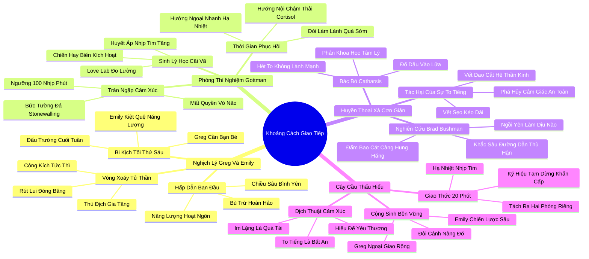

# 🗺️ BẢN ĐỒ TƯ DUY & BẢNG TRA CỨU NEO TRÍ NHỚ: CHƯƠNG MƯỜI - KHOẢNG CÁCH GIAO TIẾP: NGHỆ THUẬT TRÒ CHUYỆN VỚI NGƯỜI THUỘC TÍNH CÁCH ĐỐI LẬP

---

## 1. HỆ THỐNG PHẢ HỆ TRI THỨC (ACTIVE RECALL HIERARCHY)

---

## 2. BẢNG TRA CỨU NEO TRÍ NHỚ SIÊU TỐC (MEMORY ANCHOR CHEAT SHEET)

| 📑 Phần/Mục Tài Liệu | Khái Niệm / Từ Khóa Vàng | Bản Chất Cốt Lõi | Cảnh Báo Sai Lầm Thường Gặp | Hành Động Ứng Dụng Đột Phá |
| :--- | :--- | :--- | :--- | :--- |
| **Phần 1: Greg và Emily** | **Demand-Withdraw** | Vòng xoáy công kích và rút lui: càng bị thúc ép nói, người hướng nội càng im lặng phòng thủ. | Cố gắng bám đuổi và dồn đối phương vào chân tường để bắt trả lời ngay lập tức. | Dừng lại ngay khi nhận thấy đối phương đang đóng băng và rút lui về phòng thủ. |
| **Phần 1: Greg và Emily** | **Friday Night Dilemma** | Xung đột năng lượng cuối tuần: người hướng ngoại cần tiệc tùng, người hướng nội cần tĩnh lặng. | Xem nhu cầu nghỉ ngơi tĩnh lặng của bạn đời là sự ích kỷ hoặc hết yêu thương. | Lên kế hoạch dung hòa từ trước: tham gia có chọn lọc và tôn trọng khoảng lặng của nhau. |
| **Phần 2: Gottman Love Lab** | **Emotional Flooding** | Nhịp tim vượt ngưỡng 100 bpm khiến vỏ não mất kiểm soát và kích hoạt phản xạ sinh tồn. | Cố gắng tranh luận lý lẽ khi cơ thể đang trong trạng thái báo động đỏ sinh học. | Đo nhịp tim và tạm dừng cuộc nói chuyện ngay khi nhận thấy cơ thể bị kích động. |
| **Phần 2: Gottman Love Lab** | **Asymmetric Recovery** | Người hướng nội cần nhiều thời gian hơn (30-60 phút) để đào thải hormone căng thẳng ra khỏi máu. | Ép đối phương phải ôm làm lành ngay lập tức khi hệ thần kinh của họ chưa kịp hạ nhiệt. | Kiên nhẫn cho đối phương không gian riêng tư để nhịp tim trở lại trạng thái bình thường. |
| **Phần 3: Huyền thoại Catharsis** | **Venting Fallacy (Bushman)** | Xả cơn giận bằng la hét và to tiếng không hề làm dịu đi mà chỉ khắc sâu thêm sự thù địch. | Tin rằng to tiếng cãi vã kịch liệt là một cách giải tỏa cảm xúc lành mạnh trong tình yêu. | Thay thế việc xả giận bằng sự tĩnh lặng làm dịu nhịp thở và cơ thể. |
| **Phần 3: Huyền thoại Catharsis** | **Decibel Trauma** | Tiếng quát tháo có sức tàn phá dữ dội lên hệ thần kinh nhạy cảm của người hướng nội. | Cho rằng việc to tiếng chỉ là phong cách nói chuyện bình thường không gây hại. | Cam kết duy trì tông giọng ôn hòa và loại bỏ vĩnh viễn thói quen quát tháo trong gia đình. |
| **Phần 4: Cây cầu thấu hiểu** | **20-Minute Time-Out** | Tạm dừng cuộc đối thoại đúng 20 phút để sinh lý hạ nhiệt trước khi quay lại nói chuyện. | Bỏ đi một cách giận dữ mà không hẹn giờ quay lại, khiến đối phương cảm thấy bị bỏ rơi. | Nói lời cam kết: "Anh/em cần 20 phút để bình tĩnh lại, sau đó chúng ta sẽ tiếp tục nói chuyện". |
| **Phần 4: Cây cầu thấu hiểu** | **Emotional Translation** | Hiểu sự im lặng là quá tải cần bảo vệ, và hiểu sự bồn chồn là khao khát kết nối. | Phán xét hành vi của người khác bằng lăng kính tính cách của chính mình. | Sử dụng từ điển dịch thuật cảm xúc để thấu cảm sâu sắc những nhu cầu ẩn sau hành vi. |
