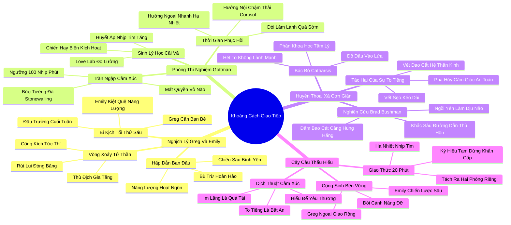

# 📖 TỔNG HỢP NỘI DUNG CHUYÊN SÂU: CHƯƠNG MƯỜI - KHOẢNG CÁCH GIAO TIẾP: NGHỆ THUẬT TRÒ CHUYỆN VỚI NGƯỜI THUỘC TÍNH CÁCH ĐỐI LẬP (THE COMMUNICATION GAP)

### 🎯 THÔNG ĐIỆP CỐT LÕI (1 - 2 CÂU)
Khoảng cách giao tiếp giữa người hướng nội và hướng ngoại bắt nguồn từ sự khác biệt sinh học trong cách xử lý xung đột và kích thích thần kinh; thay vì để sự "tràn ngập cảm xúc" (Emotional Flooding) biến thành bạo lực ngôn từ hay sự rút lui lạnh lùng, chìa khóa hòa hợp tối thượng là thấu hiểu cơ chế giải tỏa của đối phương và cùng nhau xây dựng cây cầu giao tiếp tôn trọng nhịp thở của nhau.

---

### 📊 LƯỢC ĐỒ PHÂN BỔ CẤU TRÚC TÀI LIỆU
Bảng đối chiếu cấu trúc các phần trong tài liệu gốc và số lượng luận điểm chuyên sâu được khai phóng:

| Phần / Mục Trong Tài Liệu Gốc | Trọng Tâm Phân Tích | Số Luận Điểm | Tỷ Trọng Tri Thức |
| :--- | :--- | :---: | :---: |
| **Phần 1: Greg & Emily: Nghịch Lý Hấp Dẫn Trái Ngược** | Cặp đôi kinh điển, bi kịch tối thứ Sáu (tiệc tùng đối lập nhu cầu nghỉ ngơi), vòng xoáy công kích - rút lui | 3 luận điểm | 25% |
| **Phần 2: Phòng Thí Nghiệm Tình Yêu Của John Gottman** | Love Lab, cơ chế sinh lý của xung đột, hiện tượng Tràn ngập cảm xúc (Flooding) và nhịp tim trên 100 bpm | 3 luận điểm | 25% |
| **Phần 3: Huyền Thoại Về Sự Giải Tỏa Cơn Giận (Catharsis)** | Bác bỏ niềm tin to tiếng trút giận là lành mạnh, nghiên cứu Brad Bushman: xả giận chỉ làm tăng ngọn lửa hận thù | 3 luận điểm | 25% |
| **Phần 4: Xây Dựng Cây Cầu Thấu Hiểu Bền Vững** | Công thức hòa hợp đối thoại, giải pháp hạ nhiệt xung đột, nghệ thuật tôn trọng sự khác biệt tính cách | 3 luận điểm | 25% |
| **TỔNG CỘNG** | **Toàn bộ cấu trúc Chương 10** | **12 luận điểm** | **100%** |

---

### 💡 12 LUẬN ĐIỂM CHUYÊN SÂU THEO TỪNG PHẦN TÀI LIỆU

#### 📑 PHẦN 1: GREG VÀ EMILY: NGHỊCH LÝ HẤP DẪN TRÁI NGƯỢC (GREG & EMILY)

1. **Sức Hút Ban Đầu Của Hai Cực Đối Lập:**
   - *Phân tích chuyên sâu:* Greg là một doanh nhân hướng ngoại bùng nổ, thích kết bạn, thích tiệc tùng và luôn nói cười rạng rỡ. Emily là một nhà văn khoa học hướng nội trầm lặng, sâu sắc và yêu thích sự tĩnh mịch. Khi mới yêu nhau, họ bị hút vào nhau bởi chính những phẩm chất mà mình thiếu: Greg say đắm chiều sâu trí tuệ và sự bình yên của Emily, còn Emily ngưỡng mộ sự tự tin và năng lượng xã hội dồi dào của Greg.
   - *Công cụ / Phương pháp đi kèm:* Quy Luật Hấp Dẫn Bổ Khuyết Tâm Lý (Complementary Attraction Dynamic).
   - *Ví dụ thực chiến:* Trong các buổi hẹn hò đầu tiên, Greg hào hứng kể về những dự án tham vọng, còn Emily chăm chú lắng nghe và đưa ra những lời khuyên chiến lược sắc bén khiến Greg vô cùng thán phục.

2. **Bi Kịch Bữa Tiệc Tối Thứ Sáu (The Friday Night Dilemma):**
   - *Phân tích chuyên sâu:* Sau khi kết hôn, sự khác biệt sinh học biến thành bãi mìn xung đột: Sau một tuần làm việc căng thẳng, Greg cần tổ chức tiệc tối mời bạn bè về nhà để nạp lại năng lượng; trong khi Emily sau 5 ngày tương tác xã hội đã hoàn toàn kiệt quệ và chỉ khao khát được cuộn mình trên ghế sofa đọc sách trong im lặng. Bữa tiệc tối thứ Sáu trở thành đấu trường: Greg xem sự từ chối của Emily là sự lạnh nhạt, ích kỷ; còn Emily xem sự nài ép của Greg là sự vô tâm, tàn nhẫn.
   - *Công cụ / Phương pháp đi kèm:* Phân Tích Điểm Gãy Năng Lượng Cuối Tuần (Weekend Energy Clash Diagnostic).
   - *Ví dụ thực chiến:* Khi chuông cửa reo báo hiệu khách đến, Emily trốn vào phòng ngủ với cảm giác uất ức và tức giận, trong khi Greg ra mở cửa với sự thất vọng và xấu hổ vì sự vắng mặt của vợ.

3. **Vòng Xoáy Tử Thần: Công Kích Và Rút Lui (Demand-Withdraw Pattern):**
   - *Phân tích chuyên sâu:* Khi bất đồng xảy ra, người hướng ngoại có xu hướng "Tấn công ngay lập tức": họ muốn nói to, giải quyết vấn đề ngay tại chỗ, thúc ép đối phương phải phản hồi. Điều này kích hoạt phản xạ sinh học tự vệ của người hướng nội: họ cảm thấy bị dồn vào chân tường, quá tải giác quan và chọn cách "Đóng băng và Rút lui" (câm lặng, bỏ đi, trốn vào phòng khác). Càng bị công kích, người hướng nội càng im lặng; người hướng nội càng im lặng, người hướng ngoại càng nổi điên và to tiếng hơn.
   - *Công cụ / Phương pháp đi kèm:* Vòng Lặp Xung Đột Công Kích - Rút Lui (Demand-Withdraw Trap).
   - *Ví dụ thực chiến:* Greg quát to: "Tại sao em lúc nào cũng im lặng như tảng đá vậy? Hãy nói điều gì đó đi!"; Emily càng siết chặt nắm tay, cúi gầm mặt và từ chối cất lời, khiến bầu không khí trong nhà đặc quánh sự thù địch.

---

#### 📑 PHẦN 2: PHÒNG THÍ NGHIỆM TÌNH YÊU CỦA JOHN GOTTMAN (GOTTMAN'S LOVE LAB)

4. **Khám Phá Sinh Lý Học Về Xung Đột Tại Love Lab:**
   - *Phân tích chuyên sâu:* Nhà nghiên cứu hôn nhân huyền thoại John Gottman tại Đại học Washington thành lập "Phòng Thí Nghiệm Tình Yêu" (Love Lab), nơi các cặp vợ chồng được gắn các thiết bị đo điện tâm đồ, huyết áp và độ dẫn điện da trong khi thảo luận về những chủ đề bất đồng. Gottman phát hiện ra rằng xung đột hôn nhân không chỉ là vấn đề tâm lý, mà là một cơn bão sinh lý học thần kinh thực sự.
   - *Công cụ / Phương pháp đi kèm:* Thiết Bị Đo Lường Sinh Lý Hôn Nhân (Love Lab Biomarker Suite).
   - *Ví dụ thực chiến:* Khi bắt đầu cãi vã, nhịp tim của các đối tượng nhảy vọt từ 75 nhịp/phút lên hơn 100 nhịp/phút, tuyến thượng thận bơm ồ ạt adrenaline vào máu, biến cuộc đối thoại thành một phản ứng sinh tồn "chiến hay biến".

5. **Hiện Tượng "Tràn Ngập Cảm Xúc" (Emotional Flooding):**
   - *Phân tích chuyên sâu:* Hiện tượng "Tràn ngập cảm xúc" (Flooding) xảy ra khi hệ thần kinh bị quá tải nghiêm trọng trước sự tấn công ngôn từ hoặc biểu cảm thù địch của đối phương. Khi nhịp tim vượt qua ngưỡng 100 nhịp/phút, vỏ não trước trán hoàn toàn mất quyền kiểm soát; con người mất khả năng lắng nghe thấu cảm, mất khả năng hài hước và chỉ còn lại hai phản xạ nguyên thủy: tấn công hung bạo hoặc xây bức tường đá phòng thủ (Stonewalling).
   - *Công cụ / Phương pháp đi kèm:* Ngưỡng Cảnh Báo Tràn Ngập Thần Kinh (The 100 BPM Flooding Threshold).
   - *Ví dụ thực chiến:* Emily cảm thấy tai mình ù đi, lồng ngực thắt nghẹn và không thể tiếp thu thêm bất kỳ từ ngữ nào từ Greg; sự im lặng của cô lúc này không phải là sự khinh miệt mà là cơ chế sinh học nhằm bảo vệ não bộ khỏi bị đột quỵ vì quá tải.

6. **Sự Khác Biệt Về Thời Gian Hạ Nhiệt Sinh Lý Giữa Hai Kiểu Tính Cách:**
   - *Phân tích chuyên sâu:* Người hướng ngoại sau khi trút hết cơn giận có thể hạ nhiệt rất nhanh và muốn làm lành ngay lập tức ("Anh nói xong rồi, giờ chúng mình ôm nhau nhé"). Ngược lại, do hệ thần kinh nhạy cảm hơn, người hướng nội cần nhiều thời gian hơn gấp nhiều lần (thường từ 30 phút đến vài giờ) để nồng độ cortisol và adrenaline trong máu đào thải hết. Việc người hướng ngoại đòi hỏi làm lành tức thì khi người hướng nội chưa hạ nhiệt sẽ chỉ châm ngòi cho một vụ nổ mới.
   - *Công cụ / Phương pháp đi kèm:* Đồ Thị Phục Hồi Thần Kinh Tự Chủ (Autonomic Recovery Time Curve).
   - *Ví dụ thực chiến:* Greg muốn ôm Emily chỉ 5 phút sau trận cãi vã; Emily giật mình gạt tay ra vì cơ thể cô vẫn đang trong trạng thái báo động đỏ, khiến Greg lại hiểu lầm rằng cô nuôi lòng thù hận sâu sắc.

---

#### 📑 PHẦN 3: HUYỀN THOẠI VỀ SỰ GIẢI TỎA CƠN GIẬN (THE CATHARSIS MYTH)

7. **Bác Bỏ Huyền Thoại Về Thuyết Xả Cảm (Catharsis):**
   - *Phân tích chuyên sâu:* Trong nhiều thập kỷ, tâm lý học đại chúng lan truyền quan niệm sai lầm: "Hãy trút hết cơn giận ra, hét thật to, đấm vào gối thì sẽ thấy nhẹ nhõm; việc kìm nén cơn giận sẽ gây ung thư". Susan Cain cùng các nghiên cứu khoa học hiện đại khẳng định: Thuyết Xả Cảm (Catharsis) là một huyền thoại nguy hiểm hoàn toàn phản khoa học.
   - *Công cụ / Phương pháp đi kèm:* Phê Phán Thuyết Xả Cảm Xúc (Critique of Catharsis Theory).
   - *Ví dụ thực chiến:* Nhiều khóa học trị liệu khuyên học viên dùng gậy xốp đánh túi cát để xả giận, nhưng kết quả thực tế cho thấy những người này sau đó càng trở nên hung bạo và dễ nổi cáu hơn trong đời sống thực.

8. **Nghiên Cứu Đột Phá Của Brad Bushman Về Ngọn Lửa Cơn Giận:**
   - *Phân tích chuyên sâu:* Nhà tâm lý học Brad Bushman tại Đại học Bang Iowa đã tiến hành hàng loạt thực nghiệm chứng minh: Việc xả cơn giận bằng cách la hét, đập phá hay to tiếng không hề dập tắt cơn giận, mà giống như việc đổ thêm dầu vào lửa. Khi bạn to tiếng, các đường dẫn thần kinh của sự thù địch được củng cố và khắc sâu hơn trong não bộ, biến việc nổi giận thành một thói quen phản xạ tự động mỗi khi gặp khó khăn.
   - *Công cụ / Phương pháp đi kèm:* Thí Nghiệm Đổ Dầu Vào Lửa (Bushman Venting Experiment).
   - *Ví dụ thực chiến:* Những người tham gia thí nghiệm được đấm vào bao cát sau khi bị xúc phạm có mức độ thù hằn và sẵn sàng trừng phạt người khác bằng tiếng còi đinh tai cao hơn gấp nhiều lần so với nhóm người được ngồi yên tĩnh trong 5 phút.

9. **Tác Hại Hủy Diệt Của Sự To Tiếng Đối Với Người Hướng Nội:**
   - *Phân tích chuyên sâu:* Đối với người hướng ngoại, việc to tiếng tranh cãi chỉ đơn giản là một cách giải tỏa năng lượng tự nhiên ("Chúng tôi to tiếng một chút rồi thôi, có sao đâu"). Nhưng đối với người hướng nội nhạy cảm cao, một lời quát tháo hay một ánh mắt giận dữ có sức tàn phá như một nhát dao đâm vào hệ thần kinh. Nó phá vỡ hoàn toàn cảm giác an toàn tâm lý và để lại những vết sẹo tinh thần kéo dài hàng tuần lễ.
   - *Công cụ / Phương pháp đi kèm:* Thước Đo Sang Chấn Xung Đột Âm Thanh (Decibel Trauma Metric).
   - *Ví dụ thực chiến:* Emily tâm sự rằng mỗi khi Greg lên giọng quát tháo, cô cảm thấy như toàn bộ ngôi nhà đang rung chuyển sụp đổ và cô hoàn toàn mất đi lòng tin vào sự an toàn của cuộc hôn nhân.

---

#### 📑 PHẦN 4: XÂY DỰNG CÂY CẦU THẤU HIỂU (BRIDGING THE GAP)

10. **Nguyên Tắc "Khoảng Dừng 20 Phút" Hạ Nhiệt Sinh Học:**
    - *Phân tích chuyên sâu:* Giải pháp cứu vãn hôn nhân của John Gottman: Ngay khi nhận thấy một trong hai người có dấu hiệu bị Tràn ngập cảm xúc (nhịp tim tăng nhanh, nghẹn lời, muốn to tiếng hoặc muốn bỏ trốn), hai bên phải lập tức kích hoạt thỏa thuận "Khoảng dừng 20 phút". Tạm dừng cuộc đối thoại, tách nhau ra hai phòng riêng biệt, không suy nghĩ về những lời cay đắng mà tập trung làm dịu cơ thể (đọc báo, nghe nhạc, đi dạo). Sau ít nhất 20 phút, khi nhịp tim đã trở về mức bình thường, mới quay lại nói chuyện.
    - *Công cụ / Phương pháp đi kèm:* Giao Thức Khoảng Dừng 20 Phút Gottman (The 20-Minute Time-Out Protocol).
    - *Ví dụ thực chiến:* Khi Greg bắt đầu cảm thấy giọng mình gắt gỏng, anh giơ hai tay làm ký hiệu chữ T (Time-out) và nói: "Anh yêu em, nhưng nhịp tim anh đang quá cao. Chúng ta hãy tạm nghỉ 20 phút rồi quay lại nhé".

11. **Dịch Thuật Ngôn Ngữ Xung Đột Giữa Hai Kiểu Tính Cách:**
    - *Phân tích chuyên sâu:* Hai kiểu tính cách cần học cách "dịch thuật" thông điệp của nhau:
      - Khi người hướng nội im lặng, thông điệp thực sự không phải là "Tôi ghét bạn", mà là "Hệ thần kinh của tôi đang quá tải, tôi cần thời gian xử lý suy nghĩ".
      - Khi người hướng ngoại to tiếng nài ép, thông điệp thực sự không phải là "Tôi muốn bạo hành bạn", mà là "Tôi đang cảm thấy bất an và cô đơn, tôi khao khát được kết nối lại với bạn".
    - *Công cụ / Phương pháp đi kèm:* Từ Điển Dịch Thuật Cảm Xúc Hướng Nội - Hướng Ngoại (Personality Translation Dictionary).
    - *Ví dụ thực chiến:* Emily học cách nhìn nhận sự bồn chồn của Greg như một lời kêu cứu kết nối, còn Greg học cách nhìn sự im lặng của Emily như một dấu hiệu của sự cẩn trọng trí tuệ thay vì sự ruồng bỏ.

12. **Mô Hình Hợp Tác Bổ Khuyết: Sức Mạnh Vô Song Của Sự Hòa Hợp:**
    - *Phân tích chuyên sâu:* Khi vượt qua được khoảng cách giao tiếp, các cặp đôi hoặc cộng sự hướng nội - hướng ngoại trở thành những đội ngũ bất khả chiến bại. Người hướng ngoại mang lại năng lượng mở đường, sự kết nối xã hội rộng lớn và tinh thần lạc quan; người hướng nội mang lại sự cẩn trọng chiến lược, chiều sâu tâm hồn và sự bình yên vững chãi. Họ trở thành đôi cánh hoàn hảo nâng đỡ nhau bay qua mọi phong ba bão táp của cuộc đời.
    - *Công cụ / Phương pháp đi kèm:* Khung Hợp Tác Tương Hỗ Đỉnh Cao (Synergistic Dyad Framework).
    - *Ví dụ thực chiến:* Greg và Emily tìm được tiếng nói chung: Greg chủ trì các buổi tiệc tối thứ Sáu ngoài nhà hàng với bạn bè (Emily không bắt buộc tham gia); đổi lại, ngày thứ Bảy được dành trọn vẹn cho hai vợ chồng cùng nhau nấu ăn và đọc sách trong sự ấm cúng tĩnh lặng.

---

### 🛠️ KẾ HOẠCH HÀNH ĐỘNG THỰC THI (20 HÀNH ĐỘNG)

#### TẦNG 1: HÀNH VI VI MÔ TỨC THÌ (< 2 PHÚT)
- [ ] **Ký hiệu dừng khẩn cấp:** Thống nhất một cử chỉ tay (như hình chữ T) để yêu cầu tạm dừng cuộc cãi vã ngay khi cảm thấy nhịp tim đập dồn dập.
- [ ] **Quy tắc hạ giọng nửa cung:** Chủ động hạ âm lượng giọng nói xuống thấp hơn và chậm hơn khi đối phương bắt đầu có dấu hiệu căng thẳng.
- [ ] **Câu thần chú giải tỏa đối phương:** Nói câu: "Anh/em không rời bỏ cuộc đối thoại này, anh/em chỉ cần 15 phút để tĩnh tâm lại rồi sẽ quay lại ngay".
- [ ] **Lời xác nhận cảm xúc:** Lặp lại câu nói của người kia trước khi phản biện: "Tôi hiểu là bạn đang cảm thấy bất an vì điều này...".
- [ ] **Kiểm tra nhịp tim cơ học:** Đặt ngón tay lên cổ tay đếm nhịp tim; nếu cảm thấy đập quá nhanh (>100 bpm), tuyệt đối không mở miệng nói thêm câu nào.
- [ ] **Thả lỏng cơ thể khi bị công kích:** Hít thở sâu và thả lỏng hai bờ vai để gửi tín hiệu an toàn ngược trở lại não bộ.

#### TẦNG 2: THÓI QUEN & QUY TRÌNH TUẦN
- [ ] **Áp dụng Giao thức 20 phút Gottman:** Thực hành tách nhau ra ít nhất 20 phút trong bất kỳ cuộc tranh luận nào có dấu hiệu bế tắc trong tuần.
- [ ] **Cuộc trò chuyện định kỳ Chủ nhật (State of the Union):** Dành 30 phút vào tối Chủ nhật ngồi lại trong hòa bình để rà soát cảm xúc và nhu cầu xã giao của tuần tới.
- [ ] **Xây dựng thực đơn giao tiếp an toàn:** Liệt kê danh sách những từ ngữ cấm kỵ (như "lúc nào cũng", "không bao giờ", "đồ lập dị", "đồ ồn ào") và cam kết loại bỏ.
- [ ] **Tập dượt dịch thuật ngôn ngữ tính cách:** Cùng nhau đọc lại Chương 10 cuốn sách Quiet để thấu hiểu cơ chế sinh học của đối phương.
- [ ] **Lên kế hoạch năng lượng cuối tuần trước 48 giờ:** Thống nhất lịch trình thứ Sáu và thứ Bảy từ tối thứ Tư để tránh những bất ngờ gây bức xúc.
- [ ] **Thực hành lắng nghe không ngắt lời:** Dành 10 phút để một người nói trọn vẹn suy nghĩ của mình mà người kia tuyệt đối không được cắt ngang.
- [ ] **Tạo không gian riêng tư cho người hướng nội:** Bố trí một góc riêng trong nhà nơi người hướng nội có thể ngồi đọc sách mà không bị làm phiền.

#### TẦNG 3: CHUYỂN HÓA CHIẾN LƯỢC DÀI HẠN
- [ ] **Xóa bỏ vĩnh viễn thói quen to tiếng (Catharsis):** Cam kết trong gia đình: tranh luận dựa trên lý lẽ và sự tôn trọng, coi sự la hét là một hành vi phá hoại cần loại bỏ.
- [ ] **Xây dựng văn hóa tôn trọng sự đa dạng thần kinh:** Thấu hiểu rằng nhu cầu giao tiếp khác nhau là do cấu trúc gen bẩm sinh, không phải là biểu hiện của sự yêu hay ghét.
- [ ] **Thiết lập mô hình phân công công việc gia đình theo thế mạnh:** Người hướng ngoại phụ trách ngoại giao, mua sắm và kết nối bạn bè; người hướng nội phụ trách tài chính, kế hoạch và chăm sóc chiều sâu.
- [ ] **Đào tạo kỹ năng hòa giải xung đột cho tổ chức:** Đưa mô hình Gottman và bài học về Flooding vào các khóa đào tạo kỹ năng quản lý xung đột tại công ty.
- [ ] **Bảo vệ ranh giới tâm lý bền vững:** Học cách chấp nhận rằng bạn đời không bao giờ trở thành bản sao của mình và yêu thương chính sự khác biệt đó.
- [ ] **Tái cấu trúc các cuộc họp phòng ban theo cơ chế hạ nhiệt:** Thiết kế các khoảng nghỉ 10 phút giữa các phiên tranh biện chiến lược căng thẳng trong công việc.
- [ ] **Lan tỏa nghệ thuật đối thoại thấu cảm:** Trở thành người hòa giải gương mẫu trong gia đình và tập thể bằng phong thái điềm đạm và sự thấu cảm sâu sắc.

---

### ❓ BỘ CÂU HỎI TỰ NGẪM (20 CÂU HỎI)

#### NHÓM 1: TỰ VẤN NHẬN THỨC & THẤU HIỂU BẢN THÂN
1. Khi xảy ra mâu thuẫn, phản xạ tự nhiên đầu tiên của tôi là gì: muốn xông vào tranh cãi cho ra nhẽ hay muốn lập tức bỏ chạy và im lặng?
2. Tôi có cảm nhận được khoảnh khắc cơ thể mình bị "Tràn ngập cảm xúc" (tim đập thình thịch, nghẹt thở, mất kiểm soát lý trí)?
3. Tôi có đang vô thức tin vào huyền thoại sai lầm rằng: phải la hét thật to và nói hết những lời cay đắng thì mới giải tỏa được cơn giận?
4. Sự im lặng của đối phương làm tôi cảm thấy như thế nào: cảm thấy bị xúc phạm, bị bỏ rơi hay hiểu rằng họ đang cần hạ nhiệt?
5. Tôi đã từng bao nhiêu lần thốt ra những lời độc địa trong cơn giận dữ để rồi phải hối hận suốt nhiều năm sau đó?

#### NHÓM 2: ĐÁNH GIÁ THỰC TRẠNG & RÀ SOÁT THÓI QUEN
6. Mối quan hệ giữa tôi và người bạn đời/đồng nghiệp có đang rơi vào "vòng xoáy tử thần": một người liên tục đòi hỏi và một người liên tục rút lui?
7. Vào các buổi tối cuối tuần, chúng tôi thường hòa hợp cùng nhau tận hưởng hay thường xuyên căng thẳng vì bất đồng nhu cầu tiệc tùng và nghỉ ngơi?
8. Chúng tôi có thói quen cho nhau một "khoảng dừng 20 phút" khi tranh luận căng thẳng hay luôn cố ép nhau phải nói chuyện cho đến khi kiệt quệ?
9. Mức độ âm lượng trong các cuộc cãi vã của chúng tôi có đang gây tổn thương sâu sắc cho hệ thần kinh của người nhạy cảm hơn?
10. Lần gần đây nhất chúng tôi ngồi lại trò chuyện bình thản và lắng nghe trọn vẹn cảm xúc của nhau mà không phán xét là khi nào?

#### NHÓM 3: THÁCH THỨC NIỀM TIN CŨ & PHÁ VỠ ĐỊNH KIẾN
11. Liệu người to tiếng và nói nhiều trong cuộc tranh luận có phải là người thực sự quan tâm đến mối quan hệ hơn người im lặng?
12. Có phải việc xả cơn giận ra ngoài là một nhu cầu sinh lý lành mạnh, hay nó thực chất là hành vi đổ thêm dầu vào ngọn lửa thù hằn?
13. Tại sao chúng ta lại đòi hỏi người bạn đời phải có cùng sở thích giao lưu xã hội giống hệt mình mới là biểu hiện của tình yêu đích thực?
14. Sự im lặng có nhất thiết là biểu hiện của sự khinh miệt (Stonewalling), hay nó là chiếc phao cứu sinh bảo vệ não bộ khỏi đột quỵ cảm xúc?
15. Hai người có tính cách hoàn toàn đối lập có thể xây dựng một cuộc hôn nhân hạnh phúc viên mãn trường tồn hay không?

#### NHÓM 4: THIẾT KẾ GIẢI PHÁP & HÀNH ĐỘNG KIẾN TẠO
16. Tôi và bạn đời sẽ thiết lập "Ký hiệu dừng khẩn cấp" và "Giao thức 20 phút" như thế nào để ngăn chặn các cuộc cãi vã vượt tầm kiểm soát?
17. Những giải pháp sáng tạo nào có thể dung hòa được "Bi kịch tối thứ Sáu" giữa nhu cầu giao lưu của người này và sự tĩnh lặng của người kia?
18. Tôi có thể học cách "dịch thuật" những biểu hiện giận dữ hoặc im lặng của đối phương sang ngôn ngữ của sự thấu hiểu như thế nào?
19. Làm thế nào để tôi có thể truyền đạt nhu cầu cần được ở một mình mà không làm cho đối phương cảm thấy bị ruồng bỏ và tổn thương?
20. Những thói quen gắn kết hàng ngày nào mà chúng tôi có thể cùng nhau xây dựng để nuôi dưỡng tình yêu thương dựa trên sự tôn trọng tính cách của nhau?

---

### 🗺️ MINDMAP 4-5 TẦNG TRỰC QUAN ĐỈNH CAO

