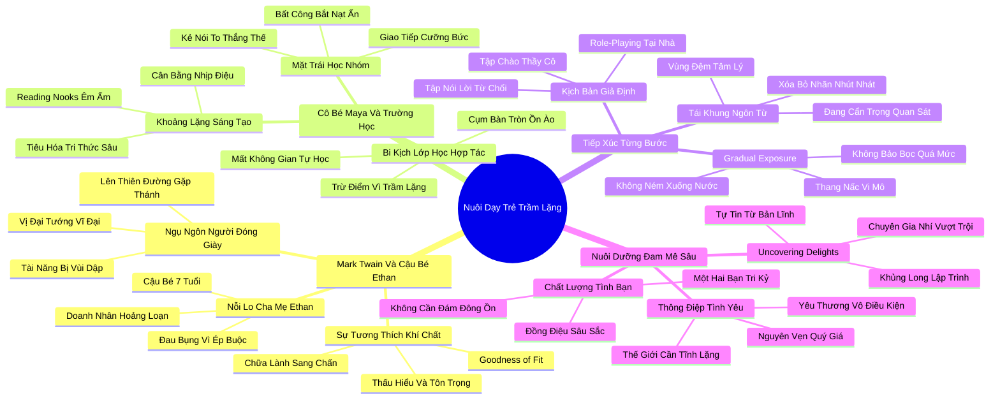

# 🗺️ BẢN ĐỒ TƯ DUY & BẢNG TRA CỨU NEO TRÍ NHỚ: CHƯƠNG MƯỜI MỘT - VỀ NGƯỜI THỢ ĐÓNG GIÀY VÀ VỊ ĐẠI TƯỚNG: NGHỆ THUẬT NUÔI DẠY NHỮNG ĐỨA TRẺ TRẦM LẶNG

---

## 1. HỆ THỐNG PHẢ HỆ TRI THỨC (ACTIVE RECALL HIERARCHY)

---

## 2. BẢNG TRA CỨU NEO TRÍ NHỚ SIÊU TỐC (MEMORY ANCHOR CHEAT SHEET)

| 📑 Phần/Mục Tài Liệu | Khái Niệm / Từ Khóa Vàng | Bản Chất Cốt Lõi | Cảnh Báo Sai Lầm Thường Gặp | Hành Động Ứng Dụng Đột Phá |
| :--- | :--- | :--- | :--- | :--- |
| **Phần 1: Ngụ ngôn Mark Twain** | **Goodness of Fit** | Sự tương thích giữa khí chất bẩm sinh của trẻ và môi trường giáo dục của cha mẹ. | Ép buộc con phải trở thành bản sao hướng ngoại của cha mẹ hoặc xã hội. | Điều chỉnh kỳ vọng và phương pháp dạy học tương thích với hệ thần kinh của con. |
| **Phần 1: Ngụ ngôn Mark Twain** | **The Cobbler-General** | Tài năng vĩ đại bị vùi dập chỉ vì đứa trẻ thiếu sự xông xáo phô diễn bề ngoài. | Coi thường tiềm năng của những đứa trẻ trầm tính, thích chơi một mình. | Khai phóng tiềm năng của trẻ bằng cách trao cho trẻ cơ hội thử sức trong môi trường phù hợp. |
| **Phần 2: Cô bé Maya** | **Cooperative Overload** | Phương pháp học nhóm cưỡng bức triệt tiêu khả năng suy nghĩ độc lập và gây quá tải giác quan. | Biến lớp học thành một không gian giao tiếp ồn ào 100% không có khoảng lặng. | Thiết kế các góc đọc sách tĩnh lặng (Reading Nooks) để trẻ nạp lại năng lượng tư duy. |
| **Phần 2: Cô bé Maya** | **Extrovert Grading Bias** | Chấm điểm học sinh dựa trên số lần giơ tay phát biểu thay vì chiều sâu bài thi viết. | Trừng phạt học sinh hướng nội bằng điểm số kém chỉ vì các em không thích tranh cướp lời. | Đánh giá năng lực học sinh qua nhiều kênh đa dạng: bài luận, sản phẩm sáng tạo, thí nghiệm. |
| **Phần 3: Tiếp xúc từng bước** | **Gradual Exposure** | Dẫn dắt trẻ vượt qua nỗi sợ xã hội bằng chiếc thang 5-10 nấc thang vi mô an toàn. | Ném trẻ vào giữa đám đông bắt tự xoay xở (gây sang chấn) hoặc bao bọc quá mức (tăng nỗi sợ). | Đồng hành cùng con chinh phục từng nấc thang nhỏ và khen ngợi sự can đảm của con. |
| **Phần 3: Tiếp xúc từng bước** | **Positive Reframing** | Xóa bỏ nhãn "nhút nhát"; thay bằng "cháu đang cẩn trọng quan sát để làm quen". | Thôi miên tiêu cực khiến trẻ mặc cảm tự ti rằng mình là một sản phẩm lỗi của tự nhiên. | Sử dụng ngôn từ ấm áp, khẳng định tính cẩn trọng là một biểu hiện của trí thông minh. |
| **Phần 4: Đam mê sâu sắc** | **Uncovering Delights** | Sự tự tin cốt lõi nở rộ khi trẻ trở thành chuyên gia tinh thông một niềm say mê sâu sắc. | Bắt ép con học các môn năng khiếu biểu diễn (MC, kịch nói) mà con hoàn toàn ghét bỏ. | Tài trợ sách, công cụ và thời gian để con đắm chìm vào lĩnh vực con thực sự yêu thích. |
| **Phần 4: Đam mê sâu sắc** | **Quiet Love Letter** | Khẳng định với con rằng con được sinh ra nguyên vẹn, quý giá và xứng đáng được yêu thương vô điều kiện. | Đặt điều kiện tình thương: chỉ yêu con khi con đạt giải thưởng hoặc trở nên hoạt bát. | Nhắc nhở con mỗi ngày rằng thế giới luôn trân trọng và cần đến tâm hồn tĩnh lặng của con. |
