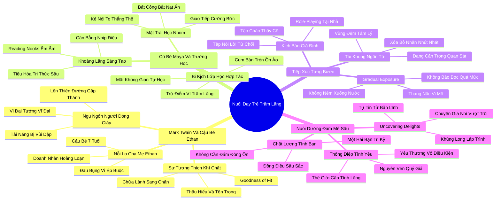

# 📖 TỔNG HỢP NỘI DUNG CHUYÊN SÂU: CHƯƠNG MƯỜI MỘT - VỀ NGƯỜI THỢ ĐÓNG GIÀY VÀ VỊ ĐẠI TƯỚNG: NGHỆ THUẬT NUÔI DẠY NHỮNG ĐỨA TRẺ TRẦM LẶNG (ON COBBLERS AND GENERALS)

### 🎯 THÔNG ĐIỆP CỐT LÕI (1 - 2 CÂU)
Trẻ em hướng nội không phải là những sản phẩm lỗi cần được sửa chữa hay nhào nặn thành những kẻ hoạt ngôn bạo dạn; thiên chức tối thượng của cha mẹ và nhà trường là thấu hiểu nguyên lý "Sự tương thích nuôi dưỡng" (Goodness of Fit), dẫn dắt trẻ tiếp xúc với thế giới bằng phương pháp giải mẫn cảm từng bước và khai phóng những niềm say mê sâu sắc để trẻ tự tin nở rộ theo đúng bản sắc đích thực của mình.

---

### 📊 LƯỢC ĐỒ PHÂN BỔ CẤU TRÚC TÀI LIỆU
Bảng đối chiếu cấu trúc các phần trong tài liệu gốc và số lượng luận điểm chuyên sâu được khai phóng:

| Phần / Mục Trong Tài Liệu Gốc | Trọng Tâm Phân Tích | Số Luận Điểm | Tỷ Trọng Tri Thức |
| :--- | :--- | :---: | :---: |
| **Phần 1: Ngụ Ngôn Mark Twain & Bác Sĩ Jerry Miller** | Câu chuyện người thợ đóng giày lên thiên đường, cậu bé Ethan 7 tuổi, nguyên lý Sự tương thích (Goodness of Fit) | 3 luận điểm | 25% |
| **Phần 2: Cô Bé Maya & Lớp Học Hợp Tác Bắt Buộc** | Maya và nỗi ám ảnh học nhóm (Cooperative Learning), bi kịch biến trường học thành đấu trường giao tiếp | 3 luận điểm | 25% |
| **Phần 3: Nghệ Thuật Dẫn Dắt Tiếp Xúc Từng Bước** | Gradual Exposure: nấc thang vi mô vượt qua nỗi sợ, xây dựng vùng đệm an toàn tâm lý cho trẻ nhạy cảm | 3 luận điểm | 25% |
| **Phần 4: Khám Phá Niềm Say Mê & Bức Thông Điệp Tình Yêu** | Uncovering Delights: nuôi dưỡng sở thích chuyên sâu, trao quyền cho những tâm hồn tĩnh lặng thay đổi thế giới | 3 luận điểm | 25% |
| **TỔNG CỘNG** | **Toàn bộ cấu trúc Chương 11** | **12 luận điểm** | **100%** |

---

### 💡 12 LUẬN ĐIỂM CHUYÊN SÂU THEO TỪNG PHẦN TÀI LIỆU

#### 📑 PHẦN 1: NGỤ NGÔN MARK TWAIN & BÁC SĨ JERRY MILLER (MARK TWAIN'S PARABLE & ETHAN)

1. **Câu Chuyện Ngụ Ngôn Của Mark Twain Về Vị Đại Tướng Vĩ Đại Nhất:**
   - *Phân tích chuyên sâu:* Mark Twain kể câu chuyện ngụ ngôn sâu sắc: Một người đàn ông lên thiên đường và thỉnh cầu Thánh Peter chỉ cho ông thấy ai là vị tướng quân sự vĩ đại nhất mọi thời đại. Thánh Peter chỉ vào một người đàn ông giản dị đang đứng gần đó. Người đàn ông kinh ngạc thốt lên: "Không thể nào, tôi biết ông ta khi còn ở trần gian, ông ta chỉ là một người thợ đóng giày nghèo khó ở làng tôi!". Thánh Peter điềm đạm trả lời: "Đúng vậy, nhưng nếu ông ấy được trao cơ hội chỉ huy quân đội, ông ấy sẽ là vị đại tướng lỗi lạc nhất lịch sử nhân loại".
   - *Công cụ / Phương pháp đi kèm:* Ngụ Ngôn Về Tài Năng Bị Chôn Vùi (The Cobbler-General Metaphor).
   - *Ví dụ thực chiến:* Hàng triệu đứa trẻ hướng nội với tài năng thiên bẩm về khoa học, văn chương, nghệ thuật đang bị xã hội lãng quên và coi thường chỉ vì chúng không sở hữu vẻ bề ngoài hoạt ngôn, xông xáo để chen lấn giành giật cơ hội.

2. **Cậu Bé Ethan 7 Tuổi Và Nỗi Lo Sợ Của Cha Mẹ:**
   - *Phân tích chuyên sâu:* Bác sĩ tâm lý trẻ em Jerry Miller tại Đại học Michigan tiếp nhận trường hợp của cậu bé Ethan: một đứa trẻ 7 tuổi thông minh, giàu tình cảm nhưng cực kỳ nhút nhát và thích chơi một mình. Cha mẹ của Ethan – vốn là những doanh nhân hướng ngoại thành đạt – vô cùng hoảng loạn, sợ rằng con trai mình bị mắc chứng tự kỷ hoặc sẽ trở thành kẻ thất bại trong xã hội. Họ liên tục thúc ép Ethan phải tham gia các đội bóng đá, các lớp kịch nói và mời bạn bè về nhà mỗi ngày.
   - *Công cụ / Phương pháp đi kèm:* Hội Chứng Lo Lắng Của Cha Mẹ Hướng Ngoại (Extrovert Parental Anxiety).
   - *Ví dụ thực chiến:* Ethan cảm thấy ngột ngạt và bắt đầu bị đau bụng dữ dội mỗi sáng thức dậy chuẩn bị đến trường vì nỗi sợ hãi không thể đáp ứng được kỳ vọng ồn ào của cha mẹ.

3. **Nguyên Lý Sống Còn: "Sự Tương Thích Nuôi Dưỡng" (Goodness of Fit):**
   - *Phân tích chuyên sâu:* Bác sĩ Miller đưa ra nguyên lý nền tảng: "Sự tương thích nuôi dưỡng" (Goodness of Fit) của hai nhà nghiên cứu Alexander Thomas và Stella Chess. Một đứa trẻ chỉ có thể phát triển lành mạnh khi tính khí bẩm sinh của nó được cha mẹ và môi trường giáo dục thấu hiểu, chấp nhận và tạo điều kiện tương thích. Sự bất tương thích giữa kỳ vọng của cha mẹ và bản tính của con là nguồn gốc của 90% các rối loạn lo âu và tự ti ở tuổi thơ.
   - *Công cụ / Phương pháp đi kèm:* Khung Đánh Giá Sự Tương Thích Khí Chất (Goodness of Fit Assessment).
   - *Ví dụ thực chiến:* Khi cha mẹ Ethan dừng việc ép con chơi bóng đá và thay vào đó cùng con xây dựng các mô hình Lego khoa học phức tạp, triệu chứng đau bụng của Ethan biến mất hoàn toàn và cậu bé bắt đầu tự tin chia sẻ các phát minh của mình.

---

#### 📑 PHẦN 2: CÔ BÉ MAYA & LỚP HỌC HỢP TÁC BẮT BUỘC (MAYA & COOPERATIVE CLASSROOM)

4. **Bi Kịch Của Cô Bé Maya Trong Lớp Học Hợp Tác:**
   - *Phân tích chuyên sâu:* Maya là một học sinh tiểu học nhạy cảm, sâu sắc và có năng khiếu viết văn tuyệt vời. Thế nhưng, trường học của em đã chuyển đổi toàn bộ bàn ghế đơn truyền thống thành các cụm bàn tròn 4-6 học sinh để áp dụng phương pháp "Học tập hợp tác" (Cooperative Learning). Suốt cả ngày học, Maya không có lấy một phút giây nào được suy nghĩ độc lập; em bị bao vây bởi tiếng ồn ào, tranh cãi của các bạn cùng nhóm và liên tục bị giáo viên trừ điểm vì "không tích cực thảo luận nhóm".
   - *Công cụ / Phương pháp đi kèm:* Phân Tích Sự Quá Tải Giảng Đường (Classroom Sensory Overload Diagnostic).
   - *Ví dụ thực chiến:* Maya ngồi nép một góc ở cụm bàn tròn, tay ôm chặt quyển vở ghi đầy những ý tưởng thơ ca sâu sắc nhưng không dám chia sẻ vì các bạn trong nhóm đang mải mê tranh cãi xem ai sẽ là người cầm bút dạ màu.

5. **Mặt Trái Nguy Hiểm Của Phong Trào "Học Nhóm Tuyệt Đối":**
   - *Phân tích chuyên sâu:* Nền giáo dục hiện đại đang mù quáng sao chép mô hình doanh nghiệp mở, biến lớp học thành một không gian giao tiếp cưỡng bức. Việc biến làm việc nhóm thành hình thức học tập duy nhất tước đoạt cơ hội rèn luyện tư duy sâu của học sinh, biến những đứa trẻ hoạt ngôn nhất thành người định đoạt kết quả học tập của cả nhóm, và biến những học sinh trầm lặng thành nạn nhân của sự bắt nạt tâm lý tinh vi.
   - *Công cụ / Phương pháp đi kèm:* Thước Đo Rủi Ro Của Phương Pháp Học Nhóm Cưỡng Bức (Cooperative Learning Pitfalls Index).
   - *Ví dụ thực chiến:* Các bài tập nhóm thường kết thúc bằng việc một học sinh giỏi nhưng hướng nội phải âm thầm làm toàn bộ khối lượng bài vở phức tạp vào ban đêm, trong khi học sinh hoạt ngôn nhất nhóm giành quyền lên thuyết trình và nhận toàn bộ lời khen ngợi.

6. **Tầm Quan Trọng Của Khoảng Lặng Sáng Tạo Trong Học Đường:**
   - *Phân tích chuyên sâu:* Trẻ em cần không gian tĩnh lặng để tiêu hóa kiến thức mới, xây dựng các liên kết thần kinh dài hạn và phát triển trí tưởng tượng độc lập. Một nền giáo dục tiến bộ phải là nền giáo dục biết kết hợp cân bằng giữa học nhóm và học độc lập, tôn trọng tốc độ xử lý thông tin khác nhau của từng đứa trẻ.
   - *Công cụ / Phương pháp đi kèm:* Mô Hình Giảng Đường Nhịp Điệu Cân Bằng (Balanced Pedagogical Rhythm Model).
   - *Ví dụ thực chiến:* Những trường học tiên tiến thiết kế các góc đọc sách riêng tư (Reading Nooks) trải thảm êm với tai nghe chống ồn, nơi học sinh có thể rút lui vào 20 phút mỗi ngày để tự học theo sở thích riêng.

---

#### 📑 PHẦN 3: NGHỆ THUẬT DẪN DẮT TIẾP XÚC TỪNG BƯỚC (GRADUAL EXPOSURE & DESENSITIZATION)

7. **Kỹ Thuật "Tiếp Xúc Từng Bước" (Gradual Exposure) Cho Trẻ Nhút Nhát:**
   - *Phân tích chuyên sâu:* Cha mẹ không nên bảo bọc con quá mức (khiến nỗi sợ hãi ngày càng phình to), nhưng cũng tuyệt đối không được ném con vào giữa hồ bơi để ép con tự bơi (gây sang chấn tâm lý vĩnh viễn). Phương pháp khoa học duy nhất là "Giải mẫn cảm và tiếp xúc từng bước": chia nhỏ tình huống xã hội gây sợ hãi thành một chiếc thang gồm 5-10 bậc thang vi mô, và đồng hành cùng con chinh phục từng bậc một cách chậm rãi và an toàn.
   - *Công cụ / Phương pháp đi kèm:* Thang Nấc Chinh Phục Nỗi Sợ Cho Trẻ Em (Childhood Gradual Exposure Ladder).
   - *Ví dụ thực chiến:* Nếu trẻ sợ đi dự tiệc sinh nhật bạn: Bậc 1 là đến nhà bạn chơi trước khi tiệc diễn ra vài ngày; Bậc 2 là đến dự tiệc sớm hơn 15 phút khi chỉ có 1-2 bạn; Bậc 3 là tham gia trong 30 phút rồi về; Bậc 4 là tham gia trọn vẹn buổi tiệc.

8. **Thiết Lập Vùng Đệm An Toàn Tâm Lý: Không Bao Giờ Dán Nhãn Tiêu Cực:**
   - *Phân tích chuyên sâu:* Khi trẻ tỏ ra ngập ngừng trước người lạ, sai lầm phổ biến nhất của cha mẹ là phân trần với người khác: "Cháu nó nhút nhát lắm ạ!". Lời nói này giống như một lời nguyền thôi miên biến sự nhút nhát thành bản sắc cố định của đứa trẻ. Thay vào đó, hãy giải thích theo hướng tích cực: "Cháu thích dành vài phút quan sát để làm quen trước khi tham gia trò chơi".
   - *Công cụ / Phương pháp đi kèm:* Nghệ Thuật Tái Khung Ngôn Từ Giáo Dục (Positive Reframing Script).
   - *Ví dụ thực chiến:* Khi một người hàng xóm hỏi chuyện và đứa trẻ bám chặt lấy chân mẹ, người mẹ mỉm cười nói: "Bé Tom đang từ từ làm quen với bác đấy ạ, lát nữa cháu sẽ chào bác sau nhé!".

9. **Tập Dượt Trước Các Kịch Bản Xã Hội (Social Rehearsal):**
   - *Phân tích chuyên sâu:* Trẻ em hướng nội sợ hãi những điều bất ngờ không lường trước. Cha mẹ có thể giải tỏa 80% nỗi lo âu của con bằng cách cùng con đóng kịch giả định (Role-playing) tại nhà trước các sự kiện: tập cách chào cô giáo mới, tập cách bước vào lớp và tìm chỗ ngồi, tập cách nói lời từ chối khi bị bạn bè trêu chọc.
   - *Công cụ / Phương pháp đi kèm:* Kịch Bản Đóng Vai Xã Hội Gia Đình (Family Role-Playing Protocol).
   - *Ví dụ thực chiến:* Hai mẹ con đóng vai người bán hàng và khách hàng tại phòng khách, tập dượt cách bước vào cửa hàng mua một hộp bút chì màu và nói lời cảm ơn người thu ngân.

---

#### 📑 PHẦN 4: KHÁM PHÁ NIỀM SAY MÊ & THÔNG ĐIỆP TÌNH YÊU (UNCOVERING DELIGHTS & LOVE LETTER)

10. **Khám Phá Và Nuôi Dưỡng "Niềm Say Mê Sâu Sắc" Của Con (Uncovering Delights):**
    - *Phân tích chuyên sâu:* Vũ khí tối thượng giúp một đứa trẻ hướng nội xây dựng lòng tự trọng vững chắc không phải là tài ăn nói hoạt bát, mà là "Năng lực chuyên môn vượt trội" trong một lĩnh vực mà con thực sự say mê. Khi một đứa trẻ trở thành chuyên gia về khủng long, thiên văn học, lập trình, cờ vua hay hội họa, sự tự tin của con sẽ nở rộ từ bên trong và thu hút những người bạn có cùng tần số một cách tự nhiên nhất.
    - *Công cụ / Phương pháp đi kèm:* Quy Trình Khai Phóng Đam Mê Sâu Sắc (Deep Passion Uncovering Loop).
    - *Ví dụ thực chiến:* Một cậu bé 10 tuổi nhút nhát nhưng say mê nghiên cứu các loài bướm; khi lớp học tổ chức buổi triển lãm sinh học, cậu tự tin đứng thuyết minh say sưa về vòng đời của bướm trước toàn trường và được các bạn học vô cùng ngưỡng mộ.

11. **Dạy Trẻ Tìm Kiếm Những Người Bạn Đồng Điệu Đích Thực:**
    - *Phân tích chuyên sâu:* Cha mẹ không nên đo lường mức độ thành công xã hội của con bằng số lượng bạn bè (con có được mời đến 20 bữa tiệc hay không). Đối với người hướng nội, chỉ cần 1 hoặc 2 người bạn tri kỷ thực sự – những người sẵn sàng ngồi hàng giờ chơi cờ, đọc sách hoặc chia sẻ những ước mơ sâu kín – là đã đủ để xây dựng một tuổi thơ hạnh phúc và an toàn tuyệt đối.
    - *Công cụ / Phương pháp đi kèm:* Thước Đo Chất Lượng Mối Quan Hệ Bạn Bè (Deep Friendship Quality Index).
    - *Ví dụ thực chiến:* Giúp con mời một người bạn duy nhất có cùng sở thích về nhà chơi vào chiều thứ Bảy thay vì ép con phải tham gia vào các nhóm học sinh ồn ào ngoài sân bóng.

12. **Bức Thông Điệp Tình Yêu Bất Hủ Dành Cho Những Tâm Hồn Tĩnh Lặng:**
    - *Phân tích chuyên sâu:* Susan Cain khép lại cuốn sách bằng một bức thông điệp tình yêu lay động hàng triệu trái tim: Hãy gửi đến những đứa trẻ trầm lặng thông điệp rằng chúng được sinh ra hoàn toàn nguyên vẹn và quý giá. Thế giới này cần những nhà thám hiểm xông pha, nhưng thế giới này cũng khát khao đến cháy bỏng những người thợ đóng giày biết suy ngẫm, những nhà thơ biết lắng nghe tiếng thở của thiên nhiên và những vị đại tướng biết bảo vệ hòa bình bằng sự điềm tĩnh và lương tri sâu sắc.
    - *Công cụ / Phương pháp đi kèm:* Tuyên Ngôn Tình Yêu Bản Thể Trẻ Em (Quiet Children's Bill of Rights).
    - *Ví dụ thực chiến:* Lời nhắn nhủ của cha mẹ trước khi con đi ngủ: "Cha mẹ yêu con vì chính con người trầm lặng, sâu sắc và ấm áp của con. Con không cần phải trở thành bất kỳ ai khác để xứng đáng được yêu thương".

---

### 🛠️ KẾ HOẠCH HÀNH ĐỘNG THỰC THI (20 HÀNH ĐỘNG)

#### TẦNG 1: HÀNH VI VI MÔ TỨC THÌ (< 2 PHÚT)
- [ ] **Xóa bỏ từ "nhút nhát":** Thay thế ngay lập tức từ "cháu nó nhút nhát" bằng câu "cháu đang dành thời gian quan sát cẩn thận".
- [ ] **Ôm ấp tiếp thêm năng lượng:** Ôm chặt con trong 10 giây khi thấy con có dấu hiệu choáng ngợp trước đám đông người lớn ồn ào.
- [ ] **Hỏi câu hỏi mở về cảm xúc:** Thay vì hỏi "Hôm nay ở trường có vui không?", hãy hỏi: "Điều gì làm con cảm thấy bình yên nhất ở lớp hôm nay?".
- [ ] **Tôn trọng quyền im lặng của con:** Cho phép con im lặng nhìn ngắm cảnh vật trên xe suốt quãng đường từ trường về nhà mà không tra vấn.
- [ ] **Lời khen ngợi chiều sâu tư duy:** Khen ngợi khi con quan sát được một chi tiết tinh tế: "Con có đôi mắt quan sát tuyệt vời đấy!".
- [ ] **Hạ thấp ánh sáng phòng ngủ:** Giảm độ sáng đèn và bật nhạc êm dịu 30 phút trước giờ ngủ để xoa dịu hệ thần kinh nhạy cảm của con.

#### TẦNG 2: THÓI QUEN & QUY TRÌNH TUẦN
- [ ] **Thiết lập góc tổ kén tĩnh lặng tại nhà:** Dựng một chiếc lều nhỏ hoặc trải đệm êm ở góc phòng với đầy sách và gối ôm làm ốc đảo riêng cho con.
- [ ] **Áp dụng thang tiếp xúc từng bước (Gradual Exposure):** Lập kế hoạch 4 bước giúp con làm quen với một môi trường mới (lớp học bơi, lớp vẽ tranh).
- [ ] **Đóng kịch giả định xã hội (Role-playing):** Dành 15 phút chiều Chủ nhật cùng con tập dượt các tình huống giao tiếp ở trường.
- [ ] **Đưa con đến thư viện hoặc bảo tàng tĩnh lặng:** Dành sáng thứ Bảy cùng con đắm chìm trong không gian yên tĩnh của tri thức và nghệ thuật.
- [ ] **Trò chuyện riêng với giáo viên chủ nhiệm:** Gặp giáo viên đầu năm học để chia sẻ về tính khí hướng nội của con và đề xuất giải pháp hỗ trợ nhẹ nhàng.
- [ ] **Tạo điều kiện cho con gặp gỡ 1-1:** Mời một người bạn duy nhất có cùng sở thích với con đến nhà chơi trò chơi cờ bàn hoặc lego.
- [ ] **Quan sát và ghi nhận niềm say mê ẩn sâu:** Lập danh sách các chủ đề mà con say sưa tìm hiểu để mua sách và tài liệu chuyên sâu cho con.

#### TẦNG 3: CHUYỂN HÓA CHIẾN LƯỢC DÀI HẠN
- [ ] **Vận động cải cách không gian lớp học:** Đề xuất ban phụ huynh và nhà trường xây dựng các góc tĩnh lặng và cân bằng giữa học nhóm và tự học.
- [ ] **Định hướng phát triển chuyên môn sâu cho con:** Khuyến khích con theo đuổi các lĩnh vực đòi hỏi tính kiên trì, tư duy độc lập và chiều sâu nghiên cứu.
- [ ] **Xây dựng lòng tự trọng cốt lõi (Unshakable Self-Esteem):** Giúp con hiểu rằng giá trị của con nằm ở nhân cách, tài năng và sự tử tế, không nằm ở số lượng bạn bè trên mạng xã hội.
- [ ] **Đào tạo kỹ năng tự bảo vệ trước sự bắt nạt học đường:** Dạy con cách đứng thẳng lưng, nhìn thẳng vào mắt kẻ bắt nạt và nói lời từ chối dứt khoát bằng giọng điềm tĩnh.
- [ ] **Bảo vệ con khỏi áp lực kỳ vọng hướng ngoại của họ hàng:** Nhẹ nhàng nhưng kiên quyết bảo vệ con trước những lời chê bai, so sánh của người thân trong các buổi gặp mặt gia đình.
- [ ] **Đầu tư vào các dự án cá nhân dài hạn của con:** Tài trợ công cụ, thiết bị để con hoàn thành các sản phẩm sáng tạo độc lập (viết sách tranh, lắp ráp robot, sáng tác nhạc).
- [ ] **Cam kết yêu thương vô điều kiện:** Khẳng định với con suốt quá trình trưởng thành rằng con luôn là niềm tự hào to lớn của cha mẹ bằng chính bản thể tĩnh lặng của mình.

---

### ❓ BỘ CÂU HỎI TỰ NGẪM (20 CÂU HỎI)

#### NHÓM 1: TỰ VẤN NHẬN THỨC & THẤU HIỂU BẢN THÂN
1. Khi nhìn thấy con mình chơi một mình ở sân trường, cảm xúc đầu tiên trong tôi là gì: lo lắng, xấu hổ hay thấu hiểu và bình an?
2. Tôi có đang vô tình áp đặt những nỗi sợ hãi hoặc tham vọng xã hội chưa thành của bản thân lên vai đứa con bé bỏng của mình?
3. Tính khí bẩm sinh của tôi và con có đang tương thích (Goodness of Fit) hay đang xảy ra sự va chạm gay gắt giữa hai thái cực?
4. Tôi đã từng bao nhiêu lần cảm thấy thất vọng chỉ vì con không thể hoạt bát, xông xáo như "con nhà người ta"?
5. Thuở nhỏ, tôi đã từng bị cha mẹ hoặc thầy cô tổn thương vì sự nhút nhát hoặc trầm lặng của mình như thế nào?

#### NHÓM 2: ĐÁNH GIÁ THỰC TRẠNG & RÀ SOÁT THÓI QUEN
6. Ngôi nhà của tôi hiện tại đang là một "ốc đảo bình yên" cho con hồi phục hay là một nơi tràn ngập tiếng quát mắng và tiếng ồn thiết bị?
7. Tôi có thói quen dán nhãn "nhút nhát" lên con trước mặt người lạ thay vì giải thích nhẹ nhàng về sự cẩn trọng của con?
8. Lớp học hiện tại của con đang nuôi dưỡng tư duy độc lập hay đang ép con phải gồng mình trong các hoạt động nhóm ồn ào liên tục?
9. Tôi có đang ép con tham gia quá nhiều lớp học ngoại khóa giao tiếp (kịch nói, MC, hùng biện) vượt quá ngưỡng chịu đựng thần kinh của con?
10. Lần gần đây nhất tôi ngồi yên lặng lắng nghe con hào hứng chia sẻ về sở thích riêng của con trong suốt 30 phút là khi nào?

#### NHÓM 3: THÁCH THỨC NIỀM TIN CŨ & PHÁ VỠ ĐỊNH KIẾN
11. Liệu một đứa trẻ ít bạn có đồng nghĩa với một đứa trẻ cô đơn và bất hạnh, hay đó là sự lựa chọn chất lượng hơn số lượng?
12. Có phải đứa trẻ hoạt ngôn, lanh lợi nhất lớp luôn là đứa trẻ sẽ thành công và hạnh phúc nhất khi bước vào đời?
13. Tại sao chúng ta lại coi sự ngập ngừng quan sát trước cái mới của trẻ là một khuyết tật cần phải "chữa trị" bằng mọi giá?
14. Người thợ đóng giày trong ngụ ngôn của Mark Twain có thể trở thành vị đại tướng vĩ đại nếu ông bị bắt phải từ bỏ bản tính trầm lặng của mình?
15. Trường học có quyền biến việc "phát biểu to và nhiều" thành thước đo duy nhất để đánh giá sự thông minh của một đứa trẻ?

#### NHÓM 4: THIẾT KẾ GIẢI PHÁP & HÀNH ĐỘNG KIẾN TẠO
16. Tôi sẽ thiết kế "Chiếc thang tiếp xúc từng bước" (Gradual Exposure Ladder) nào để giúp con tự tin bước vào năm học mới?
17. Những góc tĩnh lặng nào tôi có thể cải tạo ngay trong ngôi nhà của mình để tạo dựng không gian an toàn tuyệt đối cho con?
18. Tôi sẽ trao đổi với giáo viên chủ nhiệm như thế nào để cô giáo thấu hiểu và tạo cơ hội phát biểu an toàn cho con trong lớp học?
19. Làm thế nào để tôi có thể phát hiện và đầu tư nuôi dưỡng một "Niềm say mê sâu sắc" (Uncovering Delights) để biến nó thành chiếc mỏ neo tự tin cho con?
20. Những lời nói yêu thương và cử chỉ ấm áp cụ thể nào tôi sẽ trao cho con mỗi ngày để con luôn tự hào về bản thể tĩnh lặng của mình?

---

### 🗺️ MINDMAP 4-5 TẦNG TRỰC QUAN ĐỈNH CAO

