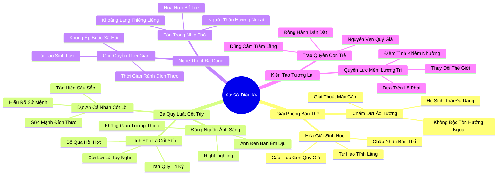

# 🗺️ BẢN ĐỒ TƯ DUY & BẢNG TRA CỨU NEO TRÍ NHỚ: KẾT LUẬN - XỨ SỞ DIỆU KỲ

---

## 1. HỆ THỐNG PHẢ HỆ TRI THỨC (ACTIVE RECALL HIERARCHY)

---

## 2. BẢNG TRA CỨU NEO TRÍ NHỚ SIÊU TỐC (MEMORY ANCHOR CHEAT SHEET)

| 📑 Phần/Mục Tài Liệu | Khái Niệm / Từ Khóa Vàng | Bản Chất Cốt Lõi | Cảnh Báo Sai Lầm Thường Gặp | Hành Động Ứng Dụng Đột Phá |
| :--- | :--- | :--- | :--- | :--- |
| **Phần 1: Giải phóng bản thể** | **Neurodiversity Emancipation** | Chấm dứt sự áp đặt độc tôn của tính hướng ngoại; giải phóng mặc cảm tự ti của người trầm lặng. | Cố ép bản thân sống ngược lại với hệ thần kinh bẩm sinh dẫn đến kiệt quệ tâm lý. | Tự hào chấp nhận sự tĩnh lặng như một món quà tiến hóa quý giá của tự nhiên. |
| **Phần 2: Ba quy luật cốt tủy** | **Love vs Gregariousness** | Tình yêu sâu sắc là điều cốt yếu; tính hòa đồng xởi lởi chỉ là sự lựa chọn tùy nghi. | Đánh đổi các mối quan hệ tri kỷ sâu sắc lấy hàng trăm mối giao tiếp xã giao hời hợt. | Dành trọn tâm sức nuôi dưỡng 2-3 mối quan hệ tâm giao chân thành suốt đời. |
| **Phần 2: Ba quy luật cốt tủy** | **Right Lighting** | Bí quyết cuộc sống: đặt bản thân vào đúng nguồn ánh sáng tương thích với hệ thần kinh. | Cố gắng chen chúc dưới ánh đèn sân khấu náo loạn khi tâm hồn cần ánh sáng bàn làm việc. | Lựa chọn môi trường nghề nghiệp và không gian sống tôn trọng mức kích thích tự nhiên. |
| **Phần 2: Ba quy luật cốt tủy** | **Core Projects Dedication** | Phụng sự Dự án Cá nhân Cốt lõi mang lại ý nghĩa và dũng khí vượt qua mọi giới hạn. | Lãng phí thời gian vào những dự án vô nghĩa chỉ nhằm mục đích kiếm tiền ngắn hạn. | Tập trung năng lượng cao nhất để hoàn thành sứ mệnh đích thực của cuộc đời mình. |
| **Phần 3: Nghệ thuật đa dạng** | **Sovereign Leisure** | Quyền chủ quyền thời gian: tận hưởng thời gian rảnh rỗi theo cách riêng của tâm hồn. | Cảm thấy tội lỗi khi từ chối các buổi tiệc tùng ồn ào để ở nhà đọc sách tĩnh dưỡng. | Dũng cảm từ chối các áp lực xã hội và bảo vệ trọn vẹn những ngày nghỉ bình yên. |
| **Phần 4: Chuyển giao thế hệ** | **Quiet Parenting** | Nuôi dạy con cái bằng sự thấu hiểu, tôn trọng khí chất và trao cho con lòng can trường trầm lặng. | Phán xét con nhút nhát và ép con phải hoạt bát giống như các bạn học khác. | Đồng hành cùng con từng bước, giúp con nở rộ theo đúng bản sắc tự nhiên. |
| **Phần 4: Kiến tạo tương lai** | **Global Soft Power** | Dẫn dắt thế giới bằng sự cẩn trọng, chiều sâu trí tuệ và tiếng nói lương tri không khoan nhượng. | Nghĩ rằng chỉ có những kẻ to tiếng, bạo lực mới có khả năng làm chủ vận mệnh lịch sử. | Đóng góp cho xã hội bằng sự điềm tĩnh, tính chính trực và các giải pháp bền vững. |
