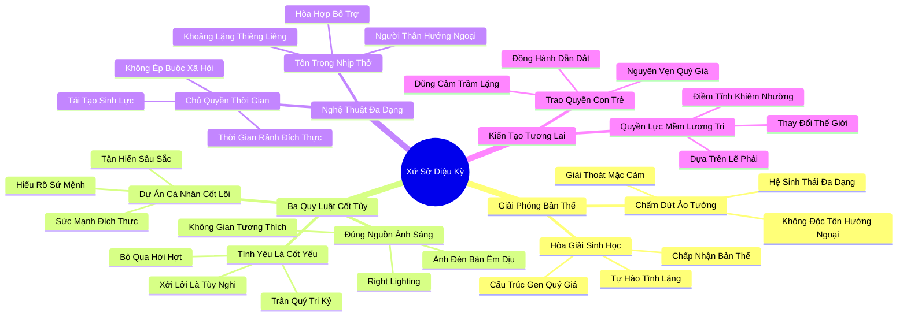

# 📖 TỔNG HỢP NỘI DUNG CHUYÊN SÂU: KẾT LUẬN - XỨ SỞ DIỆU KỲ (CONCLUSION: WONDERLAND)

### 🎯 THÔNG ĐIỆP CỐT LÕI (1 - 2 CÂU)
Tình yêu thương là điều cốt yếu, tính hòa đồng xởi lởi chỉ là sự lựa chọn tùy nghi; bí quyết tối thượng của một cuộc đời trọn vẹn là hãy can đảm đặt bản thân vào đúng "nguồn ánh sáng" tương thích với hệ thần kinh tự nhiên của bạn, để từ đó cống hiến những tinh hoa trầm lặng quý giá nhất cho nhân loại.

---

### 📊 LƯỢC ĐỒ PHÂN BỔ CẤU TRÚC TÀI LIỆU
Bảng đối chiếu cấu trúc các phần trong tài liệu gốc và số lượng luận điểm chuyên sâu được khai phóng:

| Phần / Mục Trong Tài Liệu Gốc | Trọng Tâm Phân Tích | Số Luận Điểm | Tỷ Trọng Tri Thức |
| :--- | :--- | :---: | :---: |
| **Phần 1: Tuyên Ngôn Giải Phóng Khỏi Ảo Tưởng Hướng Ngoại** | Phá vỡ chuẩn mực độc tôn của tính hướng ngoại, giải thoát khỏi mặc cảm tự ti của người trầm lặng | 2 luận điểm | 25% |
| **Phần 2: Ba Quy Luật Sinh Tồn & Phát Triển Cốt Tủy** | Tình yêu là cốt yếu - xởi lởi là lựa chọn; Đặt mình vào đúng nguồn ánh sáng; Phụng sự Dự án cá nhân cốt lõi | 3 luận điểm | 35% |
| **Phần 3: Nghệ Thuật Ứng Xử Đa Dạng & Tôn Trọng Nhịp Thở** | Tôn trọng nhu cầu giao tiếp của bạn đời và bảo vệ khoảng lặng cá nhân; Dành thời gian rảnh rỗi đích thực | 2 luận điểm | 20% |
| **Phần 4: Chuyển Giao Thế Hệ & Kiến Tạo Tương Lai** | Trang bị lòng dũng cảm trầm lặng cho con cái; Cống hiến bằng quyền lực mềm và sự điềm tĩnh lương tri | 2 luận điểm | 20% |
| **TỔNG CỘNG** | **Toàn bộ cấu trúc Phần Kết Luận** | **9 luận điểm** | **100%** |

---

### 💡 9 LUẬN ĐIỂM CHUYÊN SÂU THEO TỪNG PHẦN TÀI LIỆU

#### 📑 PHẦN 1: TUYÊN NGÔN GIẢI PHÓNG KHỎI ẢO TƯỞNG HƯỚNG NGOẠI

1. **Sự Chấm Dứt Của Kỷ Nguyên Áp Đặt Một Khuôn Mẫu Duy Nhất:**
   - *Phân tích chuyên sâu:* Xã hội hiện đại đã mắc một sai lầm lịch sử khi biến lối sống hướng ngoại ồn ào thành chuẩn mực tối cao duy nhất của thành công và đạo đức. Susan Cain tuyên bố sự chấm dứt của ảo tưởng này: thế giới không phải là một sân khấu diễn thuyết độc thoại, mà là một hệ sinh thái đa dạng. Cả người hướng nội và hướng ngoại đều sở hữu những năng lực sinh học riêng biệt và không bên nào có quyền phán xét hay xóa bỏ bên nào.
   - *Công cụ / Phương pháp đi kèm:* Tuyên Ngôn Đa Dạng Thần Kinh Xã Hội (Neurodiversity Emancipation Manifesto).
   - *Ví dụ thực chiến:* Hàng triệu độc giả trên khắp thế giới rơi nước mắt khi đọc những trang cuối của cuốn sách Quiet, nhận ra rằng họ không còn phải giả vờ cười nói gượng gạo để được xã hội công nhận giá trị.

2. **Hòa Giải Với Bản Thể Sinh Học Nguyên Bản:**
   - *Phân tích chuyên sâu:* Bước đầu tiên để bước vào "Xứ sở diệu kỳ" (Wonderland) của chính mình là sự hòa giải triệt để với cấu trúc hệ thần kinh bẩm sinh. Đừng bao giờ lãng phí một giây phút nào nữa để tự dằn vặt hay trách cứ bản thân vì sao mình không thể trở thành một người hoạt ngôn, liều lĩnh hay thích giao du đám đông. Sự tĩnh lặng của bạn là một món quà tiến hóa vô giá.
   - *Công cụ / Phương pháp đi kèm:* Liệu Pháp Tự Chấp Nhận Bản Thể (Radical Self-Acceptance Protocol).
   - *Ví dụ thực chiến:* Thay vì trốn tránh trong mặc cảm tội lỗi khi muốn ở nhà vào tối thứ Bảy, bạn cảm thấy thanh thản và tự hào pha một tách trà nóng, mở cuốn sách yêu thích và tận hưởng sự giàu có của thế giới nội tâm.

---

#### 📑 PHẦN 2: BA QUY LUẬT SINH TỒN & PHÁT TRIỂN CỐT TỦY

3. **Châm Ngôn Cốt Tử: Tình Yêu Là Cốt Yếu, Tính Xởi Lởi Chỉ Là Lựa Chọn:**
   - *Phân tích chuyên sâu:* "Love is essential; gregariousness is optional". Đây là câu nói đúc kết toàn bộ triết lý nhân sinh của cuốn sách. Con người sinh ra cần tình yêu thương sâu sắc, sự gắn kết gắn bó và lòng trắc ẩn để tồn tại; nhưng chúng ta hoàn toàn KHÔNG cần phải trở thành một kẻ xởi lởi, quảng giao, vồ vập với hàng trăm người quen hời hợt. Hãy trân quý những người bạn tâm giao thân thiết nhất, làm việc với những đồng nghiệp mà bạn thực sự tôn trọng, và dũng cảm bỏ qua phần còn lại.
   - *Công cụ / Phương pháp đi kèm:* Bộ Lọc Quan Hệ Chiều Sâu (Depth-over-Breadth Relationship Filter).
   - *Ví dụ thực chiến:* Thay vì cố gắng thu thập 5.000 bạn bè trên mạng xã hội và dự 10 bữa tiệc ngoại giao mỗi tháng, bạn đầu tư toàn bộ tâm sức để nuôi dưỡng 2-3 mối quan hệ tri kỷ bền chặt suốt đời.

4. **Bí Quyết Vàng: Đặt Bản Thân Vào Đúng Nguồn Ánh Sáng (Right Lighting):**
   - *Phân tích chuyên sâu:* "The secret of life is to put yourself in the right lighting". Đối với một số người (hướng ngoại), ánh sáng phù hợp là ánh đèn rực rỡ của sân khấu Broadway, nơi tiếng vỗ tay và sự chú ý kích hoạt năng lượng đỉnh cao. Nhưng đối với những người khác (hướng nội), nguồn ánh sáng hoàn hảo lại là ánh đèn bàn làm việc dịu nhẹ chiếu rọi một không gian tĩnh mịch. Hạnh phúc và thành công chỉ xuất hiện khi bạn tìm thấy và kiên quyết ở trong nguồn ánh sáng thuộc về bản chất của mình.
   - *Công cụ / Phương pháp đi kèm:* Bản Đồ Nguồn Ánh Sáng Tương Thích (The Right Lighting Assessment).
   - *Ví dụ thực chiến:* Một kỹ sư phần mềm từ chối lời mời thăng chức lên vị trí quản lý bán hàng ồn ào để tiếp tục làm kiến trúc sư trưởng hệ thống trong phòng thí nghiệm tĩnh lặng, nơi trí tuệ của anh tỏa sáng rực rỡ nhất.

5. **Phụng Sự Và Tận Hiến Cho Dự Án Cá Nhân Cốt Lõi:**
   - *Phân tích chuyên sâu:* Hãy thấu hiểu xem bạn sinh ra trên cõi đời này để cống hiến điều gì, và hãy bảo đảm rằng bạn dành trọn vẹn tâm trí để thực hiện điều đó. Khi bạn tìm thấy một Dự án Cá nhân Cốt lõi đủ ý nghĩa, bạn sẽ có đủ dũng khí để bước ra sân khấu khi cần thiết, và cũng có đủ sự khôn ngoan để rút lui về tĩnh lặng hoàn thiện sản phẩm mà không bị phân tâm bởi miệng lưỡi thế gian.
   - *Công cụ / Phương pháp đi kèm:* Kim Tự Tháp Tận Hiến Sứ Mệnh (Core Mission Dedication Pyramid).
   - *Ví dụ thực chiến:* Charles Darwin dành hàng chục năm nghiên cứu sâu bọ và chim sẻ trong khu vườn tĩnh lặng của mình tại làng Down để hoàn thiện thuyết tiến hóa làm rung chuyển nhận thức của cả nhân loại.

---

#### 📑 PHẦN 3: NGHỆ THUẬT ỨNG XỬ ĐA DẠNG & TÔN TRỌNG NHỊP THỞ

6. **Tôn Trọng Sự Đa Dạng Tính Cách Trong Mối Quan Hệ Thân Thuộc:**
   - *Phân tích chuyên sâu:* Yêu thương một người không phải là biến họ thành bản sao của mình. Hãy tôn trọng nhu cầu giao tiếp xã hội rộn rã của những người thân yêu (nếu họ là người hướng ngoại), đồng thời yêu cầu họ tôn trọng nhu cầu tĩnh lặng thiêng liêng của bạn (nếu bạn là người hướng nội). Tình yêu bền vững là một điệu vũ nhịp nhàng giữa sự gắn kết nồng ấm và khoảng cách tự do.
   - *Công cụ / Phương pháp đi kèm:* Điệu Vũ Hòa Hợp Tính Cách (The Dialectic Personality Dance).
   - *Ví dụ thực chiến:* Vui vẻ tiễn bạn đời đi dự buổi liên hoan âm nhạc với bạn bè của cô ấy, và tận hưởng trọn vẹn buổi tối tĩnh lặng tuyệt đối một mình ở nhà mà không có bất kỳ sự hờn dỗi nào.

7. **Trân Quý Và Sử Dụng Thời Gian Rảnh Rỗi Đích Thực:**
   - *Phân tích chuyên sâu:* Hãy sử dụng thời gian rảnh rỗi theo cách bạn thực sự mong muốn trong sâu thẳm tâm hồn, chứ không phải theo cách mà các áp lực xã hội hay các chiến dịch tiếp thị ép buộc bạn phải làm. Đừng cảm thấy có lỗi khi từ chối một chuyến du lịch đông người ồn ào để ở nhà làm vườn, vẽ tranh hoặc viết nhật ký.
   - *Công cụ / Phương pháp đi kèm:* Quy Tắc Chủ Quyền Thời Gian Cá Nhân (Sovereign Leisure Protocol).
   - *Ví dụ thực chiến:* Dành cả kỳ nghỉ lễ cuối tuần dài ngày để tĩnh dưỡng và đọc một bộ tiểu thuyết kinh điển, trở lại làm việc vào thứ Hai với một tinh thần sảng khoái và tràn đầy sinh lực sáng tạo.

---

#### 📑 PHẦN 4: CHUYỂN GIAO THẾ HỆ & KIẾN TẠO TƯƠNG LAI

8. **Trao Cho Con Cái Bản Lĩnh Và Lòng Dũng Cảm Trầm Lặng:**
   - *Phân tích chuyên sâu:* Nếu bạn có con là người hướng nội, hãy trao cho con chiếc mỏ neo tự tin vững chắc nhất: giúp con vượt qua nỗi sợ bằng sự dẫn dắt nhẹ nhàng, tôn trọng tốc độ trưởng thành của con và khẳng định rằng con được sinh ra hoàn toàn nguyên vẹn. Đừng bao giờ dập tắt ngọn lửa đam mê sâu sắc của con chỉ để ép con hòa tan vào đám đông ồn ào.
   - *Công cụ / Phương pháp đi kèm:* Di Sản Giáo Dục Trầm Lặng (Quiet Parenting Legacy).
   - *Ví dụ thực chiến:* Một người cha kiên nhẫn nắm tay con gái đứng quan sát công viên trò chơi trong 15 phút cho đến khi con tự tin buông tay cha và bước tới kết bạn với một người bạn nhỏ có tính cách ôn hòa.

9. **Dẫn Dắt Thế Giới Bằng Quyền Lực Mềm Và Tiếng Nói Lương Tri:**
   - *Phân tích chuyên sâu:* Hãy mang năng lực phân tích cẩn trọng, chiều sâu tư duy và lòng trắc ẩn của bạn vào nơi làm việc và cộng đồng. Khi cần lên tiếng, hãy nói bằng sự điềm đạm, khiêm nhường nhưng kiên định dựa trên sự thật và lẽ phải. Thế giới đang khao khát những nhà lãnh đạo trầm lặng biết suy nghĩ trước khi hành động hơn bao giờ hết.
   - *Công cụ / Phương pháp đi kèm:* Khung Hành Động Quyền Lực Mềm Toàn Cầu (Global Soft Power Action Framework).
   - *Ví dụ thực chiến:* Một vị giám đốc điều hành điềm tĩnh dùng một bài phát biểu ngắn gọn 5 phút đầy ắp số liệu xác thực và tình người để thuyết phục toàn thể công ty chuyển đổi sang quy trình sản xuất xanh bền vững.

---

### 🛠️ KẾ HOẠCH HÀNH ĐỘNG THỰC THI (15 HÀNH ĐỘNG)

#### TẦNG 1: HÀNH VI VI MÔ TỨC THÌ (< 2 PHÚT)
- [ ] **Khẩu hiệu ánh sáng:** Dán câu châm ngôn lên màn hình máy tính: "Tình yêu là cốt yếu, xởi lởi chỉ là lựa chọn".
- [ ] **Kiểm tra nguồn ánh sáng hiện tại:** Tự hỏi nhanh: "Căn phòng và công việc này có đang cung cấp đúng nguồn ánh sáng cho tâm hồn mình?".
- [ ] **Nói lời từ chối thanh thản:** Nhắn tin từ chối một cuộc hẹn xã giao vô bổ với sự lịch thiệp và không kèm theo lời xin lỗi tự ti.
- [ ] **Tận hưởng khoảng lặng 60 giây:** Nhắm mắt hít thở sâu và cảm nhận sự bình yên của không gian tĩnh lặng xung quanh.
- [ ] **Gửi lời tri ân người bạn tri kỷ:** Gửi một tin nhắn ngắn cảm ơn người bạn thân thiết nhất đã luôn lắng nghe và thấu hiểu bạn.

#### TẦNG 2: THÓI QUEN & QUY TRÌNH TUẦN
- [ ] **Thanh lọc danh bạ và mạng xã hội:** Hủy theo dõi các trang mạng kích động ồn ào và tập trung vào các kênh tri thức sâu sắc.
- [ ] **Khóa chết lịch tĩnh dưỡng cuối tuần:** Dành trọn vẹn một buổi sáng cuối tuần không công việc, không màn hình để làm điều mình yêu thích.
- [ ] **Rà soát tiến độ Dự án Cá nhân Cốt lõi:** Dành 30 phút tối Chủ nhật đánh giá xem mình đã dành bao nhiêu thời gian thực tế cho sứ mệnh lớn của đời mình.
- [ ] **Tập dượt phong thái điềm đạm:** Luyện tập thói quen nói năng từ tốn, không ngắt lời và dùng lập luận sắc bén trong các cuộc họp tuần.
- [ ] **Đồng hành cùng một đứa trẻ hướng nội:** Lắng nghe và trò chuyện với con cái hoặc một đứa trẻ nhút nhát trong gia đình với sự kiên nhẫn tuyệt đối.

#### TẦNG 3: CHUYỂN HÓA CHIẾN LƯỢC DÀI HẠN
- [ ] **Tái thiết kế toàn diện môi trường sống và làm việc:** Kiên quyết chuyển dịch sự nghiệp sang lĩnh vực cho phép bạn làm việc trong đúng "nguồn ánh sáng" của mình.
- [ ] **Xây dựng mạng lưới quan hệ dựa trên chiều sâu:** Chỉ đầu tư thời gian và năng lượng cho những mối quan hệ chân thành, tôn trọng và có chiều sâu tâm hồn.
- [ ] **Lan tỏa văn hóa tôn trọng sự tĩnh lặng:** Chia sẻ cuốn sách Quiet và những bài học về quyền lực mềm cho đồng nghiệp và cộng đồng.
- [ ] **Trở thành người bảo vệ lương tri trong tổ chức:** Kiên định sử dụng tiếng nói trầm lặng để bảo vệ sự thật, đạo đức và sự an toàn của tập thể.
- [ ] **Sống một cuộc đời trọn vẹn đích thực:** Tự hào bước đi trên cõi đời này với tư cách một người hướng nội tĩnh lặng, sâu sắc và đầy bản lĩnh.

---

### ❓ BỘ CÂU HỎI TỰ NGẪM (20 CÂU HỎI)

#### NHÓM 1: TỰ VẤN NHẬN THỨC & THẤU HIỂU BẢN THÂN
1. Tôi đã thực sự tha thứ và hòa giải với bản thể trầm lặng, sâu sắc của chính mình hay vẫn còn chút mặc cảm tự ti?
2. Đâu là "nguồn ánh sáng" đích thực của đời tôi: sự tán dương ồn ào của đám đông hay sự tĩnh lặng chiêm nghiệm bên bàn làm việc?
3. Tôi có đang lãng phí quá nhiều năng lượng cho những mối quan hệ xã giao hời hợt chỉ vì sợ mang tiếng là người xa cách?
4. Đâu là "Dự án cá nhân cốt lõi" mà nếu không thực hiện, tôi sẽ cảm thấy vô cùng hối tiếc khi nhìn lại cuộc đời mình?
5. Tôi cảm thấy bình an và hạnh phúc nhất khi nào: khi ở giữa một bữa tiệc rộn rã hay khi đắm chìm trong đam mê riêng tư?

#### NHÓM 2: ĐÁNH GIÁ THỰC TRẠNG & RÀ SOÁT THÓI QUEN
6. Tôi có đang sử dụng thời gian rảnh rỗi theo đúng ý nguyện sâu thẳm của bản thân hay đang bị cuốn theo các trào lưu tiêu dùng xã hội?
7. Trong gia đình, tôi đã thiết lập được sự tôn trọng lẫn nhau giữa nhu cầu giao tiếp của người này và sự tĩnh lặng của người kia chưa?
8. Công việc hiện tại có đang cho phép tôi phát huy tối đa sức mạnh của sự cẩn trọng, tỉ mỉ và tư duy độc lập hay không?
9. Tôi có thường xuyên ép bản thân phải mỉm cười và nói chuyện với những người khiến tôi kiệt quệ năng lượng?
10. Tôi đã từng bao nhiêu lần dũng cảm từ chối một cơ hội thăng tiến hào nhoáng để bảo vệ sự bình yên nội tâm?

#### NHÓM 3: THÁCH THỨC NIỀM TIN CŨ & PHÁ VỠ ĐỊNH KIẾN
11. Liệu thành công có bắt buộc phải đi kèm với danh tiếng rầm rộ trên truyền thông và sự tung hô của hàng vạn người xa lạ?
12. Có phải một người sống khép kín và có ít bạn bè là một người thất bại trong nghệ thuật đối nhân xử thế?
13. Tại sao chúng ta lại sợ hãi sự tĩnh lặng trong khi đó là cội nguồn sinh ra mọi tác phẩm nghệ thuật và phát minh vĩ đại nhất?
14. Tiếng nói to nhất có bao giờ đồng nghĩa với chân lý sáng rõ nhất trong một thế giới hỗn loạn?
15. Liệu lòng trắc ẩn và sự thấu cảm âm thầm có sức mạnh thay đổi thế giới lớn hơn gươm giáo và quyền lực kinh tế?

#### NHÓM 4: THIẾT KẾ GIẢI PHÁP & HÀNH ĐỘNG KIẾN TẠO
16. Tôi sẽ sắp xếp lại lịch sinh hoạt hàng tuần như thế nào để bảo đảm có đủ thời gian phụng sự cho Dự án Cá nhân Cốt lõi?
17. Những bước đi cụ thể nào tôi có thể thực hiện ngay hôm nay để đưa bản thân vào đúng "nguồn ánh sáng" tương thích?
18. Làm thế nào để tôi có thể truyền cảm hứng và trao quyền cho những đứa trẻ hướng nội trong gia đình tự tin tỏa sáng?
19. Tôi sẽ sử dụng "quyền lực mềm" của mình như thế nào để đóng góp tích cực cho sự tiến bộ và hòa bình của cộng đồng nơi tôi sống?
20. Bức thông điệp yêu thương nào tôi muốn gửi gắm lại cho chính bản thân mình trên chặng đường phía trước của cuộc đời?

---

### 🗺️ MINDMAP 4-5 TẦNG TRỰC QUAN ĐỈNH CAO

