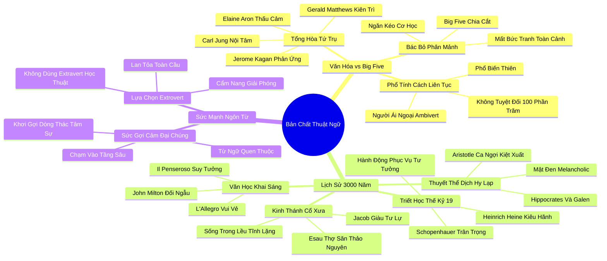

# 🗺️ BẢN ĐỒ TƯ DUY & BẢNG TRA CỨU NEO TRÍ NHỚ: ĐÔI ĐIỀU VỀ CÁC THUẬT NGỮ HƯỚNG NỘI VÀ HƯỚNG NGOẠI

---

## 1. HỆ THỐNG PHẢ HỆ TRI THỨC (ACTIVE RECALL HIERARCHY)

---

## 2. BẢNG TRA CỨU NEO TRÍ NHỚ SIÊU TỐC (MEMORY ANCHOR CHEAT SHEET)

| 📑 Phần/Mục Tài Liệu | Khái Niệm / Từ Khóa Vàng | Bản Chất Cốt Lõi | Cảnh Báo Sai Lầm Thường Gặp | Hành Động Ứng Dụng Đột Phá |
| :--- | :--- | :--- | :--- | :--- |
| **Phần 1: Big Five vs Văn hóa** | **Integrative Definition** | Định nghĩa tổng hòa: kết hợp thế giới nội tâm (Jung), phản ứng cao (Kagan) và thấu cảm (Aron). | Phân mảnh con người thành các chỉ số kiểm tra cơ học cứng nhắc và vô hồn. | Nhìn nhận bản thân như một chỉnh thể sống động với đầy đủ các phẩm chất phong phú. |
| **Phần 1: Big Five vs Văn hóa** | **Ambivert Spectrum** | Hướng nội và hướng ngoại là một phổ liên tục; đa số con người sở hữu mức độ ái ngoại linh hoạt. | Tuyệt đối hóa bản thân vào một nhãn dán cứng nhắc và từ chối thích nghi theo hoàn cảnh. | Linh hoạt điều chỉnh hành vi khi cần thiết trong khi vẫn bảo tồn năng lượng cốt lõi. |
| **Phần 2: Lịch sử 3000 năm** | **Jacob vs Esau Archetype** | Cuộc đối thoại thiên niên kỷ giữa con người của hành động cơ bắp và con người của tư tưởng chiều sâu. | Đánh giá thấp sức mạnh của người suy tưởng; cho rằng chỉ có kẻ hành động mới tạo ra lịch sử. | Tôn vinh sức mạnh của tư tưởng chiến lược như chiếc la bàn dẫn đường cho hành động. |
| **Phần 2: Lịch sử 3000 năm** | **Melancholic Genius** | Triết gia Aristotle: khí chất trầm tư u uất là mảnh đất sản sinh ra thiên tài thi ca và triết học. | Xem nét buồn trầm ngâm của người hướng nội như một căn bệnh trầm cảm cần chữa trị. | Chuyển hóa sự trầm tư sâu lắng thành các tác phẩm nghệ thuật và công trình nghiên cứu giá trị. |
| **Phần 2: Lịch sử 3000 năm** | **Il Penseroso vs L'Allegro** | Thi phẩm John Milton: sự đối ngẫu muôn thuở giữa niềm vui phố thị và sự chiêm nghiệm cô độc giữa rừng đêm. | Ép mọi người phải cùng yêu thích một hình thức giải trí ồn ào giống nhau. | Tự do lựa chọn không gian nuôi dưỡng tâm hồn phù hợp với bản sắc riêng của mình. |
| **Phần 2: Lịch sử 3000 năm** | **Heine's Admonition** | Nhà thơ Heine: những con người hành động rốt cuộc chỉ là công cụ vô thức phục vụ cho người của tư tưởng. | Tự mãn về sự bận rộn hành động bề nổi mà thiếu đi sự suy ngẫm sâu sắc về mục đích tối thượng. | Dành thời gian tư duy chiến lược thấu đáo trước khi bắt tay vào hành động thực thi. |
| **Phần 3: Sức mạnh ngôn từ** | **Vernacular Resonance** | Hai từ "Introvert" và "Extrovert" có sức gợi cảm mãnh liệt, chạm sâu vào tiềm thức tự nhận diện. | Dùng các thuật ngữ học thuật khô khan làm xa cách tri thức tâm lý học với quần chúng. | Sử dụng ngôn từ ấm áp, gần gũi để khơi dậy sự tự tin và lòng trắc ẩn trong cộng đồng. |
| **Phần 3: Sức mạnh ngôn từ** | **Public Liberation** | Lựa chọn cách viết đại chúng "extrovert" để biến cuốn sách thành công cụ giải phóng nhân cách toàn cầu. | Giam hãm tri thức trong các tháp ngà hàn lâm vô dụng đối với cuộc sống thực tế. | Mang các bài học về sự tĩnh lặng vào ứng dụng trực tiếp trong gia đình, trường học và công sở. |
