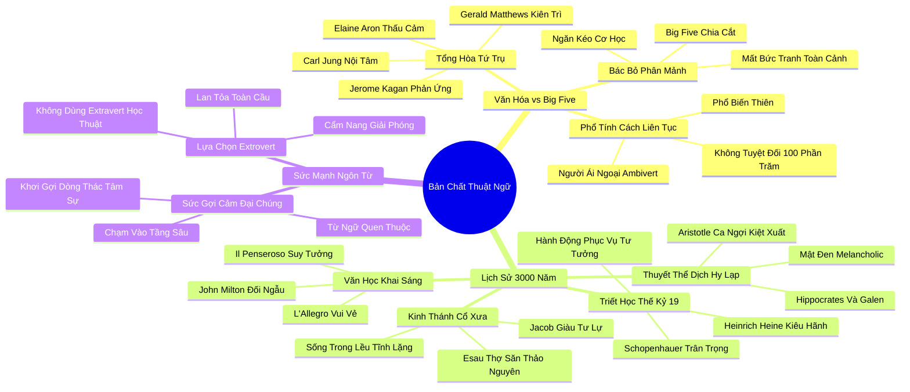

# 📖 TỔNG HỢP NỘI DUNG CHUYÊN SÂU: ĐÔI ĐIỀU VỀ CÁC THUẬT NGỮ HƯỚNG NỘI VÀ HƯỚNG NGOẠI (A NOTE ON THE WORDS INTROVERT AND EXTROVERT)

### 🎯 THÔNG ĐIỆP CỐT LÕI (1 - 2 CÂU)
Hai thuật ngữ "Hướng nội" và "Hướng ngoại" không đơn thuần là những phân loại học thuật cứng nhắc của thuyết Năm Yếu Tố (Big Five), mà là kết tinh của một truyền thống triết học, văn hóa và văn học kéo dài hơn 3.000 năm của phương Tây về cuộc đối thoại bất tận giữa "Con người của Hành động" và "Con người của Tư tưởng".

---

### 📊 LƯỢC ĐỒ PHÂN BỔ CẤU TRÚC TÀI LIỆU
Bảng đối chiếu cấu trúc các phần trong tài liệu gốc và số lượng luận điểm chuyên sâu được khai phóng:

| Phần / Mục Trong Tài Liệu Gốc | Trọng Tâm Phân Tích | Số Luận Điểm | Tỷ Trọng Tri Thức |
| :--- | :--- | :---: | :---: |
| **Phần 1: Định Nghĩa Văn Hóa vs Phân Loại Big Five** | Bác bỏ sự chia cắt cơ học của Big Five; kế thừa Carl Jung, Jerome Kagan, Elaine Aron, Gerald Matthews | 3 luận điểm | 35% |
| **Phần 2: Truyền Thống 3.000 Năm Nhị Nguyên Phương Tây** | Jacob vs Esau trong Kinh Thánh; Thuyết 4 thể dịch Hy Lạp; John Milton (Il Penseroso vs L'Allegro); Schopenhauer & Heine | 3 luận điểm | 35% |
| **Phần 3: Sức Mạnh Gợi Cảm Của Ngôn Từ Đại Chúng** | Lý do giữ lại hai từ Introvert & Extrovert; Cách viết phổ biến; Khơi gợi dòng thác tự nhận thức xã hội | 2 luận điểm | 30% |
| **TỔNG CỘNG** | **Toàn bộ cấu trúc Phần Ghi Chú** | **8 luận điểm** | **100%** |

---

### 💡 8 LUẬN ĐIỂM CHUYÊN SÂU THEO TỪNG PHẦN TÀI LIỆU

#### 📑 PHẦN 1: ĐỊNH NGHĨA VĂN HÓA VS PHÂN LOẠI BIG FIVE

1. **Sự Hạn Hẹp Cơ Học Của Mô Hình Năm Yếu Tố (Big Five):**
   - *Phân tích chuyên sâu:* Các nhà tâm lý học thực nghiệm đương đại theo trường phái Big Five thường tách rời các đặc tính nhân cách thành các ngăn kéo riêng biệt: họ xếp tính giàu lý trí và đời sống nội tâm phong phú vào nhóm "Sẵn sàng trải nghiệm" (Openness to Experience); xếp lương tri và tính cẩn trọng vào nhóm "Tận tâm" (Conscientiousness); và xếp sự bẽn lẽn, e dè vào nhóm "Nhạy cảm lo âu" (Neuroticism). Susan Cain chỉ ra rằng cách tiếp cận chia cắt này làm mất đi bức tranh toàn cảnh sống động về con người hướng nội trong đời sống văn hóa thực tế.
   - *Công cụ / Phương pháp đi kèm:* Phê Phán Mô Thức Phân Mảnh Big Five (Critique of Big Five Atomism).
   - *Ví dụ thực chiến:* Trong đời thực, một người hướng nội hiếm khi chỉ đơn thuần là "ít nói"; họ hầu như luôn mang theo một gói phẩm chất kết hợp gồm: suy tư sâu, nhạy cảm đạo đức, cẩn trọng rủi ro và tình yêu mãnh liệt với sự tĩnh mịch.

2. **Định Nghĩa Tổng Hòa Đa Tầng Của Susan Cain:**
   - *Phân tích chuyên sâu:* Tác giả chủ đích sử dụng định nghĩa "Người hướng nội" theo nghĩa rộng mở và phong phú nhất, là sự kết tinh của 4 trụ cột khoa học đỉnh cao:
     - **Tư tưởng Carl Jung:** Thế giới nội tâm mang sức hút vô tận và trải nghiệm chủ quan sâu lắng.
     - **Jerome Kagan (Harvard):** Hệ thần kinh phản ứng cao (High-reactivity) và bản tính thận trọng.
     - **Elaine Aron:** Độ nhạy cảm xử lý giác quan (Sensory Processing Sensitivity) và năng lực thấu cảm đạo đức.
     - **Gerald Matthews:** Khả năng tập trung cao độ và lòng kiên trì giải quyết các vấn đề phức tạp.
   - *Công cụ / Phương pháp đi kèm:* Khung Định Nghĩa Tổng Hòa Tứ Trụ (Four-Pillar Integrative Definition).
   - *Ví dụ thực chiến:* Mô hình này giúp giải thích tại sao một nhà khoa học như Albert Einstein vừa là người trầm lặng, vừa có trí tưởng tượng không gian vĩ đại, vừa kiên trì hàng chục năm giải một phương trình toán học.

3. **Phổ Tính Cách Liên Tục Và Sự Tồn Tại Của Người Ái Ngoại (Ambiverts):**
   - *Phân tích chuyên sâu:* Không có ai là người hướng nội tuyệt đối 100% hay hướng ngoại 100% (như Carl Jung từng cảnh báo: "Một người như thế sẽ nằm trong trại tâm thần"). Hướng nội và hướng ngoại là một phổ liên tục (Continuum). Phần lớn chúng ta nằm ở các mức độ khác nhau trên phổ này, và có một nhóm người đáng kể nằm ở chính giữa được gọi là "Người ái ngoại" (Ambiverts) – sở hữu khả năng cân bằng linh hoạt giữa nhu cầu giao lưu và sự tĩnh lặng tùy theo bối cảnh.
   - *Công cụ / Phương pháp đi kèm:* Thang Đo Phổ Tính Cách Liên Tục (Introvert-Extrovert Continuum).
   - *Ví dụ thực chiến:* Một người có thể rất thích đọc sách một mình vào ban ngày nhưng lại rất hào hứng và duyên dáng khi dẫn dắt một buổi thảo luận chuyên đề nhỏ vào buổi tối.

---

#### 📑 PHẦN 2: TRUYỀN THỐNG 3.000 NĂM NHỊ QUYÊN PHƯƠNG TÂY

4. **Kinh Thánh Cổ Xưa: Mối Thù Anh Em Giữa Jacob Và Esau:**
   - *Phân tích chuyên sâu:* Ngay từ sách Sáng Thế Ký trong Cựu Ước, nhân loại đã chứng kiến sự phân cực tính cách nguyên thủy: Esau là một thợ săn dũng mãnh, con người của thảo nguyên bao la, người của hành động và cơ bắp; trong khi Jacob là một người đàn ông trầm lặng, giàu tư lự, thích sống trong các căn lều yên tĩnh. Cuộc vật lộn nội tâm của Jacob với Thượng đế để trở thành Israel tượng trưng cho sức mạnh tinh thần bất khuất của người hướng nội trước bạo lực cơ bắp.
   - *Công cụ / Phương pháp đi kèm:* Phân Tích Cổ Mẫu Kinh Thánh (Biblical Archetype Analysis).
   - *Ví dụ thực chiến:* Câu chuyện Jacob và Esau là tấm gương phản chiếu sự đối đầu muôn thuở giữa các tướng lĩnh quân sự xông xáo và các nhà tư tưởng âm thầm định hình linh hồn dân tộc.

5. **Thời Cổ Đại Hy Lạp - La Mã: Thuyết Bốn Thể Dịch Của Hippocrates & Galen:**
   - *Phân tích chuyên sâu:* Các danh y Hy Lạp và La Mã cổ đại chia tính khí con người theo 4 thể dịch:
     - Máu và Dịch mật vàng dư thừa: Người hoạt bát (Sanguine) hoặc nóng nảy (Choleric) – tương ứng với tính hướng ngoại.
     - Chất nhầy và Dịch mật đen dư thừa: Người điềm tĩnh (Phlegmatic) hoặc u uất (Melancholic) – tương ứng với tính hướng nội.
     - Đại triết gia Aristotle đưa ra nhận định bất hủ: Khí chất "u uất" (Melancholy) không phải là một căn bệnh, mà chính là chiếc nôi sản sinh ra sự kiệt xuất trong triết học, thi ca, chính trị và nghệ thuật.
   - *Công cụ / Phương pháp đi kèm:* Bảng Thể Dịch Tính Khí Cổ Điển (Humoral Temperament Grid).
   - *Ví dụ thực chiến:* Những tác phẩm triết học vĩ đại của Plato hay các bản bi kịch kinh điển của Sophocles đều mang dấu ấn đậm nét của khí chất trầm tư u uất.

6. **Thời Kỳ Khai Sáng Và Chủ Nghĩa Lãng Mạn: Milton, Schopenhauer & Heine:**
   - *Phân tích chuyên sâu:* Thế kỷ 17, thi hào John Milton viết nên hai thi phẩm đối ngẫu bất hủ: "L'Allegro" (Người vui vẻ rong chơi nơi phố thị náo nhiệt) và "Il Penseroso" (Người suy tưởng cô độc giữa rừng đêm và ngọn tháp tri thức). Thế kỷ 19, triết gia Arthur Schopenhauer khẳng định những tâm hồn thông tuệ nhất luôn tìm thấy hạnh phúc trong sự tĩnh lặng; và nhà thơ Heinrich Heine cảnh báo đầy kiêu hãnh: "Hỡi những con người hành động đầy kiêu hãnh, các người chẳng qua chỉ là những công cụ vô thức phục vụ cho những con người của tư tưởng mà thôi!".
   - *Công cụ / Phương pháp đi kèm:* Bản Đồ Văn Học Về Tính Hướng Nội (Literary Genealogy of Introversion).
   - *Ví dụ thực chiến:* Toàn bộ các cuộc cách mạng chính trị và công nghệ làm rung chuyển thế giới thực chất đều bắt nguồn từ những ý tưởng được thai nghén trong các căn phòng đọc sách cô đơn của các nhà tư tưởng Khai sáng.

---

#### 📑 PHẦN 3: SỨC MẠNH GỢI CẢM CỦA NGÔN TỪ ĐẠI CHÚNG

7. **Lý Do Tác Giả Giữ Lại Hai Từ "Introvert" Và "Extrovert":**
   - *Phân tích chuyên sâu:* Susan Cain từng cân nhắc sáng tạo ra các thuật ngữ mới để tránh những định kiến học thuật. Nhưng bà quyết định giữ lại hai từ "Hướng nội" (Introvert) và "Hướng ngoại" (Extrovert) vì sức gợi cảm vô song của chúng trong văn hóa đại chúng. Khi được phát âm lên, hai từ này lập tức chạm vào tầng sâu tiềm thức của con người, mở ra một dòng thác tâm sự, những ký ức tuổi thơ và khát khao được thấu hiểu mà không một thuật ngữ kỹ thuật nào có thể thay thế được.
   - *Công cụ / Phương pháp đi kèm:* Sức Mạnh Cộng Hưởng Của Ngôn Từ Đại Chúng (Vernacular Resonance Power).
   - *Ví dụ thực chiến:* Khi Susan Cain nói về "Tính hướng nội" trong các cuộc trò chuyện tình cờ trên máy bay hay tại bữa tiệc, ngay lập tức những người đối diện cởi mở chia sẻ những nỗi đau thầm kín nhất mà họ chưa từng kể với ai.

8. **Sự Lựa Chọn Cách Viết Phổ Biến "Extrovert" Thay Vì "Extravert":**
   - *Phân tích chuyên sâu:* Trong các tài liệu nghiên cứu tâm lý học chuyên sâu, từ này thường được viết là "extravert" (theo gốc Latinh 'extra' nghĩa là bên ngoài). Tuy nhiên, Susan Cain quyết định sử dụng cách viết phổ thông đại chúng là "extrovert". Quyết định này mang tính biểu tượng sâu sắc: cuốn sách Quiet không được viết ra để nằm im lìm trong các thư viện học thuật hàn lâm, mà được viết ra để trở thành một cuốn cẩm nang giải phóng nhân cách cho hàng trăm triệu con người bình dị trong đời sống thực.
   - *Công cụ / Phương pháp đi kèm:* Chiến Lược Truyền Thông Đại Chúng Học Thuật (Public Intellectual Writing Strategy).
   - *Ví dụ thực chiến:* Cuốn sách Quiet đã được dịch ra hơn 40 ngôn ngữ, bán được hàng triệu bản và châm ngòi cho một phong trào xã hội toàn cầu tái định nghĩa giá trị của sự tĩnh lặng.

---

### 🛠️ KẾ HOẠCH HÀNH ĐỘNG THỰC THI (12 HÀNH ĐỘNG)

#### TẦNG 1: HÀNH VI VI MÔ TỨC THÌ (< 2 PHÚT)
- [ ] **Nhận diện bản thân trên phổ liên tục:** Tự định vị xem hôm nay bạn đang cảm thấy mình nằm ở điểm nào trên phổ từ Hướng nội đến Hướng ngoại.
- [ ] **Dùng từ "Hướng nội" với niềm kiêu hãnh:** Tự tin nói "Tôi là người hướng nội" như một lời giới thiệu về một phẩm chất tích cực, không phải là một lời xin lỗi.
- [ ] **Dừng lại trước khi dán nhãn người khác:** Khi gặp một người ít nói, không vội phán xét họ lạnh lùng mà nhận diện chiều sâu tư tưởng của họ.
- [ ] **Nhớ về lời cảnh báo của Heine:** Tự nhủ mỗi khi bị cuốn vào guồng quay hành động mù quáng: "Tư tưởng mới là kẻ dẫn đường thực sự".

#### TẦNG 2: THÓI QUEN & QUY TRÌNH TUẦN
- [ ] **Đọc lại thi phẩm Il Penseroso:** Dành 20 phút cuối tuần đọc bản dịch bài thơ "Người suy tưởng" của John Milton để cảm nhận vẻ đẹp của sự tĩnh mịch.
- [ ] **Rà soát 4 phẩm chất tổng hòa:** Đánh giá xem bản thân đang phát triển như thế nào ở cả 4 khía cạnh: Đời sống nội tâm, Nhạy cảm giác quan, Cẩn trọng rủi ro và Tập trung sâu.
- [ ] **Thảo luận về người Ái ngoại (Ambivert):** Chia sẻ khái niệm Ambivert với bạn bè và đồng nghiệp để giúp mọi người thấu hiểu tính linh hoạt của tính cách.
- [ ] **Chiêm nghiệm di sản triết học phương Tây:** Đọc lại các đoạn trích của Schopenhauer hoặc Aristotle về sự gắn kết giữa tính u uất và sự kiệt xuất sáng tạo.

#### TẦNG 3: CHUYỂN HÓA CHIẾN LƯỢC DÀI HẠN
- [ ] **Xây dựng phong cách sống tích hợp Tư tưởng - Hành động:** Dung hòa giữa năng lực chiêm nghiệm sâu sắc của Jacob và sự quyết đoán thực tế của Esau trong sự nghiệp.
- [ ] **Cổ vũ cách tiếp cận tâm lý học nhân văn:** Ủng hộ các quan điểm tâm lý học nhìn nhận con người toàn diện thay vì chia cắt thành các chỉ số kiểm tra máy móc.
- [ ] **Đưa tri thức văn hóa vào đào tạo nhân sự:** Sử dụng lịch sử 3.000 năm của tính cách để giải thích cho ban lãnh đạo hiểu về tầm quan trọng của việc tôn trọng người trầm lặng.
- [ ] **Tham gia phong trào Quiet Revolution:** Đóng góp vào các sáng kiến xã hội nhằm xây dựng trường học và nơi làm việc thân thiện với mọi kiểu thần kinh.

---

### ❓ BỘ CÂU HỎI TỰ NGẪM (20 CÂU HỎI)

#### NHÓM 1: TỰ VẤN NHẬN THỨC & THẤU HIỂU BẢN THÂN
1. Khi nghe hai từ "Hướng nội", cảm xúc đầu tiên xuất hiện trong tâm trí tôi là gì: sự tự hào, bình yên hay vẫn còn chút gượng gạo?
2. Tôi là một người nghiêng hẳn về cực hướng nội, hay tôi là một "Người ái ngoại" (Ambivert) có thể linh hoạt chuyển đổi tùy hoàn cảnh?
3. Đời sống nội tâm của tôi có thực sự là một "thế giới mang sức hút vô tận" như Carl Jung từng miêu tả?
4. Tôi cảm thấy gần gũi hơn với hình tượng nào trong thi phẩm của Milton: chàng L'Allegro hoan hỷ nơi phố thị hay chàng Il Penseroso suy tưởng giữa rừng đêm?
5. Tôi có đang sở hữu khí chất "u uất" sáng tạo mà đại triết gia Aristotle từng ca ngợi như nguồn cội của triết học và nghệ thuật?

#### NHÓM 2: ĐÁNH GIÁ THỰC TRẠNG & RÀ SOÁT THÓI QUEN
6. Môi trường xung quanh tôi có đang nhìn nhận tính hướng nội theo nghĩa hẹp tiêu cực (nhút nhát, lập dị) hay theo nghĩa rộng nhân văn?
7. Tôi có thói quen đánh giá một con người dựa trên các bài trắc nghiệm tính cách máy móc hay nhìn nhận họ như một chỉnh thể sống động?
8. Trong các cuộc đối thoại hàng ngày, tôi đóng vai trò là "con người của hành động" hay "con người của tư tưởng"?
9. Tôi có thường xuyên dành thời gian nuôi dưỡng chiều sâu tâm hồn qua việc đọc sách, thưởng thức nghệ thuật và chiêm nghiệm cuộc sống?
10. Những người xung quanh tôi có biết và tôn trọng vị trí của tôi trên phổ tính cách liên tục hay không?

#### NHÓM 3: THÁCH THỨC NIỀM TIN CŨ & PHÁ VỠ ĐỊNH KIẾN
11. Liệu mô hình Big Five của tâm lý học thực nghiệm có thực sự nắm bắt được toàn bộ vẻ đẹp và sự phức tạp của tâm hồn con người?
12. Có phải "con người của hành động" luôn vượt trội hơn "con người của tư tưởng", hay hành động không có tư tưởng dẫn đường chỉ là sự phá hoại mù quáng?
13. Tại sao trong suốt 3.000 năm lịch sử, nhân loại luôn gắn kết sự tĩnh lặng với trí tuệ uyên bác và sự thánh thiện?
14. Việc một người có thể hòa đồng trong một bữa tiệc có chứng minh rằng họ không phải là một người hướng nội đích thực?
15. Liệu các thuật ngữ tính cách là những chiếc nhãn dán giam cầm con người hay là những chiếc chìa khóa giúp chúng ta tự giải thoát?

#### NHÓM 4: THIẾT KẾ GIẢI PHÁP & HÀNH ĐỘNG KIẾN TẠO
16. Tôi sẽ sử dụng định nghĩa tổng hòa của Susan Cain như thế nào để giải thích bản thân một cách đĩnh đạc và thuyết phục trước gia đình và đồng nghiệp?
17. Làm thế nào để tôi có thể phát huy tối đa sức mạnh của cả 4 phẩm chất: nội tâm phong phú, nhạy cảm thấu cảm, cẩn trọng rủi ro và tập trung sâu?
18. Tôi có thể xây dựng một mối quan hệ cộng sinh kiểu "Jacob - Esau" nào trong công việc để kết hợp giữa tư tưởng chiến lược và hành động thực thi?
19. Những cuốn sách triết học hoặc văn học kinh điển nào tôi sẽ tìm đọc để làm giàu thêm hiểu biết về cội nguồn văn hóa của tính cách?
20. Tôi sẽ đóng góp điều gì để giúp xã hội hiện đại tái lập sự cân bằng thiêng liêng giữa hành động thực dụng và tư tưởng trầm lặng?

---

### 🗺️ MINDMAP 4-5 TẦNG TRỰC QUAN ĐỈNH CAO

