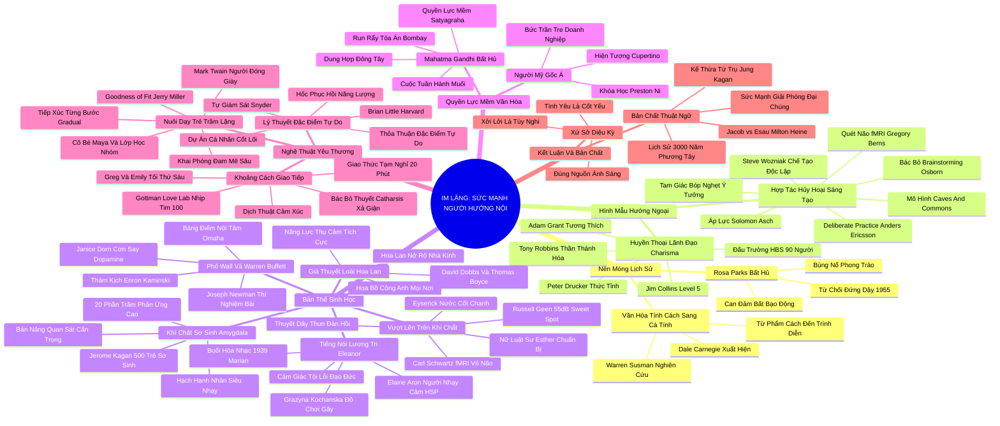

# 🗺️ MASTER BẢN ĐỒ TƯ DUY & BẢNG TRA CỨU NEO TRÍ NHỚ: IM LẶNG - SỨC MẠNH CỦA NGƯỜI HƯỚNG NỘI TRONG MỘT THẾ GIỚI KHÔNG THỂ NGỪNG NÓI

---

## 1. MASTER HỆ THỐNG PHẢ HỆ TRI THỨC TOÀN CUỐN SÁCH (ACTIVE RECALL HIERARCHY)

---

## 2. MASTER BẢNG TRA CỨU NEO TRÍ NHỚ SIÊU TỐC (FLASHCARD CHEAT SHEET)

| 📑 Phần / Chương | Khái Niệm / Từ Khóa Vàng | Bản Chất Cốt Lõi | Cảnh Báo Sai Lầm Phổ Biến | Hành Động Ứng Dụng Đột Phá |
| :--- | :--- | :--- | :--- | :--- |
| **01-Introduction** | **Extrovert Ideal** | Chuẩn mực văn hóa coi người hoạt ngôn, tự tin lấn át là hình mẫu lý tưởng duy nhất. | Nhầm lẫn sự hoạt ngôn với trí thông minh và năng lực lãnh đạo thực chất. | Nhận diện và giải phóng bản thân khỏi áp lực phải bắt chước người hướng ngoại. |
| **02-Chapter-01** | **Culture of Personality** | Sự chuyển dịch từ coi trọng Phẩm cách (Character) sang tôn sùng Vẻ ngoài cá tính (Personality). | Đánh giá giá trị con người qua sức hút bề ngoài thay vì sự chính trực nội tâm. | Xây dựng uy tín dựa trên năng lực chuyên môn và đạo đức vững chắc. |
| **03-Chapter-02** | **Level 5 & Grant Matrix** | Lãnh đạo khiêm nhường bứt phá vượt trội khi làm việc cùng nhân viên chủ động (proactive). | Bổ nhiệm các CEO ngôi sao hào nhoáng khiến cấp dưới im lặng không dám phản biện. | Ghép đôi người đứng đầu biết lắng nghe với đội ngũ nhân sự giàu sáng kiến. |
| **04-Chapter-03** | **Deliberate Practice** | Các phát minh vĩ đại luôn được thai nghén trong sự cô độc tập trung rèn luyện có chủ đích. | Ép buộc làm việc nhóm và văn phòng mở 100% bóp nghẹt tư duy sâu. | Thiết kế mô hình Caves and Commons: buồng tĩnh lặng kết hợp quảng trường chung. |
| **05-Chapter-04** | **Orchid Hypothesis** | Người có hệ thần kinh nhạy cảm héo tàn trong nghịch cảnh nhưng thăng hoa rực rỡ trong an toàn. | Coi tính nhạy cảm như một khuyết tật tâm lý cần phải loại bỏ bằng mọi giá. | Tự thiết kế một "nhà kính tinh thần" an toàn để phát huy tối đa tiềm năng. |
| **06-Chapter-05** | **Rubber Band & Sweet Spot** | Tính cách có thể co giãn linh hoạt nhưng phải quay về điểm neo tối ưu để tránh đứt gãy. | Bắt buộc bản thân diễn xuất liên tục không có thời gian phục hồi sinh học. | Xác định chính xác vùng kích thích ưa thích (55dB) và bảo vệ nó nghiêm ngặt. |
| **07-Chapter-06** | **Quiet Moral Courage** | Lòng dũng cảm xuất phát từ tiếng nói lương tri và lòng trắc ẩn thấu cảm sâu sắc (Eleanor). | Nhầm lẫn sự im lặng nhút nhát với sự hèn nhát trước cường quyền và bất công. | Kiên định hành động theo la bàn đạo đức nội tâm bất chấp sự cô lập của đám đông. |
| **08-Chapter-07** | **Inner Scorecard** | Đo lường giá trị bản thân bằng nguyên tắc nội tại; miễn nhiễm với cơn say dopamine (Buffett). | Chạy theo các cơn sốt đầu cơ và tiêu dùng xa xỉ chỉ để gây ấn tượng với xã hội. | Chịu đựng sự buồn tẻ kiên nhẫn và đầu tư giá trị ngược dòng khi đám đông sợ hãi. |
| **09-Chapter-08** | **Satyagraha Soft Power** | Quyền lực mềm phương Đông: sức mạnh của sự điềm tĩnh và lòng kiên định không bạo lực (Gandhi). | Dùng âm lượng to và sự đe dọa để áp chế người khác trong đàm phán. | Lãnh đạo bằng sự gương mẫu đạo đức và sức nặng của chân lý không thể lay chuyển. |
| **10-Chapter-09** | **Free Trait Agreement** | Kéo giãn bản thân vì Dự án Cá nhân Cốt lõi; bảo vệ nghiêm ngặt các Hốc Phục Hồi Năng Lượng. | Đóng kịch hướng ngoại vì tư lợi hoặc quên thiết lập ranh giới nghỉ ngơi. | Đàm phán hạn ngạch giao tiếp rõ ràng với bạn đời và cấp trên để giữ gìn sinh lực. |
| **11-Chapter-10** | **20-Minute Time-Out** | Tạm dừng 20 phút khi nhịp tim vượt 100 bpm để hạ nhiệt sinh lý trước khi tiếp tục đối thoại. | Tin vào thuyết xả cảm (Catharsis) to tiếng cãi vã làm tổn thương hệ thần kinh. | Sử dụng từ điển dịch thuật cảm xúc: hiểu im lặng là quá tải, to tiếng là bất an. |
| **12-Chapter-11** | **Goodness of Fit** | Sự tương thích nuôi dưỡng: dẫn dắt trẻ tiếp xúc từng bước và khai phóng đam mê sâu sắc. | Dán nhãn "nhút nhát" lên con và ép con tham gia các lớp học biểu diễn ồn ào. | Cung cấp góc tổ kén tĩnh lặng và khẳng định tình yêu thương vô điều kiện với con. |
| **13-Conclusion** | **Right Lighting** | Tình yêu là cốt yếu, xởi lởi chỉ là tùy nghi; đặt bản thân vào đúng nguồn ánh sáng tương thích. | Cố gắng chen chúc dưới ánh đèn sân khấu náo loạn khi tâm hồn cần sự tĩnh lặng. | Tự hào sống một cuộc đời trọn vẹn và cống hiến bằng quyền lực mềm lương tri. |
| **14-Note** | **3000-Year Heritage** | Kế thừa cuộc đối thoại 3.000 năm giữa Con người Hành động và Con người Tư tưởng. | Đánh giá con người bằng các bài test tính cách máy móc, phân mảnh cơ học. | Thấu cảm và trân trọng sự đa dạng thần kinh như chiếc chìa khóa tiến bộ nhân loại. |
