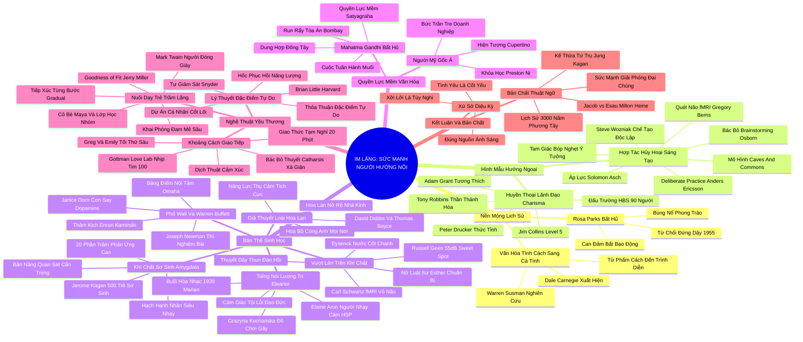

# 📚 TỔNG QUAN TÁC PHẨM TOÀN NĂNG: IM LẶNG - SỨC MẠNH CỦA NGƯỜI HƯỚNG NỘI TRONG MỘT THẾ GIỚI KHÔNG THỂ NGỪNG NÓI (QUIET: THE POWER OF INTROVERTS)
## Tác giả: Susan Cain | Chuẩn hóa Kiến trúc Tri thức v2.4 (Document Structure-Anchored)

---

### 🎯 THÔNG ĐIỆP CỐT LÕI TOÀN BỘ TÁC PHẨM (1 - 2 CÂU)
Thế giới hiện đại đang mắc kẹt trong ảo tưởng tai hại khi tôn sùng Hình mẫu Hướng ngoại Lý tưởng và Tư duy Tập thể ồn ào; thế nhưng, chính sức mạnh trầm lặng của sự cô độc sâu sắc, lòng trắc ẩn thấu cảm và năng lực bám trụ vào Bảng điểm nội tâm của những người hướng nội mới là động lực tối thượng định hình những phát minh vĩ đại, sự thịnh vượng bền vững và tiến bộ nhân loại.

---

### 📊 LƯỢC ĐỒ PHÂN BỔ CẤU TRÚC TOÀN BỘ TÁC PHẨM
Bảng đối chiếu toàn bộ 15 đơn vị tài liệu (Lời tác giả, Lời mở đầu, 11 Chương chính, Phần Kết luận, Ghi chú thuật ngữ) trong công trình kinh điển của Susan Cain:

| Thứ Tự | Mã Chương / Phần | Tiêu Đề Chương & Trọng Tâm Học Thuật | Số Luận Điểm | Tỷ Trọng Tri Thức |
| :---: | :--- | :--- | :---: | :---: |
| 00 | **00-Author-Note** | Lời Tác Giả: Phương pháp nghiên cứu, tính chân thực của các câu chuyện và đạo đức tài liệu | 5 luận điểm | 4% |
| 01 | **01-Introduction** | Lời Mở Đầu: Lịch sử Rosa Parks & Sự trỗi dậy của Hình mẫu Hướng ngoại Lý tưởng | 10 luận điểm | 7% |
| 02 | **02-Chapter-01** | Phần 1: Sự trỗi dậy của "Kẻ quyến rũ vĩ đại" - Từ Nền văn hóa Tính cách đến Nền văn hóa Cá tính | 12 luận điểm | 8% |
| 03 | **03-Chapter-02** | Phần 1: Huyền thoại về nhà lãnh đạo Charisma - HBS, Tony Robbins, Jim Collins, Adam Grant | 12 luận điểm | 8% |
| 04 | **04-Chapter-03** | Phần 1: Khi sự hợp tác hủy hoại sáng tạo - Steve Wozniak, Deliberate Practice, Bác bỏ Brainstorming | 12 luận điểm | 8% |
| 05 | **05-Chapter-04** | Phần 2: Bản thể sinh học - Thí nghiệm Kagan, Hạch hạnh nhân Amygdala, Giả thuyết Hoa Lan | 12 luận điểm | 8% |
| 06 | **06-Chapter-05** | Phần 2: Vượt lên trên khí chất - Ý chí tự do, Vỏ não trước trán, Thuyết dây thun, Vùng tối ưu | 12 luận điểm | 8% |
| 07 | **07-Chapter-06** | Phần 2: Tiếng nói lương tri - Eleanor Roosevelt, Người nhạy cảm cao HSP, Thí nghiệm Kochanska | 12 luận điểm | 8% |
| 08 | **08-Chapter-07** | Phần 2: Phố Wall & Warren Buffett - Cơn say Dopamine, Trò chơi Newman, Thảm kịch Enron, Inner Scorecard | 12 luận điểm | 8% |
| 09 | **09-Chapter-08** | Phần 3: Quyền lực mềm - Người Mỹ gốc Á, Bức trần tre, Preston Ni, Bài học Mahatma Gandhi Satyagraha | 12 luận điểm | 8% |
| 10 | **10-Chapter-09** | Phần 4: Nghệ thuật diễn xuất - Brian Little, Thuyết Đặc điểm Tự do, Hốc phục hồi, Thỏa thuận cá nhân | 12 luận điểm | 8% |
| 11 | **11-Chapter-10** | Phần 4: Khoảng cách giao tiếp - Greg & Emily, Gottman Love Lab, Bác bỏ Catharsis, Giao thức 20 phút | 12 luận điểm | 8% |
| 12 | **12-Chapter-11** | Phần 4: Nuôi dạy trẻ trầm lặng - Ngụ ngôn Mark Twain, Goodness of Fit, Maya, Gradual Exposure | 12 luận điểm | 8% |
| 13 | **13-Conclusion** | Kết Luận: Xứ sở diệu kỳ - Tình yêu là cốt yếu, Đặt mình vào đúng nguồn ánh sáng, Di sản tương lai | 9 luận điểm | 5% |
| 14 | **14-Note** | Ghi Chú: Thuật ngữ Hướng nội/Hướng ngoại - Kế thừa Jung, Kagan, Lịch sử 3.000 năm nhị nguyên | 8 luận điểm | 4% |
| **TỔNG** | **15 ĐƠN VỊ** | **TOÀN BỘ KIẾN TRÚC TÁC PHẨM "QUIET"** | **164 LUẬN ĐIỂM** | **100%** |

---

### 💡 16 LUẬN ĐIỂM BẬC THẦY ĐẠI DIỆN 4 PHẦN TÁC PHẨM

#### 📑 LỜI MỞ ĐẦU & NỀN MÓNG LỊCH SỬ (CHAPTER 00 - 01)
1. **Sức Mạnh Của Lòng Can Trường Bất Bạo Động (Rosa Parks):** Phong trào dân quyền Mỹ bùng nổ không phải từ một kẻ to tiếng, mà từ một người phụ nữ da màu trầm lặng, nhỏ bé nhưng kiên định nói "Không" trước sự bất công trên chuyến xe buýt Montgomery năm 1955.
2. **Sự Đảo Lộn Lịch Sử Từ Văn Hóa Tính Cách Sang Văn Hóa Cá Tính (Warren Susman):** Thế kỷ 20 đánh dấu bước ngoặt thoái trào khi xã hội phương Tây từ bỏ lý tưởng tôn vinh "Phẩm cách nội tâm" (Character - đức hạnh, chính trực) để chạy theo "Cá tính biểu diễn" (Personality - sự hấp dẫn, cuốn hút bề ngoài).

#### 📑 PHẦN 1: HÌNH MẪU HƯỚNG NGOẠI LÝ TƯỞNG (CHAPTER 01 - 03)
3. **Ảo Tưởng Về Nhà Lãnh Đạo Charisma:** Trường Kinh doanh Harvard (HBS) và các diễn giả triệu đô như Tony Robbins cổ xúy tư duy hành động tức thì; nhưng Jim Collins đã chứng minh 100% CEO vĩ đại nhảy vọt thuộc Cấp độ 5 – những người khiêm nhường tột bậc và có ý chí sắt đá.
4. **Quy Luật Tương Thích Lãnh Đạo Của Adam Grant:** Lãnh đạo hướng nội đạt hiệu quả tài chính và năng suất vượt trội hơn hẳn lãnh đạo hướng ngoại khi làm việc cùng đội ngũ nhân viên chủ động (proactive) nhờ khả năng lắng nghe và không áp đặt cái tôi.
5. **Cái Bẫy Của Tư Duy Tập Thể Mới (The New Groupthink):** Văn phòng mở và phương pháp động não tập thể (Brainstorming) bóp nghẹt sáng tạo do hiện tượng ỷ lại xã hội, chặn dòng tư duy và nỗi sợ bị đánh giá; Steve Wozniak chế tạo ra máy tính Apple I trong sự cô độc tuyệt đối.
6. **Luyện Tập Có Chủ Đích (Deliberate Practice) Trong Tĩnh Lặng:** Anders Ericsson chứng minh năng lực chuyên môn đỉnh cao của các bậc thầy nhân loại chỉ được hun đúc qua hàng nghìn giờ tự rèn luyện một mình ở ranh giới năng lực cá nhân.

#### 📑 PHẦN 2: BẢN THỂ SINH HỌC & TÍNH CÁCH (CHAPTER 04 - 07)
7. **Khí Chất Bẩm Sinh Của Hạch Hạnh Nhân (Jerome Kagan):** 20% trẻ sơ sinh phản ứng cao quẫy đạp dữ dội trước kích thích lạ sẽ lớn lên thành người hướng nội trầm tĩnh do hạch hạnh nhân (Amygdala) có ngưỡng kích hoạt cực nhạy.
8. **Giả Thuyết Loài Hoa Lan (The Orchid Hypothesis):** Người nhạy cảm giống như hoa lan: héo tàn trong môi trường khắc nghiệt nhưng thăng hoa vượt trội về trí tuệ, nghệ thuật và kỹ năng khi được nuôi dưỡng trong môi trường an toàn và yêu thương.
9. **Thuyết Dây Thun & Vùng Kích Thích Tối Ưu (Sweet Spot):** Con người có thể dùng ý chí và vỏ não trước trán kéo giãn bản thân như chiếc dây thun để thích nghi xã hội, nhưng bắt buộc phải trở về "Vùng tối ưu" (55dB vs 72dB của Russell Geen) để bảo toàn sinh lực.
10. **Tiếng Nói Lương Tri Can Trường Của Eleanor Roosevelt:** Sự nhạy cảm xử lý giác quan (HSP của Elaine Aron) và cảm giác tội lỗi tích cực (Kochanska) là viên đá tảng kiến tạo nhân cách đạo đức và lòng dũng cảm bảo vệ phẩm giá con người.
11. **Sức Mạnh Của Bảng Điểm Nội Tâm (Warren Buffett):** Người hướng ngoại dễ say men dopamine dẫn đến cờ bạc tài chính (Phố Wall 2008, Enron); người hướng nội sống bằng "Bảng điểm nội tâm" (Inner Scorecard), kiên nhẫn chịu đựng sự buồn tẻ và bảo toàn sự thịnh vượng trường tồn.

#### 📑 PHẦN 3: ĐA DẠNG VĂN HÓA & QUYỀN LỰC MỀM (CHAPTER 08)
12. **Quyền Lực Mềm Phương Đông & Bài Học Satyagraha Của Gandhi:** Truyền thống phương Đông tôn vinh sự tĩnh lặng, khiêm nhường; phong trào Bất bạo động của Gandhi chứng minh rằng sự kiên định vào chân lý có thể đánh bại đế quốc hùng mạnh nhất mà không cần một viên đạn.

#### 📑 PHẦN 4: NGHỆ THUẬT YÊU THƯƠNG & LAO ĐỘNG (CHAPTER 09 - 11)
13. **Lý Thuyết Đặc Điểm Tự Do & Dự Án Cá Nhân Cốt Lõi (Brian Little):** Chúng ta có thể diễn xuất hướng ngoại vì những mục tiêu ý nghĩa và người ta yêu thương, miễn là bảo vệ nghiêm ngặt các "Hốc phục hồi năng lượng" (Restorative Niches).
14. **Cứu Vãn Hôn Nhân Bằng Giao Thức 20 Phút (John Gottman):** Bác bỏ thuyết xả cảm (Catharsis); khi xung đột vượt ngưỡng 100 nhịp/phút (Flooding), tạm dừng 20 phút để hạ nhiệt sinh học trước khi dùng từ điển dịch thuật cảm xúc thấu hiểu nhau.
15. **Nguyên Lý Nuôi Dạy Con Tương Thích (Goodness of Fit):** Tuyệt đối không dán nhãn "nhút nhát" lên con trẻ; áp dụng kỹ thuật tiếp xúc từng bước (Gradual Exposure) và khai phóng "Niềm say mê sâu sắc" (Uncovering Delights) để trẻ tự tin nở rộ.

#### 📑 KẾT LUẬN: BỨC THÔNG ĐIỆP BẤT HỦ (CONCLUSION & NOTE)
16. **Tình Yêu Là Cốt Yếu, Đặt Mình Vào Đúng Nguồn Ánh Sáng:** Hướng nội và hướng ngoại là cuộc đối thoại thiên niên kỷ 3.000 năm giữa Tư tưởng và Hành động; bí quyết tối thượng là can đảm đặt bản thân vào đúng nguồn ánh sáng tương thích để phụng sự nhân loại.

---

### 🛠️ KẾ HOẠCH HÀNH ĐỘNG THỰC THI BẬC THẦY (20 HÀNH ĐỘNG)

#### TẦNG 1: HÀNH VI VI MÔ TỨC THÌ (< 2 PHÚT)
- [ ] **Khẩu hiệu ánh sáng:** Dán câu châm ngôn: "Tình yêu là cốt yếu, xởi lởi chỉ là lựa chọn" lên góc làm việc cá nhân.
- [ ] **Quy tắc 3 giây trước phản hồi:** Dừng lại 3 giây hít thở sâu trước khi trả lời trong các cuộc đối thoại căng thẳng.
- [ ] **Ký hiệu hạ nhiệt khẩn cấp:** Thống nhất cử chỉ hình chữ T với người thân để tạm dừng cãi vã khi nhịp tim tăng cao.
- [ ] **Kích hoạt hốc phục hồi vi mô:** Nhắm mắt tựa lưng vào ghế, thở chậm 4-7-8 trong 90 giây sau mỗi cuộc họp ồn ào.
- [ ] **Xóa bỏ nhãn dán tiêu cực:** Thay thế từ "nhút nhát" bằng câu "đang cẩn trọng quan sát để làm quen".
- [ ] **Kiểm tra mức độ kích thích:** Hạ độ sáng màn hình và đeo tai nghe chống ồn khi cảm thấy quá tải giác quan.

#### TẦNG 2: THÓI QUEN & QUY TRÌNH TUẦN
- [ ] **Thiết lập Ngày Không Họp Hành (No-Meeting Day):** Khóa chết trọn vẹn 1 ngày trong tuần để làm việc sâu độc lập (Deep Work).
- [ ] **Áp dụng Kỹ thuật Nhóm Danh nghĩa (Brainwriting):** Yêu cầu mọi thành viên viết ý tưởng ra giấy trước khi thảo luận tập thể.
- [ ] **Thiết lập Thỏa thuận Đặc điểm Tự do trong gia đình:** Thống nhất hạn ngạch tiệc tùng xã giao tối đa không quá 2 buổi mỗi tuần.
- [ ] **Dành 5 giờ cho Deliberate Practice:** Dành riêng 60 phút mỗi sáng sớm thực hành kỹ năng cốt lõi trong đơn độc.
- [ ] **Rà soát danh mục theo Bảng điểm nội tâm:** Đánh giá các quyết định chi tiêu và đầu tư dựa trên giá trị thật thay vì sĩ diện.
- [ ] **Nuôi dưỡng đam mê sâu sắc của con cái:** Dành sáng thứ Bảy cùng con tìm hiểu chủ đề con say mê tại thư viện.
- [ ] **Lập nhật ký Hốc phục hồi:** Đánh giá năng lượng sinh học mỗi tối Chủ nhật để chuẩn bị nhịp thở cho tuần mới.

#### TẦNG 3: CHUYỂN HÓA CHIẾN LƯỢC DÀI HẠN
- [ ] **Tái cấu trúc không gian văn phòng theo mô hình Caves & Commons:** Bố trí 50% diện tích làm cabin tĩnh lặng cách âm tuyệt đối.
- [ ] **Cải cách tiêu chí tuyển dụng và thăng tiến:** Đưa năng lực tư duy độc lập và khả năng lắng nghe vào khung đánh giá lãnh đạo C-suite.
- [ ] **Ghép đôi cộng sinh Hướng nội - Hướng ngoại:** Bắt cặp chuyên gia nghiên cứu sâu với nhân sự phát triển kinh doanh trong mọi dự án lớn.
- [ ] **Xây dựng sự nghiệp xoay quanh Dự án Cá nhân Cốt lõi:** Kiên quyết chuyển dịch công việc về đúng "nguồn ánh sáng" tương thích sinh học.
- [ ] **Xóa bỏ văn hóa sùng bái sự lạnh lùng bất cần (Cool):** Lan tỏa giá trị của lòng trắc ẩn, sự thấu cảm và trách nhiệm xã hội trong cộng đồng.
- [ ] **Xây dựng pháo đài tài chính an toàn ngược dòng:** Tích lũy tiền mặt kiên nhẫn để đầu tư giá trị khi đám đông hoảng loạn tháo chạy.
- [ ] **Trở thành sứ giả của cuộc cách mạng tĩnh lặng (Quiet Revolution):** Truyền cảm hứng cho thế hệ trẻ tự hào sống đúng với bản thể trầm lặng.

---

### ❓ BỘ CÂU HỎI TỰ NGẪM BẬC THẦY (20 CÂU HỎI)

#### NHÓM 1: TỰ VẤN NHẬN THỨC & THẤU HIỂU BẢN THÂN
1. Tôi đã thực sự thấu hiểu và hòa giải với cấu trúc hệ thần kinh bẩm sinh của mình, hay vẫn đang cố ép mình đeo chiếc mặt nạ hướng ngoại?
2. Chiếc dây thun tính cách của tôi có thể kéo giãn tối đa trong bao lâu trước khi tôi rơi vào trạng thái kiệt quệ cảm xúc?
3. Tôi đang sống dựa trên Bảng điểm nội tâm (tiêu chuẩn của chính tôi) hay Bảng điểm bên ngoài (sự tán dương của xã hội)?
4. Cơ thể tôi phản ứng như thế nào trước những kích thích mạnh: là một cây bồ công anh dẻo dai hay một nhành hoa lan quý phái?
5. Đâu là những Dự án Cá nhân Cốt lõi thực sự xứng đáng để tôi kéo giãn bản thân bước ra sân khấu lớn?

#### NHÓM 2: ĐÁNH GIÁ THỰC TRẠNG & RÀ SOÁT THÓI QUEN
6. Nơi làm việc hiện tại của tôi đang hỗ trợ năng lực tập trung sâu hay đang biến tôi thành nạn nhân của sự phân tâm liên tục?
7. Trong các mối quan hệ thân thiết, chúng tôi đã có Thỏa thuận Đặc điểm Tự do rõ ràng hay vẫn liên tục tranh cãi về nhu cầu giao tiếp?
8. Các cuộc họp tại tổ chức của tôi có đang bị chi phối hoàn toàn bởi những người nói to nhất và nhanh nhất?
9. Tôi có thói quen dành ra các "Hốc phục hồi năng lượng" sau những sự kiện xã hội căng thẳng hay không?
10. Tôi có đang vô tình dán nhãn "nhút nhát" lên con cái hoặc những người trầm lặng xung quanh mình?

#### NHÓM 3: THÁCH THỨC NIỀM TIN CŨ & PHÁ VỠ ĐỊNH KIẾN
11. Liệu người nói nhiều và hoạt ngôn nhất có luôn là người thông minh và sở hữu giải pháp tối ưu nhất?
12. Có phải làm việc nhóm và văn phòng mở luôn thúc đẩy sáng tạo tốt hơn sự cô độc tập trung trong tĩnh lặng?
13. Tại sao xã hội chúng ta lại tôn vinh sự lạnh lùng bất cần hơn lòng trắc ẩn và sự nhạy cảm đạo đức sâu sắc?
14. Steve Wozniak hay Albert Einstein có thể thay đổi thế giới nếu họ bị bắt phải làm việc trong các văn phòng mở hiện đại ngày nay?
15. Liệu tính hướng nội có phải là một khuyết tật cần chữa trị, hay đó là chiếc ăng-ten đạo đức và sáng tạo tối thượng của nhân loại?

#### NHÓM 4: THIẾT KẾ GIẢI PHÁP & HÀNH ĐỘNG KIẾN TẠO
16. Tôi sẽ thiết kế lại không gian sống và lịch làm việc hàng tuần như thế nào để luôn nằm trong "nguồn ánh sáng" phù hợp nhất?
17. Những điều khoản cụ thể nào cần có trong bản hợp đồng hòa hợp tính cách mà tôi sẽ thỏa thuận với bạn đời/đồng nghiệp?
18. Tôi sẽ sử dụng "quyền lực mềm" và phong thái lãnh đạo Lắng nghe Cấp độ 5 như thế nào để dẫn dắt đội ngũ của mình?
19. Làm thế nào để tôi có thể bảo vệ và phát triển tài năng của những đứa trẻ trầm lặng trong một nền giáo dục quá tải âm thanh?
20. Kế hoạch cụ thể nào sẽ giúp tôi mang tiếng nói lương tri và chiều sâu trí tuệ của mình ra phụng sự cộng đồng và nhân loại?

---

### 🗺️ MASTER MINDMAP 4-5 TẦNG: TOÀN BỘ CÔNG TRÌNH "QUIET"

