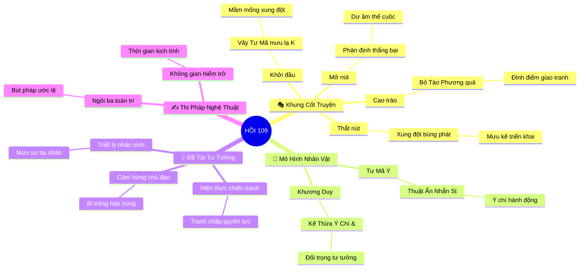

# 🎭 Tóm Tắt & Phân Tích Văn Học: Hồi 109: Vây Tư Mã, mưu lạ Khương Duy — Bỏ Tào Phương, quả báo nhà Ngụy

> **Đại Hồi Kỳ 11:** *Hậu Khổng Minh, Họ Tư Mã Soán Ngụy & Khương Duy Cửu Phạt* (Hồi 105 – 114)  
> **Chủ đề thời đại của Hồi Kỳ:** *Sự suy vong của các triều đại, chính biến lăng Cao Bình và chí kiên trinh của Khương Duy.*

---

## 1. Thông Điệp & Cảm Hứng Chủ Đạo (Core Message & Mood)
> *Hồi 109 khắc họa bước ngoặt lịch sử khi biến cố "Vây Tư Mã, mưu lạ Khương Duy" tương tác đa chiều với hành động "Bỏ Tào Phương, quả báo nhà Ngụy", thể hiện sâu sắc sự va chạm giữa mưu lược cá nhân và quy luật biến thiên của thời cuộc; qua đó làm nổi bật khí phách anh hùng và bài học nhân sinh sâu sắc trong thời loạn lạc.*

---

## 2. Khung Cốt Truyện & Biến Cố Chủ Đạo (Plot Arc & Core Events)

### 🎬 Trục Sự Kiện Tư Tưởng (4 Bước Ngoặt Chiến Lược)

1. **Khởi Đầu (Exposition): Bối Cảnh & Tiền Đề Xung Đột**
   - **Bối cảnh hồi:** Nằm trong mạch vận động của Đại Hồi Kỳ *Hậu Khổng Minh, Họ Tư Mã Soán Ngụy & Khương Duy Cửu Phạt*, cục diện chính trị và quân sự giữa các phe phái bước vào giai đoạn biến động mới.
   - **Nhân tố kích hoạt:** Biến cố mở đầu gắn liền với diễn biến *"Vây Tư Mã, mưu lạ Khương Duy"*, đặt các nhân vật chính vào tình thế bắt buộc phải đưa ra quyết định chiến lược sống còn.

2. **Thắt Nút (Inciting Incident & Complications): Xung Đột Bùng Phát**
   - **Mâu thuẫn leo thang:** Ý đồ mưu lược va chạm trực tiếp với toan tính của đối phương. Các bên dốc toàn lực triển khai binh pháp, sách lược ngoại giao hoặc đòn đánh tâm lý.
   - **Bước ngoặt thử thách:** Sự chuyển dịch thế trận khiến các nhân vật như Tư Mã Ý và Khương Duy phải đối mặt với thử thách cam go về bản lĩnh, nhân tâm và khí tiết.

3. **Cao Trào (Climax): Đỉnh Điểm Đấu Trí & Đấu Lực**
   - **Điểm nóng kịch tính:** Trận đối đầu quyết liệt thể hiện qua hành động *"Bỏ Tào Phương, quả báo nhà Ngụy"*, nơi mưu kế, dũng khí hoặc số phận nhân vật được đẩy lên mức tột đỉnh.
   - **Va chạm trực tiếp:** Cuộc chạm trán sống còn định đoạt cán cân quyền lực cục bộ, phơi bày bản chất thật và lý tưởng của từng nhân vật trên sa trường.

4. **Mở Nút & Dư Âm (Resolution & Aftermath): Kết Quả & Bài Học Thời Cuộc**
   - **Giải tỏa xung đột:** Kết quả trận phân tranh ngã ngũ, tạo nên bước chuyển dịch địa chính trị rõ nét và những bài học xương máu không thể đảo ngược.
   - **Dư âm nghệ thuật:** Lời thơ minh họa và dư cảm lắng đọng về tính hữu hạn của sức người trước dòng chảy cuộn sóng của thời gian.

---

## 3. Hệ Thống Nhân Vật Như Những "Mô Hình Tư Tưởng" (Ideological Models)

### 👥 1. Nhân Vật Trung Tâm & Lực Lượng Đại Diện

- **Tư Mã Ý — Mô hình *Thuật Ẩn Nhẫn Strategic Patience***
  - **Mô hình tư tưởng đại diện:** Bậc thầy giấu mình chờ thời, biết quản trị thời gian và cảm xúc để giành thắng lợi chung cuộc của thời đại.
  - **Chức năng nghệ thuật:** Giữ vai trò dẫn dắt xung đột kịch tính, đại diện cho ý chí hành động và thử thách tư tưởng trong Hồi 109.
  - **Biến chuyển tâm lý & Số phận:** Thể hiện rõ nét sự kiên định hoặc giằng xé nội tâm khi đối diện với nghịch cảnh và thời cơ lịch sử.

- **Khương Duy — Mô hình *Kế Thừa Ý Chí & Bi Kịch Tận Trung***
  - **Mô hình tư tưởng đại diện:** Học trò kế nghiệp Gia Cát Lượng, kiên cường chín lần bắc phạt đến khi tuẫn tiết đền nợ nước.
  - **Chức năng nghệ thuật:** Đóng vai trò đối trọng tư tưởng, phơi bày sự mâu thuẫn giữa hai con đường lựa chọn trong thời loạn.
  - **Biến chuyển tâm lý & Số phận:** Góp phần định hình kết cục của hồi qua những phản ứng mang tính quyết định.

### ⚔️ 2. Mạng Lưới Quan Hệ Đối Lập & Tương Hỗ
- **Trục xung đột 1 (Trực diện mưu lược & Sức mạnh):** Sự đối kháng giữa ý chí của Tư Mã Ý và đối thủ trong việc giành quyền kiểm soát cục diện.
- **Trục xung đột 2 (Đạo đức nhân sinh vs Toan tính thực dụng):** Sự giằng xé giữa giữ vững chữ Tín, Đạo Nghĩa và áp lực sinh tồn nghiệt ngã của bàn cờ chính trị.

---

## 4. Đề Tài, Chủ Đề & Cảm Hứng Chủ Đạo (Themes & Artistic Vision)

- 🌍 **Phạm vi Đề tài (Scope of Reality):** Hiện thực chiến tranh phong kiến, nghệ thuật ngoại giao và tranh đoạt quyền lực thời Đông Hán - Tam Quốc.
- 💡 **Chủ đề & Tư tưởng Nhân sinh (Core Philosophy):** 
  - Mưu sự tại nhân, thành sự tại thiên: Trí tuệ con người là tối quan trọng nhưng không thể tách rời thời thế khách quan.
  - Bài học về nhân tâm, sự tỉnh táo trước cám dỗ và hậu quả khôn lường của sự chủ quan, nóng vội.
- 🎨 **Cảm hứng Chủ đạo (Artistic Mood):** Cảm hứng **Bi tráng hào hùng**, hòa quyện với những nốt trầm suy tư về sự vô thường của kiếp người.

---

## 5. Thi Pháp & Điểm Nhìn Nghệ Thuật (Poetics & Narrative Stance)

- 👁️ **Ngôi kể & Điểm nhìn:** Ngôi thứ ba toàn tri truyền thống tiểu thuyết chương hồi. Điểm nhìn luân chuyển linh hoạt giữa lều soái, chiến trường và chiều sâu tâm tư tướng sĩ.
- ⏳ **Không gian & Thời gian Nghệ thuật:** 
  - *Không gian:* Địa danh chiến lược mang tính bước ngoặt, mở rộng từ ải hiểm, sông dài đến đền đài cung điện.
  - *Thời gian:* Nhịp trần thuật khẩn trương, đan xen những khoảnh khắc ngưng đọng tâm lý trước giờ xuất kích.
- ✍️ **Ngôn ngữ & Bút pháp Diễn đạt:** Bút pháp ước lệ cổ điển, đối thoại sắc sảo giàu tính kịch, kết hợp thơ ca minh họa đúc kết bài học lịch sử.

---

## 6. Bộ Câu Hỏi Gợi Mở Triết Lý & Thẩm Mỹ (15 Câu Chiêm Nghiệm)

#### Nhóm 1: Triết lý Nhân sinh & Số phận Con người (5 câu)
1. Quyết định của Tư Mã Ý trong Hồi 109 phản ánh triết lý sống nào khi đứng trước ngã rẽ hiểm nghèo?
2. Bài học sâu sắc nhất về bản tính con người khi bị đặt vào tình thế sinh tử trong hồi này là gì?
3. Sự thành bại trong hành động "Vây Tư Mã, mưu lạ Khương Duy" chứng minh điều gì về giới hạn giữa dũng cảm và liều lĩnh?
4. Liệu số phận của các nhân vật trong hồi này là do tính cách quyết định hay hoàn cảnh xô đẩy?
5. Câu nói hoặc hành động tiêu biểu nào trong hồi để lại dư âm suy ngẫm sâu xa nhất cho người đọc?

#### Nhóm 2: Xung đột Xã hội & Đạo đức Thời đại (5 câu)
6. Xung đột giữa các thế lực trong Hồi 109 bộc lộ mâu thuẫn giai cấp và tranh chấp quyền bính nào của thời đại?
7. Đạo nghĩa và chữ Tín bị thử thách ra sao trước toan tính sinh tồn thực dụng trong biến cố này?
8. Tại sao giải pháp hòa hoãn hoặc đối đầu trong hồi lại dẫn đến hệ quả chiến lược dài hạn cho toàn cuộc?
9. Thuật nhìn người và dùng người của bậc minh chủ trong Hồi 109 mang lại bài học gì cho thuật lãnh đạo?
10. Lòng dân và sự ủng hộ của sĩ phu đóng vai trò như thế nào đối với thắng lợi cục bộ của phe phái?

#### Nhóm 3: Cảm Nhận Thẩm Mỹ & Giá Trị Nghệ Thuật (5 câu)
11. Hai vế đối của tiêu đề hồi (*"Vây Tư Mã, mưu lạ Khương Duy"* và *"Bỏ Tào Phương, quả báo nhà Ngụy"*) tạo nên cấu trúc cân đối và kịch tính nghệ thuật như thế nào?
12. Thủ pháp khắc họa chân dung nhân vật qua hành động cụ thể ở hồi này đạt tới hiệu quả thẩm mỹ ra sao?
13. Nhịp điệu trần thuật biến chuyển thế nào từ đoạn mở đầu tĩnh lặng đến đỉnh điểm cao trào kịch tính?
14. Bài thơ vịnh hoặc lời bình cuối hồi đóng vai trò thanh lọc cảm xúc và nâng tầm triết lý ra sao?
15. Yếu tố nào làm nên sức sống trường tồn của những biến cố trong Hồi 109 qua nhiều thế hệ độc giả?

---

## 7. Bản Đồ Tư Duy Văn Học Trực Quan (Visual Literary Mindmap)

