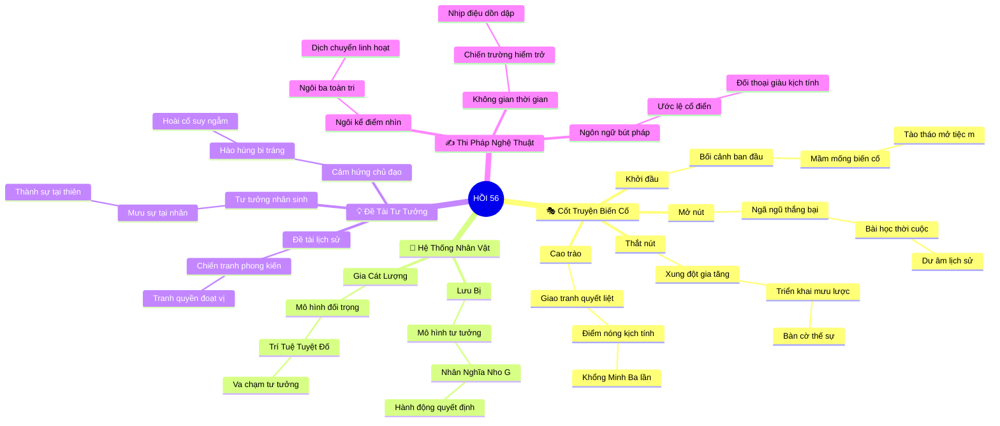

# 🎭 BẢN ĐỒ TƯ DUY VĂN HỌC TINH GỌN (4-5 TẦNG): HỒI 56 - Tào tháo mở tiệc mừng đài Đổng Tước

## 1. Sơ Đồ Tư Duy Trực Quan (Mermaid Mindmap Tinh Gọn)

---

## 2. Cây Phân Cấp Gợi Nhớ Tri Thức Văn Học 4-5 Tầng (Active Recall Hierarchy)

- 📌 **🎭 [Khung Cốt Truyện & Biến Cố Chủ Đạo]**
  - 🔹 *Khởi đầu:* ➔ *Bối cảnh hồi* ➔ *Mầm mống xung đột* ➔ *Hành động mở đầu (Tào tháo mở tiệc mừn)*
  - 🔹 *Thắt nút:* ➔ *Xung đột leo thang* ➔ *Toan tính mưu lược* ➔ *Rẽ nhánh tình thế*
  - 🔹 *Cao trào:* ➔ *Đỉnh điểm đấu trí* ➔ *Giao phong sinh tử* ➔ *Biến cố quyết định (Khổng Minh Ba lần tr)*
  - 🔹 *Mở nút:* ➔ *Cục diện ngã ngũ* ➔ *Hệ quả địa chính trị* ➔ *Dư âm triết lý*

- 📌 **👥 [Hệ Thống Nhân Vật Như Mô Hình Tư Tưởng]**
  - 🔹 *Lưu Bị:* ➔ *Nhân Nghĩa Nho Gia Chính Thống* ➔ *Ý chí hành động* ➔ *Quyết định then chốt*
  - 🔹 *Gia Cát Lượng:* ➔ *Trí Tuệ Tuyệt Đối & Tận Trung Bất Báo* ➔ *Đối trọng tư tưởng* ➔ *Bài học số phận*

- 📌 **💡 [Đề Tài, Chủ Đề & Cảm Hứng Chủ Đạo]**
  - 🔹 *Đề tài:* ➔ *Hiện thực lịch sử* ➔ *Chiến tranh loạn lạc* ➔ *Thịnh suy thời thế*
  - 🔹 *Tư tưởng:* ➔ *Nhân quả thời cuộc* ➔ *Giới hạn sức người* ➔ *Đạo lý đối nhân*
  - 🔹 *Cảm hứng:* ➔ *Bi tráng hào hùng* ➔ *Trường giang cuồn cuộn* ➔ *Ngậm ngùi nhân sinh*

- 📌 **✍️ [Thi Pháp & Điểm Nhìn Nghệ Thuật]**
  - 🔹 *Ngôi kể:* ➔ *Ngôi ba toàn tri* ➔ *Tiểu thuyết chương hồi* ➔ *Điểm nhìn bao quát*
  - 🔹 *Bút pháp:* ➔ *Ước lệ cổ điển* ➔ *Thơ ca minh họa* ➔ *Khắc họa hành động*

---

## 3. Bảng Neo Trí Nhớ Nhân Vật & Biểu Tượng Nghệ Thuật (Literary Memory Anchors)

| Nhân Vật / Biểu Tượng | Mô Hình / Lực Lượng Đại Diện | Hành Động / Hình Tượng Tiêu Biểu | Giá Trị Tư Tưởng Ngầm |
| :--- | :--- | :--- | :--- |
| **Lưu Bị** | Nhân Nghĩa Nho Gia Chính Thống | Quyết sách hàng đầu trong hành động "Tào tháo mở tiệc mừng đài" | Thể hiện bản lĩnh cá nhân |
| **Gia Cát Lượng** | Trí Tuệ Tuyệt Đối & Tận Trung Bất Báo | Đối kháng hoặc phản ứng trước biến cố "Khổng Minh Ba lần trêu tứ" | Bài học nhân tâm thời loạn |
| **Tào tháo mở tiệc m** | Sự Kiện Khởi Phát | Mở màn cho chuỗi xung đột trong Hồi Kỳ 6 | Mầm mống biến thiên lịch sử |
| **Khổng Minh Ba lần ** | Sự Kiện Cao Trào | Đỉnh điểm phân định thắng bại cục bộ | Quy luật chuyển dịch quyền lực |
