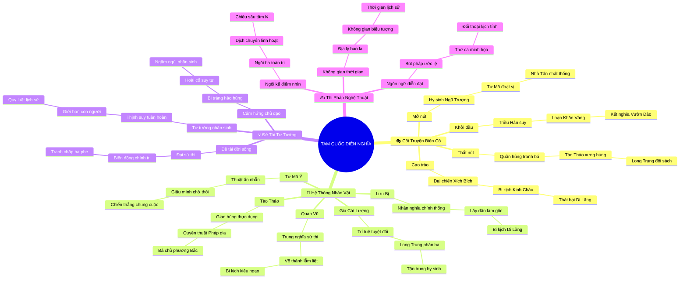

# 🎭 BẢN ĐỒ TƯ DUY VĂN HỌC TINH GỌN (4-5 TẦNG): KIỆT TÁC TAM QUỐC DIỄN NGHĨA

## 1. Sơ Đồ Tư Duy Trực Quan (Mermaid Mindmap Tinh Gọn)

---

## 2. Cây Phân Cấp Gợi Nhớ Tri Thức Văn Học 4-5 Tầng (Active Recall Hierarchy)

- 📌 **🎭 [Khung Cốt Truyện & Biến Cố Chủ Đạo]**
  - 🔹 *Khởi đầu:* ➔ *Hán triều mục nát* ➔ *Loạn Khăn Vàng* ➔ *Kết nghĩa Vườn Đào*
  - 🔹 *Thắt nút:* ➔ *Tào Tháo thâu tóm* ➔ *Trận Quan Độ* ➔ *Tam cố thảo lư*
  - 🔹 *Cao trào:* ➔ *Đại chiến Xích Bích* ➔ *Quan Vũ mất Kinh Châu* ➔ *Lưu Bị bại Di Lăng*
  - 🔹 *Mở nút:* ➔ *Khổng Minh trút hơi thở* ➔ *Họ Tư Mã đoạt Ngụy* ➔ *Tấn thống nhất*

- 📌 **👥 [Hệ Thống Nhân Vật Như Mô Hình Tư Tưởng]**
  - 🔹 *Lưu Bị:* ➔ *Nhân nghĩa Nho gia* ➔ *Lấy dân làm gốc* ➔ *Trụ cột tinh thần Thục*
  - 🔹 *Tào Tháo:* ➔ *Gian hùng thực dụng* ➔ *Quyền thuật Pháp gia* ➔ *Thà ta phụ người*
  - 🔹 *Gia Cát Lượng:* ➔ *Trí tuệ siêu việt* ➔ *Long Trung đối sách* ➔ *Cúc cung tận tụy*
  - 🔹 *Quan Vũ:* ➔ *Trung nghĩa lẫm liệt* ➔ *Biểu tượng Võ thánh* ➔ *Bi kịch kiêu ngạo*
  - 🔹 *Tư Mã Ý:* ➔ *Thuật ẩn nhẫn* ➔ *Giấu mình chờ thời* ➔ *Chiến thắng dài hạn*

- 📌 **💡 [Đề Tài, Chủ Đề & Cảm Hứng Chủ Đạo]**
  - 🔹 *Đề tài:* ➔ *Sử thi chiến tranh* ➔ *Tranh chấp chính trị* ➔ *Biến động 100 năm*
  - 🔹 *Tư tưởng:* ➔ *Hợp lâu lại tan* ➔ *Số trời nghiệt ngã* ➔ *Phù du danh lợi*
  - 🔹 *Cảm hứng:* ➔ *Hào hùng bi tráng* ➔ *Trường Giang cuồn cuộn* ➔ *Hoài cổ suy tư*

- 📌 **✍️ [Thi Pháp & Điểm Nhìn Nghệ Thuật]**
  - 🔹 *Ngôi kể:* ➔ *Ngôi ba toàn tri* ➔ *Tiểu thuyết chương hồi* ➔ *Dịch chuyển sa trường*
  - 🔹 *Không gian:* ➔ *Trường Giang, Kinh Châu* ➔ *Bao la hùng vĩ* ➔ *Biểu tượng chí lớn*
  - 🔹 *Bút pháp:* ➔ *Ước lệ cổ điển* ➔ *Thơ ca minh họa* ➔ *Đối thoại giàu tính kịch*

---

## 3. Bảng Neo Trí Nhớ Nhân Vật & Biểu Tượng Nghệ Thuật (Literary Memory Anchors)

| Nhân Vật / Biểu Tượng | Mô Hình / Lực Lượng Đại Diện | Hình Ảnh / Câu Nói Kinh Điển | Giá Trị Tư Tưởng Ngầm |
| :--- | :--- | :--- | :--- |
| **Lưu Bị** | Nhân Nghĩa Chính Thống | "Lấy nhân nghĩa làm gốc, thà chịu khổ chứ không bỏ dân" | Thu phục lòng người |
| **Tào Tháo** | Gian Hùng Thực Dụng | "Thà ta phụ người trong thiên hạ, quyết không để người phụ ta" | Quyền thuật nghiệt ngã |
| **Gia Cát Lượng** | Trí Tuệ & Tận Trung | "Cúc cung tận tụy, tử nhi hậu dĩ" | Người chống số trời |
| **Quan Vũ** | Trung Nghĩa Tuyệt Đối | "Qua năm ải chém sáu tướng, giữ trọn chữ Tín" | Bi tráng võ thánh |
| **Tư Mã Ý** | Thuật Ẩn Nhẫn Chiến Lược | Nhẫn nại mặc áo phụ nữ do Khổng Minh gửi để khiêu khích | Chiến thắng thời gian |
| **Sóng Trường Giang** | Biểu Tượng Thời Gian | "Trường Giang cuồn cuộn chảy về đông, Sóng vùi dập hết anh hùng" | Phù du danh lợi |
| **Vườn Đào** | Biểu Tượng Kết Nghĩa | "Không sinh cùng ngày cùng tháng, nguyện chết cùng năm cùng tháng" | Đạo lý huynh đệ |
| **Gò Ngũ Trượng** | Biểu Tượng Hy Sinh | Đèn thất tinh tắt, Khổng Minh trút hơi thở cuối cùng | Bi kịch nhân trí |
