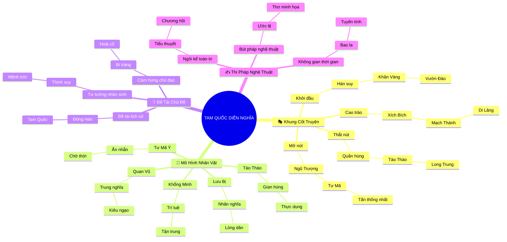

# 🎭 Tóm Tắt & Phân Tích Văn Học: Kiệt Tác Tam Quốc Diễn Nghĩa (120 Hồi)

## 1. Thông Điệp & Cảm Hứng Chủ Đạo (Core Message & Mood)
> *Tam Quốc Diễn Nghĩa là bức đại sử thi bi tráng và hoài niệm về quy luật biến thiên thịnh suy tuần hoàn của lịch sử, nơi các mô hình tư tưởng lớn (Nhân nghĩa Nho gia, Quyền thuật thực dụng, Trí tuệ siêu việt và Thuật ẩn nhẫn) va chạm khốc liệt trên bàn cờ thời đại; từ đó đúc kết bài học nhân sinh về giới hạn của sức người trước bánh xe định mệnh và nỗi ngậm ngùi trước sự phù du của danh lợi ("Trường Giang cuồn cuộn chảy về đông, Sóng vùi dập hết anh hùng").*

---

## 2. Khung Cốt Truyện & Biến Cố Chủ Đạo (Plot Arc & Core Events)

### 🎬 Trục Sự Kiện Tư Tưởng (4 Bước Ngoặt Chiến Lược)

1. **Khởi Đầu (Exposition): Triều Hán Suy Vi & Anh Hùng Khởi Phát**
   - **Bối cảnh & Tiền đề:** Triều đình Đông Hán mục ruỗng do Thập thường thị lộng quyền; mâu thuẫn xã hội bùng nổ qua cuộc khởi nghĩa Khăn Vàng.
   - **Nhân tố kích hoạt:** Lưu Bị, Quan Vũ, Trương Phi kết nghĩa tại Vườn Đào ("Không sinh cùng ngày cùng tháng, nguyện chết cùng năm cùng tháng"); Đổng Trác kéo quân vào kinh thâu tóm chính sự, mở đầu cho sự sụp đổ của trật tự cũ.

2. **Thắt Nút (Inciting Incident & Complications): Quần Hùng Cắt Cứ & Long Trung Đối Sách**
   - **Xung đột bùng nổ:** Liên minh 18 chư hầu chống Đổng Trác tan rã do tư lợi; Tào Tháo dùng mưu lược "Hiệp thiên tử dĩ lệnh chư hầu", đánh bại Viên Thiệu tại trận Quan Độ để bình định phương Bắc.
   - **Bước ngoặt số phận:** Lưu Bị ba lần đến lều tranh (Tam cố thảo lư) mời Gia Cát Lượng xuất sơn. Khổng Minh dâng *Long Trung đối sách*, vạch ra cục diện phân chia ba ngả thiên hạ.

3. **Cao Trào (Climax): Đỉnh Điểm Quyền Thuật, Binh Pháp & Bi Kịch Anh Hùng**
   - **Đỉnh điểm căng thẳng:** Đại chiến Xích Bích — Liên minh Ngô - Thục dùng mưu hỏa công thiêu rụi 80 vạn đại quân Tào Tháo, chính thức định hình thế chân vạc Tam Quốc (Ngụy - Thục - Ngô).
   - **Va chạm trực tiếp & Bi kịch:** Quan Vũ thất thủ Kinh Châu và bị hành quyết tại Mạch Thành; Trương Phi bị bộ hạ ám hại; Lưu Bị dốc toàn lực báo thù dẫn đến đại bại Di Lăng và thác oan tại thành Bạch Đế; Gia Cát Lượng 6 lần ra Kỳ Sơn phạt Ngụy, cúc cung tận tụy đến hơi thở cuối cùng ở gò Ngũ Trượng Nguyên.

4. **Mở Nút & Dư Âm (Resolution & Aftermath): Quy Luật Lịch Sử & Thiên Hạ Thống Nhất**
   - **Giải tỏa xung đột:** Quyền thần Tư Mã Ý và gia tộc thâu tóm quyền bính nhà Ngụy lập nên nhà Tấn; lần lượt Thục Hán (263) và Đông Ngô (280) bị thôn tính.
   - **Dư âm nghệ thuật:** Toàn bộ công lao anh hùng, mưu thần chước quỷ đều tan biến trước dòng chảy vô tận của thời gian, ứng nghiệm với chân lý vĩnh hằng: *"Thế lớn trong thiên hạ, cứ tan lâu rồi lại hợp, hợp lâu rồi lại tan"*.

---

## 3. Hệ Thống Nhân Vật Như Những "Mô Hình Tư Tưởng" (Ideological Models)

### 👥 1. Nhân Vật Trung Tâm & Lực Lượng Đại Diện

- **Lưu Bị (Lưu Huyền Đức) — Mô hình *Nhân Nghĩa Nho Gia Chính Thống***
  - **Mô hình tư tưởng đại diện:** Đại biểu cho lý tưởng "Lấy dân làm gốc", đạo đức Nho giáo truyền thống và ngọn cờ chính nghĩa phục hưng nhà Hán.
  - **Chức năng nghệ thuật:** Trụ cột tinh thần, thu phục nhân tâm bằng lòng chân thành và lòng trắc ẩn sâu sắc.
  - **Diễn biến tâm lý & Bi kịch:** Khởi nghiệp từ tay trắng nhờ nhân nghĩa, nhưng sụp đổ vì đặt tình cảm huynh đệ cá nhân lên trên toan tính chiến lược quốc gia (đại bại Di Lăng).

- **Tào Tháo (Tào A Man) — Mô hình *Gian Hùng Thực Dụng & Quyền Thuật***
  - **Mô hình tư tưởng đại diện:** Hiện thân của tư tưởng Pháp gia, phá bỏ rào cản lễ giáo, trọng dụng nhân tài thực tế hơn xuất thân danh gia vọng tộc.
  - **Chức năng nghệ thuật:** Động lực thúc đẩy sự sụp đổ của trật tự cũ, nhà quân sự và chính trị kiệt xuất với tôn chỉ: *"Thà ta phụ người trong thiên hạ, quyết không để người trong thiên hạ phụ ta"*.
  - **Diễn biến tâm lý & Bi kịch:** Bá chủ phương Bắc nhưng không bao giờ hiện thực hóa được giấc mộng thống nhất, cơ nghiệp cuối cùng bị dòng họ Tư Mã đoạt lấy.

- **Gia Cát Lượng (Khổng Minh) — Mô hình *Trí Tuệ Tuyệt Đối & Tận Trung Bất Báo***
  - **Mô hình tư tưởng đại diện:** Hóa thân của trí tuệ siêu việt, mưu lược thần thông và biểu tượng tận tụy trung trinh ("Cúc cung tận tụy, tử nhi hậu dĩ").
  - **Chức năng nghệ thuật:** Kiến trúc sư thế Tam Phân, đại diện cho ý chí quật cường của con người đối chọi lại mệnh trời.
  - **Diễn biến tâm lý & Bi kịch:** Nhận thức rõ sự suy vi của "mệnh trời" đối với Thục Hán nhưng vẫn dốc cạn sức tàn chống chọi cho đến khi hy sinh tại Ngũ Trượng Nguyên.

- **Quan Vũ (Quan Vân Trường) — Mô hình *Trung Nghĩa Tuyệt Đối & Bi Tráng Sử Thi***
  - **Mô hình tư tưởng đại diện:** Biểu tượng của Võ thánh, chữ "Tín" ngút trời, khí tiết kiên trinh trước tiền tài và vũ lực.
  - **Chức năng nghệ thuật:** Đỉnh cao của vẻ đẹp nhân cách người quân tử cổ điển.
  - **Diễn biến tâm lý & Bi kịch:** Gục ngã bởi chính điểm yếu chí tử là sự kiêu ngạo đối với giới văn sĩ, dẫn đến cái chết bi thảm tại Mạch Thành.

- **Tư Mã Ý (Tư Mã Trọng Đạt) — Mô hình *Thuật Ẩn Nhẫn Strategic Patience***
  - **Mô hình tư tưởng đại diện:** Đại biểu cho sự kiên nhẫn tối thượng, giấu mình chờ thời, sẵn sàng chịu nhục và ra tay tàn nhẫn khi thời cơ chín muồi.
  - **Chức năng nghệ thuật:** Đối thủ xứng tầm duy nhất của Gia Cát Lượng, người thắng cuộc cuối cùng trên bàn cờ Tam Quốc.

---

### ⚔️ 2. Mạng Lưới Quan Hệ Đối Lập & Tương Hỗ

1. **Trục xung đột 1: Nhân Nghĩa (Lưu Bị) vs Quyền Thuật Thực Dụng (Tào Tháo)**
   - Sự va chạm giữa hai con đường trị nước: Thu phục lòng người bằng tình nghĩa Nho gia đối kháng với xác lập trật tự bằng sức mạnh và pháp luật.
2. **Trục xung đột 2: Đỉnh Cao Trí Tuệ: Khổng Minh Chủ Động vs Tư Mã Ý Ẩn Nhẫn**
   - Sự đối lập giữa trí tuệ công kích biến hóa thần thông và chiến lược thủ thành tiêu hao thời gian. Khổng Minh thắng trong từng chiến thuật, nhưng Tư Mã Ý thắng trong cuộc đua trường chinh thời gian.
3. **Trục xung đột 3: Đạo Nghĩa Huynh Đệ vs Bàn Cờ Lợi Ích Lịch Sử**
   - Sự giằng xé giữa cam kết thủy chung của cá nhân (Vườn Đào) và thực tế nghiệt ngã của địa chính trị (Đông Ngô lật kèo, Tào Ngụy hưởng lợi).

---

## 4. Đề Tài, Chủ Đề & Cảm Hứng Chủ Đạo (Themes & Artistic Vision)

- 🌍 **Phạm vi Đề tài (Scope of Reality):** Đại sử thi kéo dài gần 100 năm (184 – 280), tái hiện bức tranh chiến tranh, ngoại giao và tranh chấp quyền lực thời Đông Hán và Tam Quốc.
- 💡 **Chủ đề & Tư tưởng Nhân sinh (Core Philosophy):** 
  - **Quy luật khách quan:** Thịnh cực tất suy, vạn vật đều tuần hoàn biến chuyển theo quy luật lịch sử.
  - **Giới hạn của ý chí con người trước mệnh trời:** Dù tài trí tuyệt luân hay dũng mãnh vô song đều không thể cưỡng lại bánh xe thời đại.
- 🎨 **Cảm hứng Chủ đạo (Artistic Mood):** Cảm hứng **Bi tráng hào hùng** song hành cùng tâm thức **Hoài cổ ngậm ngùi** trước sự hư vô của danh lợi phù hoa.

---

## 5. Thi Pháp & Điểm Nhìn Nghệ Thuật (Poetics & Narrative Stance)

- 👁️ **Ngôi kể & Điểm nhìn:** Ngôi thứ ba toàn tri truyền thống tiểu thuyết chương hồi. Điểm nhìn bao quát từ sa trường vạn dặm, triều đình tranh chấp đến chiều sâu biểu cảm và tâm lý nhân vật.
- ⏳ **Không gian & Thời gian Nghệ thuật:** 
  - *Không gian:* Hùng vĩ, bao la (Hoàng Hà, Trường Giang, Kinh Châu, gò Ngũ Trượng) mang tính biểu tượng cho chí lớn quẫy sóng xé trời.
  - *Thời gian:* Dòng thời gian biên niên sử khách quan kết hợp thời gian tâm lý ngưng đọng trong những giờ phút sinh tử.
- ✍️ **Ngôn ngữ & Bút pháp Diễn đạt:** Bút pháp ước lệ cổ điển, kết hợp thơ ca minh họa dẫn dắt cảm xúc, nghệ thuật đối thoại giàu tính kịch và khắc họa nhân vật qua hành động tiêu biểu.

---

## 6. Bộ Câu Hỏi Gợi Mở Triết Lý & Thẩm Mỹ (Philosophical & Aesthetic Reflection: 18 câu)

#### Nhóm 1: Triết lý Nhân sinh & Số phận Con người (6 câu)
1. Liệu "mệnh trời" trong tác phẩm là quy luật lịch sử khách quan hay chỉ là sự lý giải cho giới hạn bất lực của con người trước hoàn cảnh?
2. Bài học sâu sắc nhất từ bi kịch mất Kinh Châu của Quan Vũ về lằn ranh mong manh giữa lòng tự tôn và sự kiêu ngạo mù quáng là gì?
3. Tại sao một bậc minh chủ nhân nghĩa như Lưu Bị lại đưa ra quyết định sai lầm nhất đời mình trong chiến dịch Di Lăng?
4. Thuật ẩn nhẫn và năng lực kiểm soát cảm xúc của Tư Mã Ý để lại bài học gì cho tư duy chiến lược dài hạn?
5. Gia Cát Lượng biết rõ thiên hạ khó lòng vãn hồi nhưng vẫn dốc sức 6 lần ra Kỳ Sơn — đó là sự cố chấp hay đỉnh cao của ý thức trách nhiệm?
6. Góc nhìn hiện đại đánh giá như thế nào về sự đối lập giữa "gian hùng thực dụng" của Tào Tháo và "chính nhân quân tử" của Lưu Bị?

#### Nhóm 2: Xung đột Xã hội & Đạo đức Thời đại (6 câu)
7. Tính chính thống dòng dõi Hán thất của Lưu Bị có ý nghĩa biểu tượng lớn hơn hay năng lực thiết lập trật tự thực tế của Tào Tháo quan trọng hơn?
8. Lời thề Vườn Đào cho thấy mâu thuẫn nan giải nào giữa đạo nghĩa huynh đệ cá nhân và lợi ích chiến lược của quốc gia?
9. Thuật dùng người của Tào Tháo (chỉ trọng tài năng) và Lưu Bị (lấy đức thu phục người) để lại kinh nghiệm gì về thuật lãnh đạo?
10. Tại sao Đông Ngô (Tôn Quyền) dù sở hữu địa thế hiểm trở và nhân tài kiệt xuất nhưng không thể vươn lên thống nhất giang sơn?
11. Sự lộng hành của Thập thường thị tố cáo nguyên nhân cốt lõi nào dẫn đến sự sụp đổ của một thiết chế quyền lực khi đánh mất lòng dân?
12. Trận chiến Xích Bích chứng minh nguyên lý gì về nghệ thuật liên minh chiến lược khi đối đầu với thế lực vượt trội về quân số?

#### Nhóm 3: Cảm Nhận Thẩm Mỹ & Giá Trị Nghệ Thuật (6 câu)
13. Bài từ mở đầu "Trường Giang cuồn cuộn chảy về đông" đóng vai trò định hình âm hưởng triết lý cho toàn bộ tác phẩm như thế nào?
14. Thủ pháp khắc họa nhân vật của La Quán Trung có điểm gì đặc sắc khi biến mỗi nhân vật thành một tượng đài tư tưởng bất hủ?
15. Nghệ thuật miêu tả các đại chiến trường (Quan Độ, Xích Bích, Di Lăng) thể hiện tầm vóc thi pháp sử thi hoành tráng ra sao?
16. Yếu tố ly kỳ, huyền ảo (mượn gió đông, độn giáp, bói toán) làm phong phú vẻ đẹp lãng mạn hay làm mờ đi tính hiện thực lịch sử?
17. Nhịp điệu câu chuyện biến chuyển thế nào từ không khí hào hùng quật khởi lúc đầu sang sự tàn tạ, xót xa ở những hồi cuối?
18. Yếu tố thi pháp nào đã giúp *Tam Quốc Diễn Nghĩa* vượt khỏi giới hạn của tiểu thuyết lịch sử để trở thành triết lý sống qua hàng thế kỷ?

---

## 7. Bản Đồ Tư Duy Văn Học Trực Quan (Visual Literary Mindmap - Tinh Gọn 4-5 Tầng)

